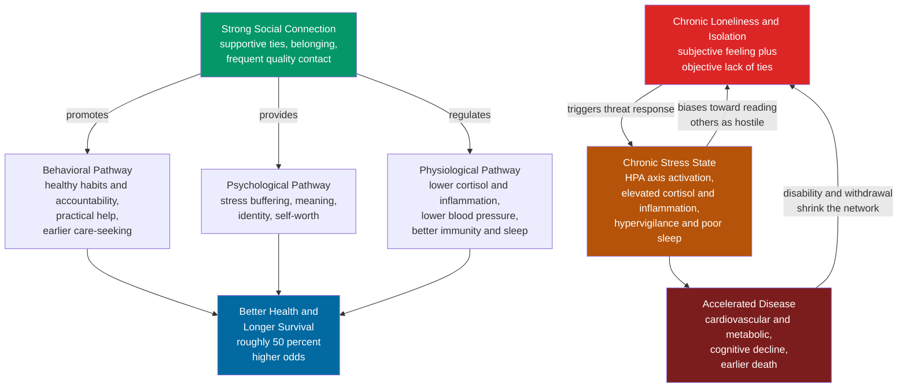

# 🤝 Social Connection and Health

> [!abstract] TL;DR
> **Social connection is a core biological determinant of health**, sitting alongside diet, exercise, and sleep rather than beneath them. The strongest evidence is Julianne **Holt-Lunstad's meta-analyses**: people with strong social relationships have roughly **50 percent greater odds of survival** over follow-up — an effect **comparable to quitting smoking and larger than the effect of obesity or physical inactivity**. The mechanism runs through three braided pathways: connection **shapes behavior** (support and accountability for healthy habits), **buffers psychology** (stress relief, meaning, identity), and **regulates physiology** (lower cortisol, inflammation, and blood pressure; better immunity and sleep). Chronic **loneliness** is best understood as an evolved aversive signal — hunger for other people — that, left unmet, becomes a chronic stressor. Because isolation is spreading and lethal, the US Surgeon General declared a **loneliness epidemic** a public-health priority in 2023. What matters most is not the *number* of contacts but the **quality of a few close ties** — the headline finding of the Harvard Study of Adult Development.

---

## Intuition

**Analogy:** We are an obligately social species — a primate that survived by living in groups — and **loneliness is to the body what hunger is to the stomach**. Hunger is not a character flaw; it is a signal that a real biological need is unmet, tuned by evolution to be *unpleasant on purpose* so that you go and eat. Loneliness works exactly the same way: it is an aversive alarm that says "you are dangerously disconnected — go and reconnect." A hunter-gatherer cut off from the band was, quite literally, closer to death, so natural selection wired isolation to *hurt* and to put the body on alert. The problem is that in a modern world you can be surrounded by people and still starve socially, and the alarm — meant to be brief — can ring for years.

Now push the analogy one step further into the clinic. If chronic hunger visibly wasted a body, no one would call nutrition a "soft" factor. Yet chronic loneliness does its damage invisibly, through stress hormones and inflammation, so we underrate it. The startling arithmetic is that **weak social connection is as dangerous as smoking up to fifteen cigarettes a day** and *more* dangerous than obesity or a sedentary life. The person eating a perfect diet and running every morning but coming home to an empty, friendless life is carrying a mortality risk factor as serious as the one they are dieting to avoid.

---

## How It Works

### Core Mechanics

Three distinctions have to be nailed down first, because they are constantly confused:

- **Social isolation** is *objective*: the measurable lack of contacts, ties, and network size. You could count it.
- **Loneliness** is *subjective*: the distressing feeling that your social relationships fall short of what you want, in number or in depth. You can be isolated without feeling lonely, and lonely in a crowd.
- **Solitude** is *chosen* aloneness — restorative, not distressing. It is to loneliness what fasting is to starvation.

All three matter for health, and they overlap only partly, which is why interventions that just add *people* to a lonely person's day often fail: the deficit is in perceived closeness, not headcount.

With those fixed, the causal story runs through **three pathways from connection to health**, plus one vicious loop:

1. **The behavioral pathway.** Close others police your health behavior in the best sense — a spouse nags you to see the doctor, friends invite you to walk, a community gives you routines and reasons to get up. Support networks also deliver **practical help** (a ride to the hospital, a meal when sick) and **information** (which specialist to see). Isolation removes all of this, and isolated people seek care later and adhere to treatment worse.
2. **The psychological pathway.** Relationships **buffer stress** — the same stressor lands softer when you have someone to call ([[Stress_and_Coping]]). They supply **meaning, identity, and self-worth** ("I am a father, a friend, a member of this choir"), and belonging is a basic psychological need whose satisfaction underwrites wellbeing ([[Positive_Psychology]]). Being needed by others is itself protective.
3. **The physiological pathway.** This is where the "soft" factor becomes hard biology. **Chronic loneliness is a chronic stressor.** John Cacioppo's work showed lonely people carry elevated **cortisol**, higher **blood pressure and vascular resistance**, raised **systemic inflammation** (pro-inflammatory gene expression, the "conserved transcriptional response to adversity"), **impaired immune function**, and **fragmented sleep** ([[Sleep_and_Circadian_Rhythms]]) — a hypervigilant brain scans for threat even at night. Sustained, this **allostatic load** accelerates cardiovascular disease, metabolic dysfunction, and cognitive decline.
4. **The loneliness loop.** Cacioppo's evolutionary model explains why loneliness is *self-perpetuating*. As an alarm it heightens vigilance for social threat, which biases lonely people toward reading others as hostile or rejecting, which drives withdrawal, which deepens isolation — a feedback loop that has to be broken from the outside. Disease and disability then further shrink the network, closing a second loop between poor health and social loss.

Zoom out and connection is not one risk factor among many but an **upstream determinant** ([[Determinants_of_Health]]) that shapes the others — which is why it belongs in the same tier as diet and exercise, and why the "**Blue Zones**" (Okinawa, Sardinia, Loma Linda) all feature dense, lifelong community as a shared longevity ingredient.

### Flow / Architecture



The diagram makes two things visible: connection reaches health through **three parallel channels** (so it is robust — knock out one and the others remain), while loneliness feeds a **self-reinforcing loop** that must be interrupted deliberately.

---

## Key Concepts

### Secondary Level

- **We are a social species.** Humans evolved to live in groups; being connected is a biological need, not a luxury or a personality quirk.
- **Loneliness is a signal, like hunger or thirst.** It hurts on purpose, to push you to reconnect. Feeling it does not mean something is wrong with you.
- **Three different things:** *isolation* is actually being alone, *loneliness* is *feeling* alone, and *solitude* is *choosing* to be alone and enjoying it.
- **The big surprise:** having strong relationships is as good for your survival as quitting smoking, and better than losing weight or exercising. Being lonely is genuinely bad for the body, not just the mood.
- **Quality beats quantity.** A few close, warm relationships protect health more than hundreds of shallow contacts or followers.

### Undergraduate Level

- **Holt-Lunstad meta-analyses (2010, 2015).** Pooling 148 studies, stronger social relationships were associated with a **50 percent increased likelihood of survival** (odds ratio ≈ 1.5). A later meta-analysis found social isolation, loneliness, and living alone each raised mortality risk by roughly 26 to 32 percent. The 2010 paper's benchmark: the effect **rivals smoking cessation and exceeds obesity and physical inactivity**.
- **The Surgeon General's advisory (2023), "Our Epidemic of Loneliness and Isolation."** The first US federal advisory to treat loneliness as a public-health emergency, framing lacking connection as a mortality risk comparable to smoking about 15 cigarettes a day, and setting out a "national strategy to advance social connection."
- **Cacioppo's evolutionary theory of loneliness.** Loneliness is an **aversive state** analogous to physical pain, evolved to motivate reconnection; when chronic, its associated hypervigilance for social threat becomes maladaptive and self-sustaining.
- **Social support buffers stress.** The *buffering hypothesis*: support matters most under high stress, blunting the physiological stress response — the psychological bridge to the biology in [[Stress_and_Coping]].
- **Social contagion of health (Christakis and Fowler).** In the Framingham Heart Study network, **obesity, smoking, and even happiness spread through social ties** — your chance of a health state shifts with the states of friends, and friends of friends — connecting health to [[Social_Networks_and_Social_Ties]] and [[Network_Dynamics_and_Contagion]].
- **The Harvard Study of Adult Development.** An 80-plus-year longitudinal study concluding that **the quality of close relationships at 50 predicted physical health and happiness at 80** better than cholesterol did — good relationships, not fame or wealth, were the strongest predictor of a long, happy life.

### Graduate Level

- **Mechanistic biology of loneliness.** Steve Cole's work links perceived isolation to a **"conserved transcriptional response to adversity" (CTRA)**: up-regulated pro-inflammatory genes and down-regulated antiviral and antibody genes in leukocytes. This offers a molecular route from a social perception to immune dysregulation and disease — a concrete instance of social-to-biological embedding paralleling the allostatic-load story in [[Determinants_of_Health]].
- **Confounding, reverse causation, and the causal question.** Sick and depressed people withdraw, so cross-sectional associations overstate causation. The stronger case rests on **prospective cohorts adjusting for baseline health**, dose-response gradients, plausible mechanisms, and a handful of interventions — though few randomized trials directly move mortality, so the evidence is strong-observational rather than experimental.
- **Structure versus function.** Network *structure* (size, density, integration — the domain of [[Social_Networks_and_Social_Ties]] and [[Social_Capital_and_Trust]]) is distinct from perceived *functional* support (do you feel you have someone to rely on). Both predict mortality but through partly different pathways; complex measures of **social integration** carried the largest effect sizes in Holt-Lunstad 2010.
- **Loneliness as a complex-systems phenomenon.** Christakis-Fowler contagion frames health behaviors as spreading on a network, but the *complex contagion* view (Centola) holds that behaviors, unlike simple information, often require **reinforcement from multiple ties** to adopt — a threshold dynamic modeled in [[Network_Dynamics_and_Contagion]]. This reframes public health as intervening on network topology, not just individuals.
- **The modern paradox of digital connection.** Screen-mediated contact can supplement or *displace* embodied connection; passive social-media use correlates with loneliness while active, reciprocal use may relieve it. The unresolved question — whether digital ties satisfy or merely simulate the social need — is a live problem in [[Technology_and_the_Good_Life]].

---

## Python Demo

```python
# Social connection and health, two views:
#  (1) Holt-Lunstad benchmark: strength of social connection as a survival
#      factor compared with established risk factors (odds ratio for survival).
#  (2) Social contagion of a health behavior spreading through a social network
#      (Christakis-Fowler / complex-contagion style), linking to Systems Thinking.
# numpy + matplotlib only.
import numpy as np
import matplotlib.pyplot as plt

rng = np.random.default_rng(42)

# --- 1. Odds ratio for survival by factor (illustrative, from meta-analyses) ---
# OR > 1 means the factor is PROTECTIVE (raises odds of surviving follow-up).
# Figures are approximate, drawn from Holt-Lunstad et al. 2010 and companions.
factors = ["Social integration\n(complex ties)", "Social support\n(functional)",
           "Quit smoking", "Not obese\n(vs obese)", "Physically\nactive",
           "Flu\nvaccine"]
odds_ratio = np.array([1.91, 1.44, 1.50, 1.23, 1.28, 1.15])
is_social  = np.array([True, True, False, False, False, False])
colors = np.where(is_social, "#059669", "#6b7280")

# --- 2. Contagion of a health behavior through a random social network ---------
N = 240
p_tie = 0.035                                   # Erdos-Renyi edge probability
A = (rng.random((N, N)) < p_tie).astype(float)  # random adjacency
A = np.triu(A, 1); A = A + A.T                   # symmetric, no self-loops
degree = A.sum(axis=1)

beta = 0.55                       # strength of peer influence (complex contagion)
steps = 30
adopting = np.zeros(N, dtype=bool)
adopting[rng.choice(N, size=5, replace=False)] = True   # 5 early adopters
curve = [adopting.mean()]
for _ in range(steps):
    # probability of adopting rises with the fraction of adopting neighbors
    frac_nbr = np.where(degree > 0, (A @ adopting) / np.maximum(degree, 1.0), 0.0)
    newly = (~adopting) & (rng.random(N) < beta * frac_nbr)
    adopting = adopting | newly
    curve.append(adopting.mean())
curve = np.array(curve)

# --- Plot ---------------------------------------------------------------------
fig, ax = plt.subplots(1, 2, figsize=(13, 5))

ax[0].barh(factors[::-1], odds_ratio[::-1], color=colors[::-1])
ax[0].axvline(1.0, color="black", lw=1, ls="--")
ax[0].set_title("Effect on Survival: Social Ties vs Known Risk Factors")
ax[0].set_xlabel("Odds ratio for survival  (1.0 = no effect)")
for i, v in enumerate(odds_ratio[::-1]):
    ax[0].text(v + 0.02, i, f"{v:.2f}", va="center", fontweight="bold")
ax[0].text(1.6, -0.6, "green = social connection", color="#059669",
           fontsize=9, fontweight="bold")

ax[1].plot(curve * 100, "o-", color="#7c3aed", lw=2.2, markersize=5)
ax[1].set_title("A Health Behavior Spreading Through a Social Network")
ax[1].set_xlabel("Time step")
ax[1].set_ylabel("Population adopting behavior (percent)")
ax[1].grid(alpha=0.3)
ax[1].annotate("S-curve:\ntakeoff once enough\nneighbors adopt",
               xy=(12, curve[12] * 100), xytext=(16, 25),
               arrowprops=dict(arrowstyle="->", color="#7c3aed"))

plt.tight_layout()
plt.savefig("social_connection_and_health.png", dpi=120)
print("Mean node degree:", round(degree.mean(), 1))
print("Final adoption fraction:", round(curve[-1], 2))
print("Social-integration OR vs obesity OR:",
      f"{odds_ratio[0]:.2f} vs {odds_ratio[3]:.2f}")
```

**What it shows.** The left panel reproduces the Holt-Lunstad benchmark: the two **green** social-connection bars stand as tall as, or taller than, the grey bars for quitting smoking, avoiding obesity, and staying active — the visual form of "relationships are a first-tier survival factor." The right panel simulates a health behavior (say, quitting smoking or taking up walking) diffusing through a random social network: because adoption probability rises with the **fraction of adopting neighbors**, the curve is a classic **S-shape** — slow, then explosive once local clusters cross a threshold, then saturating. That is the Christakis-Fowler intuition rendered as a systems dynamic, and it links directly to complex contagion in [[Network_Dynamics_and_Contagion]] and [[Network_Science_Fundamentals]].

---

## Real-World Applications

- **Public-health strategy.** The **US Surgeon General's 2023 advisory** and the **UK's Minister for Loneliness** (created 2018) reframe connection as infrastructure — funding community programs, "social prescribing" where clinicians refer patients to groups and activities rather than only to drugs, and neighborhood design that fosters casual contact.
- **Clinical screening.** Health systems increasingly screen older and high-risk patients for **social isolation and loneliness** alongside blood pressure, then route them to befriending services, group visits, or community health workers — treating isolation as a modifiable risk factor.
- **Aging in place and later-life health.** Isolation is concentrated in older adults after retirement, bereavement, and loss of mobility. Interventions — senior centers, intergenerational housing, volunteer roles that restore *being needed* — target the demographic where the mortality effect is largest and the Blue Zones' community model is most instructive.
- **Workplace and campus design.** Employers and universities treat belonging as a health and retention lever: mentoring, teams, and physical spaces that create repeated, low-stakes contact (the "third places" and hallway collisions that seed weak ties).
- **Network-aware behavior campaigns.** Knowing that behaviors spread through ties (per Christakis-Fowler and [[Social_Networks_and_Social_Ties]]), programs seed change through central, well-connected members or whole clusters rather than random individuals, exploiting contagion instead of fighting it.

---

## Common Pitfalls

- **Treating connection as a "soft" wellness extra.** The single biggest error is ranking it below diet and exercise. The meta-analytic effect sizes place it in the *same tier* as smoking — omitting it from a longevity plan leaves a smoking-sized risk on the table.
- **Confusing loneliness, isolation, and solitude.** They are different variables. Flooding a lonely person with contacts treats isolation, not the *perceived* lack of closeness that is loneliness; and pathologizing chosen, restorative solitude mistakes a resource for a deficit.
- **Assuming more contacts is better.** Quantity of ties predicts far less than quality. The Harvard Study's lesson is that a few warm, dependable relationships beat a large but shallow network; chasing followers or acquaintances can even add stress.
- **Reading correlation as proven causation.** Ill health causes withdrawal, so raw associations overstate the causal effect. Honest claims lean on prospective cohorts adjusting for baseline health, dose-response, and mechanism — not on cross-sectional headlines. Overstating certainty invites justified backlash.
- **Assuming digital equals real.** Counting online contact as equivalent to embodied connection is unproven. Passive scrolling correlates with *more* loneliness; the social need may require reciprocity and presence that a feed does not supply ([[Technology_and_the_Good_Life]]).
- **Individualizing a structural problem.** "Just make more friends" ignores that isolation is patterned by poverty, disability, car-dependent sprawl, and long work hours. Loneliness is partly an environmental and design failure, not only a personal one ([[Determinants_of_Health]]).

---

## Related Concepts

- [[Determinants_of_Health]] — situates social connection as an upstream determinant on par with income and environment, one of the "causes of the causes."
- [[Stress_and_Coping]] — the stress physiology (HPA axis, cortisol, allostatic load) that connection buffers and loneliness chronically activates; the psychological-to-biological bridge.
- [[Sleep_and_Circadian_Rhythms]] — loneliness fragments and shortens sleep via threat-vigilance; poor sleep in turn worsens mood and social function, closing a loop.
- [[Social_Networks_and_Social_Ties]] — the sociology of the structure of relationships (strong and weak ties, integration) whose *shape* the health effect depends on.
- [[Social_Capital_and_Trust]] — community-level connection and trust as a collective health resource, extending the individual story to neighborhoods.
- [[Network_Dynamics_and_Contagion]] — the systems model of how health behaviors and states spread through ties (Christakis-Fowler, complex contagion), formalizing the Python demo.
- [[Network_Science_Fundamentals]] — the graph concepts (degree, clustering, centrality) underlying who gets connected and how contagion moves.
- [[Positive_Psychology]] — belonging, meaning, and relationships as pillars of flourishing and wellbeing, the psychological upside of connection.
- [[Health_Inequality_and_Medical_Sociology]] — how connection and isolation are socially patterned, and the medical sociology of the social gradient.
- [[Technology_and_the_Good_Life]] — the ethics of whether digital connection satisfies or displaces the real social need.
- [[Cooperation_and_Evolutionary_Game_Theory]] — the evolutionary logic of why a social species is so dependent on, and rewarded by, group bonds.

---

## Review Questions

1. **Conceptual.** Explain why chronic loneliness harms the body rather than just the mood. Trace at least one full pathway from the *perception* of isolation to a physical disease outcome, naming the intermediate biological steps.
2. **Scenario.** A 68-year-old, recently widowed and living alone, eats well and walks daily but reports feeling isolated. Given the Holt-Lunstad evidence, how would you rank the health importance of her loneliness relative to her diet and exercise, and what specific intervention would you prioritize — and why might simply "introducing her to more people" fail?
3. **Trade-off / evaluative.** The evidence that connection *causes* longer life is strong-observational but light on randomized trials, and sick people withdraw socially (reverse causation). How convinced should a policymaker be, and what would it take to justify treating loneliness as a public-health priority on par with smoking? Where does the Christakis-Fowler network view change what an effective intervention looks like?

---

## Sources

- Holt-Lunstad, J., Smith, T. B., & Layton, J. B. (2010). "Social Relationships and Mortality Risk: A Meta-analytic Review." *PLoS Medicine*, 7(7), e1000316. [https://doi.org/10.1371/journal.pmed.1000316](https://doi.org/10.1371/journal.pmed.1000316)
- Holt-Lunstad, J., Smith, T. B., Baker, M., Harris, T., & Stephenson, D. (2015). "Loneliness and Social Isolation as Risk Factors for Mortality: A Meta-Analytic Review." *Perspectives on Psychological Science*, 10(2), 227–237.
- Office of the U.S. Surgeon General (2023). *Our Epidemic of Loneliness and Isolation: The U.S. Surgeon General's Advisory on the Healing Effects of Social Connection and Community.* [https://www.hhs.gov/surgeongeneral/priorities/connection/index.html](https://www.hhs.gov/surgeongeneral/priorities/connection/index.html)
- Cacioppo, J. T., & Cacioppo, S. (2018). "The growing problem of loneliness." *The Lancet*, 391(10119), 426. (See also Cacioppo & Patrick, *Loneliness: Human Nature and the Need for Social Connection*, 2008.)
- Christakis, N. A., & Fowler, J. H. (2007). "The Spread of Obesity in a Large Social Network over 32 Years." *New England Journal of Medicine*, 357(4), 370–379.
- Waldinger, R., & Schulz, M. (2023). *The Good Life: Lessons from the World's Longest Scientific Study of Happiness* (Harvard Study of Adult Development). Simon & Schuster.

---

#health #social-connection #loneliness #social-support #longevity
