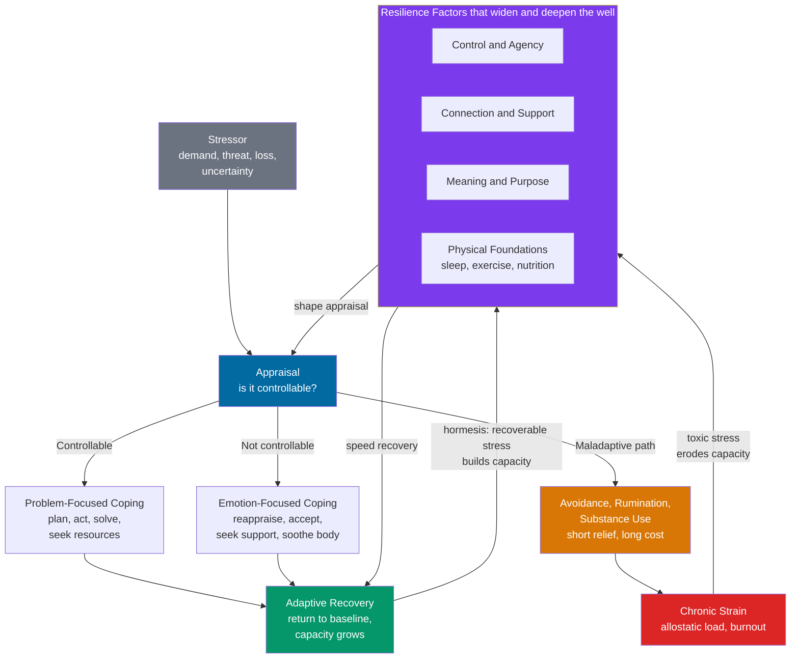

# 🌱 Stress Management and Resilience

> [!abstract] TL;DR
> **Stress management** is the practical craft of keeping the stress response from becoming chronic, and **resilience** is the capacity to bend under adversity and bounce back rather than break. The two central moves are matching your **coping strategy** to the situation — **problem-focused** coping when a stressor is controllable, **emotion-focused / acceptance** coping when it isn't (Lazarus and Folkman) — and building the standing **resilience factors** that widen your margin: a physical foundation of sleep, exercise, and nutrition; social connection; a sense of control and agency; meaning and values-based action; and skills like cognitive reappraisal and mindfulness. Resilience is not a fixed trait but an **ordinary, trainable, dynamic process** (Masten's "ordinary magic"), and it is often *built* by manageable, recoverable stress — the principle of **hormesis** and **stress inoculation** ("what doesn't kill you") — provided the stress stays short of the **chronic, toxic** range. In a systems view, a resilient person is a **deep, wide potential well** that returns to baseline after a shock, while a depleted one is a shallow well that can be **tipped into an alternative stable state** like burnout or depression.

---

## Intuition

**Analogy — the tree in the storm, the muscle at the gym.** Picture a young tree in a gale. A brittle trunk that refuses to move at all snaps at the first strong gust; a limp reed with no structure is flattened. The tree that survives is the one that **bends and springs back** — it yields to the wind, dissipates the force, and returns upright when the gust passes. Resilience is that bend-and-recover, not rigidity and not collapse. And crucially, the tree that has weathered many moderate winds grows a **thicker, stronger trunk and deeper roots** than the one raised in a windless greenhouse. The greenhouse tree looks fine until the first real storm.

That second half is the counterintuitive part. Resilience, like a **muscle** or an **immune system**, is built by *manageable, recoverable stress*, not by the avoidance of all stress. A muscle grows only when you load it past comfort and then let it recover; an immune system that never meets a pathogen never learns to defend. So the goal of stress management is not a stress-free life — that produces fragility — but a rhythm of **challenge followed by genuine recovery**. The failure mode is not stress itself; it is stress *without recovery*, the storm that never lets up, which is where the trunk finally cracks.

---

## How It Works

### Core Mechanics

Stress management and resilience are best understood as three interacting layers: how you *appraise and cope with* a specific stressor, the *standing capacities* that determine how much you can absorb, and the *dose–response* rule that says the right amount of stress builds capacity while too much destroys it.

1. **Appraisal comes first (Lazarus and Folkman).** A stressor is not stressful in itself; it becomes stressful through **appraisal** — *primary* ("is this a threat?") and *secondary* ("can I cope?"). The single most useful diagnostic question is **"Is this situation controllable?"**, because the answer tells you which coping tool to reach for. This whole appraisal machinery is the subject of the sibling note **Stress and the Stress Response**, which covers the HPA axis, cortisol, and allostatic load in depth; this note picks up where that one leaves off, at *what to do about it*.

2. **Match the coping strategy to the controllability of the stressor.**
   - **Problem-focused coping** — act on the stressor itself: plan, break the problem down, gather information, negotiate, mobilize resources. This is the right tool when the situation is **controllable** (a solvable deadline, a fixable conflict, a repairable finance).
   - **Emotion-focused / acceptance coping** — act on your *response* to a stressor you cannot change: reappraisal, acceptance, seeking comfort and support, soothing the body, meaning-making. This is the right tool when the situation is **uncontrollable** (a terminal diagnosis, a bereavement, a past event). The **matching hypothesis** says effectiveness depends on the *fit* between strategy and controllability — problem-solving an unfixable loss produces frustration; passively accepting a fixable problem produces helplessness.
   - **Maladaptive coping** — strategies that relieve distress in the short term but compound it over time: **avoidance/denial**, **rumination** (repetitive, unresolved churning that keeps the stress response switched on), and **substance use**. These feel like coping but deepen the very strain they seem to relieve.

3. **Cognitive reappraisal is the highest-leverage skill.** Because stress runs through appraisal, *changing the appraisal* changes the physiology. **Reappraisal / reframing** — deliberately reinterpreting a situation ("this is a challenge I can grow from" rather than "this is a threat that will destroy me") — is the core mechanism of CBT and a robust emotion-regulation strategy. Stress-*mindset* research (McGonigal, Crum) shows that believing stress can be *enhancing* rather than purely harmful measurably improves outcomes. See **Stress and Coping** in the Psychology vault.

4. **Standing resilience factors set the size of your margin.** Beyond in-the-moment coping, resilience rests on capacities you build *before* the storm: a **physical foundation** (sleep, exercise, nutrition — the levers with the largest and most reliable effect on stress physiology), **social connection**, a **sense of control and agency**, and **meaning, purpose, and values-based action**. Masten's **"ordinary magic"** thesis is that resilience arises from these *common* human resources, not from rare heroic traits — which is exactly why it is trainable.

5. **Hormesis: the dose makes the poison — and the medicine.** A **hormetic** stressor is one that is *manageable and recoverable*, triggering an adaptive over-compensation that leaves the system stronger. Exercise (muscle micro-damage), heat and cold exposure, fasting, and psychological **challenge** all work this way, and this is the deep link to **hormesis in Aging and Longevity**. The nuance behind "what doesn't kill you makes you stronger" is that the claim holds **only within the recoverable range**. The same curve that rises with moderate, intermittent stress turns sharply downward under **chronic, toxic, inescapable** stress — the difference between a cold plunge and a cortisol bath that never drains.

6. **The limits of individual coping.** No amount of personal reappraisal fixes a structurally toxic situation — a sixty-hour week under an abusive manager, poverty, discrimination, an unsafe neighborhood. Stress is **socially patterned** (see **Determinants of Health**), and framing purely-structural stressors as personal coping failures both blames the victim and misdiagnoses the problem.

### Flow / Architecture



The two feedback arrows at the bottom are the crux: adaptive recovery *plus recoverable dose* feeds back to strengthen the resilience factors (hormesis), while chronic unresolved strain feeds back to erode them — the same input, stress, either builds or breaks the system depending on dose and recovery.

---

## Key Concepts

### Secondary Level

- **Stress management** is the set of things you do so that stress stays temporary instead of becoming a permanent background hum.
- **Resilience** is the ability to take a hit — a setback, a loss, a hard year — and *recover*, rather than staying knocked down. It is more like a skill you can grow than a talent you either have or don't.
- **Two ways to cope:** if you can *change* the problem, work on the problem (make a plan, take action). If you *can't* change it, work on how you *feel* about it (accept it, talk to someone, calm your body). Using the wrong tool for the situation makes things worse.
- **The unhelpful shortcuts** — avoiding, endlessly worrying, or using alcohol and drugs — feel like relief but make stress worse over time.
- **The foundation:** sleep, movement, food, and good relationships are not "nice to have." They are the base that everything else stands on. Fix these first.
- **"What doesn't kill you can make you stronger"** — *manageable* stress you recover from (a hard workout, a challenge you rise to) builds strength. Never-ending stress with no recovery does the opposite.

### Undergraduate Level

- **Cognitive appraisal and the controllability heuristic (Lazarus and Folkman, 1984):** stress is a product of appraisal, and the **matching hypothesis** holds that coping works best when strategy fits controllability — problem-focused for controllable stressors, emotion-focused / acceptance for uncontrollable ones. See **Stress and Coping**.
- **Adaptive vs maladaptive coping:** reappraisal, planning, support-seeking, and acceptance are adaptive; **avoidance**, **rumination**, and **substance use** are maladaptive. Rumination is singled out in depression research as a mechanism that keeps the stress response chronically engaged.
- **Cognitive reappraisal / reframing:** the deliberate reinterpretation of a situation to change its emotional meaning — the engine of CBT and the most-studied emotion-regulation strategy. **Stress-mindset** research shows that treating stress as a challenge to grow from, not just a threat, improves performance and health.
- **Resilience as ordinary magic (Masten):** resilience is *common*, arising from ordinary adaptive systems — relationships, self-regulation, problem-solving, motivation — rather than rare traits. Its corollary is that resilience is **trainable** and can be strengthened by intervention.
- **Post-traumatic growth (Tedeschi and Calhoun):** some people report *positive* change after adversity — deeper relationships, new priorities, personal strength, spiritual depth, appreciation of life. It is distinct from mere recovery, is **not universal or inevitable**, and does not imply the trauma was good.
- **The evidence-based levers, in order:** (1) the physical foundation — sleep, exercise, nutrition; (2) social support; (3) mindfulness and breathwork; (4) meaning, purpose, and values-based action; (5) a sense of control; (6) time in nature. The physical foundation is listed first because it has the largest, most reliable effect on stress physiology.

### Graduate Level

- **Hormesis and the biphasic dose–response:** a low-to-moderate, intermittent, recoverable stressor triggers **adaptive over-compensation** (heat-shock proteins, mitochondrial biogenesis, up-regulated antioxidant and repair pathways, autophagy), yielding a net-beneficial response that reverses at high or chronic doses — the classic inverted-U / J-shaped curve. Exercise, hypoxia, caloric restriction/fasting, and thermal stress are canonical examples; this is the mechanistic bridge to **hormesis in Aging and Longevity**. **Stress inoculation** (Meichenbaum) is the psychological analogue: graded, mastered exposure to controllable stressors builds coping capacity and confidence.
- **Allostatic load and the chronic-toxic threshold:** McEwen's framework distinguishes *allostasis* (adaptation through change) from **allostatic load / overload** — the cumulative physiological cost of chronically or inefficiently mobilized mediators (cortisol, catecholamines, inflammatory cytokines). Toxic stress differs from hormetic stress precisely in being **chronic, uncontrollable, and unrecovered**; the same mediator that is protective in pulses becomes corrosive when sustained.
- **The systems / dynamical view — deep vs shallow wells and alternative stable states:** model wellbeing as a ball in a **potential landscape**. A resilient person is a **deep, wide basin of attraction** with a high barrier to the "burnout/depression" state, so shocks are absorbed and the system returns to baseline (short return time). Chronic depletion **flattens the barrier**, until a stressor of ordinary size can push the system over a **tipping point (saddle-node bifurcation)** into an **alternative stable state** — clinical burnout or depression — that exhibits **hysteresis**: it is far harder to climb back out than it was to fall in. Approaching such a transition, recovery from small perturbations slows (**critical slowing down**), producing **early-warning signals** — rising variance and autocorrelation in mood, sleep, and affect. See **Resilience and Robustness**, **Dynamical Systems and Attractors**, and **Bifurcations and Tipping Points**.
- **Burnout as a regime shift (Maslach):** the triad of **emotional exhaustion, depersonalization/cynicism, and reduced personal accomplishment**, driven by chronic workplace stress under the six-area model — workload, control, reward, community, fairness, values. Its systems reading is an attractor shift: once in the burnout basin, ordinary rest is insufficient and hysteresis dominates, which is why prevention beats cure.
- **The individual/structural boundary:** individual coping is necessary but bounded. Where stressors are structural (**Determinants of Health**, Karasek's demand–control–support model), the effective levers are organizational and political — job control, workload, support, fairness — and individual-only interventions can generate a "resilience" narrative that offloads systemic risk onto persons.

---

## Python Demo

```python
# Resilience as a dynamical system: wellbeing modeled as a ball in a
# potential well, perturbed by a stressor. A RESILIENT system is a deep,
# steep well (high barrier) that returns to baseline after a shock; a
# FRAGILE system is a shallow well that can be TIPPED past a barrier into
# an alternative stable state (burnout/depression). We simulate identical
# stressors for high vs low resilience and locate the tipping point.
# Connects to Systems Thinking: attractors, alternative stable states,
# saddle-node tipping. numpy + matplotlib only.
import numpy as np
import matplotlib.pyplot as plt

# --- Double-well potential ------------------------------------------------
# V(x; s) = s * (x**4 / 4 - x**2 / 2)
#   minima at x = +1 (HEALTHY baseline) and x = -1 (BURNOUT state),
#   barrier at x = 0. The scale s sets well depth / barrier height:
#   large s -> deep, steep, RESILIENT well; small s -> shallow, FRAGILE.
# Force (overdamped): F(x) = -dV/dx = s * (x - x**3)
def force(x, s):
    return s * (x - x**3)

def potential(x, s):
    return s * (x**4 / 4.0 - x**2 / 2.0)

# --- Overdamped Langevin simulation with a timed stressor -----------------
# A stressor is a sustained downward pressure P applied on [t_on, t_off).
# A resilient (large s) well resists it; a fragile (small s) well can be
# pushed past the barrier at x = 0 and slide into the burnout basin.
def simulate(s, P, t_on=10.0, t_off=35.0, x0=1.0, T=70.0, dt=0.01,
             D=0.0015, seed=0):
    rng = np.random.default_rng(seed)
    n = int(T / dt)
    t = np.linspace(0.0, T, n)
    x = np.empty(n)
    x[0] = x0
    noise = np.sqrt(2.0 * D * dt)
    for i in range(1, n):
        stressor = -P if (t_on <= t[i - 1] < t_off) else 0.0
        x[i] = (x[i - 1] + (force(x[i - 1], s) + stressor) * dt
                + noise * rng.standard_normal())
    return t, x

# Fold (tipping) pressure: healthy equilibrium vanishes when P exceeds
# s * max_x in (0,1) of (x - x**3), which peaks at x = 1/sqrt(3).
xstar = 1.0 / np.sqrt(3.0)
gmax = xstar - xstar**3                       # ~= 0.3849
S_RES, S_FRAG = 4.0, 1.0                       # resilient vs fragile scale
P_shock = 0.60                                 # identical stressor for both
Pcrit_frag = S_FRAG * gmax                     # fragile tipping pressure

# --- Run the two systems under the SAME stressor --------------------------
t, x_res = simulate(S_RES, P_shock, seed=1)
_, x_fra = simulate(S_FRAG, P_shock, seed=1)

# --- Sweep stressor size to locate the fragile tipping point --------------
Ps = np.linspace(0.0, 0.9, 60)
final_state = np.array([simulate(S_FRAG, P, seed=2)[1][-1] for P in Ps])

# --- Plot -----------------------------------------------------------------
fig, ax = plt.subplots(1, 3, figsize=(16, 4.6))
xx = np.linspace(-1.6, 1.6, 400)

# Panel 1: the two potential landscapes
ax[0].plot(xx, potential(xx, S_RES),  color="#059669", lw=2.5,
           label="Resilient: deep, steep well")
ax[0].plot(xx, potential(xx, S_FRAG), color="#dc2626", lw=2.5,
           label="Fragile: shallow well")
ax[0].scatter([1], [potential(1, S_RES)], color="#059669", zorder=5, s=70)
ax[0].scatter([1], [potential(1, S_FRAG)], color="#dc2626", zorder=5, s=70)
ax[0].axvline(0, color="gray", ls=":", lw=1)
ax[0].set_title("Wellbeing as a Potential Landscape")
ax[0].set_xlabel("Wellbeing state x  (+1 healthy, -1 burnout)")
ax[0].set_ylabel("Potential V(x)")
ax[0].legend(fontsize=8, loc="upper center")

# Panel 2: recovery trajectories under an identical stressor
ax[1].axvspan(10, 35, color="#fde68a", alpha=0.5, label="stressor active")
ax[1].axhline(1,  color="gray", ls=":", lw=1)
ax[1].axhline(-1, color="gray", ls=":", lw=1)
ax[1].axhline(0,  color="gray", ls="-", lw=0.6)
ax[1].plot(t, x_res, color="#059669", lw=2, label="Resilient: dips, recovers")
ax[1].plot(t, x_fra, color="#dc2626", lw=2, label="Fragile: tips into burnout")
ax[1].set_title("Identical Stressor, Divergent Fates")
ax[1].set_xlabel("Time")
ax[1].set_ylabel("Wellbeing x")
ax[1].legend(fontsize=8, loc="center right")

# Panel 3: the tipping point of the fragile system
ax[2].plot(Ps, final_state, "o-", color="#dc2626", ms=4, lw=1.5)
ax[2].axvline(Pcrit_frag, color="#7c3aed", ls="--", lw=2,
              label=f"tipping pressure ~ {Pcrit_frag:.2f}")
ax[2].axhline(0, color="gray", lw=0.6)
ax[2].set_title("Tipping Point of the Fragile System")
ax[2].set_xlabel("Stressor pressure P")
ax[2].set_ylabel("Final wellbeing state")
ax[2].legend(fontsize=8, loc="center left")

plt.tight_layout()
plt.savefig("stress_management_and_resilience.png", dpi=120)

print(f"Fragile tipping pressure  ~ {Pcrit_frag:.3f}")
print(f"Resilient final state (P={P_shock}): {x_res[-1]:+.2f}  -> baseline")
print(f"Fragile  final state (P={P_shock}): {x_fra[-1]:+.2f}  -> burnout")
```

**What it shows.** Panel 1 draws the core metaphor literally: the resilient system is a **deep, steep well** with a high barrier, while the fragile system is a **shallow well** whose barrier a moderate shock can breach. Panel 2 applies the *same* stressor to both — the resilient trajectory dips during the stressor window and **springs back to +1** (baseline), while the fragile trajectory is pushed past the barrier at 0 and **slides into the −1 burnout basin**, where it stays even after the stressor is removed (hysteresis: the shock is not enough, in reverse, to climb back out). Panel 3 sweeps the stressor size and reveals the **tipping point**: below the critical pressure the fragile system recovers, but past it the final state jumps discontinuously to the burnout attractor — a saddle-node bifurcation, exactly the structure studied in **Bifurcations and Tipping Points**. The pedagogical payoff: building resilience is *deepening and widening the well* (raising the barrier) so that everyday stressors no longer risk a regime shift.

---

## Real-World Applications

- **Stress Inoculation Training (SIT) and resilience programs.** Meichenbaum's SIT — conceptualize, rehearse coping skills, then graded real-world application — underlies programs from the US Army's **Comprehensive Soldier and Family Fitness** to first-responder and athlete preparation. The design principle is hormetic: *controllable, graded* exposure builds capacity, unlike overwhelming, uncontrollable exposure.
- **CBT and ACT in clinical practice.** **Cognitive Behavioral Therapy** targets the appraisals and rumination that amplify stress; **Acceptance and Commitment Therapy (ACT)** pairs acceptance of uncontrollable internal states with **values-based action**, operationalizing the "meaning and purpose" resilience lever.
- **Mindfulness-Based Stress Reduction (MBSR).** Kabat-Zinn's eight-week MBSR protocol is among the most-studied non-pharmacological stress interventions, with measurable effects on perceived stress and stress physiology — the empirical backbone of the mindfulness lever covered in the sibling note **Mindfulness, Meditation and Mind-Body Practices**.
- **Workplace burnout prevention.** Maslach's six-area model reframes burnout as a mismatch between person and job across workload, control, reward, community, fairness, and values — so evidence-based prevention is **organizational** (autonomy, sustainable load, recognition, fairness), not just individual self-care.
- **Deliberate hormetic practice.** Structured exercise, sauna/heat and cold exposure, and time-restricted eating are increasingly used as *intentional* recoverable stressors to build physiological and psychological robustness — the applied face of **hormesis in Aging and Longevity**, effective only when paired with genuine recovery.

---

## Common Pitfalls

- **Chasing a stress-free life.** Eliminating all challenge produces *fragility*, not health — the greenhouse tree. The goal is a rhythm of **challenge followed by recovery**, not the absence of load.
- **Using the wrong coping tool for the situation.** Problem-solving an unchangeable loss breeds frustration and helplessness; passively accepting a fixable problem breeds learned helplessness. Always diagnose controllability first, then choose the tool.
- **Mistaking maladaptive coping for coping.** Avoidance, rumination, and substance use deliver short-term relief while *deepening* the strain and, in the systems view, flattening the barrier toward burnout. Relief is not the same as recovery.
- **Confusing hormetic with toxic stress.** "What doesn't kill you makes you stronger" holds only within the **manageable, recoverable, intermittent** range. Chronic, uncontrollable, unrecovered stress sits on the falling side of the dose–response curve and corrodes capacity.
- **Skipping the physical foundation.** Reaching for reappraisal and gratitude while chronically sleep-deprived, sedentary, and poorly fed is building on sand — sleep, exercise, and nutrition move stress physiology more than any purely cognitive technique. See the sibling notes **Sleep Science and Circadian Rhythms** and **Social Connection and Health**.
- **Individualizing structural stressors.** Prescribing yoga for a person crushed by a toxic sixty-hour job or by poverty misdiagnoses the problem and blames the victim. Where the stressor is structural, the fix is structural (**Determinants of Health**).
- **Ignoring early-warning signs.** Because burnout and depression are hysteretic alternative states, waiting until you have crossed the tipping point makes recovery far harder. Rising irritability, sleep disruption, cynicism, and slowed recovery from small setbacks are **critical-slowing-down** signals to act on *early*.

---

## Related Concepts

- [[Stress_and_Coping]] — the Psychology-vault deep dive on the HPA axis, Selye's General Adaptation Syndrome, appraisal, and the coping taxonomy this note applies; the closest companion.
- [[Resilience_and_Robustness]] — the Systems Thinking treatment of a system's capacity to absorb shocks and retain function; the formal backbone of the "deep vs shallow well" idea here.
- [[Dynamical_Systems_and_Attractors]] — basins of attraction and stable states; the mathematics behind wellbeing as a ball in a potential well returning to baseline.
- [[Bifurcations_and_Tipping_Points]] — saddle-node tipping, hysteresis, alternative stable states, and critical slowing down / early-warning signals; the model behind the burnout regime shift in the Python demo.
- [[Ecological_Resilience_and_Ecosystems]] — Holling's ecological resilience and regime shifts; the field where the deep/shallow-well and tipping-point language originated.
- [[Feedback_Loops_and_Causality]] — the balancing and reinforcing loops that make recoverable stress build capacity (hormesis) or chronic stress erode it.
- [[Determinants_of_Health]] — why stress is socially patterned and where individual coping ends and structural intervention must begin.
- [[Happiness_and_Wellbeing]] — chronic stress is the strongest predictor of reduced wellbeing; meaning and positive affect are resilience resources.
- [[Metabolism_and_Energy_Balance]] — the physiology behind fasting and exercise as hormetic stressors.
- [[Homeostasis_and_Human_Physiology]] — allostasis vs homeostasis: the regulatory machinery whose overload is the chronic-stress failure mode.

---

## Review Questions

1. **Conceptual.** Explain, using the potential-well model, what it means to say resilience is "a deep, wide well" rather than a fixed personality trait. What real-world investments *deepen and widen* the well, and why does the model imply that everyday stressors become dangerous only after the well has already been flattened?
2. **Scenario.** Two employees face the same restructuring. One treats it as a controllable challenge and starts networking and upskilling; the other ruminates, withdraws, and drinks more. Using the matching hypothesis and the adaptive/maladaptive distinction, predict their trajectories — and identify the point at which the second employee's path becomes a *tipping point* rather than a temporary dip. What early-warning signs would you watch for?
3. **Trade-off / evaluative.** "What doesn't kill you makes you stronger" is true for exercise and cold exposure but false for chronic poverty or an abusive workplace. Reconcile these using the hormesis dose–response curve and the distinction between hormetic and toxic stress. Where is the boundary between an individual stress-management responsibility and a structural one, and what goes wrong when that boundary is misdrawn?

---

## Sources

- Lazarus, R. S., & Folkman, S. (1984). *Stress, Appraisal, and Coping.* Springer.
- Masten, A. S. (2001). "Ordinary Magic: Resilience Processes in Development." *American Psychologist*, 56(3), 227–238.
- McEwen, B. S. (1998). "Stress, Adaptation, and Disease: Allostasis and Allostatic Load." *Annals of the New York Academy of Sciences*, 840, 33–44.
- Calabrese, E. J., & Mattson, M. P. (2017). "How does hormesis impact biology, toxicology, and medicine?" *npj Aging and Mechanisms of Disease*, 3, 13.
- Maslach, C., & Leiter, M. P. (2016). "Understanding the burnout experience: recent research and its implications for psychiatry." *World Psychiatry*, 15(2), 103–111.
- Scheffer, M., et al. (2009). "Early-warning signals for critical transitions." *Nature*, 461, 53–59.

---

#health #resilience #stress-management #coping #hormesis
