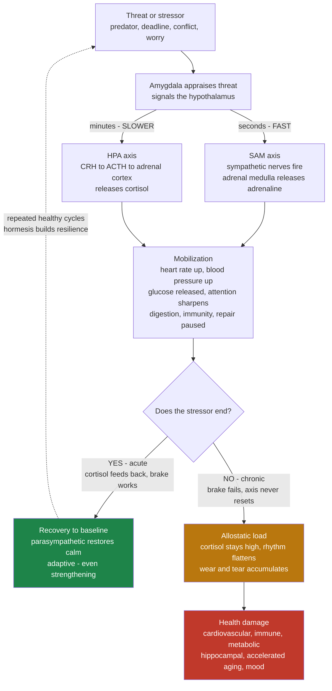

# 🚨 Stress and the Stress Response

> [!abstract] TL;DR
> **Stress** is the body's coordinated emergency response to a demand it appraises as threatening. It runs on two axes on two clocks: the **SAM axis** (sympathetic-adrenal-medullary) fires in *seconds*, dumping **adrenaline** to spike heart rate, blood pressure, glucose and attention; the **HPA axis** (hypothalamus → pituitary → adrenal) follows over *minutes*, releasing **cortisol** to sustain the mobilization and then — crucially — to switch itself back off. This machinery is a masterpiece for a real, brief emergency: **acute stress is adaptive, even strengthening** (eustress, hormesis). The health problem is **chronic activation** — a stress response that never fully stands down. The cumulative wear of running the system too hard, too long, without recovery is **allostatic load** (McEwen), and it is the mechanistic bridge from psychological stress to real disease: cardiovascular damage, immune dysregulation, central obesity, hippocampal shrinkage, accelerated aging, and mood disorders. The same response is medicine in bursts and poison in a drip.

---

## Intuition

**Analogy — the fire alarm and the sprinkler system.** A building's fire-suppression system is a life-saver: smoke triggers a blaring alarm and the sprinklers open, drenching everything to stop a real fire. For an actual fire, this is exactly what you want — loud, fast, total, worth the water damage. That is your **acute stress response**: threat detected, alarm sounds (adrenaline), sprinklers run (cortisol), the fire is put out, and then — the whole point — the system *resets and dries out*.

Now imagine the smoke detector is so twitchy that it blares all day at burnt toast, cigarette smoke, a car backfiring outside, an angry email. The alarm never stops; the sprinklers drip constantly. There is no fire, but the building is now *slowly rotting from the water*: warped floors, rusted steel, mold in the walls. Nothing dramatic happened — yet the very system built to protect the building is destroying it, because it was designed for **brief emergencies, not permanent activation**. That drip-damage is **allostatic load**, and it is why chronic psychological stress — deadlines, money worry, a bad relationship, doom-scrolling — produces genuine physical illness even though no tiger ever showed up. The stress response is not the villain; a stress response *that never turns off* is.

> This note is the **applied-health** view: what chronic stress does to the body and how to blunt it. For the psychological mechanics (appraisal, coping, Selye's General Adaptation Syndrome) see [[Stress_and_Coping]]; for the underlying regulation theory (allostasis, allostatic load, set points) see [[Homeostasis_and_Human_Physiology]]; for the neural hardware see [[Autonomic_Nervous_System]] and [[Limbic_System_and_Diencephalon]].

---

## How It Works

### The threat detector

Everything starts with **appraisal**, not with the event itself. The **amygdala** (see [[Limbic_System_and_Diencephalon]]) flags a stimulus as threatening — often before conscious awareness — and signals the **hypothalamus**, the master switch that commands both stress axes. Because the trigger is *interpretation*, the exact same event (a big presentation) can launch a full stress cascade in one person and barely register in another. The body cannot tell a real predator from an imagined catastrophe; a vivid worry recruits the same hardware as a physical threat.

### Two axes, two clocks

The response deploys in two overlapping waves on very different timescales — a fast neural arm layered over a slow endocrine arm, the same fast-plus-slow architecture that runs all of physiology.

1. **SAM axis — fast (seconds).** The **sympathetic** branch of the [[Autonomic_Nervous_System]] fires directly, and the **adrenal medulla** releases **adrenaline** (epinephrine) and noradrenaline into the blood. Within a heartbeat: pupils dilate, heart rate and blood pressure jump, airways open, the liver dumps glucose, blood shunts to muscle, and non-urgent functions (digestion, immunity, reproduction) are throttled. This is **fight-or-flight** — instant mobilization for a physical emergency.
2. **HPA axis — slower (minutes to hours).** The hypothalamus secretes **CRH** → the pituitary secretes **ACTH** → the adrenal **cortex** secretes **cortisol**. Cortisol *sustains and manages* the mobilization: it keeps blood glucose high (gluconeogenesis), sharpens threat-relevant memory, and modulates inflammation. Critically, cortisol also **feeds back on the hypothalamus and pituitary to shut the axis off** — a built-in brake. A healthy stress response is defined less by how *big* the surge is than by how *cleanly it recovers*.

### What it mobilizes, and why it is adaptive

| Resource | Change | Survival purpose |
|---|---|---|
| **Glucose / free fatty acids** | Released to blood | Instant fuel for muscle and brain |
| **Heart rate / blood pressure** | Up | Deliver fuel and oxygen fast |
| **Attention / vigilance** | Narrowed, sharpened | Lock onto the threat |
| **Memory encoding** | Enhanced (amygdala + cortisol) | Remember what nearly killed you |
| **Digestion / repair / immunity / reproduction** | Suppressed | Don't spend energy on tomorrow during today's emergency |

For a **brief** stressor this is pure benefit and the tab is trivially small. Moderate acute stress that is *survived and recovered from* is even **strengthening** — this is **hormesis** (a small dose of a stressor makes the system more robust) and **eustress** (good stress: the productive edge before a deadline, the challenge of a hard workout). Exercise, cold exposure, fasting, and public speaking are all controlled acute stressors we use *because* the recovery leaves us fitter.

### When acute becomes chronic — allostatic load

**Allostasis** means achieving stability *through change* — the brain predictively raising blood pressure, glucose, and cortisol to meet anticipated demand (see [[Homeostasis_and_Human_Physiology]]). In bursts this is efficient. The failure mode appears when the demand never ends: modern stressors (job insecurity, chronic conflict, financial strain, poor sleep, always-on notifications) keep the axes switched **on**. Three things then go wrong:

- **Cortisol stays elevated** and its normal daily rhythm flattens.
- **The negative-feedback brake weakens** — glucocorticoid receptors become resistant, so the "off" signal stops working and the axis self-perpetuates.
- **The baseline drifts upward** — the new "normal" is a low-grade permanent alarm.

Bruce **McEwen** named the cumulative price of this — the wear-and-tear of chronically over-driven stress mediators — **allostatic load**, and its endpoint **allostatic overload** (the system exhausted, damage manifest). This is the concept that turns "stress" from a vague feeling into a measurable physiological cost.



### The health bill of chronic stress

Sustained cortisol and sympathetic tone damage nearly every system:

- **Cardiovascular** — chronically high blood pressure, endothelial injury, and accelerated atherosclerosis; stress is an independent risk factor for heart disease.
- **Immune / inflammatory** — cortisol first suppresses immunity (slower wound healing, more infections), then chronic exposure drives a paradoxical **low-grade systemic inflammation** implicated in most age-related disease.
- **Metabolic** — cortisol promotes **visceral (abdominal) fat**, insulin resistance, and type 2 diabetes risk. The classic "stress belly" is endocrinology, not laziness.
- **Brain / cognition** — cortisol is toxic to **hippocampal** neurons (memory, context), while strengthening the amygdala (fear). Chronic stress measurably impairs memory and executive function and is linked to hippocampal volume loss in depression and PTSD (see [[Learning_and_Memory_Systems]]).
- **Accelerated aging** — chronic stress shortens **telomeres** and speeds cellular aging (Epel & Blackburn), literally aging the body faster (see [[Aging_and_Regeneration]]).
- **Mental health** — sustained HPA dysregulation is one of the most reproducible biological findings in depression and anxiety (see [[Psychiatric_Disorders_and_Neurobiology]]).

### The Yerkes-Dodson law — arousal is not linear

Performance versus arousal follows an **inverted-U** (Yerkes & Dodson, 1908): too little arousal and you're flat and unmotivated; too much and you're overwhelmed and error-prone; a middle zone is optimal. The peak **shifts with task difficulty** — simple, well-learned tasks tolerate (even benefit from) high arousal, while complex, novel tasks peak at *low* arousal. This is the quantitative face of "some stress is good": the goal is not zero stress but the *right amount for the task*.

### Perception is half the physiology

Stress is not purely about what happens to you — it is about **appraisal** (Lazarus). Two modulators dominate whether a stressor is toxic:

- **Controllability** — an *uncontrollable* stressor is far more damaging than a controllable one of equal size (Seligman's learned helplessness). Perceived control blunts the cortisol response.
- **Predictability** — unpredictable stressors prevent the body from ever scheduling "downtime," keeping the axis primed.

Even your **belief about stress itself** matters. Alia **Crum**'s "stress mindset" research shows that people who view stress as *enhancing* (a body preparing you to meet a challenge) show healthier cortisol profiles and better outcomes than those who view it as purely harmful. Reappraising a racing heart as "readiness" rather than "danger" changes the downstream physiology.

### The stress-sleep loop

Stress and sleep form a **bidirectional vicious cycle**: stress elevates evening cortisol and fragments sleep, while sleep deprivation *itself* raises next-day cortisol and amplifies amygdala reactivity — so poor sleep makes you more stressed, which makes you sleep worse. Because the natural cortisol nadir occurs in the first half of the night, sleep is the body's single most important stress-recovery window. Breaking this loop is often the highest-leverage stress intervention (see [[Sleep_and_Circadian_Rhythms]]).

### Measuring stress

- **Cortisol** — salivary or hair cortisol, and especially the **cortisol awakening response** and the *slope* of the daily rhythm (a flat slope signals dysregulation).
- **Heart-rate variability (HRV)** — beat-to-beat variation reflecting parasympathetic ("rest and restore") tone; **higher HRV = better regulation and recovery capacity**, lower HRV = chronic sympathetic dominance.
- **Blood pressure, inflammatory markers (CRP, IL-6), and composite allostatic-load indices** that sum dysregulation across cardiovascular, metabolic, and neuroendocrine systems.

### Buffers — what protects the body

The evidence converges on a short list of stress **buffers** that restore the recovery half of the cycle: **social connection** (bonding releases oxytocin, which dampens cortisol; loneliness is itself a chronic stressor), **exercise** (a controlled acute stressor that trains a faster recovery and improves HRV), **sleep** (the primary recovery mechanism), and **meaning, control, and mindfulness** (reappraisal and present-focus that lower threat appraisal). Note the distinction between **managing stressors** (removing or reducing the demands) and **building resilience** (raising the body's capacity to absorb and recover from demands) — you need both.

---

## Key Concepts

### Secondary (intuitive)

- **Stress response** = your body's built-in emergency mode: heart pounding, senses sharp, ready to run or fight.
- **Adrenaline** = the instant kick (seconds); **cortisol** = the slower, longer-lasting stress hormone (minutes to hours).
- **Acute stress is fine, even useful** — the alarm should blare for a real fire. The problem is when it never turns off.
- **Allostatic load** = the slow damage from an alarm that stays on all the time.
- **Buffers** = sleep, exercise, friends, and a sense of control help your body switch the alarm back off.

### Undergraduate (formal)

- **Two-axis architecture:** the fast **SAM axis** (sympathetic → adrenal medulla → catecholamines, seconds) and the slower **HPA axis** (CRH → ACTH → cortisol, minutes), with cortisol providing **negative feedback** that terminates the response.
- **Eustress / hormesis vs distress:** moderate, recoverable acute stress is adaptive and strengthening; chronic, unremitting, uncontrollable stress is pathological.
- **Allostasis and allostatic load** (Sterling & Eyer; McEwen): predictive set-point regulation and the cumulative cost of chronic mediator elevation.
- **Cognitive appraisal** (Lazarus & Folkman): stress = perceived demand exceeding perceived resources; **controllability** and **predictability** as primary modulators.
- **Yerkes-Dodson law:** an inverted-U relating arousal to performance, with the optimum shifting lower as task complexity rises.

### Graduate (systems and clinical)

- **HPA dynamics as a leaky-integrator control loop:** cortisol as a first-order system driven by stressor input and damped by glucocorticoid-receptor-mediated feedback; **chronic stress = degraded feedback gain** (receptor resistance) plus an upward baseline drift, converting a self-limiting response into a self-perpetuating one.
- **Glucocorticoid rhythm as a biomarker:** diagnostic value lies in the *slope and awakening response*, not a single spot value; a flattened diurnal slope predicts mortality and disease progression.
- **Allostatic-load indices:** multi-system composites (cardiovascular, metabolic, inflammatory, neuroendocrine) that outperform any single marker in predicting morbidity — stress pathology is a *distributed* phenomenon.
- **Mismatch / evolutionary framing:** a response tuned for infrequent, brief, physical, escapable threats is chronically mis-triggered by frequent, sustained, psychological, inescapable modern demands — the core of Sapolsky's "why zebras don't get ulcers."
- **Neuroplastic remodeling:** chronic glucocorticoids drive **dendritic atrophy in the hippocampus and prefrontal cortex** and **hypertrophy in the amygdala**, biasing the brain toward threat and away from context and regulation — a structural substrate for the stress-to-mood-disorder pathway.

---

## Python Demo

```python
# Modeling the stress response and allostatic load.
#
# Cortisol is treated as a LEAKY INTEGRATOR with a feedback "off switch":
#     dC/dt = -k*(C - B) + S(t)
#   C = cortisol,  B = baseline set point,  k = feedback/clearance rate,
#   S = stressor drive (decaying pulses).
#
# ACUTE  : one strong stressor, feedback intact -> full recovery to baseline.
# CHRONIC: stressors keep arriving before recovery finishes AND repeated
#          activation ERODES the feedback (k falls) and DRIFTS the baseline up
#          -> the same machinery now inflicts accumulating "allostatic load".
#
# Allostatic load here accumulates while cortisol sits in the wear-and-tear
# zone but slowly REPAIRS during recovery: acute damage heals, chronic ratchets up.
import numpy as np
import matplotlib.pyplot as plt

hours = 24 * 14                    # simulate 14 days
dt    = 0.1                        # hours
t     = np.arange(0, hours, dt)
n     = len(t)

def stress_pulses(times, amp, tau):
    """Sum of decaying exponential stressor pulses (glucose/adrenaline-like drive)."""
    S = np.zeros_like(t)
    for t0 in times:
        S += np.where(t >= t0, amp * np.exp(-(t - t0) / tau), 0.0)
    return S

# Acute: a single strong stressor on day 1
S_acute   = stress_pulses([24.0], amp=14.0, tau=1.5)
# Chronic: a stressor every 6 hours, day after day -> no recovery window
S_chronic = stress_pulses(np.arange(24.0, hours, 6.0), amp=5.0, tau=3.0)

def simulate(S, chronic=False):
    C    = np.zeros(n)
    B    = np.zeros(n)
    load = np.zeros(n)
    B0, thresh, k = 10.0, 14.0, 0.8
    C[0] = B[0] = B0
    for i in range(n - 1):
        if chronic:
            # feedback erodes as load builds (receptor resistance), but stays bounded
            kk = k * (0.4 + 0.6 * np.exp(-load[i] / 300.0))
            # baseline drifts upward and saturates (a new, higher "normal")
            B[i + 1] = B0 + 3.5 * (1.0 - np.exp(-load[i] / 200.0))
        else:
            kk = k
            B[i + 1] = B0
        C[i + 1] = C[i] + (-kk * (C[i] - B[i]) + S[i]) * dt
        excess   = max(C[i] - thresh, 0.0)                       # time above wear zone
        load[i + 1] = max(load[i] + (0.5 * excess - 0.015 * load[i]) * dt, 0.0)
    return C, B, load

C_ac, B_ac, load_ac = simulate(S_acute,   chronic=False)
C_ch, B_ch, load_ch = simulate(S_chronic, chronic=True)
days = t / 24.0

fig, ax = plt.subplots(1, 3, figsize=(16, 4.8))

# Panel 1: cortisol over time -- adaptive acutely, damaging chronically
ax[0].axhline(14.0, color="grey", ls="--", lw=1, label="wear-and-tear threshold")
ax[0].plot(days, C_ac, color="#1E8449", lw=1.8, label="Acute: full recovery")
ax[0].plot(days, C_ch, color="#C0392B", lw=1.8, label="Chronic: never resets")
ax[0].plot(days, B_ch, color="#C0392B", ls=":", lw=1.2, label="Chronic baseline drift")
ax[0].set_xlabel("Time (days)"); ax[0].set_ylabel("Cortisol (arb. units)")
ax[0].set_title("Same response: adaptive acute vs damaging chronic")
ax[0].legend(fontsize=8, loc="upper right"); ax[0].grid(alpha=0.3)

# Panel 2: cumulative allostatic load -- the wear-and-tear bill
ax[1].plot(days, load_ac, color="#1E8449", lw=2, label="Acute: heals back down")
ax[1].plot(days, load_ch, color="#C0392B", lw=2, label="Chronic: load accumulates")
ax[1].set_xlabel("Time (days)"); ax[1].set_ylabel("Allostatic load (arb. units)")
ax[1].set_title("Allostatic load accumulates only when chronic")
ax[1].legend(fontsize=8, loc="upper left"); ax[1].grid(alpha=0.3)

# Panel 3: Yerkes-Dodson inverted-U -- optimum shifts with task difficulty
arousal      = np.linspace(0, 10, 400)
perf_simple  = np.exp(-((arousal - 7.0) ** 2) / 8.0)   # simple task peaks high
perf_complex = np.exp(-((arousal - 3.5) ** 2) / 4.0)   # complex task peaks low
ax[2].plot(arousal, perf_simple,  color="#2E86C1", lw=2, label="Simple task: peak at high arousal")
ax[2].plot(arousal, perf_complex, color="#8E44AD", lw=2, label="Complex task: peak at low arousal")
ax[2].axvspan(0, 2,     color="grey", alpha=0.08)
ax[2].axvspan(8.5, 10,  color="grey", alpha=0.08)
ax[2].text(0.4, 0.04, "under-\naroused", fontsize=8)
ax[2].text(8.6, 0.04, "over-\naroused", fontsize=8)
ax[2].set_xlabel("Arousal / stress"); ax[2].set_ylabel("Performance")
ax[2].set_title("Yerkes-Dodson law: the inverted-U")
ax[2].legend(fontsize=8, loc="upper center"); ax[2].grid(alpha=0.3)

plt.tight_layout()
plt.show()

print(f"Acute   final allostatic load : {load_ac[-1]:8.1f}")
print(f"Chronic final allostatic load : {load_ch[-1]:8.1f}")
print(f"Chronic / acute load ratio    : {load_ch[-1] / max(load_ac[-1], 1e-9):8.1f}x")
```

**What you see.** In the acute run, one big cortisol spike is driven cleanly back to baseline by intact feedback, its allostatic load rises briefly and then **heals back toward zero** — the emergency cost is fully paid off. In the chronic run, stressors arrive faster than the system can recover; the erosion of feedback and the upward baseline drift keep cortisol parked in the wear-and-tear zone, and allostatic load **ratchets up and stays high**. The printed ratio makes the punchline quantitative: it is not the *height* of any single stress response that harms you, but the **failure to recover** between them. The third panel is the flip side — moderate arousal is where performance peaks, and the optimum sits *lower* for hard tasks, which is why "just relax" and "push harder" are both sometimes wrong advice.

---

## Real-World Applications

- **Workplace burnout prevention.** Karasek's demand-control model shows the toxic combination is high demand + low control + low support — exactly the appraisal profile that maximizes cortisol. Interventions that add **autonomy** and **recovery time** outperform teaching individuals to "cope harder."
- **HRV-guided training and recovery.** Athletes and wearables (Whoop, Oura, Garmin) use heart-rate variability as a daily readout of autonomic recovery to decide whether to train hard or rest — operationalizing the recovery half of the stress cycle.
- **Clinical allostatic-load scoring.** Epidemiology (e.g. the MacArthur studies) uses multi-system allostatic-load indices to predict cardiovascular disease, cognitive decline, and mortality better than any single biomarker.
- **Stress-mindset and reappraisal interventions.** Crum-style "stress is enhancing" reframes and arousal-reappraisal ("I'm excited," not "I'm anxious") measurably improve performance and cardiovascular stress profiles under exam and public-speaking stress.
- **Trauma-informed care and PTSD treatment.** Because uncontrollable, unpredictable stress is the most damaging kind, effective treatment restores a sense of **safety, predictability, and control** rather than merely reducing exposure.
- **Hormesis by design.** Exercise, sauna/cold exposure, and time-restricted eating are deliberately dosed *acute* stressors used to build resilience — provided adequate recovery follows.

---

## Common Pitfalls

- **"Stress is always bad, aim for zero."** Zero arousal is the flat, under-aroused left tail of the Yerkes-Dodson curve — unmotivated and disengaged. The target is *recoverable acute* stress, not the absence of stress. Believing stress is uniformly harmful worsens outcomes (Crum).
- **Judging stress by peak intensity instead of recovery.** A big surge that resets cleanly is healthy; a modest surge that never resets is the damaging one. The Python demo's whole point: **incomplete recovery**, not peak height, drives allostatic load.
- **"It's just in your head, so it's not real."** Appraisal being psychological does *not* make the consequences psychological — cortisol, telomere shortening, visceral fat, and atherosclerosis are thoroughly physical. Perception is the trigger; the damage is biological.
- **Treating individual coping as a substitute for fixing the stressor.** You cannot mindfulness your way out of a 70-hour week under an abusive manager. **Managing stressors** (removing the demand) and **building resilience** (raising capacity) are different levers; over-relying on the latter blames the victim.
- **Ignoring the sleep-stress loop.** Chasing "stress management" while sleeping five hours is fighting a fire while the sprinkler is off — sleep is the primary recovery mechanism, and skipping it *raises* baseline cortisol.
- **Over-relying on a single cortisol reading.** A one-off spot cortisol is nearly uninterpretable; the diagnostic signal is the **daily rhythm and awakening response**, and increasingly the multi-system composite, not a lone number.

---

## Related Concepts

- [[Homeostasis_and_Human_Physiology]] — the foundational health-regulation view: allostasis, allostatic load, and set-point control that this note applies specifically to the stress axes.
- [[Stress_and_Coping]] — the psychology companion: cognitive appraisal, Selye's General Adaptation Syndrome, coping strategies, and social support; read together with this note for mechanism + management.
- [[Autonomic_Nervous_System]] — the fast SAM/sympathetic hardware behind fight-or-flight, and the parasympathetic "rest and restore" arm that drives recovery and HRV.
- [[Limbic_System_and_Diencephalon]] — the amygdala (threat appraisal), hypothalamus (master switch), and hippocampus (a chronic-cortisol casualty) that this response is built on.
- [[Learning_and_Memory_Systems]] — why acute cortisol sharpens memory but chronic cortisol impairs it and shrinks the hippocampus.
- [[Psychiatric_Disorders_and_Neurobiology]] — HPA dysregulation as one of the most reproducible biological signatures of depression, anxiety, and PTSD.
- [[Sleep_and_Circadian_Rhythms]] — the bidirectional stress-sleep loop and cortisol's diurnal rhythm; sleep as the primary stress-recovery window.
- [[Aging_and_Regeneration]] — chronic stress as an accelerant of cellular aging via telomere shortening and inflammation.

> Forthcoming siblings in this section — *Sleep Science and Circadian Rhythms*, *Mental Health and Psychological Wellbeing*, and *Stress Management and Resilience* — will extend the recovery, mental-health-outcome, and intervention sides of this note and link back here once created.

---

## Review Questions

**Secondary.** Using the fire-alarm-and-sprinkler analogy, explain why the same stress response that saves your life in a real emergency can *damage* your health when it is triggered all day by emails and worries. What is the name for that slow damage?

**Undergraduate.** The stress response uses two axes on two timescales. Name each axis, its main hormone, and its speed, and explain the *specific role of cortisol's negative feedback*. Then argue why "how cleanly the response recovers" is a better indicator of health than "how large the surge is," and connect this to the difference between eustress/hormesis and chronic distress.

**Graduate.** A patient reports chronic work stress. Their spot morning cortisol is normal, but their diurnal cortisol *slope is flat*, their HRV is low, and they have new central adiposity and impaired memory. Using the leaky-integrator/feedback framing, explain (a) why a single cortisol value can look normal while the system is badly dysregulated, (b) how eroded glucocorticoid-receptor feedback converts a self-limiting response into a self-perpetuating one, and (c) which *two categorically different* intervention strategies you would deploy and why neither alone is sufficient.

---

## Sources

- McEwen, B. S. (1998). "Stress, Adaptation, and Disease: Allostasis and Allostatic Load." *Annals of the New York Academy of Sciences*, 840, 33–44.
- Sapolsky, R. M. (2004). *Why Zebras Don't Get Ulcers* (3rd ed.). Holt.
- Lazarus, R. S., & Folkman, S. (1984). *Stress, Appraisal, and Coping*. Springer.
- Epel, E. S., Blackburn, E. H., et al. (2004). "Accelerated telomere shortening in response to life stress." *PNAS*, 101(49), 17312–17315.
- Crum, A. J., Salovey, P., & Achor, S. (2013). "Rethinking stress: The role of mindsets in determining the stress response." *Journal of Personality and Social Psychology*, 104(4), 716–733.
- Yerkes, R. M., & Dodson, J. D. (1908). "The relation of strength of stimulus to rapidity of habit-formation." *Journal of Comparative Neurology and Psychology*, 18, 459–482.

---

#health #stress #cortisol #allostatic-load #hpa-axis
