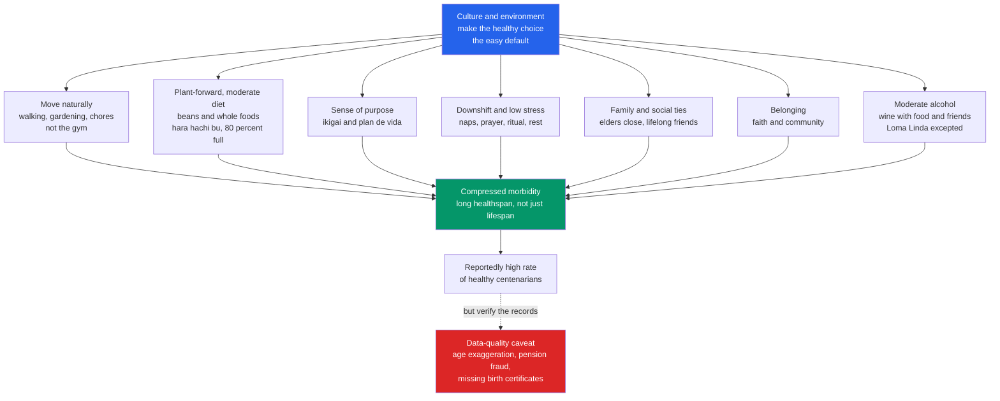

# 🌿 Blue Zones and Lifestyle Longevity

> [!abstract] TL;DR
> **Blue Zones** are a handful of regions — Okinawa (Japan), Sardinia (Italy), Ikaria (Greece), the Nicoya Peninsula (Costa Rica), and Loma Linda (California) — where people reportedly reach 100 at unusually high rates and stay healthy far longer than the modern norm. Named by demographers **Poulain and Pes** and popularized by **Dan Buettner**, they are best read as **natural experiments in longevity**: their shared habits — summarized as the **"Power 9"** — turn out to be the *same lifestyle levers* proven elsewhere (don't smoke, move constantly, eat plant-forward and moderately, stay socially connected, keep a sense of purpose, downshift stress). The single most important, well-evidenced lesson is that **longevity comes from stacking several ordinary habits, not from one magic intervention**, and that in these cultures **the environment makes the healthy choice the default** — you don't need more willpower, you need better defaults. The single most important *caveat*, thanks to **Saul Newman's** work, is that some Blue Zone statistics are inflated by **poor birth records, pension fraud, and age exaggeration** — so separate the durable, independently-verified lifestyle lessons from the romanticized marketing.

---

## Intuition

**Analogy: imagine a few oddly ordinary villages where reaching 100 is as unremarkable as reaching 80 elsewhere — and nobody there is *trying*.** No one counts macros, buys supplements, or grinds through a gym. A ninety-five-year-old Sardinian shepherd walks five miles of hillside because that is simply how you tend sheep. An Okinawan grandmother eats until she is *almost* full, gardens every morning, and meets the same five lifelong friends she has known since childhood. A Nicoyan farmer gets up at dawn with a clear reason to — a "plan de vida." None of it looks like health advice. It looks like **a way of life that happens to be healthy as a side effect.**

That is the whole puzzle, and the whole lesson. When a behavior that is famously hard everywhere else — eating less, moving daily, staying connected, not smoking — becomes *effortless and unavoidable* for an entire population, that population lives longer. The Blue Zones are not a diet or a program. They are proof that **health is downstream of environment and culture far more than of individual discipline** — which is exactly why you can learn from them without being able to copy them wholesale, and exactly why you should check whether the astonishing statistics are even real before you build a supplement brand on them.

---

## How It Works

### Core Mechanics

**1. What a Blue Zone is, and where the term came from.** In 2004, demographers **Michel Poulain and Gianni Pes** identified a cluster of villages in the mountainous Nuoro/Ogliastra region of **Sardinia** with an extreme concentration of male centenarians, and drew **blue circles** on the map — hence "Blue Zone." The National Geographic writer **Dan Buettner** popularized and expanded the idea, converging on five regions with reportedly exceptional longevity and healthy old age: **Okinawa** (Japan), **Sardinia** (Italy), **Ikaria** (Greece), the **Nicoya Peninsula** (Costa Rica), and **Loma Linda** (California, a community of Seventh-day Adventists). The claim is not just long *lifespan* but long **healthspan** — more years lived free of chronic disease and disability, i.e. **compressed morbidity** (the aging biology beneath this is the [[Hallmarks_of_Aging]]).

**2. The "Power 9" — the shared lifestyle pattern.** Across five very different cultures, Buettner distilled nine recurring habits. They fall into four buckets:

- **Move naturally.** Constant, low-intensity movement built into daily life — walking, gardening, herding, manual chores — *not* deliberate gym exercise. Their environments nudge them to move every 20 minutes; ours lets us sit all day (the modern counter-problem is covered in [[Sedentary_Behavior_and_Physical_Activity_Guidelines]]).
- **Eat wisely.** A **plant-forward, moderate-calorie** diet: beans and legumes as a cornerstone, whole grains, vegetables, minimal processed food, and meat only a few times a month. Okinawans practice **"hara hachi bu"** — a Confucian rule to *stop eating at roughly 80 percent full*, a cultural form of caloric moderation that maps onto the nutrient-sensing pathways of aging (this is the dietary-pattern story in [[Dietary_Patterns_and_Popular_Diets]]; beans and fiber feed the microbiome, per [[The_Gut_Microbiome_and_Nutrition]]). Most zones also include **moderate alcohol** — a glass or two of wine, with food and friends (Loma Linda's Adventists are the teetotal exception).
- **Connect.** A **sense of purpose** — Okinawan *ikigai*, Nicoyan *plan de vida*, a reason to get up in the morning (the wellbeing science is in [[Mental_Health_and_Psychological_Wellbeing]]). **Downshifting** routines that defuse chronic stress — naps in Ikaria, prayer in Loma Linda, ancestor veneration in Okinawa, an evening "happy hour" in Sardinia. And deep **social and family ties**: elders live with or near family, partners are committed for life, children are invested in, and friendships are lifelong (the Okinawan **"moai"** — a group of friends bonded for decades; the mortality evidence is in [[Social_Connection_and_Health]]).
- **Belong.** Membership in a **faith or community group**. Buettner reports that attending faith-based services regularly is associated with meaningfully longer life across the zones — belonging, ritual, and communal support acting together.

**3. The well-evidenced core: these are the same levers proven everywhere.** Strip away the folklore and the Power 9 collapse onto the lifestyle factors with the strongest independent evidence in all of epidemiology: **not smoking, regular physical activity, a plant-forward whole-food diet, moderate weight, strong social connection, and a sense of purpose.** Landmark cohort work — **Li et al. (2018)** on the US population — found that adults at age 50 with *all five* low-risk factors lived roughly **12–14 years longer** than those with none. The Blue Zones do not reveal an exotic secret; they reveal what happens when a *whole population* stacks these ordinary habits by default. **The gain is in the stacking**, not in any single heroic intervention.

**4. The health-behavior lesson: better defaults, not more willpower.** The deepest transferable insight is not a food or a nutrient — it is **choice architecture**. Blue Zone residents are not more disciplined than anyone else; their **environment and culture make the healthy choice the easy, automatic, social default.** Walkable villages, gardens instead of supermarkets, meals eaten slowly with others, purpose embedded in social roles. This reframes longevity from an individual willpower problem into an **environmental design** problem — the same "causes of the causes" logic as [[Determinants_of_Health]]. You change behavior at scale by changing defaults, not by exhorting people to try harder.

**5. The essential skepticism.** Blue Zones are **observational and, for the extreme-age claims, partly unverified.** Demographer **Saul Justin Newman** showed that regions reporting the highest rates of centenarians and supercentenarians correlate strongly with **poor birth-record keeping, poverty, and illiteracy** — conditions that generate **age exaggeration, clerical error, and pension fraud** (uncollected death records so families keep drawing pensions). When the US rolled out statewide birth certificates, reported supercentenarian numbers *fell sharply*; audits in Greece and Japan found large fractions of "living" centenarians were already dead. Newman's critique (recognized with a 2024 Ig Nobel Prize) does not prove the lifestyle lessons wrong — those are backed by separate, robust cohort data — but it shreds the aura of certainty around the *statistics* and warns against **over-romanticizing, cherry-picking, and confusing correlation with causation** (apply the toolkit in [[Nutrition_Myths_and_Evidence]]). The task is to **keep the durable lessons and discard the marketing.**

### Flow / Architecture



The diagram's real point is the top node and the dashed arrow. The healthy habits do not float free — they are **produced by the culture** at the top, which is why "just adopt the Power 9" understates the difficulty. And the dashed arrow at the bottom is the discipline of a good scientist: before you explain an extraordinary outcome, **confirm the outcome is real.**

---

## Key Concepts

### Secondary Level

- **A Blue Zone is a place where reaching 100 is unusually common** — Okinawa, Sardinia, Ikaria, Nicoya, and Loma Linda are the famous five.
- **The habits they share (the "Power 9")** are ordinary: move all day, eat mostly plants and stop before you are stuffed, keep close friends and family, have a reason to get up, and belong to a community.
- **No single habit is magic.** The long life comes from **stacking** several of them together, over decades.
- **Their secret is really their environment**: the healthy choice is the easy, normal, default choice — not the product of iron willpower.
- **Be a little skeptical.** Some of the "100-year-old" records are not fully trustworthy, so keep the sensible lessons and ignore the hype.

### Undergraduate Level

- **Origin and definition:** Poulain and Pes coined "Blue Zone" for a Sardinian longevity cluster; Buettner extended it to five regions and framed the **healthspan** claim (compressed morbidity), not just raw lifespan.
- **The four levers behind the Power 9:** natural movement, plant-forward moderate eating (hara hachi bu), stress downshifting plus purpose, and social/community belonging.
- **Convergence with the evidence base:** the Power 9 map almost exactly onto the independently-validated low-risk lifestyle factors (non-smoking, activity, diet quality, healthy weight, social connection) — see **Li et al. 2018** finding ~12–14 extra years at age 50 for adopting all of them.
- **The stacking principle:** each factor gives a modest hazard reduction; combined, they compound into a large life-expectancy difference — no single intervention accounts for it.
- **Choice architecture over willpower:** the transferable public-health lesson is to redesign defaults (walkability, food environment, social structure), the logic of [[Determinants_of_Health]].
- **The Newman critique:** high reported centenarian density correlates with poor vital-records infrastructure, poverty, and pension incentives — a serious data-quality confound for the extreme-age claims.

### Graduate Level

- **Compressed morbidity (Fries) as the real target:** the interesting quantity is not maximum lifespan but the *fraction of life spent healthy*. Blue Zone claims are strongest as healthspan observations and weakest as supercentenarian counts.
- **Nutrient sensing and caloric moderation:** hara hachi bu and legume-heavy, low-glycemic diets engage the **mTOR / AMPK / IGF-1 / sirtuin** axis — "deregulated nutrient sensing" is a canonical entry in the [[Hallmarks_of_Aging]], linking a cultural eating rule to conserved longevity biology and calorie-restriction research.
- **The identification problem:** Blue Zones are **observational, confounded, and cherry-picked** — regions selected *because* they showed the outcome, then explained post hoc. Healthy-user bias, survivorship bias, and ecological-fallacy risks abound; the multi-factor bundling makes it near-impossible to attribute effects to any single component causally.
- **Age-heaping and record fraud (Newman):** in the absence of reliable birth registration, reported ages heap and inflate; introduction of statewide US birth certificates cut reported supercentenarian rates by large margins, and audits (Greece ~72 percent, Japan's 2010 "missing centenarians") found substantial pension-driven overcounting. This does not falsify the lifestyle levers but demolishes naive use of the *counts*.
- **Separating durable lessons from marketing:** the commercially licensed "Blue Zones Project" and media (books, Netflix) blend robust behavioral science with romanticized narrative. The defensible core is the *convergent* lifestyle evidence; the sellable excess is the mystique of a copyable secret culture.
- **External validity and cultural non-transferability:** you cannot transplant a moai, a plan de vida, or four generations under one roof by policy fiat. Interventions must translate the *mechanisms* (movement defaults, food environment, social embedding) into new contexts rather than imitate the surface culture.

---

## Python Demo

```python
# Longevity is not one magic pill -- it is STACKED ordinary habits.
# We take rough published all-cause-mortality hazard ratios (HR) for the big
# lifestyle levers and show how adopting 1, 2, ... all of them compounds into
# projected extra years of healthy life -- with the honest caveat that these
# HRs come from OBSERVATIONAL cohorts (association, not proof of causation).
import numpy as np
import matplotlib.pyplot as plt

# --- Rough published all-cause mortality hazard ratios (healthy vs risky) ----
# Each HR below 1 means lower mortality risk. Values are rounded and
# illustrative, drawn from cohort meta-analyses, ordered by effect size.
factors = [
    ("Not smoking",        0.53),  # smoking roughly doubles mortality
    ("Regular activity",   0.68),  # active vs sedentary
    ("Strong social ties", 0.73),  # Holt-Lunstad 2010 meta-analysis
    ("Plant-forward diet", 0.78),  # top vs bottom diet-quality quintile
    ("Healthy weight",     0.80),  # normal BMI vs obese
    ("Moderate alcohol",   0.88),  # contested benefit -- see caveat
]
names = [f[0] for f in factors]
hr    = np.array([f[1] for f in factors])

# Multiplicative on the HAZARD (the standard Cox proportional-hazards
# assumption): combined HR after stacking the first k factors = product of HRs.
combined_hr = np.cumprod(hr)
log_benefit = -np.log(combined_hr)          # cumulative log-hazard reduction

# Naive Gompertz translation of hazard reduction into life-expectancy gain:
#   delta_LE ~= -ln(HR) / b,  b = mortality-rate doubling slope (~0.10 per yr).
# This OVERSTATES real gains (it ignores competing risks and a biological
# ceiling), so we also pass it through a saturating map calibrated to the
# empirical anchor: Li et al. 2018 found ~12-14 extra years at age 50 for
# adopting all low-risk factors together.
b = 0.10
naive_gain = log_benefit / b                          # optimistic upper bound
LE_MAX, k  = 16.0, 1.22                                # ceiling + saturation rate
real_gain  = LE_MAX * (1 - np.exp(-k * log_benefit))  # diminishing returns

n = np.arange(1, len(factors) + 1)
fig, (ax1, ax2) = plt.subplots(1, 2, figsize=(14, 5.5))

# LEFT: cumulative projected gain as habits are stacked -----------------------
ax1.plot(np.r_[0, n], np.r_[0, naive_gain], "o--", color="#9ca3af", lw=2,
         label="Naive multiplicative model (overstates)")
ax1.plot(np.r_[0, n], np.r_[0, real_gain], "o-", color="#059669", lw=2.5,
         label="With diminishing returns (realistic)")
ax1.axhline(13, color="#dc2626", ls=":", lw=2,
            label="Li et al. 2018 empirical (~13 yr, all factors)")
ax1.set_xticks(np.r_[0, n])
ax1.set_xlabel("Number of healthy habits STACKED")
ax1.set_ylabel("Projected gain in healthy life expectancy (years)")
ax1.set_title("Longevity compounds from stacking ordinary habits")
ax1.legend(fontsize=8, loc="lower right"); ax1.grid(alpha=0.3)

# RIGHT: marginal years added by each habit as it is stacked ------------------
marginal = np.diff(np.r_[0, real_gain])
colors = plt.cm.viridis(np.linspace(0.15, 0.85, len(names)))
ax2.bar(range(len(names)), marginal, color=colors)
ax2.set_xticks(range(len(names)))
ax2.set_xticklabels(names, rotation=30, ha="right", fontsize=9)
ax2.set_ylabel("Marginal years added by this habit")
ax2.set_title("No single magic bullet -- the first habits give the most")
for i, m in enumerate(marginal):
    ax2.text(i, m + 0.1, f"+{m:.1f}", ha="center", fontsize=9)
ax2.grid(alpha=0.3, axis="y")

plt.tight_layout(); plt.show()

# --- Numbers behind the picture ---------------------------------------------
print("Habit stacked              combined HR   projected +years")
for i, nm in enumerate(names):
    print(f"  {nm:20s}    {combined_hr[i]:.3f}         {real_gain[i]:5.1f}")
print(f"\nAll {len(names)} habits combined: HR = {combined_hr[-1]:.3f}, "
      f"projected +{real_gain[-1]:.1f} healthy years.")
print("CAVEAT: these hazard ratios are OBSERVATIONAL -- association, not proof "
      "of cause. Healthy-user bias and confounding inflate them; read this as "
      "a direction-of-effect illustration, not a personal prediction.")
```

**What it shows.** Each ordinary habit only nudges mortality risk on its own, but because risks combine **multiplicatively on the hazard**, stacking them **compounds** — the left panel climbs steeply as habits accumulate. The naive model would predict nearly 20 extra years; the realistic, saturating curve bends toward the **empirically observed ~12–14 years** (Li et al. 2018), because competing risks and a biological ceiling impose **diminishing returns**. The right panel makes the headline concrete: **there is no magic bullet** — quitting smoking is the single biggest lever, but no one factor delivers the whole benefit; the long life is *built by stacking*. The model is a deliberate caricature, and its inputs are **observational hazard ratios** vulnerable to healthy-user bias — so it illustrates the *shape* of the Blue Zone lesson, not a guarantee for any individual.

---

## Real-World Applications

- **Blue Zones Project (community redesign).** Buettner's organization has partnered with US cities — **Albert Lea (Minnesota)**, the California **Beach Cities**, **Fort Worth (Texas)** — to redesign the *environment*: walkable streets, healthier default menus, workplace and school policies, and social "moai" groups. It operationalizes "better defaults, not more willpower" as municipal policy — the applied form of [[Determinants_of_Health]].
- **Lifestyle medicine and clinical guidelines.** The convergent evidence behind the Power 9 underpins **lifestyle medicine** as a discipline (the American College of Lifestyle Medicine's six pillars: nutrition, activity, sleep, stress, social connection, avoiding risky substances) and reinforces plant-forward, Mediterranean-style dietary guidance ([[Dietary_Patterns_and_Popular_Diets]]).
- **The social-prescribing movement.** Health systems in the UK and elsewhere now "prescribe" community groups, volunteering, and social contact to combat isolation — a direct translation of the belonging/connection lever ([[Social_Connection_and_Health]]).
- **Purpose and healthy aging programs.** Interventions that cultivate *ikigai*-style purpose in retirees (volunteering, mentoring, structured roles) draw on the Nicoyan "plan de vida" observation ([[Mental_Health_and_Psychological_Wellbeing]]).
- **A cautionary case study in evidence literacy.** The Newman controversy is now taught as a model of how **compelling narratives can outrun data quality** — used to train researchers and journalists to check vital-records reliability before accepting extreme-longevity claims ([[Nutrition_Myths_and_Evidence]]).

---

## Common Pitfalls

- **Treating a Blue Zone as a diet or a product.** The lesson is a *whole way of life produced by an environment*, not a menu or a supplement. Buying "Blue Zone" cookbooks while keeping a sedentary, isolated, high-stress life misses the entire mechanism.
- **Chasing one magic ingredient.** People fixate on olive oil, red wine, or a specific bean. The demo's point is the opposite: **the effect is in the stack**, and no single component carries it. Isolating one factor is precisely the reductionism the concept warns against.
- **Ignoring the data-quality problem (romanticizing the numbers).** Accepting the centenarian *counts* uncritically, when many stem from poor birth records or pension fraud (Newman), lets marketing masquerade as science. Verify the outcome before explaining it.
- **Confusing correlation with causation.** These are observational, cherry-picked regions explained after the fact. "Blue Zone people eat X and live long" rarely means X *causes* the longevity — healthy-user bias and confounding are pervasive.
- **Assuming the culture is copyable.** You cannot decree a moai, four-generation households, or a lifelong plan de vida by policy. Interventions must translate the **mechanisms** (movement defaults, food environment, social embedding), not imitate the surface culture.
- **Overstating the alcohol lever.** "Wine at 5" is the shakiest of the Power 9; recent evidence questions whether *any* level of alcohol is net-protective. Do not use the Blue Zones to justify drinking.
- **Survivorship and static thinking.** Okinawan longevity was a mid-20th-century cohort phenomenon; younger Okinawans who adopted a Western diet have *worse* health. The pattern is not a fixed genetic destiny — it can be lost in a generation, which is itself evidence that lifestyle, not magic, drives it.

---

## Related Concepts

- [[Hallmarks_of_Aging]] — the underlying biology of *why* these habits work; hara hachi bu and low-glycemic eating engage the "deregulated nutrient sensing" hallmark (mTOR/AMPK/IGF-1).
- [[Cellular_Senescence_and_Senolytics]] — one molecular route by which chronic inflammation and metabolic stress (which Blue Zone habits reduce) accelerate biological aging.
- [[Health_and_Wellbeing_Overview]] — the healthspan-vs-lifespan framing and the six-pillar model that the Power 9 instantiate.
- [[Dietary_Patterns_and_Popular_Diets]] — the Blue Zone plant-forward, moderate-calorie pattern as one of the evidence-backed dietary patterns (alongside Mediterranean and DASH).
- [[The_Gut_Microbiome_and_Nutrition]] — why the legume-and-fiber cornerstone of Blue Zone diets matters mechanistically.
- [[Social_Connection_and_Health]] — the mortality evidence (Holt-Lunstad) behind the belonging, family, and "moai" levers.
- [[Mental_Health_and_Psychological_Wellbeing]] — the purpose (ikigai/plan de vida) and stress-downshifting components.
- [[Sedentary_Behavior_and_Physical_Activity_Guidelines]] — the modern counterpoint to Blue Zone "natural constant movement": why our environments make sitting the default.
- [[Determinants_of_Health]] — the "better defaults, not more willpower" insight; health as a product of environment and the causes of the causes.
- [[Nutrition_Myths_and_Evidence]] — the evidence-critique toolkit for separating the Newman-critiqued claims and marketing from the durable science.

---

## Review Questions

**Tier 1 — Recall / comprehension:**
1. Name the five Blue Zones and list the four broad buckets of the "Power 9." What does the Okinawan phrase "hara hachi bu" prescribe, and which longevity mechanism does it engage?
2. Explain the difference between *lifespan* and *healthspan*, and state which one the Blue Zone claims are strongest for.

**Tier 2 — Application / analysis:**
3. A wellness company launches a "Blue Zone superfood" supplement, citing Okinawan centenarians. Using the "stacking" finding and the choice-architecture insight, explain two distinct reasons this product misunderstands why Blue Zone residents live long.
4. A city wants to raise its residents' healthy life expectancy. Drawing on the "better defaults, not more willpower" principle and [[Determinants_of_Health]], design three *environmental* interventions (not exhortations) and justify each by which Power 9 lever it targets.

**Tier 3 — Synthesis / evaluation:**
5. Saul Newman argues that Blue Zone centenarian rates correlate with poor birth records and pension fraud. Does this critique invalidate the lifestyle advice derived from the Blue Zones? Argue precisely *which* claims it undermines and *which* survive it, and cite the independent evidence that survives.
6. The Python demo shows a naive multiplicative model predicting ~20 extra years while cohort data (Li et al.) find ~13. Explain the biological and statistical reasons for the gap (competing risks, diminishing returns, healthy-user bias), and argue whether the true causal effect is likely *smaller* or *larger* than the observed association — and why.

---

## Sources

- Buettner, D., & Skemp, S. (2016). "Blue Zones: Lessons From the World's Longest Lived." *American Journal of Lifestyle Medicine*, 10(5):318-321. [https://doi.org/10.1177/1559827616637066](https://doi.org/10.1177/1559827616637066)
- Poulain, M., Pes, G. M., et al. (2004). "Identification of a Geographic Area Characterized by Extreme Longevity in the Sardinia Island: the AKEA Study." *Experimental Gerontology*, 39(9):1423-1429. [https://doi.org/10.1016/j.exger.2004.06.016](https://doi.org/10.1016/j.exger.2004.06.016)
- Li, Y., et al. (2018). "Impact of Healthy Lifestyle Factors on Life Expectancies in the US Population." *Circulation*, 138(4):345-355. [https://doi.org/10.1161/CIRCULATIONAHA.117.032047](https://doi.org/10.1161/CIRCULATIONAHA.117.032047)
- Holt-Lunstad, J., Smith, T. B., & Layton, J. B. (2010). "Social Relationships and Mortality Risk: A Meta-analytic Review." *PLoS Medicine*, 7(7):e1000316. [https://doi.org/10.1371/journal.pmed.1000316](https://doi.org/10.1371/journal.pmed.1000316)
- Newman, S. J. (2019). "Supercentenarians and the Oldest-Old Are Concentrated Into Regions With No Birth Certificates and Short Lifespans." *bioRxiv* preprint. [https://doi.org/10.1101/704080](https://doi.org/10.1101/704080)

---

#health #longevity #blue-zones #lifestyle-medicine #centenarians
