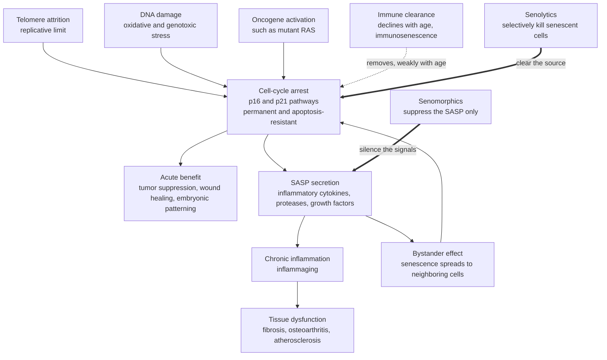

# 🧟 Cellular Senescence and Senolytics

> [!abstract] TL;DR
> **Cellular senescence** is a permanent exit from the cell cycle that a cell enters when it is too damaged to divide safely — triggered by **telomere attrition** (replicative senescence), **DNA damage**, or **oncogene activation**, and locked in by the **p16 and p21** tumor-suppressor pathways. It is **Janus-faced**: acutely *protective* (it halts would-be cancer cells and aids wound healing and embryonic patterning), but chronically *destructive*. Senescent cells resist death (**apoptosis-resistant**), accumulate as immune clearance falters with age, and pour out the **SASP** — the *senescence-associated secretory phenotype*, a broth of inflammatory cytokines, proteases, and growth factors that drives **"inflammaging,"** spreads senescence to neighbors (**bystander effect**), and degrades tissue. Genetically deleting these cells in mice (Baker & van Deursen) extends healthspan — turning senescence into one of the leading **intervention targets** in aging biology. Two drug classes exploit this: **senolytics** (dasatinib + quercetin, fisetin, navitoclax) that *selectively kill* senescent cells in intermittent **"hit-and-run"** doses, and **senomorphics** that *silence the SASP* without killing the cells. Human trials are early, promising, and unproven.

## Intuition — analogy first

Picture a factory where a machine breaks in a dangerous way. You have two safe options: **repair it**, or **shut it down and unplug it** so it can never run defective parts again. Cellular senescence is that second option — the body's "unplug it permanently" switch. A cell that has accumulated dangerous damage (frayed chromosome ends, broken DNA, a stuck accelerator pedal in the form of an active oncogene) would be a menace if it kept dividing, so instead it **arrests forever**. Smart safety engineering: better a dead-weight machine than a runaway one that produces cancer.

Here is the twist. These shut-down machines don't get hauled away to the scrapyard — they **refuse to die** and just sit on the factory floor. Worse, each one starts **leaking corrosive smoke** (the SASP): it rusts the machines around it, and some of *those* neighbors seize up and start smoking too. This is why people call them **"zombie cells"** — they've stopped doing their job, they won't die, and they *poison and infect* their neighbors. In a young factory, a cleanup crew (the immune system) spots the zombies and carts them off. But as the factory ages, the cleanup crew shrinks and slows, zombies pile up, and the whole floor fills with corrosive smoke — chronic, low-grade inflammation that quietly wrecks the tissue.

**Senolytics** are a targeted demolition crew: a drug that recognizes the specific "please don't kill me" survival signals zombies use to cling to life, switches them off, and lets the zombies finally die — after which the body clears the debris. Because zombie cells can't multiply, you don't need the demolition crew standing by all the time; you send them in **periodically** to clear the accumulated pile, then leave. That intermittent "**hit-and-run**" strategy is the whole therapeutic bet.

---

## How It Works

### From damage to a permanent arrest

A cell becomes senescent when a persistent **stress signal** convinces it that dividing would be dangerous. Three canonical triggers:

1. **Telomere attrition (replicative senescence).** Chromosome ends shorten a little each division because DNA polymerase can't copy the very tip (the *end-replication problem*). After roughly 50–60 divisions — the **Hayflick limit** — a critically short telomere loses its protective cap and looks to the cell exactly like a double-strand break, firing the DNA-damage response.
2. **DNA damage / stress-induced premature senescence.** Oxidative stress, radiation, or chemotherapy can slam a cell into senescence at *any* division number.
3. **Oncogene-induced senescence.** A hyperactive oncogene (classically mutant `RAS`) forces the cell to proliferate abnormally; the cell senses this as a threat and arrests — a genuine anti-cancer failsafe.

All three converge on two reinforcing brakes, both classic **tumor-suppressor pathways**:

- **The p53 → p21 axis** *initiates* the arrest (p21 inhibits the cyclin-dependent kinases that push the cell into S-phase).
- **The p16 → RB axis** *maintains* it. p16 rises and stays high, keeping RB in its growth-suppressing state — which is why the arrest becomes **irreversible**. Rising **p16** is the field's most-used biomarker of senescent burden.

Crucially, senescence is a **distinct third state**, not death and not mere pausing:

| State | Cell cycle | Reversible? | Metabolically active? | Secretes SASP? |
|---|---|---|---|---|
| **Quiescence (G0)** | Paused | Yes — can re-enter | Low | No |
| **Senescence** | Permanently arrested | No | Yes — very | Yes |
| **Apoptosis** | N/A — cell dies | N/A | Ends | No |

That "yes, very" metabolic activity is the problem: a senescent cell is not an inert corpse. It is a **factory rewired to produce inflammation**.

### The SASP: why one arrested cell harms the whole tissue

The **senescence-associated secretory phenotype (SASP)** is the senescent cell's active secretory program: pro-inflammatory cytokines (**IL-6, IL-8, IL-1α, TNF-α**), matrix-degrading proteases (**MMPs**), and growth factors. The SASP has three consequences that make senescence a *tissue-level*, not cell-level, disease driver:

- **Chronic inflammation ("inflammaging").** A persistent, sterile, low-grade inflammatory signal that is now recognized as a shared root of many age-related diseases.
- **Bystander / paracrine spread.** SASP factors push *healthy neighboring cells* into senescence — senescence is, in effect, **mildly contagious**, so burden can grow faster than intrinsic damage alone would predict.
- **Tissue degradation.** Proteases dismantle the extracellular matrix and impair stem-cell function and regeneration.

### Accumulation with age: a two-sided imbalance

Senescent burden rises with age because **production goes up while clearance goes down**:

- **Production rises** — more accumulated DNA damage, shorter telomeres, and bystander spread.
- **Clearance falls** — the immune cells that normally hunt and remove senescent cells (NK cells, macrophages, T cells) themselves decline with age (**immunosenescence**). Senescent cells are also intrinsically hard to kill because they upregulate anti-apoptotic **BCL-2-family** survival proteins.

The result is a runaway: burden climbs, the SASP recruits more inflammation, immune surveillance erodes, and clearance can't keep up.

### The intervention logic

Baker, van Deursen and colleagues delivered the causal proof: using a genetic switch to **selectively delete p16-high senescent cells in mice extends healthspan and delays age-related dysfunction** across many tissues. That transformed senescence from a *marker* of aging into a *target*. Two pharmacological strategies followed:

- **Senolytics** — drugs that *selectively kill* senescent cells, typically by disabling the very BCL-2-family survival signals the cells depend on. Because senescent cells don't proliferate, you can dose **intermittently** ("hit-and-run"): clear the pile, stop, let it slowly rebuild, clear again — minimizing off-target exposure.
- **Senomorphics** — drugs that *don't kill* the cells but **suppress the SASP** (e.g., blocking the NF-κB or mTOR signaling that drives secretion). This defuses the inflammation without removing the cells' beneficial arrest.



---

## Key Concepts

### Secondary (school-level intuition)

- **Senescent cells are "zombie cells."** They stop dividing but refuse to die, and they release signals that harm and infect neighboring cells.
- **Two faces.** In the young body, senescence is *protective* — it stops damaged cells from becoming cancer and helps wounds heal. In the old body, senescent cells *pile up* and cause harm.
- **Why they pile up.** With age, the body makes *more* of them and the immune "cleanup crew" gets *worse* at removing them.
- **Senolytics** are drugs that selectively kill the zombie cells; **senomorphics** are drugs that just quiet down the harmful signals they release.
- Deleting these cells in mice makes the mice healthier for longer — the core evidence that this matters.

### Undergraduate (mechanism and pharmacology)

- **Three states, one difference.** Distinguish **quiescence** (reversible pause, G0), **senescence** (irreversible arrest, metabolically active, SASP-secreting), and **apoptosis** (programmed death). Conflating them is the classic error.
- **The two brakes.** **p53 → p21** initiates arrest; **p16^INK4a^ → RB** maintains it and makes it permanent. p16 is the workhorse biomarker of senescent burden.
- **Replicative vs. stress-induced.** Replicative senescence follows telomere erosion at the Hayflick limit; stress-induced premature senescence (SIPS) and oncogene-induced senescence (OIS) can arrive at any division number.
- **The SASP toolkit.** IL-6, IL-8, IL-1α, TNF-α (inflammation); MMPs (matrix breakdown); growth factors (aberrant signaling). Driven largely by **NF-κB** and **mTOR**.
- **Why they resist death.** Senescent cells upregulate **BCL-2-family** anti-apoptotic proteins (BCL-2, BCL-xL, BCL-W). Senolytics work by removing this crutch — e.g., **navitoclax (ABT-263)** is a BCL-2/BCL-xL inhibitor; **dasatinib** disrupts pro-survival kinase signaling; **quercetin** and **fisetin** are flavonoids hitting PI3K/BCL-xL. The classic combination is **dasatinib + quercetin (D+Q)**.
- **Hit-and-run dosing.** Because senescent cells don't proliferate, a *single short course* can clear much of the burden; you re-dose only periodically. This intermittent schedule limits drug exposure and toxicity compared with continuous therapy.

### Graduate (systems view, evidence, and open problems)

- **Antagonistic pleiotropy.** Senescence is a textbook case: a program selected for its *early-life* benefit (tumor suppression, wound healing) that becomes *harmful late in life* when selection is weak — the evolutionary logic behind why an anti-cancer failsafe drives aging.
- **The causal chain of evidence.** Correlation (senescent cells accumulate with age and cluster at disease sites) → genetic causation (**INK-ATTAC / p16-driven ablation** extends healthspan; Baker et al. 2011, 2016) → pharmacological proof of concept (senolytics improve function and, in some studies, lifespan in aged mice; Xu et al. 2018).
- **Heterogeneity is the hard problem.** "Senescence" is not one state — the trigger, tissue, and time shape the transcriptome and the SASP. There is **no single universal marker** (p16, SA-β-gal, and Lamin B1 loss are each imperfect), which complicates both diagnosis and drug targeting. A senolytic that clears one senescent subtype may miss another.
- **The Janus problem for therapy.** Beneficial roles mean **indiscriminate clearance could backfire**: impairing wound healing, liver regeneration, and even *unleashing* cancers whose growth was being restrained by OIS. Timing, tissue-selectivity, and dose matter.
- **Disease-specific programs.** Senescent cells are causally implicated in **osteoarthritis** (senescent chondrocytes), **idiopathic pulmonary fibrosis** and other **fibroses**, **atherosclerosis** (senescent vascular and foam cells), diabetic complications, and neurodegeneration (senescent astrocytes/microglia).
- **The translation gap.** Mouse healthspan extension is robust; human evidence is **early-stage** — small, open-label or short trials (e.g., D+Q in idiopathic pulmonary fibrosis and diabetic kidney disease). Whether intermittent senolytics safely improve human healthspan remains **unproven**, and enthusiasm has repeatedly outrun data in longevity science.

---

## Python Demo

We model the **senescent-cell fraction** `S` of a tissue across an adult lifespan, capturing the three drivers the biology demands: (1) **intrinsic production that rises with age**, (2) a **bystander/contagion term** where the SASP converts healthy neighbors (`S` spreading into `1 − S`, like an epidemic), and (3) **immune clearance that declines with age** (immunosenescence). Then we overlay **periodic "hit-and-run" senolytic doses** that instantly remove a fraction of senescent cells, and show how *intermittent* clearance holds the burden low even though the drug is absent most of the time.

$$\frac{dS}{dt} = \underbrace{\big[p(t) + \beta S\big]\,(1 - S)}_{\text{production + bystander spread}} \;-\; \underbrace{c(t)\,S}_{\text{immune clearance}}$$

```python
# Senescent-cell accumulation vs. periodic "hit-and-run" senolytic clearance.
# dS/dt = (p(t) + beta*S)*(1 - S) - c(t)*S
#   p(t): intrinsic production rises with age
#   beta*S : SASP-driven bystander spread (contagion of senescence)
#   c(t): immune clearance falls with age (immunosenescence)
# Senolytics: at fixed intervals, instantly kill a fraction of senescent cells.
import numpy as np
import matplotlib.pyplot as plt

# --- Model parameters (t is "years of adult life", age 20 -> 90) ------
P0    = 0.0020   # baseline intrinsic senescence production (per year)
TAU_P = 25.0     # production rises: p(t) = P0 * (1 + t/TAU_P)
BETA  = 0.050    # bystander/contagion strength (SASP spreads senescence)
C0    = 0.150    # baseline immune clearance rate (per year)
TAU_C = 30.0     # clearance declines: c(t) = C0 / (1 + t/TAU_C)
S0    = 0.010    # starting senescent fraction at age 20

# --- Senolytic "hit-and-run" schedule --------------------------------
DOSE_INTERVAL = 5.0    # years between doses
DOSE_START    = 10.0   # first dose at t=10  (age 30)
KILL_FRAC     = 0.60   # each dose removes 60% of senescent cells

YEARS = 70.0
dt    = 0.02
t     = np.arange(0.0, YEARS + dt, dt)
n     = len(t)

def p(tt):  # age-rising production
    return P0 * (1.0 + tt / TAU_P)

def c(tt):  # age-falling immune clearance
    return C0 / (1.0 + tt / TAU_C)

def simulate(with_senolytic):
    S = np.zeros(n)
    S[0] = S0
    next_dose = DOSE_START
    for i in range(1, n):
        s = S[i-1]
        dS = (p(t[i-1]) + BETA * s) * (1.0 - s) - c(t[i-1]) * s
        s_new = s + dt * dS
        # Apply an intermittent senolytic pulse when a dose is due.
        if with_senolytic and t[i] >= next_dose:
            s_new *= (1.0 - KILL_FRAC)
            next_dose += DOSE_INTERVAL
        S[i] = min(max(s_new, 0.0), 1.0)
    return S

S_untreated = simulate(with_senolytic=False)
S_treated   = simulate(with_senolytic=True)
age = 20.0 + t   # convert model time to human age

dose_times = np.arange(DOSE_START, YEARS, DOSE_INTERVAL)

print(f"Untreated senescent fraction at age 90 : {S_untreated[-1]*100:5.1f}%")
print(f"Treated   senescent fraction at age 90 : {S_treated[-1]*100:5.1f}%")
print(f"Peak treated burden across life        : {S_treated.max()*100:5.1f}%")
print(f"Doses delivered                        : {len(dose_times)}")

# --- Plot ------------------------------------------------------------
fig, (ax1, ax2) = plt.subplots(2, 1, figsize=(9, 8), sharex=False)

ax1.plot(age, S_untreated*100, color='crimson', lw=2, label='No treatment')
ax1.plot(age, S_treated*100,  color='seagreen', lw=2, label='Periodic senolytics (hit-and-run)')
for d in dose_times:
    ax1.axvline(20.0 + d, color='seagreen', ls=':', alpha=0.35)
ax1.set_xlabel('Age (years)')
ax1.set_ylabel('Senescent-cell fraction (%)')
ax1.set_title('Senescent burden: runaway accumulation vs. intermittent clearance')
ax1.legend(loc='upper left', fontsize=9)
ax1.grid(alpha=0.3)

# Why burden accumulates: production up, clearance down.
ax2.plot(age, p(t)*1000, color='darkorange', lw=2, label='Production p(t)  (x1000/yr)')
ax2.plot(age, c(t),      color='steelblue',  lw=2, label='Immune clearance c(t)  (/yr)')
ax2.set_xlabel('Age (years)')
ax2.set_ylabel('Rate')
ax2.set_title('Two-sided imbalance: production rises while clearance declines')
ax2.legend(loc='upper right', fontsize=9)
ax2.grid(alpha=0.3)

plt.tight_layout()
plt.show()
```

**What it shows.** Without treatment (top, red), the senescent fraction climbs relentlessly across the lifespan — not just from rising intrinsic production but amplified by the **bystander term** and the **collapsing clearance** shown in the bottom panel: production `p(t)` rises while immune clearance `c(t)` falls, so the tissue loses the race. With **periodic senolytics** (green), each dotted dose line drops the burden sharply; between doses it slowly rebuilds, producing a **sawtooth** that stays far below the untreated curve. The key insight of **"hit-and-run" dosing** falls straight out of the model: because senescent cells *don't proliferate*, you don't need continuous drug — a **short pulse every few years** is enough to keep the burden low, minimizing exposure and off-target toxicity. (The parameters are illustrative, not clinically calibrated — the point is the *shape* of the dynamics, not the numbers.)

---

## Real-World Applications

- **Osteoarthritis** — senescent chondrocytes accumulate in damaged joints and drive cartilage breakdown via SASP proteases; local senolytics (e.g., navitoclax-class or UBX0101) have been tested by intra-articular injection to clear them at the disease site.
- **Idiopathic pulmonary fibrosis (IPF)** — the **first-in-human senolytic trial** (Mayo Clinic, 2019) used **dasatinib + quercetin** in IPF patients, reporting improved physical function and reduced circulating SASP factors — a proof-of-feasibility, not proof of efficacy.
- **Diabetic kidney disease** — a small open-label D+Q study showed a measurable reduction in senescent-cell burden in adipose and skin biopsies in humans, one of the few direct demonstrations that the drugs clear human senescent cells.
- **Atherosclerosis** — senescent cells in plaques promote instability; clearing them slowed plaque progression in mouse models, motivating cardiovascular interest.
- **Geroscience / longevity medicine** — senescence sits alongside a handful of aging mechanisms as a *shared-driver* target: rather than treating one age-related disease at a time, clear the senescent cells that underlie many. It is a flagship of the "target aging itself" strategy (see [[Aging_and_Regeneration]]).
- **Cancer therapy interplay** — chemo and radiation induce **therapy-induced senescence** in tumors and normal tissue; a proposed **"one-two punch"** first pushes tumor cells into senescence, then applies senolytics to remove them and blunt SASP-driven relapse.

---

## Common Pitfalls

- **Confusing senescence with cell death or with quiescence.** Senescent cells are *alive, metabolically active, and apoptosis-resistant* — they will not clear themselves, which is exactly why senolytics must *actively kill* them. And unlike quiescent (G0) cells, they cannot be coaxed back into dividing.
- **Treating senescence as purely harmful.** Its acute roles — **tumor suppression, wound healing, embryonic development** — are real and beneficial. Indiscriminate clearance risks impaired healing, blocked liver regeneration, and even releasing cancers that oncogene-induced senescence was restraining. Timing and selectivity matter.
- **Assuming one drug clears all senescent cells.** Senescence is **heterogeneous** across tissue and trigger, with no universal marker; a senolytic effective against one subtype (or one BCL-2-family dependency) may leave others untouched.
- **Extrapolating mouse healthspan straight to humans.** The mouse-to-human gap is the central caution of longevity science. Human data are early, small, and mostly measure *biomarkers*, not lifespan or hard outcomes.
- **Buying "senolytic supplements" (e.g., unsupervised fisetin/quercetin megadoses).** Effective doses, schedules, long-term safety, and real-world benefit are unestablished; dasatinib in particular is a potent prescription kinase inhibitor with genuine toxicity.
- **Ignoring the SASP as a target in its own right.** Killing cells (senolytics) is not the only lever — **senomorphics** that quiet the SASP may be safer where the arrest itself is still doing useful work.

---

## Related Concepts

- [[Aging_and_Regeneration]] — the broader hallmarks-of-aging picture in which cellular senescence is one interacting hallmark; positions senescence among telomere attrition, stem-cell exhaustion, and inflammaging.
- [[Aging_and_Genome_Instability]] — the deep molecular companion: shelterin, the end-replication problem, the ATM → p53 → p21 and p16 → RB circuitry, and the BCL-2-family pharmacology of senolytics in full detail.
- [[The_Cell_Cycle_and_Mitosis]] — the cell-cycle checkpoints and CDK regulation that p21 and p16 hijack to enforce a *permanent* arrest; the baseline needed to see how senescence differs from a normal cell-cycle pause.
- [[Cancer_and_the_Cell_Cycle]] — senescence as an anti-cancer failsafe (halting damaged cells) and its dark mirror: SASP-driven tumor promotion and the tension between anti-aging and anti-cancer goals.
- [[Cancer_Genetics_and_Oncogenes]] — oncogene-induced senescence (mutant RAS) and the p53/RB tumor-suppressor logic that senescence shares with cancer biology.
- [[The_Innate_Immune_System]] — NK cells and macrophages that normally surveil and clear senescent cells; their age-related decline (immunosenescence) is why burden accumulates.
- [[The_Adaptive_Immune_System]] — T-cell-mediated clearance and the immunosenescence that erodes the "cleanup crew" side of the production-vs-clearance balance.
- [[Stem_Cells_and_Differentiation]] — SASP and senescence impair stem-cell niches and regeneration, linking senescent burden to declining tissue repair with age.
- [[Metabolism_and_Energy_Balance]] — metabolic dysfunction and chronic inflammation intersect with inflammaging; nutrient-sensing interventions like caloric restriction can reduce senescent burden.

---

## Review Questions

1. **(Secondary)** Explain, using the "zombie cell" analogy, why senescent cells are described as both *protective* early in life and *harmful* later in life. What are the two things a senescent cell does that a normal dead cell does not?
2. **(Undergraduate)** A researcher stains an aged tissue and finds many p16-high cells that are metabolically active, resist apoptosis, and secrete IL-6 and MMPs. (a) Which cellular state is this, and how do you distinguish it from quiescence and apoptosis? (b) Why does this state make a senolytic — rather than simply waiting for the cells to die — necessary, and what molecular dependency do senolytics like navitoclax exploit? (c) Why can the drug be given intermittently ("hit-and-run") rather than continuously?
3. **(Graduate)** Genetic ablation of senescent cells extends healthspan in mice, yet senescence also suppresses tumors and aids wound healing. Design the conceptual requirements for a *safe* human senolytic program: address (a) the antagonistic-pleiotropy trade-off and the risk of unleashing OIS-restrained cancers, (b) the heterogeneity problem and the absence of a universal senescence marker, and (c) why the mouse-to-human translation gap should temper claims. When might a *senomorphic* be preferable to a *senolytic*?

---

## Sources

- Baker, D.J., Childs, B.G., ... van Deursen, J.M. (2016). "Naturally occurring p16^Ink4a^-positive cells shorten healthy lifespan." *Nature*, 530, 184–189. — [Nature](https://doi.org/10.1038/nature16932)
- van Deursen, J.M. (2014). "The role of senescent cells in ageing." *Nature*, 509, 439–446. — [Nature](https://doi.org/10.1038/nature13193)
- Xu, M., Pirtskhalava, T., ... Kirkland, J.L. (2018). "Senolytics improve physical function and increase lifespan in old age." *Nature Medicine*, 24, 1246–1256. — [Nature Medicine](https://doi.org/10.1038/s41591-018-0092-9)
- Justice, J.N., Nambiar, A.M., ... Kirkland, J.L. (2019). "Senolytics in idiopathic pulmonary fibrosis: results from a first-in-human, open-label, pilot study." *EBioMedicine*, 40, 554–563. — [EBioMedicine](https://doi.org/10.1016/j.ebiom.2018.12.052)
- Campisi, J. & d'Adda di Fagagna, F. (2007). "Cellular senescence: when bad things happen to good cells." *Nature Reviews Molecular Cell Biology*, 8, 729–740. — [NRMCB](https://doi.org/10.1038/nrm2233)

---

#health #aging #cellular-senescence #senolytics #SASP
