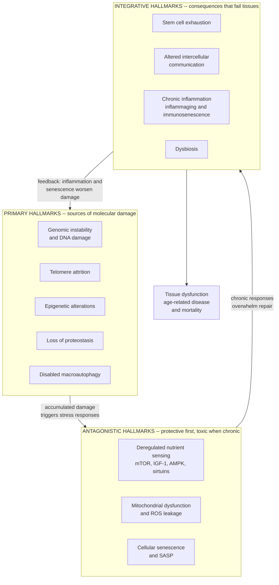

# 🧬 Hallmarks of Aging

> [!abstract] TL;DR
> The **hallmarks of aging** are a small set of shared cellular and molecular processes that together drive biological aging across tissues — originally **nine** in López-Otín et al. (Cell, 2013), expanded to **twelve** in 2023. They are grouped into **primary** hallmarks (the sources of damage), **antagonistic** hallmarks (stress responses that protect us at first but turn toxic when chronic), and **integrative** hallmarks (the downstream consequences that make tissues fail). Their power is that they are not a list of independent villains but a **reinforcing network**: aging is best understood as a *systems failure* in which each hallmark accelerates the others, and each is a candidate *therapeutic target*.

---

## Intuition

**Analogy: aging is the mechanic's checklist of how any complex machine wears out.**

Take a car that has run for 250,000 miles. No single thing kills it — instead a mechanic finds the *same recurring failure modes* every time an old engine comes into the shop: worn bearings, a corroded frame, a gummed-up fuel system, a battery that no longer holds charge, sensors that misfire and trigger the wrong responses. Any one problem is survivable; what dooms the car is that they **feed each other** — a bad bearing overheats the oil, degraded oil wears more bearings, and the misfiring sensors keep the engine running rich, which fouls everything else. The hallmarks of aging are exactly this checklist for a *living* machine: a short, recurring inventory of what goes wrong at the cellular level in every aging body, plus the crucial insight that the failures are wired together into a cascade.

Push the analogy one notch: some of the "failures" are actually the car's *safety systems misbehaving*. When a component overheats, a good design shuts that part down to protect the rest — sensible in an emergency, disastrous if it stays shut forever. That is the essence of the **antagonistic** hallmarks (like cellular senescence): a protective brake that saves you from cancer today but, applied to more and more cells for decades, corrodes the tissue it was meant to protect. The framework's real teaching is that you cannot fix aging one bolt at a time while ignoring the wiring diagram.

---

## How It Works

### The framework and why it exists

Before 2013, biogerontology was a sprawling field of competing single-cause theories (free radicals, telomeres, wear-and-tear, programmed death). López-Otín, Blasco, Partridge, Serrano and Kroemer imposed order by asking: what candidate processes qualify as genuine *drivers* of aging rather than mere correlates? They proposed **three criteria** a process must satisfy to earn the "hallmark" label:

1. **Time-dependence** — it should *manifest during normal aging* (it appears and worsens as an organism gets older).
2. **Aggravation accelerates aging** — *experimentally worsening* it should *speed up* aging or shorten healthy lifespan.
3. **Amelioration retards aging** — *experimentally reversing or dampening* it should *slow* aging and extend **healthspan** (the disease-free, functional portion of life). This third criterion is the therapeutic gold standard, and the hardest to satisfy.

The 2013 paper named **nine** hallmarks; the 2023 follow-up ("Hallmarks of aging: An expanding universe") added **three** more, for **twelve**, and stressed their **interconnection** even more strongly.

### The three tiers

**PRIMARY hallmarks — the causes of damage.** Unambiguously negative: they inflict molecular damage and nothing good comes of them.

- **Genomic instability and DNA damage** — mutations, chromosomal aberrations, and unrepaired lesions accumulate as DNA-repair capacity declines (link [[Aging_and_Genome_Instability]], [[DNA_Repair_and_Mutation]]).
- **Telomere attrition** — the protective caps on chromosome ends shorten with each division until cells hit replicative senescence or crisis.
- **Epigenetic alterations** — drift in DNA methylation and histone marks changes *which* genes are expressed; this is what **epigenetic aging clocks** measure (link [[Epigenetics_DNA_Methylation_and_Histone_Modification]], [[Genes_Environment_and_Epigenetics_in_Health]]).
- **Loss of proteostasis** — the protein quality-control system (chaperones, proteasome) falters, so misfolded and aggregated proteins pile up (the substrate of Alzheimer's and Parkinson's).
- **Disabled macroautophagy** *(added 2023)* — the cellular recycling of damaged organelles and aggregates slows, removing a key clean-up route that also links proteostasis to nutrient sensing.

**ANTAGONISTIC hallmarks — protective at first, harmful in excess.** These are *responses* to the damage above. At low levels they are adaptive; sustained for decades they become pathological — a dose-and-duration problem.

- **Deregulated nutrient sensing** — the growth/thrift network of **mTOR, IGF-1, AMPK, and sirtuins**. Robust anabolic (growth) signaling is good when young but pro-aging when chronically high; dialing it *down* (caloric restriction, rapamycin, metformin) is the most reproducible lifespan-extending lever known.
- **Mitochondrial dysfunction** — aging mitochondria produce less ATP and leak more reactive oxygen species and damage signals, feeding back onto DNA and inflammation (link [[Oxidative_Phosphorylation]], [[Mitochondria_and_Chloroplasts]]).
- **Cellular senescence** — a stress-arrested state that is *anti-cancer* (it stops damaged cells from dividing, link [[Cancer_and_the_Cell_Cycle]]) but harmful in bulk: senescent cells resist death and secrete an inflammatory **SASP** (senescence-associated secretory phenotype) that poisons neighbors.

**INTEGRATIVE hallmarks — the consequences that fail tissues.** These emerge when damage and responses overwhelm the tissue's ability to maintain itself; they most directly produce the *aged phenotype*.

- **Stem cell exhaustion** — the regenerative reserve depletes, so blood, gut, muscle, and skin renew poorly (link [[Stem_Cells_and_Differentiation]]).
- **Altered intercellular communication and inflammaging** — endocrine, neuronal, and immune signaling drifts toward a chronic pro-inflammatory tone.
- **Chronic inflammation** *(elevated in 2023)* — the sterile, low-grade, systemic inflammation nicknamed **inflammaging**, coupled with **immunosenescence** (a weakening, dysregulated immune system that both clears fewer senescent cells and fuels more inflammation).
- **Dysbiosis** *(added 2023)* — an aging shift in the gut microbiome that promotes inflammation and impairs metabolism (link [[The_Gut_Microbiome_and_Nutrition]]).

### Aging as a networked failure

The framework's central modern claim is that the hallmarks are **not additive but multiplicative**: they form a densely connected feedback network. Short telomeres trigger senescence; senescent SASP drives inflammaging; inflammation damages mitochondria; failing mitochondria raise ROS that damages DNA and shortens telomeres — closing the loop. This is why aging behaves like a **complex systems collapse** rather than the failure of a single part (link [[Feedback_Loops_and_Causality]], [[Cascades_and_Systemic_Risk]]). It also motivates the field's biggest open debate — *which hallmarks are upstream root causes versus downstream symptoms?* — since intervening on an upstream node should ripple further than patching a downstream one.



---

## Key Concepts

### Secondary Level

- **A hallmark is a shared failure mode.** Instead of one theory of aging, the framework lists a short set of processes that go wrong in *every* aging cell and organism — a diagnostic checklist for the body.
- **Three buckets.** *Primary* = what causes damage (bad DNA, short telomeres). *Antagonistic* = safety responses that help briefly but hurt long-term (like a cell shutting itself down). *Integrative* = the visible results (weak repair, chronic inflammation) that make you frail.
- **Nine became twelve.** The original 2013 list had nine hallmarks; a 2023 update added three (disabled autophagy, chronic inflammation, dysbiosis).
- **They feed each other.** No single hallmark "is" aging. Each one speeds up the others, so aging snowballs — which is why fixing one thing at a time is so hard.

### Undergraduate Level

- **The three qualifying criteria** (manifests with age, aggravation accelerates aging, amelioration slows aging) are the framework's rigor: they separate *drivers* from mere *biomarkers*. Many popular "causes of aging" fail criterion 3.
- **Cellular senescence is the model antagonistic hallmark.** It illustrates **antagonistic pleiotropy** — a trait selected because it prevents cancer early in life becomes harmful late in life when senescent cells accumulate and the immune system can no longer clear them (immunosenescence).
- **Nutrient sensing is the most druggable node.** The mTOR/IGF-1/AMPK/sirtuin axis links diet to aging; caloric restriction, rapamycin (mTOR inhibitor), and metformin/AMPK activation all extend lifespan in model organisms, tying the hallmarks to metabolism (link [[Metabolism_and_Energy_Balance]]).
- **Inflammaging is a unifying theme.** Low-grade chronic inflammation is both a hallmark *and* a common pathway through which other hallmarks (senescent SASP, mitochondrial DAMPs, dysbiosis) cause damage, and it links aging to nearly every age-related disease.
- **Biological-age clocks operationalize the hallmarks.** Epigenetic (Horvath, Hannum, DunedinPACE) and proteomic/immune clocks estimate the *pace* of aging from molecular readouts of these hallmarks, often predicting mortality better than birth date (link [[Biomarkers_and_Measuring_Health]]).

### Graduate Level

- **Upstream vs downstream — the causal ordering debate.** The tiering is *conceptual*, not a proven causal chain. Candidate "root" hallmarks include epigenetic reprogramming (partial reprogramming with Yamanaka factors can reverse cell age without erasing identity) and nutrient sensing (its manipulation moves the most other hallmarks). Whether senescence and inflammation are *causes* or *amplifiers* is actively contested and matters enormously for where to intervene.
- **Geroscience hypothesis.** Because the hallmarks jointly underlie cancer, neurodegeneration, cardiovascular, and metabolic disease, targeting *aging itself* (rather than one disease) could compress morbidity across all of them simultaneously — the rationale for trials like TAME (metformin) using multimorbidity as an endpoint.
- **Antagonistic pleiotropy and disposable soma** give the hallmarks an evolutionary logic: selection optimizes early-life reproduction and tolerates late-life damage, so the antagonistic hallmarks are *features* of a program tuned for a different life stage, not simple malfunctions.
- **Network centrality and intervention leverage.** Modeling the hallmarks as a directed feedback graph reframes therapy design as a *leverage-point* problem: senolytics (clear senescent cells), NAD+ restoration (mitochondrial/sirtuin), rapalogs (mTOR), and partial reprogramming (epigenetic) each hit different nodes, and combination therapy targeting hubs may beat single-node interventions (link [[Feedback_Loops_and_Causality]]).
- **Limits and critiques.** The framework is criticized as descriptive rather than mechanistic, as tissue-averaged (hallmarks differ by organ), and as potentially over-inclusive (the 9-to-12 expansion invites "hallmark inflation"). It remains an organizing *heuristic*, not a validated causal model.

---

## Python Demo

```python
# Aging as an interacting NETWORK of hallmarks, not a single clock.
#
# We model four hallmark "damage" variables (each normalized to [0,1]) accruing
# from age 20 to 100, wired into a positive-feedback network:
#
#   telomere attrition  --> cellular senescence
#   senescent SASP      --> inflammaging      (and damages mitochondria)
#   inflammaging        --> mitochondrial dysfunction (and more senescence)
#   mitochondrial ROS   --> telomere loss + senescence   (closes the loop)
#
# Immune clearance of senescent cells DECLINES with age (immunosenescence).
# We integrate the four hallmarks into an "estimated biological age" that
# outpaces chronological age -- then show that a senolytic-style intervention
# on ONE upstream node (boosting senescent-cell clearance) slows the WHOLE
# cascade. This is a Systems-Thinking point: intervene on a hub, not a symptom.

import numpy as np
import matplotlib.pyplot as plt

ages = np.arange(20, 101)          # chronological age
n = len(ages)

def simulate(intervene=False, intervene_age=50, senolytic=0.6):
    telo = np.zeros(n); sen = np.zeros(n); mito = np.zeros(n); infl = np.zeros(n)
    bio_age = np.zeros(n); bio_age[0] = ages[0]

    # intrinsic per-year accrual (baseline damage sources)
    r_telo, r_sen, r_mito, r_infl = 0.006, 0.004, 0.006, 0.004
    # coupling gains: who accelerates whom (the feedback wiring)
    g_mito_telo = 0.010   # ROS speeds telomere loss
    g_telo_sen  = 0.020   # short telomeres trigger senescence
    g_infl_sen  = 0.015   # inflammation promotes senescence
    g_mito_sen  = 0.012   # mito dysfunction promotes senescence
    g_sen_infl  = 0.030   # SASP drives inflammaging
    g_mito_infl = 0.010   # mito DAMPs drive inflammation
    g_infl_mito = 0.018   # inflammation damages mitochondria (feedback)
    g_sen_mito  = 0.010   # SASP damages neighbouring mitochondria

    for t in range(1, n):
        a = ages[t]
        # senescent-cell clearance FALLS with age (immunosenescence)
        clear = 0.020 * (1.0 - (a - 20) / 120.0)
        if intervene and a >= intervene_age:
            clear += senolytic * 0.020        # senolytic boosts clearance

        d_telo = r_telo + g_mito_telo * mito[t-1]
        d_sen  = (r_sen + g_telo_sen*telo[t-1] + g_infl_sen*infl[t-1]
                  + g_mito_sen*mito[t-1]) - clear * sen[t-1]
        d_mito = r_mito + g_infl_mito*infl[t-1] + g_sen_mito*sen[t-1]
        d_infl = (r_infl + g_sen_infl*sen[t-1] + g_mito_infl*mito[t-1]
                  - 0.015 * infl[t-1])        # partial resolution of inflammation

        telo[t] = np.clip(telo[t-1] + d_telo, 0, 1)
        sen[t]  = np.clip(sen[t-1]  + d_sen,  0, 1)
        mito[t] = np.clip(mito[t-1] + d_mito, 0, 1)
        infl[t] = np.clip(infl[t-1] + d_infl, 0, 1)

        # integrate hallmarks -> biological age accrues faster than 1 yr/yr
        damage = 0.25*telo[t] + 0.30*sen[t] + 0.25*mito[t] + 0.20*infl[t]
        bio_age[t] = bio_age[t-1] + 1.0 + 2.0 * damage

    return dict(telo=telo, sen=sen, mito=mito, infl=infl, bio=bio_age)

base = simulate(intervene=False)
treat = simulate(intervene=True, intervene_age=50)

fig, ax = plt.subplots(1, 2, figsize=(14, 5.2))

# ---- Panel 1: the four hallmark trajectories (baseline) ----
ax[0].plot(ages, base["telo"], lw=2.2, label="Telomere attrition")
ax[0].plot(ages, base["sen"],  lw=2.2, label="Cellular senescence")
ax[0].plot(ages, base["mito"], lw=2.2, label="Mitochondrial dysfunction")
ax[0].plot(ages, base["infl"], lw=2.2, label="Inflammaging")
ax[0].set_title("Interacting hallmark trajectories")
ax[0].set_xlabel("Chronological age"); ax[0].set_ylabel("Normalized damage 0 to 1")
ax[0].legend(fontsize=8, loc="upper left")

# ---- Panel 2: biological vs chronological age, with intervention ----
ax[1].plot(ages, ages, "--", color="gray", label="Chronological age (reference)")
ax[1].plot(ages, base["bio"],  lw=2.5, color="#c0392b",
           label="Biological age (no intervention)")
ax[1].plot(ages, treat["bio"], lw=2.5, color="#2e8b57",
           label="Biological age (senolytic from age 50)")
ax[1].axvline(50, ls=":", color="black")
ax[1].set_title("One upstream intervention slows the cascade")
ax[1].set_xlabel("Chronological age"); ax[1].set_ylabel("Estimated biological age")
ax[1].legend(fontsize=8, loc="upper left")

plt.tight_layout()
plt.savefig("hallmarks_of_aging.png", dpi=110)

gap_base  = base["bio"][-1]  - ages[-1]
gap_treat = treat["bio"][-1] - ages[-1]
print(f"Biological-age GAP at age 100, no intervention : +{gap_base:5.1f} years")
print(f"Biological-age GAP at age 100, with senolytic  : +{gap_treat:5.1f} years")
print(f"Years of biological aging averted by the hub intervention: "
      f"{gap_base - gap_treat:5.1f}")
```

**What the demo teaches.** Panel 1: no hallmark rises alone — because they are wired into a positive-feedback loop, they accelerate *together*, and senescence and inflammaging climb fastest late in life as clearance fails (immunosenescence). Panel 2: the integrated "biological age" **diverges** from chronological age (the gray diagonal), exactly the divergence that aging clocks quantify. Crucially, hitting *one upstream node* — boosting senescent-cell clearance from age 50 — bends the entire trajectory down, because that node is a **hub** in the feedback network. This is the core Systems-Thinking lesson (link [[Feedback_Loops_and_Causality]]): in a reinforcing network you get the most leverage by intervening on a hub, not by patching each symptom, and the benefit *compounds* over time.

---

## Real-World Applications

- **Senolytic drugs.** Dasatinib + quercetin and fisetin selectively clear senescent cells; in mice they improve healthspan and physical function, and human trials in idiopathic pulmonary fibrosis and diabetic kidney disease target the *cellular senescence* hallmark directly.
- **mTOR inhibitors (rapalogs).** Rapamycin and everolimus dial down *deregulated nutrient sensing*; low-dose rapalogs have improved immune response to vaccination in older adults — a rare human healthspan signal.
- **Caloric restriction, fasting, and metformin.** These act on the AMPK/mTOR/IGF axis; the TAME trial proposes metformin as the first "anti-aging" drug tested against multimorbidity as an endpoint, embodying the geroscience hypothesis.
- **NAD+ boosters (NR, NMN).** Aim at *mitochondrial dysfunction* and sirtuin signaling; widely sold as supplements though human outcome evidence remains thin.
- **Epigenetic partial reprogramming.** Transient Yamanaka-factor expression reverses the *epigenetic alterations* hallmark and restored vision in aged mice by resetting cellular age without loss of identity — a leading root-cause approach now in biotech pipelines.
- **Biological-age clocks in the clinic and in trials.** DNA-methylation clocks (Horvath, DunedinPACE) and inflammatory/proteomic clocks are used as *surrogate endpoints* to test whether an intervention actually slows the hallmarks (link [[Biomarkers_and_Measuring_Health]]).
- **Microbiome and inflammaging interventions.** Fecal transplant, prebiotics, and diet target *dysbiosis* and *chronic inflammation* to modulate the integrative hallmarks (link [[The_Gut_Microbiome_and_Nutrition]]).

---

## Common Pitfalls

- **Treating the tiers as a proven causal chain.** "Primary → antagonistic → integrative" is a *heuristic ordering*, not an established mechanism. The real system is a cyclic feedback network, and the upstream-vs-downstream question is unresolved — do not present it as settled.
- **Assuming more hallmarks means more understanding.** The 9-to-12 expansion risks "hallmark inflation." A longer list is not a deeper theory; each addition should still meet the three criteria (especially criterion 3, amelioration).
- **Confusing a biomarker with a driver.** Many things change with age (grey hair, some methylation sites) without *causing* aging. A correlate that fails the aggravation/amelioration tests is not a hallmark.
- **Single-target optimism.** Because the hallmarks reinforce one another, fixing one node often triggers compensation elsewhere. Durable effect usually needs hub-targeting or combinations — the demo's central point.
- **Extrapolating mouse lifespan to human healthspan.** Most dramatic results (senolytics, reprogramming, rapamycin) are in short-lived models. Human data are early, and lifespan extension in a mouse is not proof of benefit in people.
- **Reading a biological-age clock as destiny.** Clocks estimate a *population-calibrated pace*, carry measurement noise, and can be confounded by cell-type mixture; an "accelerated" clock is a prompt to investigate, not a diagnosis.
- **Ignoring tissue heterogeneity.** Hallmarks weight differently across organs (telomeres matter more in blood/gut; proteostasis in brain). Whole-body averages hide where the real bottleneck is.

---

## Related Concepts

- [[Aging_and_Genome_Instability]] — the primary hallmarks of genomic instability, DNA damage, and telomere attrition in molecular detail.
- [[Epigenetics_DNA_Methylation_and_Histone_Modification]] — the machinery behind the *epigenetic alterations* hallmark and the methylation aging clocks that measure it.
- [[Genes_Environment_and_Epigenetics_in_Health]] — how environment writes the epigenetic marks that clocks read, and how biological age is estimated.
- [[Aging_and_Regeneration]] — the developmental-biology view of aging, senescence, and the regenerative decline behind stem cell exhaustion.
- [[Stem_Cells_and_Differentiation]] — the regenerative reserve whose depletion is the *stem cell exhaustion* integrative hallmark.
- [[Cancer_and_the_Cell_Cycle]] — why senescence is an anti-cancer brake, illustrating the antagonistic-pleiotropy logic of aging.
- [[Cancer_Genetics_and_Oncogenes]] — cancer as a prototypical disease of aging arising from the same genomic-instability hallmark.
- [[Oxidative_Phosphorylation]] — the mitochondrial ATP/ROS biology underlying the *mitochondrial dysfunction* hallmark.
- [[Mitochondria_and_Chloroplasts]] — organelle structure and function relevant to mitochondrial decline and mitophagy.
- [[Metabolism_and_Energy_Balance]] — the nutrient-sensing and metabolic context of the mTOR/IGF/AMPK axis.
- [[The_Gut_Microbiome_and_Nutrition]] — the *dysbiosis* hallmark added in 2023 and its link to inflammaging.
- [[Biomarkers_and_Measuring_Health]] — biological-age clocks and how hallmarks are quantified as measurable endpoints.
- [[Feedback_Loops_and_Causality]] — the positive-feedback dynamics that make aging a reinforcing network rather than a single cause.
- [[Cascades_and_Systemic_Risk]] — the systems view of aging as a cascading, networked failure.

---

## Review Questions

1. **(Secondary)** Name the three tiers of hallmarks and give one example of each. Explain, using the "old machine" analogy, why cellular senescence sits in the *antagonistic* tier rather than the *primary* tier.
2. **(Undergraduate)** State the three criteria a process must meet to qualify as a hallmark of aging. Take one popular "cause of aging" that fails the third criterion (amelioration) and explain why that failure matters for whether it should guide therapy.
3. **(Graduate)** The hallmarks form a positive-feedback network, and the demo shows that intervening on a single hub bends the whole trajectory. Given the unresolved debate over which hallmarks are *upstream root causes*, argue for which node you would target first — and design an experiment (including endpoints and controls) that could distinguish a true upstream driver from a downstream amplifier.

---

## Sources

- López-Otín, C., Blasco, M. A., Partridge, L., Serrano, M., & Kroemer, G. (2013). *The Hallmarks of Aging.* Cell, 153(6), 1194-1217.
- López-Otín, C., Blasco, M. A., Partridge, L., Serrano, M., & Kroemer, G. (2023). *Hallmarks of aging: An expanding universe.* Cell, 186(2), 243-278.
- Kennedy, B. K., et al. (2014). *Geroscience: Linking Aging to Chronic Disease.* Cell, 159(4), 709-713.
- Franceschi, C., et al. (2018). *Inflammaging: a new immune-metabolic viewpoint for age-related diseases.* Nature Reviews Endocrinology, 14(10), 576-590.
- Di Micco, R., Krizhanovsky, V., Baker, D., & d'Adda di Fagagna, F. (2021). *Cellular senescence in ageing: from mechanisms to therapeutic opportunities.* Nature Reviews Molecular Cell Biology, 22(2), 75-95.

---

#health #aging #hallmarks-of-aging #senescence #biogerontology
