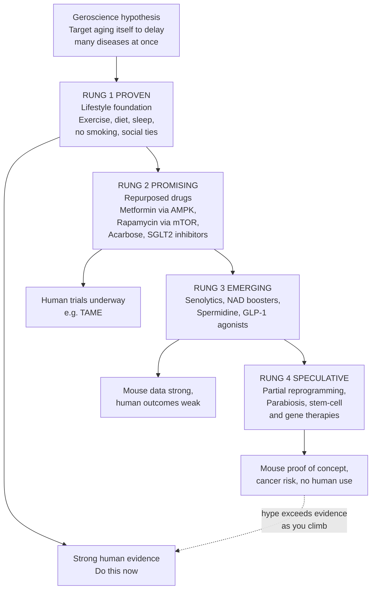

# 🧬 Longevity Interventions and the Future of Aging

> [!abstract] TL;DR
> Aging is now treatable in principle: the **geroscience hypothesis** holds that because a handful of shared molecular processes drive most age-related disease, an intervention that slows aging itself could delay cancer, heart disease, dementia, and frailty *simultaneously* — a far bigger prize than curing any single disease. The catch is that the field is a steep **evidence ladder**. At the bottom sit the only things robustly proven to extend healthy human life — exercise, good diet, sleep, not smoking, social connection. One rung up are repurposed drugs with real but incomplete evidence (**metformin, rapamycin**). Higher still are emerging bets with strong mouse data but weak human outcomes (**senolytics, NAD+ boosters**). At the speculative top is **partial epigenetic reprogramming** — resetting a cell's biological age with Yamanaka factors — which has reversed aging markers in mice but is nowhere near safe human use. The single most useful skill in this field is a **hype detector**: the ability to tell the rung of the ladder an intervention is actually on from the confidence with which it is sold.

---

## Intuition

**Analogy:** Think of aging as a clock, and interventions as things you can do to it. The **proven, boring stuff** — moving your body, sleeping, eating real food — reliably makes the clock **tick slower**. A **promising set of drugs** might slow the hands a little more, but we are still reading the instructions. The **experimental frontier** is trying to *reset the clock backwards* — take an old cell and make it young again — which has genuinely worked in a dish and in mice, but doing it in a living human without triggering cancer is like resetting a running watch mid-tick without breaking the mainspring. And surrounding all of it is a **carnival of clock-menders** — supplement sellers, unregulated clinics, and podcast gurus — promising to stop the clock entirely for the price of a subscription.

The core discipline is separating those four things. Almost everyone can benefit from *slowing* the clock today with tools we have proven work. Almost no one can safely *reverse* it yet, no matter what the marketing says. Confusing "a mouse lived longer" or "my biomarker improved" with "this will make me live longer" is the central error of the entire field.

---

## How It Works

### The geroscience hypothesis

Conventional medicine plays **whack-a-mole**: cure a cancer and the patient later dies of heart disease; fix the heart and dementia arrives. The reason is that these diseases share upstream drivers — the **hallmarks of aging** such as cellular senescence, genomic instability, mitochondrial decline, chronic inflammation ("inflammaging"), and deranged nutrient sensing. **Geroscience** proposes targeting those shared drivers directly. If you slow aging itself, you compress the whole cluster of age-related diseases at once and *add healthy years*, not just frail ones. This is why a modest anti-aging effect could dwarf the public-health value of curing any individual disease — a point formalized in the **longevity dividend** argument.

### The evidence ladder

The honest way to organize interventions is not by excitement but by **strength of human evidence**:

1. **Rung 1 — Proven foundation (lifestyle).** Regular exercise (especially cardiovascular fitness and strength), a whole-food dietary pattern, adequate sleep, avoiding tobacco, and strong social connection are the *only* interventions robustly shown to extend healthy human lifespan. They are unglamorous, unpatentable, and unsexciting — and they beat everything above them on this list combined. The [[Blue_Zones_and_Lifestyle_Longevity|Blue Zones]] are the population-scale demonstration.

2. **Rung 2 — Repurposed drugs (real but incomplete evidence).** Off-patent drugs already proven safe for other uses, now tested for aging:
   - **Metformin** — a diabetes drug that activates **AMPK** and mimics some effects of caloric restriction. Observational data hinted diabetics on metformin outlived non-diabetics; the proposed **TAME trial** (Targeting Aging with Metformin) is designed to test whether it delays the *onset of multiple age-related diseases* as a bloc — a landmark regulatory precedent as much as a drug test.
   - **Rapamycin** and rapalogs — the **most consistent lifespan extender in mice**, acting by inhibiting **mTOR**, a master nutrient-sensing growth switch. Inhibiting mTOR mimics nutrient scarcity and boosts autophagy. Real human tradeoffs (immune effects, metabolic side effects, dosing schedules) mean it is promising, not proven, for healthy people.
   - **Acarbose** and **SGLT2 inhibitors** — blunt glucose/insulin excursions; both extend mouse lifespan and are plausible geroprotectors under study.

3. **Rung 3 — Emerging / experimental (strong mouse data, weak human outcomes).**
   - **Senolytics** — drugs that selectively kill **senescent ("zombie") cells** that accumulate with age and poison surrounding tissue with inflammatory signals. Clearing them rejuvenates aged mice; human outcome trials are early.
   - **NAD+ boosters (NMN, NR)** — NAD+ is a coenzyme central to energy metabolism and DNA repair that declines with age. Precursors reliably *raise NAD+ levels* in humans, but there is **little evidence they improve aging outcomes** — a textbook case of a compelling mechanism outrunning the data.
   - **Spermidine** and **GLP-1 agonists** — spermidine induces autophagy; GLP-1 drugs (originally for diabetes and obesity) are showing broad cardiometabolic benefits and an emerging, speculative geroprotective role.

4. **Rung 4 — Speculative frontier (proof-of-concept, no safe human use).**
   - **Partial epigenetic reprogramming** — briefly expressing the **Yamanaka factors** (OSKM) to reset a cell's epigenetic "age" *without* erasing its identity. Work from the **Sinclair** and **Belmonte** labs restored youthful gene-expression and even reversed vision loss in aged mice. The dark twin is **cancer**: full reprogramming makes tumors, so the challenge is rejuvenating without dedifferentiating. Far from human use.
   - **Parabiosis / young plasma, stem-cell and regenerative therapies, gene therapies** — attempts to supply youthful signals or replace worn parts. Vivid mouse results, thin and often commercially exploited human evidence.

### The measurement problem

To know if any of this works you need to measure aging *faster than lifespan allows*. Enter **aging clocks** — epigenetic (DNA-methylation) and multi-omic **biomarkers** that estimate biological age. They are the field's great hope as **surrogate endpoints**, but they are **not yet validated**: it is unproven that *changing your clock changes your fate*. A clock that merely *predicts* mortality is not the same as one that *causally tracks* aging, and optimizing an unvalidated surrogate is exactly how you fool yourself. See [[Biomarkers_and_Measuring_Health]].

### The intervention ladder



---

## Key Concepts

### Secondary

- **Healthspan vs lifespan** — lifespan is how long you live; **healthspan** is how long you live *without* disease and disability. The goal of serious longevity science is extending healthspan (compressing sickness into a short window at the end), not merely adding frail years.
- **Geroscience** — the idea that treating the aging process itself can prevent many diseases at once, because they share common causes.
- **Lifestyle is the proven base** — exercise, diet, sleep, not smoking, and social connection are the only interventions with strong human evidence for a longer, healthier life. Everything more exotic is a bet layered on top of these.
- **The mouse-to-human gap** — most exciting results are in mice, worms, or cell dishes. Short-lived lab animals in sterile cages are a poor model of a human's decades-long, messy life; most interventions that extend mouse life fail to translate.

### Undergraduate

- **The four rungs of evidence** — proven lifestyle, promising repurposed drugs (metformin, rapamycin), emerging bets (senolytics, NAD+), and speculative reprogramming — ranked by *human* outcome data, not by mechanistic elegance or press coverage.
- **mTOR and AMPK as nutrient-sensing hubs** — rapamycin inhibits **mTOR** (the "growth on" switch) and metformin activates **AMPK** (the "energy low" sensor); both pharmacologically mimic the state of caloric restriction, the oldest known lifespan-extending intervention.
- **Cellular senescence and senolytics** — senescent cells stop dividing but resist death and secrete inflammatory signals (the SASP). Selectively removing them (**senolytics**) reverses several aging phenotypes in mice.
- **NAD+ decline and the mechanism-vs-outcome gap** — NAD+ falls with age and precursors (NMN/NR) demonstrably restore blood levels, yet human *outcome* evidence is weak. A striking case study in why "it fixes the biomarker" is not "it makes you healthier."
- **Surrogate endpoints and aging clocks** — because you cannot wait a lifetime for a mortality result, the field wants a validated short-term proxy. Epigenetic clocks are candidate surrogates but remain unvalidated as *causal* readouts of aging.

### Graduate

- **Partial reprogramming and the identity/cancer boundary** — transient OSKM expression can reset epigenetic age while (ideally) preserving cell identity. The theoretical basis is that aging carries an *epigenetic* (software) component that is reversible, distinct from irreversible *genetic* (hardware) damage. The lethal risk is teratoma/cancer if cells dedifferentiate; the open problem is a therapeutic window that rejuvenates without dedifferentiating, in vivo, safely.
- **Antagonistic pleiotropy and why aging isn't "one bug"** — evolution never optimized for post-reproductive survival; genes and pathways (e.g., growth signaling) that boost early fitness harm us later. Aging is therefore a *distributed* failure across many systems, which is why single-target "cures" are naive and multi-hallmark thinking dominates.
- **The longevity dividend vs the failure-of-success scenario** — extending healthspan yields huge economic and human value (the **longevity dividend**); but if we extend *lifespan without healthspan*, we get a demographic "failure of success" — more years of costly frailty. The entire societal case hinges on *compressing morbidity*, not just postponing death.
- **Regulatory endpoints** — you cannot get a drug approved for "aging" because aging is not a recognized disease indication. TAME's real innovation is proposing a *composite morbidity endpoint*, potentially opening a regulatory path to treat aging as an approvable target.
- **Distributive justice of radical life extension** — if effective interventions are expensive and privately provisioned, they could convert wealth inequality into **lifespan inequality**, a novel and severe form of injustice. See [[Distributive_Justice_and_Inequality]] and [[Genetic_Engineering_and_Enhancement_Ethics]].

---

## Python Demo

```python
# Map candidate longevity interventions on an EVIDENCE vs HYPE landscape.
# x-axis: strength of human OUTCOME evidence (0 = none, 10 = proven in people)
# y-axis: potential effect size / hype (0 = modest claims, 10 = "cure aging")
# The gap between an item's y and x is its "hype premium" -- the distance
# between how it is SOLD and what has been SHOWN.
import numpy as np
import matplotlib.pyplot as plt

# (name, human_evidence, hype_or_potential, rung)
interventions = [
    ("Exercise",             9.3, 5.2, 1),
    ("Diet / not smoking",   9.0, 4.8, 1),
    ("Sleep",                8.2, 4.2, 1),
    ("Metformin (TAME)",     5.0, 4.5, 2),
    ("Rapamycin / mTOR",     4.3, 6.3, 2),
    ("Acarbose / SGLT2i",    3.8, 4.0, 2),
    ("Senolytics",           2.8, 7.0, 3),
    ("NAD+ (NMN / NR)",      1.8, 7.6, 3),
    ("Spermidine",           2.4, 4.3, 3),
    ("GLP-1 agonists",       5.4, 5.6, 3),
    ("Young plasma",         1.1, 6.8, 4),
    ("Partial reprogramming", 0.7, 9.5, 4),
]

rung_color = {1: "#2e7d32", 2: "#1565c0", 3: "#ef6c00", 4: "#c62828"}
rung_label = {1: "Rung 1 Proven", 2: "Rung 2 Promising",
              3: "Rung 3 Emerging", 4: "Rung 4 Speculative"}

fig, ax = plt.subplots(figsize=(11, 8))

# Diagonal: evidence == hype. ABOVE it = hype exceeds evidence (danger zone).
line = np.linspace(0, 10, 100)
ax.plot(line, line, "--", color="gray", linewidth=1.4)
ax.fill_between(line, line, 10, color="crimson", alpha=0.06)
ax.fill_between(line, 0, line, color="green", alpha=0.06)
ax.text(1.6, 8.9, "HYPE  >  EVIDENCE\n(buyer beware)",
        color="crimson", fontsize=11, fontweight="bold", ha="left")
ax.text(6.6, 2.1, "EVIDENCE  >=  HYPE\n(do this now)",
        color="darkgreen", fontsize=11, fontweight="bold", ha="left")

seen = set()
for name, ev, hype, rung in interventions:
    lbl = rung_label[rung] if rung not in seen else None
    seen.add(rung)
    ax.scatter(ev, hype, s=190, color=rung_color[rung],
               edgecolor="black", linewidth=0.7, zorder=5, label=lbl)
    ax.annotate(name, (ev, hype), xytext=(6, 6),
                textcoords="offset points", fontsize=9)

ax.set_xlim(0, 10)
ax.set_ylim(0, 10)
ax.set_xlabel("Strength of human OUTCOME evidence  -->", fontsize=12)
ax.set_ylabel("Potential effect size / hype  -->", fontsize=12)
ax.set_title("The Longevity Landscape: Evidence vs Hype\n"
             "Distance above the dashed line = how far marketing outruns proof",
             fontsize=13)
ax.legend(loc="lower left", framealpha=0.9)
ax.grid(alpha=0.25)

plt.tight_layout()
plt.savefig("longevity_evidence_vs_hype.png", dpi=110, bbox_inches="tight")
plt.show()

# Quantify the "hype premium" (how far each sits above the evidence=hype line)
print("Hype premium (potential minus evidence), sorted:")
for name, ev, hype, _ in sorted(interventions, key=lambda r: r[2] - r[1], reverse=True):
    print(f"  {name:24s} evidence={ev:4.1f}  hype={hype:4.1f}  premium={hype-ev:+5.1f}")
```

**What it shows:** The proven lifestyle interventions (green) cluster in the lower-right — high evidence, honest claims — the only quadrant where you should confidently act today. As you move up the ladder toward reprogramming (red), points drift into the upper-left "danger zone" where **hype outruns evidence**. Partial reprogramming has the largest *hype premium*: near-zero human outcome data paired with the boldest claims. The plot is a visual hype-detector — the vertical distance above the dashed diagonal quantifies exactly how far an intervention's marketing has outrun its proof.

---

## Real-World Applications

1. **Personal decision-making (what to actually do).** The rational strategy the ladder implies: fully exploit Rung 1 (it is proven, free, and effective), treat Rung 2 as physician-supervised experiments, and regard Rungs 3-4 as research to *watch*, not products to *buy*. Most measurable healthspan gain available to a person today lives entirely on the bottom rung.
2. **The TAME trial and a regulatory path for "aging."** By seeking approval against a *composite* age-related-disease endpoint, TAME aims to establish that aging itself can be an approvable target — the precedent that would let future geroprotectors reach patients at all.
3. **Longevity biotech and clinics.** A wave of companies (Altos Labs, Calico, Unity Biotechnology and others) pursue reprogramming and senolytics with serious science, while a parallel fringe of unregulated "anti-aging clinics" sell unproven infusions and stem-cell treatments — the same field, opposite ends of the evidence ladder.
4. **The supplement market.** NMN/NR, resveratrol, and spermidine are sold at scale on *mechanistic* stories, largely ahead of human outcome data — a multi-billion-dollar case study in mechanism outrunning proof.
5. **Public-health and pension policy.** If interventions extend *healthspan*, the longevity dividend reshapes retirement, workforce, and healthcare economics favorably; if they extend only *lifespan*, they worsen the burden of aging — making the healthspan-vs-lifespan distinction a policy variable, not just a biological one.

---

## Common Pitfalls

- **Confusing the rung with the confidence.** The cardinal error: treating a Rung 3-4 intervention (senolytics, NAD+, reprogramming) with Rung 1 certainty because it is *newer and more exciting*. Excitement is inversely correlated with evidence here.
- **The mouse-to-human leap.** "Extended lifespan in mice" is a hypothesis-generator, not a human recommendation. Most such results never translate; caged, short-lived, genetically uniform mice are a weak model of human aging.
- **Mechanism worship.** "NAD+ declines with age and this raises it" is a mechanism, not an outcome. Raising a biomarker you believe *should* matter is not evidence that people get healthier — the NMN/NR story is the canonical trap.
- **Optimizing an unvalidated surrogate.** Chasing a lower "epigenetic age" assumes the clock *causes* rather than merely *correlates with* aging. Improving an unvalidated surrogate can be self-deception (Goodhart's law for biology).
- **Supplement grifting and unproven clinics.** The field's genuine promise is a magnet for hype: subscription supplements sold on podcasts and cash-only clinics offering "stem cells" or young-plasma infusions with no controlled evidence and real risks.
- **Ignoring the tradeoffs of real drugs.** Rapamycin and metformin are not free lunches — immune, metabolic, and dosing tradeoffs mean self-experimentation without medical supervision can do net harm.
- **Immortality framing.** Serious near-term science is about compressing morbidity and adding healthy years — not "curing death." Conflating the two discredits the credible work and feeds the grift.

---

## Related Concepts

- [[Biomarkers_and_Measuring_Health]] — supplies the measurement toolkit; aging clocks are the proposed surrogate endpoints for judging whether any intervention here actually works, and why unvalidated surrogates mislead.
- [[Aging_and_Regeneration]] — the underlying developmental biology of senescence, stem cells, and tissue regeneration that reprogramming and senolytics try to manipulate.
- [[Aging_and_Genome_Instability]] — the genomic/epigenetic damage that constitutes a core hallmark of aging and that reprogramming claims to partially reverse.
- [[Genetic_Engineering_and_Enhancement_Ethics]] — reprogramming and gene therapies for aging are human-enhancement technologies; the same ethics of germline editing, safety, and "playing with human nature" apply.
- [[Distributive_Justice_and_Inequality]] — the risk that expensive interventions convert wealth inequality into lifespan inequality; the justice frame for who gets access to added healthy years.
- [[Metabolism_and_Energy_Balance]] — nutrient sensing (mTOR, AMPK, insulin/IGF) is the metabolic machinery that rapamycin, metformin, acarbose, and caloric restriction all act upon.
- [[Dietary_Patterns_and_Popular_Diets]] — the dietary half of the Rung 1 foundation, and the origin of the caloric-restriction and fasting hypotheses that the drugs pharmacologically mimic.
- [[Exercise_Physiology_Overview]] — exercise (especially cardiorespiratory fitness) is the single best-evidenced longevity intervention and the anchor of the proven bottom rung.
- [[Sleep_Science_and_Circadian_Rhythms]] — sleep is a proven Rung 1 pillar; circadian disruption accelerates several hallmarks of aging.
- [[Genes_Environment_and_Epigenetics_in_Health]] — the epigenetic-clock and reprogramming story rests on the idea that aging has a reversible epigenetic component distinct from fixed genetic damage.

---

## Review Questions

### Secondary

1. State the **geroscience hypothesis** in one sentence, and explain why an intervention that slows aging could be more valuable than a cure for any single disease.
2. Name the five **proven lifestyle** interventions on the bottom rung of the evidence ladder. Why do these outperform every more exotic intervention despite getting the least attention?
3. What is the difference between **healthspan** and **lifespan**, and why does the whole societal case for longevity science depend on which one we extend?

### Undergraduate

1. Rapamycin and metformin both mimic caloric restriction but through *different* switches. Name the pathway each acts on (mTOR vs AMPK) and explain what "mimicking nutrient scarcity" does at the cellular level.
2. NAD+ precursors reliably raise NAD+ levels in humans, yet the field treats them skeptically. Explain the **mechanism-versus-outcome gap** using this example, and say what evidence *would* move NMN/NR up the ladder.
3. Why is the **mouse-to-human gap** so treacherous for interpreting longevity results? Give two concrete reasons a lifespan-extending result in mice might fail in people.

### Graduate

1. Partial epigenetic reprogramming reversed aging markers in mice but risks cancer. Explain the **identity-versus-rejuvenation** boundary: what exactly must a safe therapy accomplish, and why does the same mechanism that rejuvenates also threaten to cause tumors?
2. Aging clocks are proposed as **surrogate endpoints** to avoid waiting a lifetime for mortality data. Design an argument (and the study you would need) to establish whether a clock *causally tracks* aging versus merely *predicts* death — and explain why "improving your clock" is meaningless until that question is settled.
3. Suppose an effective, expensive geroprotective therapy arrives. Using a distributive-justice frame, argue whether it should be publicly provisioned. Address the "longevity dividend" upside, the risk of converting wealth inequality into **lifespan inequality**, and the demographic "failure of success" scenario.

---

## Sources

- [López-Otín, C., et al. "Hallmarks of Aging: An Expanding Universe." *Cell*, 2023](https://doi.org/10.1016/j.cell.2022.11.001)
- [Barzilai, N., et al. "Metformin as a Tool to Target Aging (the TAME trial rationale)." *Cell Metabolism*, 2016](https://doi.org/10.1016/j.cmet.2016.05.011)
- [Wilkinson, J. E., et al. / Harrison, D. E., et al. "Rapamycin fed late in life extends lifespan in genetically heterogeneous mice." *Nature*, 2009](https://doi.org/10.1038/nature08221)
- [Lu, Y., Belmonte, J. C. I., Sinclair, D., et al. "Reprogramming to recover youthful epigenetic information and restore vision." *Nature*, 2020](https://doi.org/10.1038/s41586-020-2975-4)
- [Olshansky, S. J., et al. "In Pursuit of the Longevity Dividend." *The Scientist*, 2006](https://www.the-scientist.com/uncategorized/in-pursuit-of-the-longevity-dividend-46600)

---

#health #longevity #geroscience #rapamycin #life-extension
