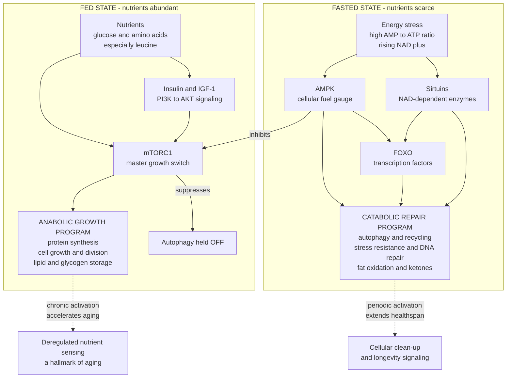

# 🔄 Nutrient Sensing, Fasting, and Caloric Restriction

> [!abstract] TL;DR
> Every cell continuously *reads the room* for food and flips between two programs: a **growth program** when nutrients are abundant — driven by **insulin/IGF-1 signaling** and **mTOR**, which build protein, divide cells, and store energy — and a **repair-and-conserve program** when food is scarce — driven by **AMPK**, the **sirtuins**, and **FOXO** transcription factors, which trigger **autophagy** (cellular recycling), stress resistance, and fat burning. These are **evolutionarily conserved longevity switches**: turning the growth arm *down* (or the repair arm *up*) is the **single most reproducible way to extend lifespan** across yeast, worms, flies, and mice. **Caloric restriction (CR)** — eating fewer calories without malnutrition — is the gold-standard intervention; **fasting protocols** (time-restricted eating, alternate-day fasting, fasting-mimicking diets) chase the same machinery through *when* you eat; and **CR mimetics** (rapamycin, metformin, resveratrol, spermidine) try to pull the same levers with drugs. The honest state of the evidence: robust metabolic and biomarker benefits in humans, but **human lifespan extension remains unproven**, and chronic CR carries real downsides (muscle loss, cold intolerance, low libido, adherence). **Deregulated nutrient sensing** — the network stuck in growth mode — is one of the recognised **hallmarks of aging**.

## Intuition

**Analogy: think of the body as a workshop that runs two shifts — a "build-and-stock" shift when supplies are pouring in, and a "clean-and-repair" shift when the loading dock goes quiet.**

When trucks of raw material keep arriving (you keep eating), the workshop runs the **build shift** at full tilt: it assembles new products, hires more workers, and crams every shelf with inventory. Nobody sweeps the floor, nobody fixes the broken machines, and nobody clears out the defective parts piling up in the corner — there's no time, and no reason to, while supplies are free-flowing. This is the **mTOR / insulin–IGF-1** growth mode.

When the loading dock goes quiet (you fast), the workshop switches to the **repair shift**: with nothing new to build, the crew finally clears the junk, recycles broken machines for spare parts, patches the roof, and runs the diagnostics that keep the whole plant from degrading. This is the **AMPK / sirtuin / FOXO** repair mode, and the star of that shift is **autophagy** — literally "self-eating," the cell digesting its own damaged components for parts.

The core hypothesis of longevity science falls straight out of the analogy: **modern humans almost never run the repair shift.** With food available every waking hour, the dock never goes quiet, the build shift runs 16+ hours a day, and the junk in the corner — damaged proteins, worn-out mitochondria, the molecular debris of aging — never gets cleared. Caloric restriction and fasting are attempts to **schedule the repair shift back in.**

---

## How It Works

The body senses "how much food is around" through a small set of **conserved signaling pathways** that were tuned by hundreds of millions of years of feast-and-famine. They split cleanly into two opposing arms.

**The anabolic / growth arm (active when nutrients are abundant):**

1. **Insulin and IGF-1 signaling** — carbohydrate raises blood glucose and triggers **insulin**; protein and growth signals drive **insulin-like growth factor 1 (IGF-1)**. Both bind receptors that fire the **PI3K–AKT** cascade, the body's "food is here, grow" telegram. Famously, mutating the insulin/IGF receptor gene *daf-2* in the worm *C. elegans* **doubles its lifespan** (Kenyon, 1993) — the discovery that opened the whole field.
2. **mTOR (mechanistic target of rapamycin)** — the master growth switch, and specifically **mTORC1**. It is activated directly by **amino acids** (especially **leucine**) and by the insulin/AKT signal. When on, mTORC1 drives **protein synthesis, cell growth and division, and lipid/glycogen storage** — and it actively **suppresses autophagy**. This is the same pathway that mediates muscle protein synthesis (see [[Macronutrients_Protein_Carbs_and_Fats]]), which is the crux of the protein–longevity tension below.

**The catabolic / stress-resistance arm (active when nutrients are scarce):**

3. **AMPK (AMP-activated protein kinase)** — the cell's **energy gauge**. When ATP is spent and the AMP:ATP ratio rises (fasting, exercise), AMPK switches on, **inhibits mTOR**, and turns on **fat oxidation, mitochondrial biogenesis, and autophagy**. It is the "low fuel" warning light that flips the whole system to conserve mode.
4. **Sirtuins** — a family of enzymes (SIRT1–7) that require **NAD⁺**, a molecule that rises when the cell is energy-depleted. Sirtuins couple metabolic state to **chromatin maintenance, DNA repair, and mitochondrial function** — they are how "I am hungry" reaches down to the epigenome.
5. **FOXO transcription factors** — when insulin/IGF signaling is *low*, FOXO proteins move into the nucleus and switch on genes for **stress resistance, antioxidant defense, DNA repair, and autophagy**. FOXO is the downstream mouthpiece that makes the fasted state *protective*.

**Autophagy** is the shared payoff of the repair arm — the lysosome-based (see [[The_Endomembrane_System]]) process that engulfs and recycles damaged proteins and organelles. Yoshinori **Ohsumi won the 2016 Nobel Prize** for mapping its genetics. Autophagy is the mechanistic bridge between "not eating" and "aging slower": fasting lowers mTOR and raises AMPK, which **releases the brake on autophagy**, letting the cell finally clean house.



The whole story of dietary longevity is captured by this diagram: **push the system left (chronic overnutrition) and you age faster; nudge it right (CR, fasting, or a mimetic drug) and you activate the repair program.**

---

## Key Concepts

### Secondary (explain to anyone)

- **The body has two modes.** A **grow-and-store mode** when food is plentiful, and a **repair-and-clean mode** when food is scarce. You spend almost all day in grow mode because food is always available.
- **Autophagy is the cell taking out its own trash.** It ramps up when you go without food and clears damaged parts. "Auto-phagy" literally means "self-eating."
- **Eating less, done right, makes animals live longer.** This is the most consistent finding in aging research — **caloric restriction** extends lifespan in yeast, worms, flies, and mice.
- **Fasting diets try to schedule the repair mode.** Intermittent fasting and time-restricted eating are less about *what* you eat and more about *when* — leaving long enough gaps for the repair program to switch on.
- **In humans, the metabolic benefits are real, but "fasting makes you live longer" is not yet proven.**

### Undergraduate (needs some background)

- **The nutrient-sensing network has two arms.** Anabolic: **insulin/IGF-1 → PI3K/AKT → mTOR** (grow, when fed). Catabolic: **AMPK, sirtuins (NAD⁺-dependent), FOXO** (repair, when fasted). They are mutually antagonistic — AMPK inhibits mTOR, low insulin frees FOXO.
- **Caloric restriction (CR)** = reducing energy intake by roughly **20–40%** *without malnutrition* (all vitamins, minerals, and protein still met). This is the distinction that separates CR from starvation, and it is essential.
- **The fed–fasted cycle** is the everyday version of this switch. After a meal, insulin and mTOR rise and the body stores; hours into a fast, glucagon and AMPK rise, glycogen is spent, and near **~12+ hours** the "metabolic switch" flips the body toward **fat oxidation and ketones** (see [[Metabolism_and_Energy_Balance]]) — the state where autophagy meaningfully builds.
- **Fasting protocols** vary the *timing*: **time-restricted eating / 16:8 (TRE)** compresses eating into an 8-hour window; **alternate-day fasting (ADF)**; **5:2** (two low-calorie days per week); and Valter **Longo's fasting-mimicking diet (FMD)** — a 5-day low-calorie, low-protein regimen a few times a year designed to trigger fasting biology without total abstinence.
- **The central unresolved question:** is fasting just **CR in disguise** (benefits come from eating fewer total calories), or does the **fasted state itself add value** through autophagy and the metabolic switch, independent of calorie count? Current evidence: both matter, and disentangling them in humans is genuinely hard.
- **Autophagy** is executed by the **ATG genes** (Ohsumi's Nobel work) and delivers cargo to the **lysosome** for degradation (see [[The_Endomembrane_System]]). It is suppressed by mTOR and activated by AMPK/FOXO — the molecular reason fasting and autophagy are linked.

### Graduate (systems-level and the honest evidence state)

- **Deregulated nutrient sensing as a hallmark of aging.** In the López-Otín *Hallmarks of Aging* framework, chronically **high insulin/IGF-1 and mTOR** signaling with **blunted AMPK/sirtuin** activity is one of the primary drivers of aging. Notably, this is one hallmark we can move *pharmacologically and behaviorally today*, which is why it is the field's favorite lever.
- **The primate CR studies and their nuance.** Two long-term rhesus-monkey trials seemed to disagree. **Wisconsin (WNPRC)** reported CR reduced age-related deaths and disease. **NIA** reported no significant survival benefit. Reconciliation: the **NIA control monkeys were already fed a healthier, portion-controlled diet** (not *ad libitum*), and the **Wisconsin controls ate freely on a higher-sugar diet**. The lesson is profound — **CR's benefit depends heavily on the baseline you are restricting *from*.** Restricting an already-lean, healthy diet yields little; restricting an over-fed one yields a lot. Both cohorts showed clear improvements in **healthspan** (less diabetes, cancer, cardiovascular disease) even where lifespan did not shift.
- **The human evidence — CALERIE.** The **CALERIE** randomized trial imposed ~**12–15% CR for 2 years** in healthy non-obese adults. Results: improved cardiometabolic risk markers (blood pressure, lipids, insulin sensitivity, inflammation, **CRP**), reduced oxidative stress, and a **thymus rejuvenation / immune signal** — strong *biomarker* evidence. But it was never a lifespan study, adherence was hard even in motivated volunteers, and it flagged real **downsides**: loss of **lean mass and bone density**, and reduced quality-of-life domains in some. Chronic CR in free-living humans is difficult and not obviously desirable.
- **Fasting mechanisms beyond calories.** Proposed CR-independent benefits of fasting include **enhanced autophagy**, **circadian alignment** (eating in the active phase), **ketone signaling** (β-hydroxybutyrate as a signaling molecule, not just fuel), and periodic **stem-cell and immune renewal** (Longo's FMD work). The strongest human data show **metabolic improvements**; the cleanest human trials that match calories between TRE and non-TRE arms often show **the timing adds little beyond the calorie deficit** — the field is actively contested.
- **CR mimetics** — drugs that engage these pathways without dieting (see the forthcoming *Longevity Interventions* note): **rapamycin** (direct **mTORC1 inhibitor**, the most robust pharmacological lifespan extender in mice), **metformin** (indirect **AMPK activation**; the **TAME** trial aims to test it as a geroprotector in humans), **resveratrol** (a proposed **sirtuin/SIRT1 activator**, human longevity data weak), and **spermidine** (an **autophagy inducer**). None is proven to extend human lifespan; rapamycin and metformin are the most credible candidates.
- **The protein–mTOR–muscle tension.** High protein intake **activates mTOR** — good for muscle, potentially *not* ideal for longevity signaling. But **low protein risks sarcopenia** and frailty, especially in older adults with **anabolic resistance** (see [[Strength_Resistance_Training_and_Muscle]]). The likely resolution is **age-dependent**: moderate protein restriction may favor longevity in midlife, while **older adults need *more* protein** (and resistance training) to preserve muscle and independence, even at some mTOR cost. There is no single protein target that is optimal across the lifespan.
- **The hormesis framing.** Fasting, CR, and exercise are best understood as **hormetic stressors** — mild, intermittent stresses that provoke an adaptive over-compensation (AMPK/sirtuin/FOXO stress-resistance programs) leaving the organism more robust. The keyword is **intermittent**: the repair program is meant to be *pulsed*, not permanent — chronic severe restriction stops being hormetic and becomes harmful.

---

## Python Demo

This models the **growth-vs-repair tradeoff** as a switch driven by the fed–fasted cycle. Each meal raises a **nutrient/insulin signal** that decays over hours; **mTOR** follows that signal through a saturating (switch-like) function; **autophagy** is the reciprocal *repair* program that only builds up once nutrients stay low for a **sustained** fasted stretch (the metabolic switch — brief snack gaps barely register). We then compare three feeding schedules and count how many **hours per day** each spends in the autophagy/repair state.

```python
# Nutrient-sensing switch across feeding schedules.
# mTOR (growth) tracks a decaying post-meal nutrient/insulin signal;
# autophagy (repair) is a leaky integrator of the "fasted" drive, so it only
# builds during SUSTAINED fasts -> grazing suppresses it, TRE unlocks it.
# numpy + matplotlib only.
import numpy as np
import matplotlib.pyplot as plt

# --- time grid: simulate 2 days at 1-min resolution, analyse the 2nd day ---
dt = 1 / 60.0                      # hours (1-minute steps)
t = np.arange(0, 48, dt)          # two 24 h days (day 1 = warm-up)

# --- feeding schedules: meal clock-times (hour of day), repeated each day ---
schedules = {
    "Grazing (8 meals, 14 h)": [7, 9, 11, 13, 15, 17, 19, 21],
    "3 meals (8 to 20)":       [8, 13, 20],
    "TRE 16:8 (12 to 20)":     [12, 15, 18, 20],
}

# --- model parameters ---
TAU_DECAY = 2.5     # h, post-meal nutrient/insulin elevation decay
K_MTOR    = 0.35    # nutrient level giving half-maximal mTOR
N_HILL    = 3.0     # steepness of the mTOR switch
TAU_AUTO  = 1.5     # h, how slowly autophagy ramps once nutrients fall
THRESH    = 0.5     # autophagy level counted as "repair state ON"

def nutrient_signal(times, meals):
    """Sum of decaying pulses from each meal across both simulated days."""
    N = np.zeros_like(times)
    for day in (0, 24):
        for m in meals:
            t0 = m + day
            active = times >= t0
            N[active] += np.exp(-(times[active] - t0) / TAU_DECAY)
    return N

def simulate(meals):
    N = nutrient_signal(t, meals)
    mtor = N**N_HILL / (K_MTOR**N_HILL + N**N_HILL)   # saturating growth switch
    repair_drive = 1.0 - mtor                         # permissive when fed-signal low
    auto = np.zeros_like(t)                            # leaky integrator -> needs a
    for i in range(1, len(t)):                         # sustained fast to cross THRESH
        auto[i] = auto[i-1] + dt * (repair_drive[i] - auto[i-1]) / TAU_AUTO
    return mtor, auto

mask = t >= 24                    # analyse day 2 only (drop start-up transient)
hours = t[mask] - 24

colors = {"Grazing (8 meals, 14 h)": "#d1495b",
          "3 meals (8 to 20)":       "#edae49",
          "TRE 16:8 (12 to 20)":     "#00798c"}

results = {}
for name, meals in schedules.items():
    mtor, auto = simulate(meals)
    repair_hours = np.sum(auto[mask] > THRESH) * dt
    results[name] = (mtor[mask], auto[mask], repair_hours)
    print(f"{name:26s}: {repair_hours:4.1f} h/day in autophagy/repair state")

# --- plot ---
fig, (ax1, ax2, ax3) = plt.subplots(3, 1, figsize=(10, 10))

for name, (mtor, auto, rh) in results.items():
    ax1.plot(hours, mtor, color=colors[name], lw=2, label=name)
    ax2.plot(hours, auto, color=colors[name], lw=2, label=name)

ax1.set_title("mTOR (growth) activity over one day")
ax1.set_ylabel("mTOR activity (0 to 1)")
ax1.set_xlim(0, 24); ax1.set_xticks(range(0, 25, 3))
ax1.legend(fontsize=8, loc="upper right"); ax1.grid(alpha=0.3)

ax2.axhline(THRESH, color="gray", ls="--", lw=1)
ax2.text(0.3, THRESH + 0.02, "repair threshold", fontsize=8, color="gray")
ax2.set_title("Autophagy (repair) activity over one day")
ax2.set_ylabel("Autophagy activity (0 to 1)")
ax2.set_xlabel("Hour of day")
ax2.set_xlim(0, 24); ax2.set_xticks(range(0, 25, 3))
ax2.legend(fontsize=8, loc="upper right"); ax2.grid(alpha=0.3)

names = list(results.keys())
rhrs = [results[n][2] for n in names]
ax3.barh(names, rhrs, color=[colors[n] for n in names])
for y, v in enumerate(rhrs):
    ax3.text(v + 0.1, y, f"{v:.1f} h", va="center", fontsize=9)
ax3.set_title("Total time per day in the autophagy / repair state")
ax3.set_xlabel("Hours per day above repair threshold")
ax3.invert_yaxis()

plt.tight_layout(); plt.show()

# Typical console output (ordering is the point, not the exact numbers):
#   Grazing (8 meals, 14 h)   :  ~5 h/day in autophagy/repair state
#   3 meals (8 to 20)         :  ~8 h/day in autophagy/repair state
#   TRE 16:8 (12 to 20)       : ~12 h/day in autophagy/repair state
```

**What it shows.** All three schedules deliver similar total calories, yet they buy very different amounts of "repair time." **Grazing** keeps the nutrient signal — and therefore mTOR — chronically elevated, so autophagy barely crosses its threshold; the workshop never runs the clean-and-repair shift. **Three spaced meals** open real gaps, and the long overnight fast lets autophagy build. **Time-restricted eating** compresses feeding into 8 hours and hands the body a 16-hour fast, roughly **doubling** the daily time in the repair state versus grazing. This is the mechanistic rationale behind fasting protocols in one picture: *when* you eat reshapes how long the growth switch stays off, even when *how much* you eat is unchanged. (The model is a teaching cartoon — real autophagy also depends on tissue, exercise, sleep, and protein — but the qualitative ordering is the point.)

---

## Real-World Applications

- **Time-restricted eating in metabolic health.** Compressing food intake to an 8–10 hour window improves insulin sensitivity, blood pressure, and lipids in several trials — often even when weight loss is modest — informing clinical advice for prediabetes and metabolic syndrome.
- **Fasting-mimicking diets (FMD) in the clinic.** Longo's periodic 5-day low-calorie, low-protein protocol is being studied for cardiometabolic risk reduction and as an **adjunct to chemotherapy** (differential stress resistance — normal cells hunker down, cancer cells stay vulnerable), a translational offshoot of nutrient-sensing biology.
- **Rapamycin and mTOR inhibition.** Direct mTORC1 inhibition is the most robust drug-based lifespan extender in mice and is used clinically (as an immunosuppressant and in some cancers); intermittent low-dose rapamycin is an active human geroprotection hypothesis.
- **Metformin and the TAME trial.** An inexpensive, AMPK-linked diabetes drug is the subject of **Targeting Aging with Metformin (TAME)** — a landmark attempt to get "aging" recognised as a modifiable target by testing whether metformin delays *multiple* age-related diseases at once.
- **Geroprotective supplements.** **Spermidine** (autophagy inducer) and **NAD⁺ precursors** (NR/NMN, feeding the sirtuin arm) are sold and studied as ways to nudge the repair program pharmacologically, with human outcome data still thin.
- **Everyday healthspan advice.** The practical, low-risk takeaway most clinicians endorse: **avoid constant grazing and late-night eating**, front-load calories earlier in the active phase, and pair any eating pattern with **resistance training and adequate protein** to protect muscle — capturing the nutrient-sensing benefits without the harms of severe chronic restriction.

---

## Common Pitfalls

- **Confusing caloric restriction with starvation or malnutrition.** CR is fewer *calories* with *complete* nutrition (protein, vitamins, minerals intact). Under-eating protein and micronutrients is not longevity practice — it is malnutrition, and it drives muscle and bone loss, not health.
- **Attributing all of fasting's benefit to autophagy or "meal-timing magic."** Much of intermittent fasting's real-world effect is simply the **calorie deficit** it produces. Overselling autophagy as the mechanism outruns the human evidence, where timing-only benefits are often small once calories are matched.
- **Treating the primate studies as a contradiction instead of a lesson.** Wisconsin vs NIA did not "disprove CR" — they revealed that **the benefit depends on what you restrict *from*.** Restricting an already-healthy, portion-controlled diet yields little; restricting overnutrition yields a lot.
- **Over-restricting protein in older adults.** Chronically low protein to "keep mTOR down" backfires after midlife: it accelerates **sarcopenia**, frailty, and falls. The longevity-vs-muscle tradeoff is **age-dependent** — older adults generally need *more* protein plus resistance training, not less.
- **Chasing CR mimetics as shortcuts.** Rapamycin, metformin, resveratrol, and spermidine are promising but **unproven for human lifespan**, and rapamycin/metformin carry real side effects. None replaces the basics, and self-experimentation with immunosuppressants is genuinely risky.
- **Making the repair program permanent.** These are **hormetic** stressors — beneficial precisely because they are *intermittent*. Continuous severe restriction stops being a healthy pulse and becomes chronic stress, immune suppression, and hormonal dysfunction.
- **Ignoring circadian timing.** Eating a full day's calories in a late-night window is metabolically worse than the same calories eaten earlier; fasting benefits interact with the body clock, not just the clock on the wall.

---

## Related Concepts

- [[Metabolism_and_Energy_Balance]] — the whole-body fed–fasted cycle and the metabolic switch (glycogen → fat oxidation → ketones) that this note operates on at the cellular signaling level.
- [[Macronutrients_Protein_Carbs_and_Fats]] — protein (leucine) and carbohydrate (insulin) are the direct inputs that activate mTOR and insulin/IGF-1; the source of the protein–longevity tension.
- [[Dietary_Patterns_and_Popular_Diets]] — where intermittent fasting and time-restricted eating sit among whole dietary patterns, and why their evidence is "muddier" than the mechanism suggests.
- [[Strength_Resistance_Training_and_Muscle]] — the counterweight to mTOR suppression: resistance training and protein preserve muscle, resolving the longevity-vs-sarcopenia tradeoff in older adults.
- [[Aging_and_Regeneration]] — the broader biology of aging and the hallmark framework in which *deregulated nutrient sensing* (mTOR/AMPK/sirtuin/IGF) is a core driver.
- [[The_Endomembrane_System]] — the lysosome and autophagosome machinery that physically executes autophagy, the repair program's payoff.
- [[The_Endocrine_System_and_Hormones]] — insulin, IGF-1, and glucagon are the hormonal signals that flip the nutrient-sensing switch between growth and repair.
- [[Bioenergetics_and_ATP]] — the AMP:ATP ratio and NAD⁺ that AMPK and the sirtuins read as their "fuel gauge."
- [[Cancer_and_the_Cell_Cycle]] — unrestrained mTOR-driven growth is also a cancer axis; the growth-vs-repair tension has a tumor-suppression side.
- [[Glycolysis]] — the fed-state carbohydrate pathway whose downregulation is part of the shift into the fasted repair program.

---

## Review Questions

**Tier 1 — Recall / comprehension:**
1. Name the two arms of the nutrient-sensing network. Which molecules drive the **growth** arm (active when fed) and which drive the **repair** arm (active when fasted), and what cellular process does each arm turn on or off?
2. What is the precise difference between **caloric restriction** and starvation, and why does that distinction matter for whether an intervention is healthy?

**Tier 2 — Application / analysis:**
3. Two people eat the same total calories and the same macros, but one grazes across 14 hours and the other uses a 16:8 time-restricted window. Using mTOR, AMPK, and autophagy, explain why their daily "repair time" differs even though their calorie count is identical — and connect this to the fed–fasted cycle in [[Metabolism_and_Energy_Balance]].
4. The Wisconsin and NIA rhesus-monkey CR studies reached apparently opposite conclusions on survival. Explain how their **control-group diets** reconcile the results, and state the general principle this implies about who benefits most from caloric restriction.

**Tier 3 — Synthesis / evaluation:**
5. Fasting could work either because it is "caloric restriction in disguise" or because the **fasted state itself** adds benefits via autophagy, ketone signaling, and circadian alignment. Design a human study that could distinguish these two possibilities, and explain why this has been so hard to resolve in practice.
6. A 70-year-old wants to "keep mTOR low for longevity" by eating a low-protein diet. Using the protein–mTOR–muscle tension and the concept of anabolic resistance, argue why this could *harm* their healthspan, and propose a strategy that captures nutrient-sensing benefits without accelerating sarcopenia — referencing [[Strength_Resistance_Training_and_Muscle]].

---

## Sources

- López-Otín, C., Blasco, M.A., Partridge, L., Serrano, M., & Kroemer, G. (2023). "Hallmarks of Aging: An Expanding Universe." *Cell*, 186(2), 243–278. https://doi.org/10.1016/j.cell.2022.11.001
- Green, C.L., Lamming, D.W., & Fontana, L. (2022). "Molecular mechanisms of dietary restriction promoting health and longevity." *Nature Reviews Molecular Cell Biology*, 23(1), 56–73. https://doi.org/10.1038/s41580-021-00411-4
- de Cabo, R. & Mattson, M.P. (2019). "Effects of Intermittent Fasting on Health, Aging, and Disease." *New England Journal of Medicine*, 381(26), 2541–2551. https://doi.org/10.1056/NEJMra1905136
- Kraus, W.E., et al. (2019). "2 years of calorie restriction and cardiometabolic risk factors (CALERIE): exploratory outcomes of a multicentre, phase 2, randomised controlled trial." *Lancet Diabetes & Endocrinology*, 7(9), 673–683. https://doi.org/10.1016/S2213-8587(19)30151-2
- Mattison, J.A., et al. (2017). "Caloric restriction improves health and survival of rhesus monkeys." *Nature Communications*, 8, 14063. https://doi.org/10.1038/ncomms14063
- Wei, M., et al. / Longo, V.D. (2017). "Fasting-mimicking diet and markers/risk factors for aging, diabetes, cancer, and cardiovascular disease." *Science Translational Medicine*, 9(377), eaai8700. https://doi.org/10.1126/scitranslmed.aai8700

---

#health #aging #caloric-restriction #fasting #mtor
