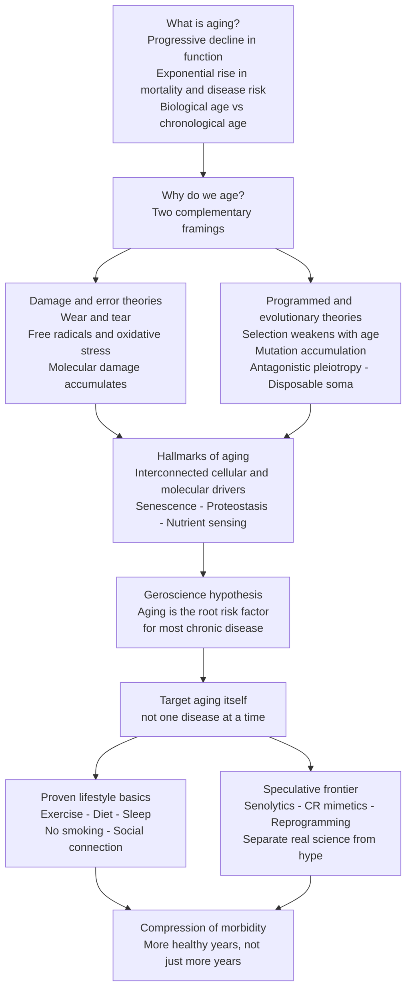

# 🕰️ The Science of Aging and Longevity

> [!abstract] TL;DR
> **Aging is the progressive, near-universal decline in biological function — and rise in disease and mortality risk — that accumulates with time.** For most of a human life the risk of dying **doubles roughly every eight years** (the Gompertz law), which means aging is not a background nuisance but *the single largest risk factor* for cancer, heart disease, dementia, and type-2 diabetes combined. The old paradigm treats each of these diseases one at a time; the new paradigm — **geroscience** — argues that if you slow the underlying aging process even slightly, you delay *all* of them at once. This section is about that shift: what aging actually is, why we age (damage that piles up versus an evolutionary indifference to old age), the **hallmarks** that organize the mechanisms, and the difference between the **well-evidenced lifestyle basics** and the **speculative, hype-prone frontier**. The north star is not raw lifespan but **healthspan** — compressing sickness into a short window at the end of a long, functional life.

---

## Intuition

**Analogy: aging is rust and entropy fought by an increasingly tired maintenance crew.**

Picture a large ship that can never dock. From the day it launches, seawater corrodes the hull, joints fatigue, and salt eats the wiring — the relentless, thermodynamically-guaranteed drift toward disorder. The ship survives not because damage stops, but because a **maintenance crew** patrols the decks, patching rust, replacing bolts, and rerouting failed circuits faster than the sea destroys them. For decades the crew keeps pace and the ship looks new. But the crew *itself* ages: it gets smaller, slower, and less accurate; its own tools wear out; and eventually it starts mistaking good panels for bad ones and patching the wrong places. Now damage outruns repair. The ship does not fail all at once — it fails everywhere a little, and then somewhere critically.

That is aging in one image. Your cells suffer constant molecular damage (oxidation, DNA lesions, misfolded proteins) and are defended by a vast repair-and-maintenance apparatus (DNA repair, protein quality control, autophagy, immune surveillance). Youth is not the *absence* of damage — it is a maintenance crew winning the race. Aging is that crew slowly losing it, both because the damage compounds *and* because the repair machinery is itself made of the same aging parts. Every hallmark of aging you will meet in this section is either a **source of damage** or a **failing repair system** — a rusting hull or a tired crew.

---

## How It Works

### What aging actually is

Aging is easy to recognize and surprisingly hard to define. Operationally, it is the **time-dependent decline in physiological function accompanied by an exponentially rising probability of death and disease.** Three features make it a scientific object rather than a vague dread:

1. **It is progressive and cumulative** — function does not drop in a single step; reserve capacity erodes gradually, often invisibly, for decades before a threshold is crossed.
2. **It is near-universal** — nearly all complex animals age, though at wildly different *rates* (a mouse ages ~30x faster than a human; some species show negligible senescence).
3. **It separates two clocks.** **Chronological age** is how many times the Earth has orbited the Sun since you were born. **Biological age** is how worn your systems actually are — and the two can diverge by more than a decade. Two 60-year-olds can have the cardiovascular reserve, immune competence, and mortality risk of a 50-year-old and a 72-year-old respectively. Measuring that gap is the job of **aging biomarkers and "aging clocks,"** covered in [[Biomarkers_and_Measuring_Health]].

### Why we age: two rival framings (that are really one)

The theories of aging fall into two camps that sound opposed but are complementary.

**Damage and error theories** say aging is *wear and tear*: the passive accumulation of unrepaired molecular damage. The most famous is the **free-radical / oxidative-stress theory** (Harman, 1956): the mitochondrial electron-transport chain leaks reactive oxygen species that damage DNA, lipids, and proteins, and this damage compounds over a lifetime (see [[Oxidative_Phosphorylation]] for the ROS source). Cousins include **somatic mutation theory** (accumulating DNA errors), **wear-and-tear**, and **error-catastrophe** theories. The intuition: entropy wins because repair is imperfect.

**Programmed and evolutionary theories** answer a deeper question — *why did evolution not build a body that maintains itself indefinitely?* The answer is not that aging is an adaptive "program" to make room for the young, but that **the force of natural selection weakens with age.** In the wild, most animals die young from predators, starvation, or cold. Because few individuals survive to old age, genes that cause harm *only late in life* are almost invisible to selection. Three ideas formalize this:

- **Mutation accumulation** (Medawar, 1952) — late-acting harmful mutations escape selective pressure and pile up in the genome.
- **Antagonistic pleiotropy** (Williams, 1957) — a gene that boosts early-life fitness (growth, reproduction) is favored *even if* it causes damage later; the early benefit is paid for by late-life decline. Vigorous cell proliferation aids healing when young but fuels cancer and senescence when old.
- **Disposable soma** (Kirkwood, 1977) — an organism has a finite energy budget to split between **reproduction** and **somatic maintenance**. Since the body ("soma") is likely to die of external causes anyway, evolution under-invests in perfect self-repair — just enough maintenance to stay functional through the reproductive years.

The modern synthesis: **damage accumulation is the mechanism; weak late-life selection is the reason evolution tolerates it.** The evolutionary theories explain the flowchart below's right branch, and the damage theories its left branch — but both funnel into the *same* cellular endpoints.

### The Gompertz law: mortality's exponential clock

In 1825, Benjamin Gompertz noticed that human mortality risk rises **exponentially** with adult age: the hazard `μ(x) = A · e^(G·x)`, where `A` is baseline mortality and `G` is the **Gompertz rate constant** — effectively *the rate of aging*. In humans, `G` corresponds to a **mortality-rate doubling time of roughly eight years**: your risk of dying this year is about double what it was eight years ago. This single equation is why aging dominates late-life risk, and it makes the central geroscience argument quantitative (see the Python demo): **treating one disease shifts the curve a little, but slowing aging rotates the whole curve** — a far bigger prize. (The law bends at extreme old age — a **late-life mortality plateau** — one of the open puzzles of the field.)

### The hallmarks of aging: the modern organizing framework

Rather than argue over one "cause," the field now organizes aging into a set of **interconnected hallmarks** — cellular and molecular processes that (i) manifest with age, (ii) accelerate aging when worsened, and (iii) slow it when repaired. The canonical list (López-Otín et al., 2013, expanded 2023) includes **genomic instability, telomere attrition, epigenetic alterations, loss of proteostasis, deregulated nutrient sensing, mitochondrial dysfunction, cellular senescence, stem-cell exhaustion, altered intercellular communication (inflammaging), disabled autophagy, chronic inflammation, and dysbiosis.** Crucially, they are a *network*, not a list — damage in one propagates to others. This section unpacks the highest-leverage hallmarks in [[Hallmarks_of_Aging]], with a dedicated deep dive on the "zombie cells" of [[Cellular_Senescence_and_Senolytics]]. The underlying cell biology lives in [[Aging_and_Regeneration]] and the genome-damage angle in [[Aging_and_Genome_Instability]].

### The geroscience shift: target aging, not diseases one at a time

Here is the paradigm change. Because aging is the *shared* root risk factor for most chronic disease, the **geroscience hypothesis** holds that intervening on aging itself could delay cancer, cardiovascular disease, dementia, and metabolic disease *simultaneously*. Curing any single disease adds only modest years (eliminating all cancer adds ~3 years of life expectancy) because the aging body simply dies of the next age-related disease. Slowing aging is playing a different game — the "**longevity dividend**." The evidence-graded attempts to actually do it are surveyed in [[Longevity_Interventions_and_the_Future_of_Aging]], and the Python demo below makes the arithmetic concrete.

### What model organisms taught us

The reason we believe aging is *modifiable* comes from short-lived lab organisms. In **budding yeast**, sirtuins (Sir2) modulate replicative lifespan. In the worm **C. elegans**, a single mutation in *daf-2* (the insulin/IGF-1 receptor) **doubles lifespan** (Kenyon, 1993) — the discovery that aging is under genetic control by a specific, conserved pathway. In the fruit fly **Drosophila**, dietary restriction and specific genes extend life. In **mice**, dwarf mutants live longer, **caloric restriction** robustly extends lifespan, and **rapamycin** extends lifespan even when started late. The stunning result across all of them: a handful of **conserved nutrient-sensing pathways** — insulin/IGF-1 signaling, **mTOR**, **AMPK**, and **sirtuins** — tune the rate of aging. Fasting, caloric restriction, and the drugs that mimic them all converge here — the subject of [[Nutrient_Sensing_Fasting_and_Caloric_Restriction]].

### Lifespan records and the maximum-lifespan debate

The verified human record is **Jeanne Calment**, who died in 1997 at **122 years**. Over the 20th century, survival curves **rectangularized**: as childhood and mid-life deaths collapsed, more people survived to bunch up against a seemingly fixed wall near 85–95. This fuels an unresolved debate — **is there a hard maximum lifespan?** One analysis (Dong et al., 2016) argued for a cap near ~115; others (Barbi et al., 2018) found the late-life mortality *plateau* implies no fixed limit. The distinction matters enormously: a fixed wall means we can only compress morbidity up to it; a soft wall means slowing aging could push it back.

### The map of this section



**Section roadmap (the notes in `05_Aging_and_Longevity`):**

1. **The Science of Aging and Longevity** — *this note*: the overview and framing.
2. [[Hallmarks_of_Aging]] — the interconnected cellular and molecular drivers, in depth.
3. [[Cellular_Senescence_and_Senolytics]] — "zombie cells," inflammaging, and drugs that clear them.
4. [[Nutrient_Sensing_Fasting_and_Caloric_Restriction]] — the mTOR / AMPK / IGF-1 / sirtuin pathways and the most robust lifespan lever known.
5. **Blue Zones and Lifestyle Longevity** *(planned)* — what the world's longest-lived populations actually do.
6. [[Longevity_Interventions_and_the_Future_of_Aging]] — the evidence-graded frontier: rapamycin, metformin, senolytics, reprogramming — and how to tell science from snake oil.
7. [[Biomarkers_and_Measuring_Health]] — aging clocks and how we quantify biological age (in `01_Foundations_of_Health`).

---

## Key Concepts

### Secondary (explain to anyone)

- **Aging = you wear out over time** — function slowly declines and the risk of disease and death rises with every year. It is universal but its *speed* varies between individuals and species.
- **Biological vs chronological age** — the calendar says one number; your body may be older or younger than that. The gap is what health interventions aim to shrink.
- **Healthspan, not lifespan** — the goal is more *healthy, functional* years, not just more total years; ideally sickness is **compressed** into a short window at the end (see [[Health_and_Wellbeing_Overview]]).
- **The boring basics win** — exercise, a good diet, enough sleep, not smoking, and strong social ties are the best-evidenced longevity levers. Everything flashier is far less certain.
- **Real science vs anti-aging hype** — most "anti-aging" supplements and clinics sell hope, not proof. Learn to demand human evidence.

### Undergraduate (needs some science background)

- **The Gompertz law** — adult mortality rises exponentially, `μ(x) = A·e^(G·x)`; human risk of death roughly **doubles every eight years**. `G` is effectively the *rate of aging*.
- **Damage/error theories** — free-radical/oxidative stress, somatic mutation, wear-and-tear; aging as accumulated, imperfectly-repaired molecular damage.
- **Evolutionary/programmed theories** — **mutation accumulation**, **antagonistic pleiotropy**, and **disposable soma**; all rest on the fact that selection weakens with age because few wild animals survive to be old.
- **Hallmarks of aging** — the field's organizing framework: an interconnected *network* of drivers (senescence, proteostasis loss, nutrient-sensing deregulation, genomic instability, mitochondrial dysfunction, and more).
- **Geroscience hypothesis** — aging is the shared upstream risk factor for most chronic disease, so slowing aging could delay many diseases at once.
- **Conserved nutrient-sensing pathways** — insulin/IGF-1, **mTOR**, **AMPK**, and **sirtuins** tune longevity across yeast, worms, flies, and mice; the target of caloric restriction and its mimetics.

### Graduate (systems-level thinking)

- **Late-life mortality deceleration / plateau** — the Gompertz exponential bends at extreme ages, plausibly due to **population heterogeneity** (frailer individuals die first, leaving robust survivors) or intrinsic hazard saturation; central to the maximum-lifespan debate (Dong 2016 vs Barbi 2018).
- **Reliability theory of aging** (Gavrilov & Gavrilova) — model the body as a system of redundant, partially-defective components; aging emerges as the depletion of redundancy, naturally producing Gompertz-like curves and late-life plateaus.
- **Hyperfunction / quasi-programmed aging** (Blagosklonny) — a reframing in which aging is less about accumulated damage and more about the **continued, unrestrained action of growth programs (mTOR)** past their developmental purpose — reconciling "programmed" and "damage" views.
- **Antagonistic pleiotropy, mechanistically** — e.g., robust IGF-1 signaling and cell proliferation aid growth and healing early but drive cancer, senescence, and inflammaging late; a strong inflammatory response fights infection young but yields chronic **inflammaging** old.
- **Aging clocks and causality** — epigenetic clocks (Horvath, PhenoAge, GrimAge) predict mortality tightly, but whether they *measure the aging process causally* or merely *correlate* with it is unresolved — and it determines whether "improving your clock" means anything (see [[Biomarkers_and_Measuring_Health]]).
- **The longevity dividend and the regulatory gap** — slowing aging would yield enormous economic and health returns, but aging is **not a recognized disease indication**, so trials like **TAME** are engineered to test a geroscience intervention within existing regulatory categories.

---

## Python Demo

```python
# Why targeting AGING beats treating diseases one at a time.
# We model adult mortality with the Gompertz law:  mu(x) = A * exp(G * x)
#   A = baseline mortality (frailty / disease burden)
#   G = Gompertz rate constant  =  the *rate of aging* (mortality doubling time)
# From the hazard we build the survival curve S(x) and life expectancy, then
# compare three fundamentally different interventions.
import numpy as np
import matplotlib.pyplot as plt

age = np.linspace(0, 120, 12001)      # fine age grid, dx = 0.01 yr
dx = age[1] - age[0]

def gompertz(A, G):
    mu = A * np.exp(G * age)           # hazard: force of mortality
    H = np.cumsum(mu) * dx             # cumulative hazard
    S = np.exp(-H)                     # survival function S(x)
    return mu, S

def life_expectancy(S):
    return np.sum(S) * dx              # e0 = area under the survival curve

def q_age(S, q):
    # Age by which a fraction q of the cohort has died  (deaths reach q <=> S = 1-q).
    return np.interp(1 - q, S[::-1], age[::-1])

# --- Baseline: human-like Gompertz (mortality doubles ~ every 8 years) --------
A0, G0 = 5e-5, 0.085
mu0, S0 = gompertz(A0, G0)

# 1) TREAT DISEASES  -> lower baseline mortality A by 30%, SAME aging rate G.
#    On a log-hazard plot this SHIFTS the line straight down (parallel):
#    same slope = same rate of aging, just starting lower. Modest gain.
mu_dz, S_dz = gompertz(0.70 * A0, G0)

# 2) SLOW AGING  -> cut the Gompertz rate constant G by 12%, SAME baseline A.
#    On a log-hazard plot this ROTATES the line to a shallower slope:
#    mortality still rises, but doubles more slowly. This is geroscience.
mu_ag, S_ag = gompertz(A0, 0.88 * G0)

# 3) COMPRESS MORBIDITY -> steeper terminal decline (G up) with much lower A,
#    tuned to hold median lifespan ~fixed. The curve becomes RECTANGULAR:
#    a long healthy plateau, then a sharp wall. Deaths bunch into a narrow band.
mu_cm, S_cm = gompertz(3.2e-7, 1.80 * G0)

scenarios = [
    ("Baseline",                 mu0,   S0,   "#334155"),
    ("Treat diseases  (A -30%)", mu_dz, S_dz, "#d97706"),
    ("Slow aging      (G -12%)", mu_ag, S_ag, "#059669"),
    ("Compress morbidity",       mu_cm, S_cm, "#7c3aed"),
]

e0_base = life_expectancy(S0)
print(f"{'Scenario':26s}{'LifeExp':>9s}{'Gain':>8s}{'Median':>9s}{'IQR@death':>11s}")
for name, _, S, _ in scenarios:
    e0  = life_expectancy(S)
    med = q_age(S, 0.50)
    iqr = q_age(S, 0.75) - q_age(S, 0.25)     # spread of age-at-death = (de)compression
    print(f"{name:26s}{e0:9.1f}{e0 - e0_base:+8.1f}{med:9.1f}{iqr:11.1f}")

# ---- Plot: log-hazard (left) and survival curves (right) --------------------
fig, (axh, axs) = plt.subplots(1, 2, figsize=(13, 5.5))
for name, mu, S, c in scenarios:
    axh.semilogy(age, mu, color=c, lw=2.3, label=name)
    axs.plot(age, S,  color=c, lw=2.3, label=name)

axh.set_xlabel("Age (years)"); axh.set_ylabel("Mortality hazard  (log scale)")
axh.set_title("Gompertz law: aging is an exponential\nSlow aging ROTATES; treat disease SHIFTS")
axh.set_xlim(20, 110); axh.set_ylim(1e-4, 2)
axh.grid(alpha=0.3, which="both"); axh.legend(fontsize=8, loc="lower right")

axs.axhline(0.5, color="#94a3b8", ls="--", lw=1)
axs.set_xlabel("Age (years)"); axs.set_ylabel("Fraction surviving  S(x)")
axs.set_title("Survival curves under each intervention")
axs.set_xlim(0, 110); axs.set_ylim(0, 1.02)
axs.grid(alpha=0.3); axs.legend(fontsize=8, loc="lower left")

plt.tight_layout()
plt.show()

# Typical output (values are illustrative of the mechanism):
#   Scenario                  LifeExp    Gain   Median  IQR@death
#   Baseline                     78.6     +0.0     83.2      18.5
#   Treat diseases  (A -30%)     82.7     +4.1     87.4      18.5   <- curve SHIFTED right, same shape
#   Slow aging      (G -12%)     88.9    +10.3     92.9      21.0   <- curve ROTATED: far bigger gain
#   Compress morbidity           78.9     +0.3     83.2      10.3   <- same median, deaths BUNCHED (IQR halved)
#
# Read-out:
#  * Treating a disease lowers baseline mortality -> the whole survival curve
#    slides RIGHT by a fixed amount. Same rate of aging (same slope), modest years.
#  * Slowing aging lowers G -> the log-hazard line ROTATES flatter, compounding
#    over decades into a MUCH larger gain from a smaller-sounding change.
#  * Compression of morbidity keeps median lifespan fixed but squares off the
#    curve (IQR@death 18.5 -> 10.3): the sick/decline window shrinks - the real goal.
```

The demo turns the geroscience argument into arithmetic. Because mortality is *exponential* in age, a small proportional cut in the **rate** of aging (`G`) rotates the entire hazard line and compounds into years — whereas cutting **baseline** mortality (`A`, i.e., curing a disease) merely slides the same-shaped curve sideways for a modest, one-off gain. And "compression of morbidity" is a different axis entirely: holding lifespan fixed while **squaring off** the survival curve so the frail, declining years collapse into a narrow band. Slowing aging is the only lever that moves all three at once.

---

## Real-World Applications

- **The TAME trial (metformin)** — Targeting Aging with Metformin is a landmark attempt to test the geroscience hypothesis in humans by asking whether a cheap, generic drug delays the *onset of multiple age-related diseases together*, rather than treating any one. Its design also confronts the regulatory reality that "aging" is not an approved indication.
- **Rapamycin and rapalogs** — mTOR inhibition extends lifespan in every model tested and is the most reproducible pharmacological longevity intervention in mice; low-dose and intermittent human trials probe immune and healthspan benefits.
- **Senolytics** — drugs (e.g., dasatinib + quercetin, and newer agents) that selectively clear **senescent "zombie" cells** driving inflammaging; early human trials target conditions like idiopathic pulmonary fibrosis and osteoarthritis. Covered in depth in [[Cellular_Senescence_and_Senolytics]].
- **Caloric restriction and CR mimetics** — the **CALERIE** human trials showed sustained modest calorie reduction improves cardiometabolic and inflammatory markers; the field hunts for compounds (metformin, rapamycin, spermidine, GLP-1 agonists) that capture the benefit without the deprivation.
- **Epigenetic aging clocks as trial endpoints** — because a full lifespan trial in humans is impractical, aging clocks are increasingly used as **surrogate biomarkers** to read out whether an intervention is bending the biological-age trajectory (see [[Biomarkers_and_Measuring_Health]]).
- **Partial reprogramming** — transient expression of Yamanaka factors has restored youthful function to aged cells and tissues in mice, spawning a wave of longevity biotech (Altos Labs, Calico, Retro) — the highest-risk, highest-upside frontier.
- **Blue Zones public health** — the observational fact that specific populations (Okinawa, Sardinia, Ikaria) reach old age in good health informs policy on plant-forward diets, built-in daily movement, and social connection (a dedicated section note).

---

## Common Pitfalls

- **Confusing chronological with biological age.** "I'm 55, so I'm fine" ignores that your systems may be running at 65. The calendar is not the clock that kills you.
- **Extrapolating worms and mice straight to humans.** A gene that doubles a nematode's lifespan rarely translates; the *translation gap* between models and humans has buried countless "breakthroughs." Conserved pathways are a lead, not a promise.
- **Treating aging as a single program to switch off.** Aging is a *network* of interacting hallmarks with deep evolutionary roots, not one master switch. Simple "reset" narratives oversell the biology.
- **Assuming lifespan extension equals healthspan extension.** An intervention that adds frail, bed-bound years is a failure, not a success. Always ask whether the *good* years increased — the compression-of-morbidity question.
- **Falling for anti-aging hype.** Supplements, "young-blood" transfusions, and boutique clinics vastly outrun their human evidence. Demand randomized human data and be suspicious of anything sold before it is proven.
- **Trusting confounded longevity observations.** Blue Zones and centenarian studies are observational and beset by data-quality issues (record errors, pension fraud), survivorship bias, and confounding. Compelling correlations are hypotheses, not prescriptions.
- **Neglecting the boring basics for the flashy frontier.** The evidence base for exercise, diet, sleep, and not smoking dwarfs that for every experimental compound. Optimizing the speculative while ignoring the proven is backwards.

---

## Related Concepts

- [[Health_and_Wellbeing_Overview]] — the parent orientation note; supplies the **healthspan-vs-lifespan** framing and the compression-of-morbidity goal that this whole section serves. *(sibling vault section)*
- [[Hallmarks_of_Aging]] — the deep dive on the interconnected cellular and molecular drivers this overview only names. *(sibling note)*
- [[Cellular_Senescence_and_Senolytics]] — the "zombie cell" hallmark and the drugs that clear it; a leading interventional target. *(sibling note)*
- [[Nutrient_Sensing_Fasting_and_Caloric_Restriction]] — the mTOR / AMPK / IGF-1 / sirtuin pathways the model organisms revealed, and the most robust lifespan lever. *(sibling note)*
- [[Longevity_Interventions_and_the_Future_of_Aging]] — the evidence-graded frontier of drugs and biotech, and how to separate science from hype. *(sibling note)*
- [[Biomarkers_and_Measuring_Health]] — how we quantify **biological age**: VO2max, ApoB, and epigenetic **aging clocks**. *(sibling vault section)*
- [[Metabolism_and_Energy_Balance]] — the physiology of the nutrient-sensing pathways that act as master regulators of aging. *(sibling vault section)*
- [[Determinants_of_Health]] — social, environmental, and behavioral determinants shape the *rate* of aging as much as genes do. *(sibling vault section)*
- [[Genes_Environment_and_Epigenetics_in_Health]] — epigenetic drift is a hallmark of aging and the basis of aging clocks; nature and nurture set the pace. *(sibling vault section)*
- [[Aging_and_Regeneration]] — the deep cell biology of the hallmarks: senescence, telomeres, stem-cell exhaustion, and regenerative decline (Biology vault).
- [[Aging_and_Genome_Instability]] — the genome-damage angle: DNA repair failure, mutation accumulation, and instability as an upstream driver (Genetics vault).
- [[Natural_Selection_and_Adaptation]] — the evolutionary logic behind *why* we age: selection weakens with age, licensing antagonistic pleiotropy and the disposable soma.
- [[Oxidative_Phosphorylation]] — the mitochondrial electron-transport chain is the main source of the reactive oxygen species at the heart of the free-radical theory.
- [[Cancer_and_the_Cell_Cycle]] — the canonical antagonistic-pleiotropy trade-off: the proliferation that heals youth fuels the cancer of age; cancer is a leading age-related killer.

---

## Review Questions

### Secondary

1. In your own words, what is the difference between **chronological age** and **biological age**, and why does the distinction matter for health?
2. Explain **healthspan vs lifespan** using the maintenance-crew analogy. What is "compression of morbidity" and why is it the goal rather than simply living longer?
3. Name three of the **best-evidenced lifestyle levers** for a long, healthy life, and explain in one sentence why you should be skeptical of an "anti-aging" supplement advertised online.

### Undergraduate

1. State the **Gompertz law** and explain what the constant `G` represents. Given that human mortality doubles roughly every eight years, why does aging dominate late-life disease risk?
2. Contrast **damage/error theories** with **evolutionary/programmed theories** of aging. Using **antagonistic pleiotropy** and the **disposable soma**, explain why evolution did *not* build a body that repairs itself indefinitely.
3. What is the **geroscience hypothesis**, and how do the results from **C. elegans daf-2 mutants** and **rapamycin in mice** support the claim that aging is modifiable?

### Graduate

1. The Python demo shows that cutting the Gompertz rate `G` by 12% adds far more life expectancy than cutting baseline mortality `A` by 30%. Explain *mathematically* why a proportional change in the aging rate compounds while a change in baseline mortality does not — and connect this to why "curing cancer" adds only ~3 years to life expectancy.
2. Epigenetic **aging clocks** predict mortality tightly. Design an argument (and the experiment you would need) to distinguish whether a clock *measures aging causally* versus merely *predicts outcomes*. Why does the answer determine whether an intervention that "lowers your clock" is meaningful?
3. Is there a **hard maximum human lifespan**? Summarize the evidence on both sides (rectangularization and the Dong 2016 cap vs the Barbi 2018 late-life mortality plateau), and explain how the **reliability theory of aging** predicts a plateau without invoking a fixed limit. What would each answer imply for the ultimate ceiling on longevity interventions?

---

## Sources

- Gompertz, B. (1825). "On the Nature of the Function Expressive of the Law of Human Mortality." *Philosophical Transactions of the Royal Society*. https://royalsocietypublishing.org/doi/10.1098/rstl.1825.0026
- López-Otín, C., Blasco, M. A., Partridge, L., Serrano, M., & Kroemer, G. (2023). "Hallmarks of Aging: An Expanding Universe." *Cell*, 186(2):243-278. https://www.cell.com/cell/fulltext/S0092-8674(22)01377-0
- Kirkwood, T. B. L. (1977). "Evolution of ageing." *Nature*, 270:301-304 — the disposable-soma theory. https://www.nature.com/articles/270301a0
- Kennedy, B. K., et al. (2014). "Geroscience: Linking Aging to Chronic Disease." *Cell*, 159(4):709-713. https://www.cell.com/cell/fulltext/S0092-8674(14)01366-3
- Kenyon, C. (2010). "The genetics of ageing." *Nature*, 464:504-512 — conserved longevity pathways from worms to mammals. https://www.nature.com/articles/nature08980
- Barbi, E., Lagona, F., Marsili, M., Vaupel, J. W., & Wachter, K. W. (2018). "The plateau of human mortality: Demography of longevity pioneers." *Science*, 360:1459-1461. https://www.science.org/doi/10.1126/science.aat3119

---

#health #aging #longevity #healthspan #gerontology
