# 🏭 Environmental Health and Toxicology

> [!abstract] TL;DR
> **Environmental health** studies how the physical, chemical, and biological world around us — the air we breathe, the water we drink, the chemicals we absorb, and the spaces we live in — writes itself into our bodies and shapes disease, mostly slowly and invisibly, over years. **Toxicology** supplies its central law, Paracelsus's insight that **"the dose makes the poison"**: no substance is simply safe or toxic; every one is both, depending on how much reaches the body. That single idea — formalized as the **dose-response relationship** — governs everything from drug labels to drinking-water limits, and its deepest unsettled question is what happens at *low* doses (is there a safe **threshold**, or does every increment of a carcinogen or of radiation add risk under a **linear-no-threshold** model?). Because environmental hazards fall hardest on the poor and powerless, and because proving harm from chronic low-dose exposure is genuinely hard, this field sits at the crossroads of biology, statistics, ethics, and policy.

---

## Intuition

**Analogy: the environment writes on your health in slow ink.** A doctor's diagnosis is a single sharp sentence; the environment writes an entire biography in a faint, invisible hand, one letter per day for decades. The lead in old pipes, the fine soot from traffic, the pesticide residue, the mold in a damp wall, the plastics that leach a little at a time — none of them announce themselves. There is no cough, no bruise, no moment of injury. The ink is slow, and by the time the words are legible — a lower IQ, a tumor, a failing kidney — the pen has long since moved on and the writer is impossible to name. Most environmental disease is not a lightning strike; it is weathering.

Now push the analogy one step, because it reveals the whole science: **the same ink is invisible in a drop and indelible in a flood.** A trace of a substance leaves no mark; a heavy exposure scars permanently; and in between lies a curve. Selenium is a nutrient you would die without and a poison that will kill you at ten times that amount. Water itself is lethal in enough volume. Oxygen ages you. This is why the toxicologist never asks "is it toxic?" but always "at what dose?" — the substance is only half the story, and the amount is the other half.

---

## How It Works

### The core principle: the dose makes the poison

The founding law of toxicology is roughly 500 years old. The Swiss physician **Paracelsus** (1493–1541) wrote: *"All things are poison, and nothing is without poison; the dosage alone makes it so a thing is not a poison."* Everything on the periodic table and every molecule can harm you — the only question is quantity. This dethrones the intuitive but false binary of "natural = safe, chemical = dangerous." Botulinum toxin (natural) is the most lethal substance known; table salt (a chemical) is harmless at dinner and fatal by the cupful.

The relationship between quantity and harm is the **dose-response curve**, the field's central object. For most substances it is a sigmoid: nothing happens until a **threshold**, then response rises steeply, then saturates. From it we read the field's key landmarks:

1. **LD50 / ED50** — the dose that is lethal (or produces the effect) in 50 percent of a test population. A crude but standardized measure of *potency*: a low LD50 means a small dose does a lot of damage.
2. **NOAEL** — the No-Observed-Adverse-Effect Level, the highest tested dose at which nothing bad is detected. Its neighbor is the **LOAEL**, the lowest dose where an effect *does* appear.
3. **Reference Dose (RfD) / Acceptable Daily Intake (ADI)** — the NOAEL divided by **safety (uncertainty) factors**, typically a factor of 10 for extrapolating animal-to-human and another 10 for human-to-human variability (children, the sick, the pregnant), giving 100 or more. This is the "how much is allowed" number behind regulations.

### Hazard vs risk, and the exposure chain

Two words the public uses interchangeably but toxicology keeps rigidly apart:

- **Hazard** is the *intrinsic capacity* of something to cause harm (a shark can bite you).
- **Risk** is the *probability* of harm in a real situation, which requires **exposure** (your risk from the shark on your sofa is zero). A terrifying hazard with no exposure is no risk; a mild hazard with universal chronic exposure (like PM2.5) can be one of the largest killers on Earth.

Risk therefore rides on a chain: **source → exposure → dose → biological effect → risk**. A chemical in a factory is a hazard; only when it enters air, is inhaled, reaches a target tissue at some internal dose, and triggers a response does it become risk. Exposures split into **acute** (a single large hit — a pesticide spill, carbon-monoxide poisoning) and **chronic** (small, repeated, lifelong — the far harder problem, because effects are delayed, diffuse, and confounded).

The lifetime totality of these exposures — chemical, physical, and psychosocial — is the **exposome**, the environmental complement to the genome. Where the genome is fixed and readable at birth, the exposome accumulates and interacts with genes and epigenetics across a whole life (see [[Genes_Environment_and_Epigenetics_in_Health]]).

### Flow / Architecture

```mermaid
flowchart LR
    subgraph SOURCES["Environmental Sources"]
        AIR["Air<br/>PM2.5, ozone,<br/>indoor cooking smoke"]
        WATER["Water and Sanitation<br/>pathogens, arsenic,<br/>lead in pipes"]
        CHEM["Toxic Chemicals<br/>heavy metals, BPA,<br/>PFAS, pesticides"]
        BUILT["Built Environment<br/>housing, walkability,<br/>green space"]
        RAD["Radiation<br/>UV, radon,<br/>ionizing sources"]
    end
    SOURCES --> EXP["Exposure<br/>contact via inhalation,<br/>ingestion, skin"]
    EXP --> DOSE["Dose<br/>amount actually reaching<br/>the target tissue"]
    DOSE --> RESP["Biological Effect<br/>dose-response curve<br/>acute or chronic"]
    RESP --> RISK["Risk<br/>probability and severity<br/>of harm in a population"]
    HAZARD["Hazard<br/>intrinsic capacity<br/>to cause harm"] --> RISK
    RISK --> ASSESS["Risk Assessment<br/>hazard ID, dose-response,<br/>exposure, characterization"]
    ASSESS --> POLICY["Policy and Regulation<br/>reference doses, limits,<br/>precaution vs risk-based"]
    POLICY -.->|"controls sources"| SOURCES
    style SOURCES fill:#e0f2fe
    style DOSE fill:#ffa94d,color:#fff
    style RISK fill:#c0392b,color:#fff
    style POLICY fill:#0369a1,color:#fff
```



The diagram encodes the field's grammar: hazards on the left are only *potential*; they must travel the exposure-dose-response chain to become *risk*; risk assessment formalizes that chain into numbers; and policy loops back to throttle the sources — the intervention point where environmental health becomes prevention.

---

## Key Concepts

### Secondary Level

- **The dose makes the poison.** There is no such thing as a "safe chemical" or a "toxic chemical" in the abstract — only safe and toxic *amounts*. Water, oxygen, salt, and vitamins all become poisons at high enough doses.
- **Environmental health is a hidden giant.** Where you live — the air quality, the water, the housing, the neighborhood — is one of the largest and most *underappreciated* causes of disease, quietly shaping health more than most medical care (link [[Determinants_of_Health]]).
- **Hazard is not risk.** A dangerous thing you never touch cannot hurt you; a mildly dangerous thing you breathe every day for 70 years might. Risk needs *exposure*.
- **The big five threats:** dirty **air**, unsafe **water**, toxic **chemicals**, harmful **radiation**, and an unhealthy **built environment**.
- **Slow and invisible.** Most environmental harm is chronic — tiny doses over years — so it is easy to ignore and hard to trace back to a cause.

### Undergraduate Level

- **The dose-response curve and its landmarks.** The sigmoid relationship between dose and effect yields the **LD50/ED50** (potency), the **NOAEL/LOAEL** (where effects start), and — after dividing by **safety factors** of 10x for interspecies and 10x for intraspecies variation — the **Reference Dose (RfD)** or **ADI** that regulators enforce.
- **The four steps of risk assessment (US NRC "Red Book" 1983):** (1) *hazard identification* — can it cause harm at all? (2) *dose-response assessment* — how much causes how much harm? (3) *exposure assessment* — how much are people actually getting? (4) *risk characterization* — combine into a population risk estimate with its uncertainties.
- **The exposome.** Coined by Christopher Wild (2005), the totality of environmental exposures from conception onward — the missing half of "nature and nurture" that GWAS alone cannot capture (link [[Genes_Environment_and_Epigenetics_in_Health]]).
- **Particulate matter (PM2.5).** Fine particles under 2.5 micrometers penetrate deep into the lungs and cross into the blood; ambient and household air pollution together rank among the largest environmental risk factors globally, tied to cardiovascular and respiratory death and now cognitive decline (link [[Atmospheric_Optics_and_Aerosols]]).
- **The heavy-metal case: lead.** Lead has *no known safe level* in children; even low-level exposure lowers IQ and impairs behavior. Its 20th-century history — leaded gasoline and paint, the fall in blood-lead after phase-out, the Flint water crisis — is toxicology's most consequential story, and a case study in industry-manufactured doubt.
- **Endocrine disruptors and "forever chemicals."** **BPA** and **phthalates** mimic or block hormones and can act at very low doses in ways that *break* the classic monotonic dose-response (non-monotonic curves). **PFAS** — per- and polyfluoroalkyl substances — are so chemically stable they persist essentially forever in water and blood, a paradigm case of a diffuse, chronic, hard-to-prove exposure.

### Graduate Level

- **Threshold vs Linear-No-Threshold (LNT) — the policy fault line.** For most non-cancer toxins, biology repairs low-dose damage, so a **threshold** (a genuinely safe dose) is assumed. But for **genotoxic carcinogens** and **ionizing radiation**, regulators default to **LNT**: because a single mutagenic hit can in principle initiate a cancer, *every* increment of dose adds proportional risk and **no dose is safe**. LNT is protective and conservative but scientifically contested at very low doses (where effects are unmeasurable against background), and it drives enormous costs — the debate over radiation limits, radon remediation, and "collective dose" turns entirely on this curve's shape near zero.
- **Hormesis.** A biphasic dose-response in which *low* doses of a stressor produce a *beneficial* or stimulatory effect (an overcompensating adaptive response) while high doses harm — a J- or U-shaped curve. Documented for radiation, some metals, and exercise-like stressors; philosophically it collides head-on with LNT. Whether hormesis should inform policy (it mostly does not) is fiercely argued, partly because it has been weaponized to downplay pollutant risk.
- **Non-monotonic dose-response (NMDRC).** Endocrine disruptors can show effects at low doses that *vanish or reverse* at high doses, because hormone receptors saturate and feedback loops engage. This violates the "extrapolate down from high-dose tests" assumption baked into classical risk assessment and is a live controversy in regulating BPA and similar compounds.
- **Toxicokinetics and toxicodynamics.** *Kinetics* = what the body does to the chemical (Absorption, Distribution, Metabolism, Excretion — ADME), including **bioaccumulation** (mercury in tuna) and **biomagnification** up food chains. *Dynamics* = what the chemical does to the body (receptor binding, oxidative stress, DNA adducts). The **internal (biologically effective) dose** at the target, not the external exposure, is what the response curve truly depends on.
- **The precautionary principle vs risk-based regulation.** When harm is plausible but not proven, do you act (precaution: "absence of evidence is not evidence of absence," burden on the emitter) or wait for demonstrated risk (risk-based: avoid costly false alarms, burden on the regulator)? Europe's REACH leans precautionary; US TSCA historically leaned risk-based, presuming chemicals innocent until proven guilty. Both fail predictably: precaution can paralyze and paranoia can misallocate; risk-based regulation systematically under-protects against slow, low-dose, long-latency harms that are almost impossible to prove (link [[Causal_Reasoning]], [[Nutrition_Myths_and_Evidence]]).
- **Why environmental epidemiology is hard.** Long **latency** (asbestos to mesothelioma spans decades), pervasive **confounding** (polluted neighborhoods are also poor neighborhoods — the exposure travels with poverty, diet, and stress), the impossibility of a true control group, low-dose signals buried in noise, and mixtures of thousands of co-occurring chemicals. Causal inference here leans on **Bradford Hill viewpoints**, natural experiments (leaded-gasoline phase-outs), and biomarkers rather than randomized trials.

---

## Python Demo

```python
# "The dose makes the poison" (Paracelsus). This demo makes the central
# principle of toxicology visible and shows why the LOW-DOSE region is where
# science meets policy. We contrast three competing models of the dose-response
# relationship and mark the field's landmarks: LD50, NOAEL, and the reference dose.
#
# numpy + matplotlib only.
import numpy as np
import matplotlib.pyplot as plt

dose = np.linspace(0, 100, 1000)      # arbitrary dose units, e.g. mg/kg/day

# --- Full high-dose lethality curve (classic sigmoid) -> defines LD50 --------
LD50  = 40.0
slope = 0.12
lethality = 100.0 / (1.0 + np.exp(-slope * (dose - LD50)))     # percent responding

# --- Three competing LOW-dose response models --------------------------------
# 1. THRESHOLD: zero effect below a NOAEL, then rising harm.
#    The default for most NON-cancer toxins -- a genuinely "safe dose" exists.
NOAEL = 10.0
threshold = np.where(dose < NOAEL, 0.0, 1.2 * (dose - NOAEL))

# 2. LINEAR-NO-THRESHOLD (LNT): risk proportional to dose from zero up.
#    The regulatory default for genotoxic carcinogens and ionizing radiation --
#    NO dose is safe; every increment adds risk.
lnt = 0.9 * dose

# 3. HORMESIS: low doses give a NET BENEFIT (response dips below baseline),
#    higher doses harm -- a J-shaped curve that collides with LNT.
hormesis = -8.0 * dose * np.exp(-dose / 6.0) + 0.9 * np.maximum(dose - 12.0, 0.0)

# Reference dose = NOAEL divided by safety factors:
#   10x interspecies (animal -> human) * 10x intraspecies (human variability).
RfD = NOAEL / 100.0

fig, ax = plt.subplots(1, 2, figsize=(14, 5.4))

# ---- Panel A: the low-dose regulatory battleground --------------------------
lo = dose <= 30
ax[0].plot(dose[lo], threshold[lo], lw=2.6, color="#2e8b57",
           label="Threshold: a safe dose exists")
ax[0].plot(dose[lo], lnt[lo], lw=2.6, color="#c0392b",
           label="Linear-no-threshold: no safe dose")
ax[0].plot(dose[lo], hormesis[lo], lw=2.6, color="#7c3aed",
           label="Hormesis: low-dose benefit")
ax[0].axhline(0, color="black", lw=0.8)
ax[0].axvline(NOAEL, ls="--", color="gray")
ax[0].axvline(RfD, ls=":", color="#0369a1")
ax[0].annotate("NOAEL", xy=(NOAEL, 14), xytext=(NOAEL + 0.8, 16), color="gray")
ax[0].annotate("Reference Dose\n= NOAEL / 100\n(safety factors)",
               xy=(RfD, -4), xytext=(RfD + 3, -13), color="#0369a1",
               arrowprops=dict(arrowstyle="->", color="#0369a1"), fontsize=8)
ax[0].set_title("Low-dose models: where the same data splits policy")
ax[0].set_xlabel("Dose")
ax[0].set_ylabel("Excess response / risk")
ax[0].legend(fontsize=8, loc="upper left")

# ---- Panel B: the full sigmoid, the LD50, and the "harmless zone" -----------
ax[1].plot(dose, lethality, lw=2.6, color="#c0392b")
ax[1].axhline(50, ls="--", color="gray")
ax[1].axvline(LD50, ls="--", color="gray")
ax[1].plot([LD50], [50], "o", color="black", ms=8)
ax[1].annotate("LD50 = 40\n50% of population responds",
               xy=(LD50, 50), xytext=(LD50 + 6, 30),
               arrowprops=dict(arrowstyle="->"), fontsize=9)
ax[1].axvspan(0, NOAEL, alpha=0.15, color="#2e8b57")
ax[1].text(0.8, 86, "harmless\nzone", color="#2e8b57", fontsize=9)
ax[1].set_title("ONE substance: harmless -> lethal by dose alone")
ax[1].set_xlabel("Dose")
ax[1].set_ylabel("Percent responding")

plt.tight_layout()
plt.savefig("dose_response_models.png", dpi=120)

print(f"LD50 = {LD50}   NOAEL = {NOAEL}   Reference Dose (RfD) = {RfD}")
print(f"At dose = 5 (below NOAEL):")
print(f"   Threshold model excess harm : {np.interp(5, dose, threshold):.2f}  (declared SAFE)")
print(f"   LNT model excess risk       : {np.interp(5, dose, lnt):.2f}  (still NON-zero)")
print(f"   Hormesis model response     : {np.interp(5, dose, hormesis):.2f}  (net BENEFIT)")
```

**What it shows.** Panel B is Paracelsus in one picture: the *identical* substance runs from a green "harmless zone" below the NOAEL all the way to lethal, purely as a function of dose, with the **LD50** as its potency landmark. Panel A is the policy drama — at a low dose of 5 units, the **threshold** model declares the exposure perfectly safe, the **LNT** model insists a real (if tiny) risk remains, and **hormesis** claims a net *benefit*. The three curves are indistinguishable in the messy, unmeasurable low-dose data, yet they imply utterly different drinking-water limits, radiation standards, and cleanup budgets. The gap between them, not the high-dose science, is where billions of dollars and the precautionary-vs-risk-based debate actually live.

---

## Real-World Applications

- **Drinking-water and air standards.** The EPA's Maximum Contaminant Levels, the WHO air-quality guidelines for PM2.5, and pesticide tolerances on food are all NOAEL-divided-by-safety-factor numbers — dose-response science turned directly into enforceable limits.
- **Drug safety and the therapeutic index.** Pharmacology is applied toxicology: the **therapeutic index** (LD50 / ED50) quantifies how much room lies between a drug's effective dose and its toxic dose. A narrow index (warfarin, lithium) demands blood-level monitoring.
- **The lead phase-out — a public-health triumph.** Removing lead from gasoline and paint drove population blood-lead down by roughly 90 percent over decades and is credited with measurable IQ gains and, controversially, part of the fall in violent crime — the exposome intervening at scale.
- **Radon testing in homes.** Radon, a radioactive gas seeping from soil, is a leading cause of lung cancer in non-smokers; LNT-based policy drives cheap home testing and mitigation — a direct consequence of assuming no safe radiation dose.
- **Biomonitoring and the exposome.** Programs like the US NHANES measure chemicals in blood and urine across the population, turning "how exposed are we?" into hard data and revealing near-universal PFAS body burdens.
- **Climate change as an environmental-health threat.** Heat waves, expanding vector ranges, wildfire smoke, and worsened air quality make climate a threat multiplier for environmental disease (link [[Anthropogenic_Climate_Change]]), often concentrated in the same communities that bear the pollution burden (link [[Environmental_Justice_and_Sustainability]]).

---

## Common Pitfalls

- **The naturalistic fallacy: "natural = safe."** Botulinum toxin, arsenic, aflatoxin, and radon are all natural; the safest kitchen is full of "chemicals." Toxicity depends on dose and structure, never on origin (link [[Nutrition_Myths_and_Evidence]]).
- **Confusing hazard with risk.** Headlines that a substance "causes cancer in mice" describe a *hazard* at some dose; without the exposure and dose context they say nothing about your *risk*. The reverse error — dismissing a real chronic risk because any single exposure is tiny — is just as common (PM2.5, lead).
- **Assuming a safe threshold where none may exist.** For genotoxic carcinogens and radiation, "the dose was below the old limit" does not mean "no harm." Under LNT, small doses across millions of people still yield real cases.
- **Extrapolating from high-dose animal tests naively.** Endocrine disruptors can act at *low* doses in ways high-dose tests miss (non-monotonic curves), so "we tested high doses and it was fine" can be a false reassurance.
- **Ignoring confounding and latency in environmental studies.** Pollution tracks with poverty, diet, and stress; effects can lag by decades. Weak studies mistake this correlation for causation — or miss a real effect because the latency outran the follow-up (link [[Causal_Reasoning]]).
- **Manufacturing doubt.** Industries have repeatedly exploited the genuine hard-to-prove nature of chronic low-dose harm (tobacco, lead, PFAS) to delay regulation — turning legitimate scientific uncertainty into a stalling tactic.
- **Treating the exposome as one exposure at a time.** Real life is a *mixture* of thousands of chemicals whose combined effect is rarely the sum of parts; single-chemical risk assessment can systematically understate the total burden.

---

## Related Concepts

- [[Determinants_of_Health]] — the physical environment is one of the five great determinants; this note is the deep dive on that bucket, and on why its share is larger than the direct accounting suggests.
- [[Genes_Environment_and_Epigenetics_in_Health]] — the **exposome** is the environmental complement to the genome; toxic exposures act partly through the epigenetic mechanisms described there.
- [[Environmental_Justice_and_Sustainability]] — environmental hazards are not distributed by lottery; they pile up on the poor and marginalized, making toxicology inseparable from distributive ethics.
- [[Nutrition_Myths_and_Evidence]] — shares the "natural vs chemical" fallacy, the low-dose-chronic-exposure evidence problem, and the difficulty of proving dietary and environmental harms.
- [[Anthropogenic_Climate_Change]] — climate change as a threat multiplier for heat, air pollution, and vector-borne disease; the atmospheric science behind a major environmental-health driver.
- [[Atmospheric_Optics_and_Aerosols]] — the physics of the fine aerosols and particulate matter (PM2.5) that constitute one of the largest global air-pollution health risks.
- [[Atmospheric_Chemistry_and_Stratospheric_Ozone]] — ground-level ozone as a pollutant and stratospheric ozone as UV protection; the chemistry behind two radiation-and-air health stories.
- [[Urban_Heat_Island_Effect]] — a built-environment hazard that concentrates heat exposure in dense, often lower-income neighborhoods.
- [[Causal_Reasoning]] — the inference machinery (confounding, latency, Bradford Hill) needed to attribute chronic disease to environmental exposures without randomized trials.

---

## Review Questions

1. **(Conceptual)** Explain, using the dose-response curve, why the questions "is this substance toxic?" and "is this substance safe?" are both malformed. Define NOAEL, LD50, and Reference Dose, and show how a regulator gets from the first to the last using safety factors.
2. **(Applied scenario)** A town's tap water is found to contain a genotoxic industrial carcinogen at a concentration well below any level where health effects have ever been *measured*. Under a threshold model versus a linear-no-threshold model, what would each conclude about the need for and cost of remediation? Which would you adopt as the town's health officer, and what does your choice reveal about the precautionary principle versus risk-based regulation?
3. **(Trade-off / evaluation)** Environmental epidemiology can almost never run a randomized controlled trial. Using latency, confounding, and the absence of a control group, explain why a real chronic low-dose harm might go undetected for decades — and why that same difficulty is exploited to "manufacture doubt." What kinds of evidence (natural experiments, biomarkers, dose-response gradients) can partly substitute for a trial?

---

## Sources

- Klaassen, C. D. (ed.) (2018). *Casarett and Doull's Toxicology: The Basic Science of Poisons*, 9th ed. McGraw-Hill. (The standard reference; Paracelsus, dose-response, ADME.)
- National Research Council (1983). *Risk Assessment in the Federal Government: Managing the Process* ("The Red Book"). National Academies Press. (The four-step risk-assessment framework.)
- Wild, C. P. (2005). "Complementing the Genome with an 'Exposome'." *Cancer Epidemiology, Biomarkers & Prevention*, 14(8), 1847–1850.
- Landrigan, P. J., et al. (2018). "The Lancet Commission on Pollution and Health." *The Lancet*, 391(10119), 462–512.
- Vandenberg, L. N., et al. (2012). "Hormones and Endocrine-Disrupting Chemicals: Low-Dose Effects and Nonmonotonic Dose Responses." *Endocrine Reviews*, 33(3), 378–455.
- Calabrese, E. J., & Baldwin, L. A. (2003). "Hormesis: The Dose-Response Revolution." *Annual Review of Pharmacology and Toxicology*, 43, 175–197.

---

#health #environmental-health #toxicology #dose-response #pollution
