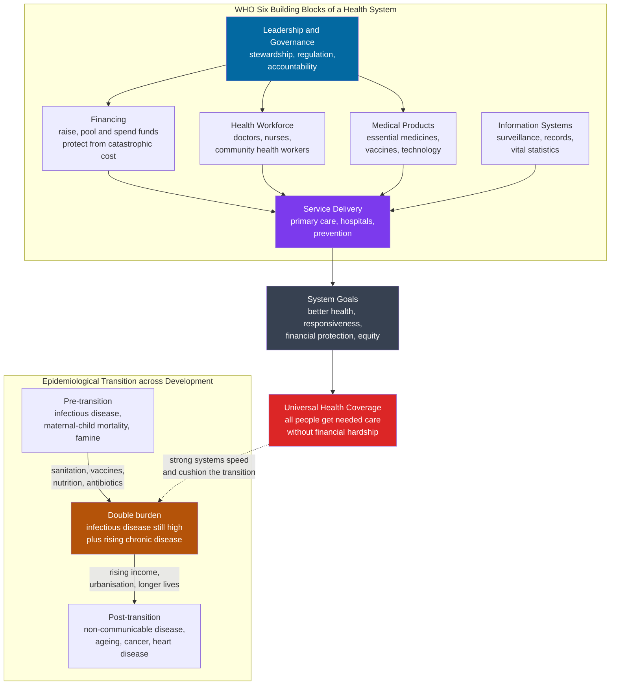

# 🌍 Global Health and Health Systems

> [!abstract] TL;DR
> **Global health** studies how health is distributed across the world and why the gaps are so vast — a child born in Monaco or Japan can expect to live into her mid-eighties, while one born in Chad or Lesotho may not reach fifty, a **gap of roughly 30 years** set almost entirely by the country and system she was born into rather than by her genes. A **health system** is the machinery a society builds to protect that health: the WHO frames it as **six building blocks** — service delivery, workforce, information, medical products, financing, and governance — whose job is to deliver **universal health coverage**, meaning everyone gets the care they need without financial ruin. Two empirical regularities organize the field: the **Preston curve** (life expectancy rises steeply with national income at low levels, then flattens — so the first dollars buy enormous health and the basics of public health are cheap) and the **epidemiological transition** (as countries develop, the disease burden shifts from infectious and maternal-child causes to chronic, non-communicable disease). How a country **finances and organizes** that machinery — Beveridge, Bismarck, national health insurance, or out-of-pocket — determines whether it lands *above* or *below* the curve. The United States is the famous anomaly: the highest spending on Earth, yet mediocre outcomes.

---

## Intuition

**Analogy:** Imagine two newborns cry out in the same minute — one in Tokyo, one in a rural district of the Central African Republic. They have the same species, the same basic biology, the same potential. Yet one is expected to live past **84** and the other may not see **55**. Neither has met a doctor. The single most powerful predictor of how long each will live was decided the moment of birth by **an accident of geography** — the country, the system, the plumbing, and the peace they were born into. Your personal doctor is the *last and smallest* lever on that outcome; the water pipe, the vaccine cold-chain, the tax that pooled everyone's money, and the government that kept the lights on matter far more.

Now picture health as **the harvest of a national field**. A brilliant surgeon is like a skilled gardener tending one wilting plant. But whether the whole field yields depends on the **irrigation (financing), the farmhands (workforce), the roads to market (service delivery), the weather reports (information), the seed and fertilizer supply (medicines), and the estate manager who keeps it all honest (governance)**. Rich countries have irrigated the whole field; the poorest are still hauling buckets. The extraordinary finding of global health is that **the first buckets of clean water and cheap vaccines produce more life-years than the last helicopter of high-tech medicine** — which is exactly what the Preston curve draws.

---

## How It Works

### Core Mechanics

Global health treats **populations, not patients**, as the unit of analysis, and asks why health outcomes differ so wildly between and within countries. Four interlocking ideas do most of the explanatory work.

1. **The vast global inequality.** Life expectancy at birth ranges from the low fifties in the poorest, most fragile states to the mid-eighties in the richest — a ~30-year spread. Child mortality tells the same story in miniature: under-five death rates differ more than **50-fold** between the worst-off and best-off countries. These gaps are not fixed by biology; many are cheaply closable, which is what makes them a matter of **equity and justice**, not just economics (see [[Determinants_of_Health]] and [[Global_Justice_and_Human_Rights]]).

2. **The epidemiological transition.** As societies develop, the *shape* of what kills them changes (the population-measurement toolkit for tracking this is in [[Public_Health_and_Epidemiology]]). In the **pre-transition** phase, the burden is dominated by **infectious disease, maternal and child mortality, and famine** — high and volatile death rates. As sanitation, nutrition, vaccines, and antibiotics arrive, those causes recede and people live long enough to accumulate **non-communicable, chronic disease** — heart disease, stroke, cancer, diabetes, dementia. Crucially, many developing countries now face a **double burden**: they have not finished the fight against infectious disease — malaria, TB, HIV, diarrheal disease (see [[Infectious_Disease_Vaccines_and_Immunity]]) — while urbanization, tobacco, and processed diets already drive up chronic disease. They fight on two fronts at once with a fraction of the budget.

3. **The Preston curve.** Plot each country's **life expectancy against its income per capita** and the points trace a sharply concave curve: at low income, small gains in wealth buy huge gains in life expectancy; past roughly middle-income, the curve **flattens** and even large income gains add little. Two profound implications follow. First, the marginal health return on money is highest where money is scarcest — the moral case for redistribution and aid. Second, health can be **"bought cheaply"** at the low end through public-health basics (clean water, sanitation, immunization, skilled birth attendance) that do not require a rich economy — which is why countries like **Cuba, Costa Rica, Sri Lanka, and the Indian state of Kerala** achieve life expectancies near rich-world levels at modest income, sitting *above* the curve, while oil-rich states and the United States can sit *below* it. Preston also showed the whole curve **shifts upward over time**: even at constant income, life expectancy rises decade by decade as knowledge and technology diffuse.

4. **The building blocks of a health system.** The WHO's framework decomposes a system into six functions: **service delivery** (clinics, hospitals, prevention), **health workforce** (doctors, nurses, community health workers), **health information systems** (surveillance, records, vital statistics), **access to essential medicines and technologies**, **financing** (raising, pooling, and spending money to protect against catastrophic cost), and **leadership and governance** (stewardship, regulation, accountability). Their combined goal is better health, responsiveness, **financial protection**, and equity — summarized as **universal health coverage (UHC)**.

**How systems are financed and organized.** Four archetypes recur, usually blended in practice:

- **Beveridge model (national health service).** Financed from general taxation, providers largely public; the state is payer and provider. Examples: the UK NHS, Spain, the Nordics. Strengths: universal, cheap to administer, equitable. Tension: waiting lists, budget rationing.
- **Bismarck model (social health insurance).** Financed by mandatory payroll contributions into nonprofit "sickness funds," mostly private providers, tightly regulated. Examples: Germany, France, Japan, the Netherlands. Strengths: choice and universality. Tension: cost control across many funds.
- **National health insurance.** A single public insurer pays private providers — a hybrid. Examples: Canada, Taiwan, South Korea. Strengths: universal coverage with private delivery and strong bargaining power on prices.
- **Out-of-pocket model.** No pooling; you pay directly or go without. This is the *default* for the majority of the world's poor and the reason ~1 billion people risk **catastrophic health expenditure** each year, pushing families into poverty when illness strikes.

The **US anomaly** sits across all four at once — employer-based private insurance, Medicare (national insurance for the old), Medicaid, the VA (a Beveridge pocket), and tens of millions uninsured or under-insured paying out of pocket. The result: it spends ~17 percent of GDP on health, nearly double the OECD average, yet ranks poorly on life expectancy, maternal mortality, and amenable mortality — the textbook case of **high spending buying mediocre outcomes**.

**The "iron triangle."** Every system trades off **access, cost, and quality** — you can optimize two, but the third strains. Expand access and control cost, and quality/waiting suffers; maximize access and quality, and cost explodes; control cost and quality, and access narrows. UHC is the political project of managing this triangle so that **no one is bankrupted or excluded** (the normative logic is worked out in [[Justice_in_Health_and_Resource_Allocation]]).

**Primary care versus hospitals.** The best-performing systems lean on **strong primary care** — a first point of contact that prevents, screens, coordinates, and treats the common 90 percent cheaply — rather than expensive specialist and hospital care downstream. "Barbara Starfield's law": health systems with strong primary-care orientation have lower costs, better population health, and less inequity. Under-investing in primary care and over-building tertiary hospitals is a classic path to an inefficient, inequitable system.

**Global health governance.** No single government runs global health; a crowded ecosystem of actors does: the **WHO** (the UN's normative and coordinating body), the **Gates Foundation** (the largest private funder), **Gavi** (the vaccine alliance), the **Global Fund** (AIDS, TB, malaria), the World Bank, and NGOs. Their triumphs are historic — the **eradication of smallpox (1980)** and the near-eradication of **guinea worm** and polio. Their critiques are equally sharp: **verticalization** (disease-specific "silos" that build parallel structures instead of strengthening the whole system), donor-driven priorities that override local ones, and charges of **neocolonialism** — rich outsiders setting agendas for poor countries (a theme in [[Global_Justice_and_Human_Rights]]).

**Health as development.** The causation runs both ways. Wealth buys health (the Preston curve), but **health also drives wealth**: healthy children learn, healthy adults work and invest, and controlling disease unlocks growth. This is the logic of health as human capital and a core development lever (see [[Development_Economics]] and [[Human_Capital_and_Education]]).

**Measuring performance.** Systems are judged on **life expectancy** and **healthy life expectancy (HALE)**; **DALYs** (disability-adjusted life-years — years of healthy life lost to death and disability); **amenable mortality** (deaths that timely, effective care *should* have prevented — a cleaner measure of the system's own contribution); and **spending efficiency** (outcomes achieved per dollar, where the US underperforms and Costa Rica overperforms). **Pandemics** are the ultimate stress test of this whole apparatus — surveillance, surge capacity, trust, and coordination — as COVID-19 brutally revealed.

### Flow / Architecture



The diagram's logic: **governance sits at the top**, steering financing, workforce, and supply, all of which converge on **service delivery**; delivery produces the **system goals** that add up to **universal health coverage**. A strong system, in turn, both *accelerates* the epidemiological transition (killing off infectious disease faster) and *cushions* its chronic-disease phase (managing diabetes and heart disease before they kill).

---

## Key Concepts

### Secondary Level

- **Global health** is the study of health *around the world* and why it is so unequal — where you are born can mean a **30-year difference** in how long you live.
- **Health system** = everything a country builds to keep people healthy: hospitals and clinics, doctors and nurses, medicines, and the money and rules behind them.
- **The six building blocks (WHO):** service delivery, workforce, information, medicines, financing, governance. Weakness in any one weakens the whole.
- **Universal health coverage (UHC):** the goal that *everyone* can get the care they need *without being bankrupted* by the bill.
- **Preston curve:** money buys a lot of health when a country is poor, but very little once it is rich — the first dollars matter most, and clean water and vaccines are cheap.
- **Epidemiological transition:** as countries get richer, the main killers switch from **infections** (like diarrhea and malaria) to **chronic diseases** (like heart disease and cancer).

### Undergraduate Level

- **The double burden of disease:** developing countries face infectious disease *and* rising chronic disease simultaneously, straining limited budgets on two fronts.
- **Health-system financing models:** **Beveridge** (tax-funded national health service, e.g. UK), **Bismarck** (mandatory social insurance funds, e.g. Germany), **national health insurance** (single public payer, private providers, e.g. Canada, Taiwan), and **out-of-pocket** (pay-or-go-without — the poor world's default). Real systems blend them.
- **The iron triangle of access, cost, and quality:** you can prioritize two, but the third strains — the central trade-off every reform confronts.
- **The US anomaly:** highest health spending on Earth (~17 percent of GDP) with mediocre outcomes — the reference case for spending inefficiency.
- **Primary care vs specialist/hospital care:** systems anchored in strong, accessible **primary care** are cheaper, healthier, and more equitable (Starfield). Over-building hospitals while starving primary care is a classic mistake.
- **Measuring performance:** **life expectancy**, **HALE** (healthy life expectancy), **DALYs** (years of healthy life lost), **amenable mortality** (deaths preventable by good care), and **spending efficiency** (outcome per dollar). See the epidemiologic measurement toolkit in [[Public_Health_and_Epidemiology]] and the population metrics in [[Determinants_of_Health]].
- **Global health actors:** WHO, Gates Foundation, Gavi, the Global Fund, World Bank — coordinating (or competing over) priorities and money.

### Graduate Level

- **Above/below the curve — efficiency of systems.** The *residual* from a Preston-curve fit is a rough efficiency measure: countries like **Cuba, Costa Rica, Sri Lanka, and Kerala** sit far above their income line (health bought cheaply through primary care and public-health basics), while oil-rich states and the US sit below it (income not converted into health). This decomposition separates the effect of *wealth* from the effect of *system quality*.
- **Verticalization vs horizontal systems-strengthening.** Disease-specific "vertical" programs (PEPFAR for HIV, malaria campaigns) deliver fast, measurable wins but can build **parallel silos** that poach staff and neglect the health system as a whole. "Diagonal" approaches try to use disease funding to strengthen horizontal capacity — the central strategic debate in global health financing.
- **Preston's decomposition and the upward-shifting curve.** Preston (1975) showed that most 20th-century life-expectancy gains came *not* from income growth moving countries *along* the curve, but from the entire curve **shifting upward** as public-health knowledge and technology (vaccines, oral rehydration, antibiotics) diffused independently of income — a powerful argument that health is driven by knowledge and institutions, not GDP alone.
- **UHC and the ethics of rationing.** Universal coverage forces explicit choices about *what* is covered for *whom* — the province of cost-effectiveness thresholds (cost per DALY averted), priority-setting bodies (e.g. NICE), and fair-process theories of legitimacy. The normative machinery is developed in [[Justice_in_Health_and_Resource_Allocation]] and grounded in [[Distributive_Justice_and_Inequality]].
- **The neocolonial critique of global health governance.** Aid flows, research agendas, and "capacity building" are increasingly criticized for reproducing colonial power asymmetries — priorities set in Geneva and Seattle, data extracted from the Global South, and "decolonizing global health" as a corrective movement (connects to [[Global_Justice_and_Human_Rights]]).
- **Health as both cause and consequence of development.** Endogeneity plagues the Preston relationship: wealth buys health *and* health builds wealth (via labor productivity, human capital, and demographic dividend). Disentangling the two requires instruments and natural experiments — a live question in [[Development_Economics]] and [[Human_Capital_and_Education]].
- **Pandemics as governance stress tests.** COVID-19 exposed the fragility of surveillance, surge capacity, supply chains, vaccine equity (the failure of COVAX to close the rich-poor gap), and public trust — reframing global health security as a collective-action problem with strong externalities, where a weak link anywhere is a risk everywhere.

---

## Python Demo

```python
# The Preston curve: life expectancy vs income per capita across countries.
# Synthetic but realistic-style data. Shows (1) the steep-then-flat concave
# curve (diminishing returns of wealth to health), and (2) outliers that
# over- or under-perform their income -- efficient vs inefficient systems.
# numpy + matplotlib only.
import numpy as np
import matplotlib.pyplot as plt

rng = np.random.default_rng(7)

# --- 1. The underlying Preston relationship ----------------------------
# Life expectancy rises roughly with the log of income, then plateaus.
# Fit-by-design: ~57 yrs at $1,000 income, ~80 yrs at $40,000, capped ~84.
def preston(income):
    le = 14.0 + 6.2 * np.log(income)
    return np.minimum(le, 84.0)          # soft plateau at the top

income_grid = np.linspace(500, 65000, 500)
curve = preston(income_grid)

# --- 2. A cloud of "typical" countries scattered around the curve ------
n = 120
country_income = np.exp(rng.uniform(np.log(600), np.log(62000), n))
noise = rng.normal(0, 2.2, n)            # systems differ around the trend
country_le = np.clip(preston(country_income) + noise, 45, 85)

# --- 3. Named outliers: efficient (above) vs inefficient (below) -------
# name, income per capita (USD), life expectancy (years)
outliers = [
    ("Cuba",              9000,  79.0),   # high LE at modest income  (over)
    ("Costa Rica",       15000,  80.3),   # strong primary care       (over)
    ("Sri Lanka",         4000,  77.0),   # cheap public-health basics(over)
    ("Kerala (India)",    5000,  77.5),   # sub-national overperformer(over)
    ("USA",              63000,  78.8),   # highest spend, mediocre   (under)
    ("Eq. Guinea",       14000,  60.0),   # oil wealth, poor system   (under)
    ("South Africa",     13000,  64.0),   # HIV burden                (under)
    ("Japan",            42000,  84.4),   # near the ceiling          (on/over)
]

# --- 4. Efficiency = residual from the curve (actual minus expected) ---
print("Country          Income   LE    Expected   Residual")
for name, inc, le in outliers:
    resid = le - preston(inc)
    flag = "OVER " if resid > 0 else "under"
    print(f"{name:16s} {inc:6d}  {le:5.1f}   {preston(inc):6.1f}   "
          f"{resid:+5.1f}  {flag}")

# --- 5. Plot ------------------------------------------------------------
fig, ax = plt.subplots(figsize=(11, 6.5))

ax.scatter(country_income, country_le, s=28, color="#9ca3af",
           alpha=0.55, label="Countries (synthetic)")
ax.plot(income_grid, curve, color="#7c3aed", lw=3,
        label="Preston curve (expected life expectancy)")

for name, inc, le in outliers:
    over = le - preston(inc) > 0
    col = "#059669" if over else "#dc2626"       # green=over, red=under
    ax.scatter(inc, le, s=110, color=col, edgecolor="black", zorder=5)
    ax.annotate(name, xy=(inc, le), xytext=(0, 9),
                textcoords="offset points", ha="center",
                fontsize=9, fontweight="bold", color=col)

ax.set_title("The Preston Curve: Life Expectancy vs Income per Capita",
             fontsize=13, fontweight="bold")
ax.set_xlabel("Income per capita (USD, log-spaced axis)")
ax.set_ylabel("Life expectancy at birth (years)")
ax.set_xscale("log")                              # reveals the plateau clearly
ax.set_ylim(45, 88)
ax.grid(alpha=0.3, which="both")

# Green/red legend proxies for the efficiency framing
ax.scatter([], [], s=90, color="#059669", edgecolor="black",
           label="Overperforms income (efficient)")
ax.scatter([], [], s=90, color="#dc2626", edgecolor="black",
           label="Underperforms income (inefficient)")
ax.legend(loc="lower right", framealpha=0.95)

plt.tight_layout()
plt.savefig("preston_curve.png", dpi=120)
print("\nSaved preston_curve.png")
```

**What it shows.** The purple line is the **Preston curve** — life expectancy climbing steeply through the low-income range and flattening toward a ceiling, the visual signature of **diminishing returns of wealth to health**. The gray cloud is the world's countries scattered around that trend. The colored points make the **efficiency** argument concrete: **green** systems (Cuba, Costa Rica, Sri Lanka, Kerala) sit *above* the curve — they buy high life expectancy at modest income through primary care and public-health basics — while **red** systems (the USA at the far right, oil-rich Equatorial Guinea, HIV-burdened South Africa) sit *below* it, converting income into health poorly. The printed **residual** (actual minus expected life expectancy) is a first-pass measure of system performance independent of national wealth.

---

## Real-World Applications

- **Universal health coverage as global policy.** UHC is a UN Sustainable Development Goal target (3.8). Countries from **Thailand** (its 2002 "30-baht scheme" extended coverage to the poor and demonstrably cut catastrophic spending) to **Rwanda** (community-based health insurance covering the vast majority of the population) show that UHC is achievable well below rich-world income — moving them *above* the Preston curve.
- **Vaccine alliances and the eradication playbook.** **Gavi** has immunized over a billion children by pooling demand to cut vaccine prices; **smallpox eradication (1980)** remains the discipline's defining triumph, and **guinea-worm** and **polio** are near-eliminated — case studies in what coordinated global governance can do.
- **Benchmarking and reform.** The **OECD** and the **Commonwealth Fund** rank health systems on cost, access, equity, and outcomes; these rankings (repeatedly placing the US last among wealthy nations despite top spending) drive domestic reform debates and expose the **iron triangle** trade-offs directly.
- **Cost-effectiveness rationing.** Bodies like the UK's **NICE** use **cost-per-QALY/DALY** thresholds to decide what a public system will fund — the operational face of UHC's hard choices and of the ethics in [[Justice_in_Health_and_Resource_Allocation]].
- **Pandemic preparedness.** Post-COVID, the WHO's **pandemic accord** negotiations, revised International Health Regulations, and the failed-then-reformed **COVAX** vaccine-sharing mechanism are all attempts to redesign global health *governance* after a real-world stress test.
- **Health as a development investment.** The World Bank and the *Lancet* Commission on Investing in Health quantify the **"grand convergence"** — the claim that a focused investment could bring the poorest countries' health close to today's middle-income levels within a generation, tying directly to [[Development_Economics]].

---

## Common Pitfalls

- **Equating health with health *care*, and care with hospitals.** Nations routinely over-invest in tertiary hospitals and specialists while starving **primary care and public-health basics** (water, sanitation, vaccines) that deliver far more life-years per dollar — a fast path to sitting *below* the Preston curve.
- **Reading the Preston curve as "get rich to get healthy."** The curve's flattening and its upward drift over time show that beyond low income, **institutions, knowledge, and system design** matter more than GDP. Cuba and Costa Rica refute the income-determinism reading; the US refutes the "more money = more health" reading.
- **Assuming the epidemiological transition is finished in developing countries.** Many face a **double burden** — infectious disease is *not* conquered even as chronic disease surges. Building a system tuned only for one front (either infectious *or* chronic) leaves the other unmanaged.
- **Verticalization by default.** Donor money flows most easily to single, measurable diseases, tempting countries to build **parallel silos** that fragment the workforce and neglect the whole system. Wins on one disease can coincide with a weakening of everything else.
- **Confusing spending with outcomes.** High health expenditure signals neither quality nor equity. The US spends the most and dies younger; **efficiency (outcome per dollar)** and **amenable mortality**, not raw spending, are the honest metrics.
- **Ignoring financial protection.** A system can boast fine hospitals yet still bankrupt families through **out-of-pocket** costs. Coverage on paper is not coverage in practice if the poor cannot afford to use it — the core insight behind UHC.
- **Neocolonial agenda-setting.** Well-funded external actors can override local priorities and extract data without building local capacity, producing programs that are technically effective but politically illegitimate and unsustainable (see [[Global_Justice_and_Human_Rights]]).

---

## Related Concepts

- [[Determinants_of_Health]] — the upstream social, economic, and environmental forces that this note scales up to the level of nations and systems; explains *why* the country you are born in matters more than your doctor.
- [[Public_Health_and_Epidemiology]] — the measurement and prevention toolkit (surveillance, DALYs, levels of prevention, causal inference) that health systems deploy and by which they are judged.
- [[Infectious_Disease_Vaccines_and_Immunity]] — the infectious half of the double burden and the eradication successes (smallpox, polio) that define global health's triumphs.
- [[Justice_in_Health_and_Resource_Allocation]] — the bioethics of UHC, rationing, and fair priority-setting; supplies the normative machinery for deciding what a system covers and for whom.
- [[Global_Justice_and_Human_Rights]] — grounds the moral claim that a 30-year life-expectancy gap is an injustice, and frames the neocolonialism critique of global health governance.
- [[Distributive_Justice_and_Inequality]] — the general theories of fair distribution that underpin health-equity arguments and the redistributive logic of the Preston curve.
- [[Development_Economics]] — the two-way relationship between national income and health; poverty traps, institutions, and health as both driver and product of development.
- [[Human_Capital_and_Education]] — the channel by which health becomes economic growth: healthy, educated populations are more productive, closing the development-health loop.

---

## Review Questions

1. **Conceptual.** Explain the Preston curve in your own words. Why does the first $1,000 of income per capita buy far more life expectancy than the ten-thousandth dollar? Using that logic, explain how Cuba can sit *above* the curve while the United States sits *below* it despite spending far more.
2. **Scenario.** You advise the health minister of a lower-middle-income country facing a **double burden** of disease with a fixed budget. A major donor offers large earmarked funding for a single high-profile infectious disease. Do you accept it, and how would you guard against **verticalization** while still strengthening the six WHO building blocks? Which metric — life expectancy, DALYs, amenable mortality, or spending efficiency — would you use to judge success, and why?
3. **Trade-off / evaluative.** The "iron triangle" says a system cannot maximize access, cost-control, and quality simultaneously. Take the four financing models (Beveridge, Bismarck, national health insurance, out-of-pocket) and argue which corner of the triangle each tends to sacrifice. Then defend a claim: is **universal health coverage** a realizable engineering goal or an aspiration that always forces a rationing choice? Ground your answer in the ethics of resource allocation.

---

## Sources

- Preston, S. H. (1975). "The Changing Relation between Mortality and Level of Economic Development." *Population Studies*, 29(2), 231–248.
- World Health Organization (2007/2010). *Everybody's Business: Strengthening Health Systems to Improve Health Outcomes — WHO's Framework for Action* (the six building blocks); and *The World Health Report 2010: Health Systems Financing — The Path to Universal Coverage.* [https://www.who.int/publications/i/item/9789241564052](https://www.who.int/publications/i/item/9789241564052)
- Omran, A. R. (1971). "The Epidemiologic Transition: A Theory of the Epidemiology of Population Change." *The Milbank Memorial Fund Quarterly*, 49(4), 509–538.
- Reid, T. R. (2009). *The Healing of America: A Global Quest for Better, Cheaper, and Fairer Health Care.* Penguin Press. (Accessible account of the Beveridge / Bismarck / national-insurance / out-of-pocket models.)
- Jamison, D. T., et al. (2013). "Global Health 2035: A World Converging within a Generation." *The Lancet*, 382(9908), 1898–1955. [https://www.thelancet.com/commissions/global-health-2035](https://www.thelancet.com/commissions/global-health-2035)
- Roser, M. (2023). "Link between Health Spending and Life Expectancy: The US is an Outlier." *Our World in Data.* [https://ourworldindata.org/the-link-between-life-expectancy-and-health-spending-us-focus](https://ourworldindata.org/the-link-between-life-expectancy-and-health-spending-us-focus)

---

#health #global-health #health-systems #universal-health-coverage #health-equity
