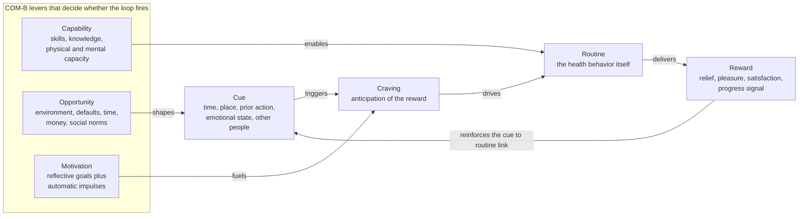

# 🔄 Health Behavior and Behavior Change

> [!abstract] TL;DR
> Most of the chronic-disease burden in wealthy countries traces to a short list of **modifiable behaviors** — poor diet, physical inactivity, smoking, harmful drinking, insufficient sleep — so changing behavior is arguably the single highest-leverage move in health. The catch is the **intention-behavior gap**: knowing what is healthy barely predicts doing it, which is why pure health *education* has a weak track record. Durable change comes not from more willpower but from working *with* the machinery of behavior — building **habits** (cue → routine → reward automaticity), tuning **motivation** toward autonomous rather than coerced reasons, raising **self-efficacy**, and above all reshaping the **environment** so the healthy choice is the easy default. The field's synthesis, the **COM-B model**, says any behavior requires **Capability, Opportunity, and Motivation** together — fix whichever is missing. And individual change has real limits: it is fighting upstream against the structural [[Determinants_of_Health]] that shape what is even possible.

---

## Intuition

**Analogy: the gym membership that gets used in January and abandoned by March.** Almost everyone *knows* that exercise, vegetables, and sleep are good for them. If knowing were doing, there would be no obesity epidemic, no smokers, no half-empty gyms in February. The hard part of health was never the *information* — it is the yawning gap between what we sincerely intend at the moment we buy the membership and what we actually do at 6 a.m. on a cold Tuesday when the intention has to compete with a warm bed, a busy day, and a brain that steeply discounts a heart attack thirty years away against ten more minutes of sleep now.

This is the core truth of health behavior: **the bottleneck is action, not knowledge.** Willpower is the wrong tool to close the gap because it is a volatile, exhaustible resource that reliably fails exactly when you are tired, stressed, or busy — which is most of the time. What actually works is quieter and more structural: turning the behavior into an automatic **habit** so it no longer needs a decision; and redesigning the **environment** so that the default, path-of-least-resistance option is the healthy one. You do not out-discipline a doughnut sitting on your desk; you stop putting the doughnut on your desk. Behavior change is less about trying harder and more about **engineering the conditions** under which the right behavior happens on its own.

---

## How It Works

### Core Mechanics

**1. Why behavior is the crux.** The leading causes of premature death in high-income countries — cardiovascular disease, many cancers, type 2 diabetes, COPD — are dominated by behavioral risk factors. Global Burden of Disease analyses attribute a large share of lost healthy years to diet, tobacco, high blood sugar, and physical inactivity, all downstream of daily behavior. In the [[Determinants_of_Health]] accounting, individual behavior is the largest *directly modifiable* bucket (~40 percent of premature death). That is the opportunity. The problem is captured in one finding repeated across decades: **health education increases knowledge and even intention, but changes behavior only weakly.** Telling people the facts is necessary and nearly useless on its own.

**2. The intention-behavior gap.** Meta-analyses show that a large medium-to-large change in *intention* produces only a small-to-medium change in *behavior*. Roughly half of people who intend to act do not follow through. The gap exists because intentions are formed by the slow, reflective mind but behavior is executed in real time under the pressure of impulses, habits, fatigue, and environmental cues. Closing the gap is the central engineering problem of the whole field.

**3. The major theories (a toolkit, not rivals).** Each theory spotlights a different lever:
   - **Health Belief Model** (Rosenstock, 1966) — people act when they feel *susceptible* to a serious threat, believe the benefits outweigh the barriers, and receive a *cue to action*. Explains why fear appeals sometimes work and often backfire.
   - **Transtheoretical / Stages of Change model** (Prochaska & DiClemente) — change is a process through stages: **precontemplation → contemplation → preparation → action → maintenance** (with relapse a normal loop, not a failure). The intervention should match the stage; pushing "how" onto someone still in precontemplation wastes both parties' effort.
   - **Theory of Planned Behavior** (Ajzen) — intention is driven by *attitudes*, *subjective norms* (what important others do and expect), and *perceived behavioral control*. Predicts intention well but inherits the intention-behavior gap.
   - **Self-Determination Theory** (Deci & Ryan) — distinguishes **autonomous motivation** (I do it because I value it) from **controlled motivation** (I do it for a reward or to avoid guilt). Autonomous motivation, fed by satisfying the needs for **autonomy, competence, and relatedness**, produces durable change; controlled motivation collapses when the pressure is removed. Connects to [[Theories_of_Motivation]].
   - **Social Cognitive Theory** (Bandura) — behavior, person, and environment reciprocally determine each other; the pivotal construct is **self-efficacy**, the belief that you *can* perform the behavior. Self-efficacy predicts initiation, effort, and persistence better than almost any other single variable.
   - **COM-B model** (Michie, van Stralen & West) — the modern synthesis: any **B**ehavior requires **C**apability (physical and psychological), **O**pportunity (physical and social environment), and **M**otivation (reflective and automatic). Diagnose which component is the binding constraint, then pick an intervention that targets it. This is the practical unifier of everything above.

**4. Habit formation and automaticity.** A **habit** is a behavior triggered automatically by a **cue** rather than by a fresh decision — control has migrated from the effortful, goal-directed system to the cheap, automatic machinery of the basal ganglia. The behavioral signature is the **habit loop**: a *cue* fires a *craving* that drives a *routine* whose *reward* reinforces the cue-routine link. Lally et al. (2010) tracked real people forming everyday health habits and found automaticity rises and then **plateaus after a median of ~66 days** (range 18 to 254) — far longer than the folk "21 days," and with the crucial, reassuring finding that **missing an occasional day does not derail the process**. The two biggest levers are **cue consistency** and **context stability**. Practical techniques: **implementation intentions** ("when situation X occurs, I will do Y") and **habit stacking** (anchor the new behavior to an existing one), both covered in [[Habits_and_Behavior_Change]].

**5. Environment and choice architecture.** Because willpower is unreliable, the most robust interventions change the *situation* rather than the person. **Nudges** (Thaler & Sunstein) reshape the choice environment to make the healthy option the easy, default one without banning anything: opt-out defaults, portion sizes, product placement, salience, friction. Making healthy food the default in a cafeteria beats posting calorie counts. This is why environmental and structural change usually outperforms exhortation — and it connects to the ethics of steering behavior in [[Technology_and_the_Good_Life]] and to the food-and-built-environment layer of the [[Determinants_of_Health]].

**6. Behavioral economics of health.** People are **present-biased** — hyperbolic discounting makes an immediate small reward (the cigarette, the dessert) loom larger than a distant large one (a healthy old age), which is exactly the wrong shape for health. Countermeasures leverage the bias rather than fight it: **commitment devices** (pre-committing money or access), **incentives**, and reframing distant benefits as immediate ones. The loss-aversion machinery from [[Prospect_Theory_and_Loss_Aversion]] explains why framing a health outcome as a *loss* often motivates more than the equivalent *gain*.

**7. Relapse and maintenance.** Starting is easy; *maintaining* is where most attempts die. The tools that sustain change are **self-monitoring** (tracking the behavior), **feedback**, coping plans for high-risk situations, and — most powerfully — **identity-based habits**: shifting from "I am trying to quit smoking" to "I am not a smoker," so the behavior flows from self-concept rather than ongoing effort.

**8. Digital health and its limits.** Apps, wearables, and gamification can deliver self-monitoring, feedback, and reminders at scale (see [[Biomarkers_and_Measuring_Health]]), and the best-evidenced techniques (goal-setting, feedback, prompts) do help. But the field's chronic disease is the **engagement problem**: most health apps are abandoned within weeks, and a gadget that measures more does not automatically change behavior. Measurement is not motivation.

### Flow / Architecture



The loop is the *mechanism* of an established habit; the COM-B levers are what an intervention can *push on*. A behavior fails when any one lever is missing — you can be highly motivated but lack the opportunity, or have the capability and environment but no motivation. Good behavior-change design first diagnoses which lever is the binding constraint, then targets that one.

---

## Key Concepts

### Secondary Level

- **Knowing is not doing.** Everyone knows vegetables beat chips; the hard part is actually choosing them, day after day. This gap is the whole problem of health behavior.
- **Habits beat willpower.** A habit is something you do automatically, triggered by a cue (7 a.m. → put on running shoes). Once it is a habit you no longer have to decide, so it does not drain your self-control.
- **Cue, routine, reward.** Habits form when a *cue* leads to a *routine* that gives a *reward*; repeat it enough in the same setting and it runs on autopilot.
- **Make the healthy choice the easy choice.** If the fruit bowl is on the counter and the cookies are in a high cupboard, you eat more fruit — without any extra self-control. Changing your surroundings works better than nagging yourself.

### Undergraduate Level

- **The intention-behavior gap:** intentions predict behavior only weakly; roughly half of intenders fail to act. Health education raises knowledge and intention but changes behavior little — the reason "just inform people" campaigns underperform.
- **Stages of Change (Transtheoretical model):** precontemplation → contemplation → preparation → action → maintenance, with relapse as a normal loop. Match the intervention to the stage; consciousness-raising for early stages, action planning for later ones.
- **Self-efficacy (Bandura):** the belief that you can execute the behavior; the strongest single predictor of whether people start, persist, and recover from lapses. Built through mastery experiences, modeling, and encouragement.
- **Autonomous vs controlled motivation (Self-Determination Theory):** change driven by internalized value lasts; change driven by external pressure or reward collapses once the pressure stops. Supporting autonomy, competence, and relatedness makes motivation durable ([[Theories_of_Motivation]]).
- **Implementation intentions (Gollwitzer):** pre-deciding *"when X, I will do Y"* roughly doubles follow-through by delegating initiation to an environmental cue instead of in-the-moment deliberation — a direct patch for the intention-behavior gap.
- **Nudges and defaults (Thaler & Sunstein):** small changes to the choice environment that steer behavior without removing options. Opt-out beats opt-in; the default is powerful because inertia is powerful.

### Graduate Level

- **COM-B and the Behaviour Change Wheel (Michie et al., 2011):** a systematic framework mapping Capability, Opportunity, and Motivation to nine intervention functions (education, persuasion, incentivization, coercion, training, restriction, environmental restructuring, modelling, enablement) and to policy categories. It replaces intuition-driven design with a diagnosis-then-target procedure and underlies the taxonomy of ~93 discrete **behavior-change techniques**.
- **Dual-process architecture:** behavior is jointly controlled by a fast, automatic, cue-driven system and a slow, reflective, goal-directed system. Most durable interventions either *automate* the desired behavior (habit formation) or *restructure the environment* so the automatic system's default is already correct — rather than relying on the reflective system to win every real-time contest.
- **Present bias and hyperbolic discounting:** the quasi-hyperbolic (beta-delta) discount function produces dynamically *inconsistent* preferences — today's self plans to diet, tomorrow's self defects — which formalizes why health goals are so fragile and why **commitment devices** (voluntarily constraining the future self) can be welfare-improving.
- **Context stability and habit disruption:** because habits are cue-dependent, they are unusually plastic during **life discontinuities** (moving house, new job, having a child) when old cues vanish — the *habit-discontinuity hypothesis*, which is why interventions are far more effective delivered during such windows.
- **Intervention-generated inequality:** individual-level, information-heavy interventions tend to be adopted more readily by the already-advantaged, so they can *widen* health inequities even while improving the average. This is the structural critique: behavior is socially patterned, and interventions that ignore the [[Determinants_of_Health]] pit personal effort against food deserts, precarious work, and targeted marketing.
- **Maintenance vs initiation asymmetry:** the predictors of *starting* a behavior differ from those of *sustaining* it; self-efficacy and motivation drive initiation, while habit strength, identity, self-regulation, and a supportive environment drive maintenance — which is why so many interventions show a spike then a full relapse.

---

## Python Demo

```python
# Health behavior change: model (1) habit formation as an asymptotic learning
# curve toward automaticity (Lally et al. ~66-day plateau), (2) that missing an
# occasional day barely hurts while consistency drives formation, and
# (3) the intention-behavior gap and how an implementation-intention cue lifts
# the probability of acting. numpy + matplotlib only.
import numpy as np
import matplotlib.pyplot as plt

rng = np.random.default_rng(42)

# --- 1. Automaticity as an exponential approach to a plateau ------------
# Automaticity grows only on days the behavior is ACTUALLY performed, so
# habit strength is a function of cumulative repetitions, not calendar days.
days   = np.arange(1, 121)
A_max  = 100.0     # ceiling automaticity on a self-report scale
k      = 0.0455    # rate tuned so ~66 reps reach ~95 percent of the ceiling

def automaticity(performed):
    """performed: boolean per day; only performed days add a repetition."""
    reps = np.cumsum(performed)
    return A_max * (1.0 - np.exp(-k * reps))

perfect    = np.ones(len(days), dtype=bool)          # act every single day
missed     = rng.random(len(days)) < 0.15            # ~15 percent of days slip
occasional = ~missed                                 # consistent-but-imperfect

A_perfect    = automaticity(perfect)
A_occasional = automaticity(occasional)
gap_days     = A_perfect - A_occasional              # cost of missing days

# --- 2. Intention-behavior gap and the cue effect ----------------------
# Probability of acting on any given day. Good intentions convert weakly;
# an implementation intention ("when CUE, I will ROUTINE") sharply raises it.
p_intention_only = 0.40      # about half of intenders fail to act
p_with_cue       = 0.72      # implementation-intention / cue boost

acts_intention = rng.random(len(days)) < p_intention_only
acts_cue       = rng.random(len(days)) < p_with_cue

A_intention = automaticity(acts_intention)           # weak habit accrual
A_cue       = automaticity(acts_cue)                  # strong habit accrual

# --- Plot --------------------------------------------------------------
fig, ax = plt.subplots(1, 3, figsize=(16, 4.6))

# Panel 1: the learning curve to a plateau, consistency vs occasional misses
ax[0].plot(days, A_perfect,    color="#059669", lw=2.5, label="Perfect consistency")
ax[0].plot(days, A_occasional, color="#7c3aed", lw=2.5, label="About 15 percent missed")
ax[0].axvline(66, color="#dc2626", ls="--", lw=1.5)
ax[0].text(68, 18, "Lally median\nabout 66 days", color="#dc2626", fontsize=9)
ax[0].set_title("Habit Formation Is an Asymptotic Learning Curve")
ax[0].set_xlabel("Day"); ax[0].set_ylabel("Automaticity (self-report scale)")
ax[0].legend(loc="lower right"); ax[0].grid(alpha=0.3)

# Panel 2: missing the occasional day barely dents formation
ax[1].plot(days, gap_days, color="#dc2626", lw=2.5)
ax[1].fill_between(days, 0, gap_days, color="#dc2626", alpha=0.15)
ax[1].set_title("Cost of Missing Days Stays Small")
ax[1].set_xlabel("Day"); ax[1].set_ylabel("Automaticity lost vs perfect")
ax[1].grid(alpha=0.3)

# Panel 3: implementation-intention cue closes the intention-behavior gap
ax[2].plot(days, A_cue,       color="#059669", lw=2.5,
           label=f"With cue, p={p_with_cue}")
ax[2].plot(days, A_intention, color="#9ca3af", lw=2.5,
           label=f"Intention only, p={p_intention_only}")
ax[2].set_title("Implementation Intentions Close the Gap")
ax[2].set_xlabel("Day"); ax[2].set_ylabel("Automaticity")
ax[2].legend(loc="lower right"); ax[2].grid(alpha=0.3)

plt.tight_layout()
plt.savefig("health_behavior_change.png", dpi=120)

print("Automaticity at day 66, perfect:      ", round(A_perfect[65], 1))
print("Automaticity at day 66, occasional:   ", round(A_occasional[65], 1))
print("Peak automaticity lost to missed days:", round(gap_days.max(), 1))
print("Days acted, intention only:", int(acts_intention.sum()), "of", len(days))
print("Days acted, with cue:      ", int(acts_cue.sum()),       "of", len(days))
```

**What it shows.** Panel 1 reproduces the shape of Lally's data: automaticity climbs steeply at first, then bends into a **plateau around day 66** — habits are a saturating learning curve, not a light switch. Panel 2 makes the reassuring finding concrete: the perfect and the occasionally-missed schedules stay close, so the **automaticity lost to skipping ~15 percent of days is small** and never derails formation — consistency over the long run matters far more than never missing. Panel 3 dramatizes the **intention-behavior gap**: acting on intention alone (p = 0.40) accrues habit strength slowly and unevenly, while adding an **implementation-intention cue** (p = 0.72) drives far more repetitions and pushes automaticity to the plateau much faster. The lever was never "want it more" — it was raising the probability that intention converts into action on any given day.

---

## Real-World Applications

- **Tobacco control as the template.** The historic fall in smoking came not from telling people it kills — they knew — but from a *structural* package: taxes (a commitment-device-like price signal), smoke-free-venue laws (environmental restructuring), plain packaging and graphic warnings (cue and salience), advertising bans, and quitlines. It is the canonical proof that environment and policy beat education alone.
- **Retirement and organ-donation defaults (proof of the nudge).** Automatic enrollment lifts pension participation from a minority to a near-universal, and opt-out organ-donation registries reach far higher consent rates than opt-in — the same default logic public-health teams now apply to cafeteria menus, vaccination scheduling, and healthy-food placement.
- **Diabetes Prevention Program.** A structured lifestyle program built on **self-monitoring, goal-setting, coaching, and coping plans** cut progression to type 2 diabetes more than metformin in a landmark trial — behavior change, systematically delivered, outperforming a drug.
- **Financial incentives and commitment contracts.** Programs paying people to quit smoking or lose weight, and platforms like commitment-contract apps where users stake money forfeited on failure, translate behavioral economics (present bias, loss aversion) into measurable adherence gains.
- **Digital self-monitoring, done right.** Wearables and apps that pair passive tracking with **feedback, prompts, and social accountability** (the evidence-backed behavior-change techniques) improve activity — when they solve the engagement problem; most that rely on the novelty of data alone are abandoned within weeks (see [[Biomarkers_and_Measuring_Health]]).

---

## Common Pitfalls

- **The information-deficit fallacy.** Assuming people fail to act because they lack facts. They usually have the facts; they lack the habit, the opportunity, or the automatic motivation. More pamphlets do not close the intention-behavior gap.
- **Relying on willpower.** Treating self-control as the plan. Willpower is finite and fails under exactly the stress and fatigue that dominate real life. Design habits and environments so the behavior needs little willpower at all.
- **The "21 days" myth.** Expecting a habit in three weeks and quitting when it is not automatic. Lally's median is ~66 days with huge variance; setting a false deadline manufactures a sense of failure right before the habit would have formed.
- **All-or-nothing thinking about lapses.** Treating one missed day as proof of failure and abandoning the effort. The data are clear that occasional misses barely dent formation; catastrophizing a single lapse is what actually breaks the streak.
- **Controlling motivation that evaporates.** Building change on external rewards, guilt, or fear. It works while the pressure is on and collapses the moment it lifts. Cultivate autonomous, value-based reasons for durable change.
- **Ignoring the environment.** Trying to change the person while leaving the obesogenic environment — the vending machine, the car-dependent commute, the food marketing — untouched. You are asking individuals to out-discipline a system engineered to defeat them.
- **Blaming individuals for structural risk.** The flip side: framing everything as personal responsibility ignores that behavior is socially patterned by the [[Determinants_of_Health]]. Behavior-only programs can even *widen* inequities because the advantaged act on advice more easily.
- **Confusing measurement with change.** Buying a tracker or logging data feels like progress but changes nothing by itself. Data must be wired into feedback, goals, and accountability to move behavior.

---

## Related Concepts

- [[Determinants_of_Health]] — the upstream social, economic, and environmental forces that shape which behaviors are even possible; the essential structural counterweight to individual behavior change.
- [[Habits_and_Behavior_Change]] — the deep dive on the habit loop, automaticity, Lally's ~66-day data, habit stacking, and implementation intentions; the mechanistic companion to this note.
- [[Biomarkers_and_Measuring_Health]] — the measurement and wearable-tracking layer that digital behavior-change tools rely on, and the engagement problem those tools face.
- [[Nudges_and_Choice_Architecture]] — the behavioral-finance treatment of defaults, nudges, and choice architecture that health interventions borrow to make the healthy choice the easy one.
- [[Theories_of_Motivation]] — the psychology of autonomous vs controlled motivation, intrinsic drive, and Self-Determination Theory that underpins durable change.
- [[Motivation_and_Learning]] — how motivation, goal-setting, and self-regulation govern whether intentions convert into sustained action.
- [[Prospect_Theory_and_Loss_Aversion]] — loss aversion and framing effects that explain why health messages framed as losses often outmotivate equivalent gains.
- [[Technology_and_the_Good_Life]] — the ethics of steering behavior through nudges, defaults, and persuasive technology, and where influence shades into manipulation.
- [[Stress_and_the_Stress_Response]] — chronic stress depletes self-regulation and drives compensatory behaviors (eating, smoking, poor sleep) that behavior-change efforts must contend with.
- [[Mental_Health_and_Psychological_Wellbeing]] — the bidirectional link between mental health and health behavior; low mood erodes the capacity to act on intentions.
- [[Metabolism_and_Energy_Balance]] — the physiological system that diet and activity behaviors act on, showing why sustained behavior, not one-off effort, is what moves health outcomes.

---

## Review Questions

1. **Conceptual.** Explain the intention-behavior gap and why it means health *education* alone rarely changes behavior. Using the COM-B model, describe two distinct reasons an informed, motivated person might still fail to perform a health behavior, and name the lever each corresponds to.
2. **Scenario.** A workplace wants to increase how often employees take the stairs instead of the elevator. Design two interventions: one that targets the *individual* (a habit or motivation technique) and one that targets the *environment* (a nudge or choice-architecture change). Predict which will be more robust over a year and justify your prediction using what is known about willpower, defaults, and habit formation.
3. **Trade-off / evaluative.** Individual behavior-change programs can improve average health yet *widen* health inequities. Explain the mechanism of intervention-generated inequality, and argue whether public-health resources are better spent on individual behavior-change interventions or on structural changes to the [[Determinants_of_Health]]. Under what conditions would you favor each?

---

## Sources

- Lally, P., van Jaarsveld, C. H. M., Potts, H. W. W., & Wardle, J. (2010). "How are habits formed: Modelling habit formation in the real world." *European Journal of Social Psychology*, 40(6), 998–1009. [https://doi.org/10.1002/ejsp.674](https://doi.org/10.1002/ejsp.674)
- Michie, S., van Stralen, M. M., & West, R. (2011). "The behaviour change wheel: A new method for characterising and designing behaviour change interventions." *Implementation Science*, 6, 42. [https://doi.org/10.1186/1748-5908-6-42](https://doi.org/10.1186/1748-5908-6-42)
- Gollwitzer, P. M. (1999). "Implementation intentions: Strong effects of simple plans." *American Psychologist*, 54(7), 493–503. [https://doi.org/10.1037/0003-066X.54.7.493](https://doi.org/10.1037/0003-066X.54.7.493)
- Deci, E. L., & Ryan, R. M. (2000). "The 'what' and 'why' of goal pursuits: Human needs and the self-determination of behavior." *Psychological Inquiry*, 11(4), 227–268. [https://doi.org/10.1207/S15327965PLI1104_01](https://doi.org/10.1207/S15327965PLI1104_01)
- Prochaska, J. O., & DiClemente, C. C. (1983). "Stages and processes of self-change of smoking: Toward an integrative model of change." *Journal of Consulting and Clinical Psychology*, 51(3), 390–395. [https://doi.org/10.1037/0022-006X.51.3.390](https://doi.org/10.1037/0022-006X.51.3.390)
- Thaler, R. H., & Sunstein, C. R. (2008). *Nudge: Improving Decisions About Health, Wealth, and Happiness.* Yale University Press.

---

#health #behavior-change #habits #health-psychology #nudges
