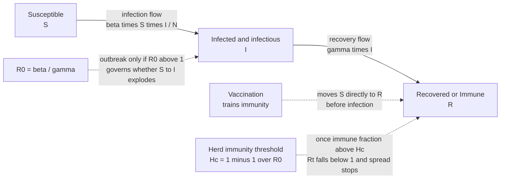

# 🦠 Infectious Disease, Vaccines and Immunity

> [!abstract] TL;DR
> Infectious disease is the oldest and still one of the deadliest public-health problems, and controlling it is one of the great triumphs of modern medicine. Whether a pathogen sparks an **epidemic** turns on a single number — the **basic reproduction number** $R_0$, the average number of new infections one case causes. If $R_0 > 1$ the outbreak grows exponentially; if $R_0 < 1$ it fizzles. The **SIR compartmental model** (Susceptible → Infected → Recovered) captures this on the back of an envelope. **Immunity** — innate then adaptive, with lasting **memory** — is how the body wins; **vaccines** manufacture that memory safely by showing the immune system a harmless preview of a pathogen. When enough people are immune, the pathogen runs out of hosts: **herd immunity**, reached once a fraction $1 - 1/R_0$ of the population is protected (about 95% for measles, roughly 50% for flu). Vaccination is therefore a **collective-action** good — vulnerable to free-riding, misinformation, and, on the pathogen's side, to the relentless **evolution** of antimicrobial resistance.

## Intuition

**Analogy — an epidemic is a fire spreading through a forest.** Whether one lightning strike becomes a wildfire or dies as a wisp of smoke depends on the forest, not the spark. Pack the trees close together and leave them bone-dry, and each burning tree ignites several neighbors — the fire races outward and consumes everything (this is $R_0 > 1$). Space the trees out or dampen them with rain, and a burning tree lights *fewer* than one neighbor on average, so the fire gutters out (this is $R_0 < 1$). The same match, the same forest, but the arithmetic of "how many neighbors does each burning tree light" decides everything.

**Vaccination is clearing firebreaks.** You do not need to soak every tree to stop a wildfire — you cut strips through the forest so that a burning tree finds no fuel next to it. Immunize enough people and the chain of transmission keeps hitting dead ends; the fire cannot jump the gap even to the trees you *did not* protect. That gap-jumping failure is **herd immunity**, and the fraction of the forest you must clear to guarantee it depends only on how ferociously the fire spreads — a raging measles blaze needs firebreaks through 95% of the forest; a smoldering flu needs far fewer.

---

## How It Works

### The chain of infection

Every infection is a chain with six links, and control means breaking *any one* of them:

1. **Pathogen** — the infectious agent (virus, bacterium, fungus, parasite, prion), with some intrinsic transmissibility and virulence.
2. **Reservoir** — where it lives and multiplies (humans, animals, soil, water). Diseases with only a human reservoir, like smallpox, can be **eradicated**; those with animal reservoirs, like influenza or rabies, cannot.
3. **Portal of exit** — how it leaves the host (respiratory droplets, feces, blood, sexual fluids).
4. **Mode of transmission** — direct contact, airborne aerosols, droplets, vehicle (food/water), or vector (mosquito, tick).
5. **Portal of entry** — how it invades the next host (inhalation, ingestion, mucous membranes, broken skin).
6. **Susceptible host** — someone lacking immunity. This is the link vaccines target directly.

Public-health interventions map onto these links: sanitation and clean water break vehicle transmission; masks and ventilation break airborne transmission; vector control breaks mosquito-borne transmission; and vaccination removes the susceptible host.

### Epidemic dynamics and the SIR model

To predict whether a disease will take off, divide the population into **compartments** by disease state and track the flows between them. In the classic **SIR** model each person is **S**usceptible, **I**nfected (and infectious), or **R**ecovered (immune or removed). The well-mixed mean-field equations are:

$$\frac{dS}{dt} = -\beta \frac{S I}{N}, \qquad \frac{dI}{dt} = \beta \frac{S I}{N} - \gamma I, \qquad \frac{dR}{dt} = \gamma I$$

where $\beta$ is the transmission rate per contact and $\gamma$ is the recovery rate, so $1/\gamma$ is the mean infectious period. Because R is an absorbing state, an SIR epidemic is a **one-shot wave**: it grows, peaks, and burns out as susceptibles are depleted. (In the **SIS** variant, recovery returns you to Susceptible and the disease can become **endemic** — the model for the common cold.)

### $R_0$, $R_t$, and the epidemic threshold

The **basic reproduction number** is
$$R_0 = \frac{\beta}{\gamma}$$
— the average number of secondary infections one case produces *in a fully susceptible population*. It is the single most important quantity in epidemiology, and it drives a sharp **phase transition** at $R_0 = 1$:

- $R_0 < 1$: each case replaces itself with fewer than one new case. The chain **dies out**.
- $R_0 > 1$: each case more than replaces itself. Early infections grow **exponentially** — a pure reinforcing feedback loop — until the susceptible pool empties and a balancing loop forces the peak and burnout.
- $R_0 = 1$: the **epidemic threshold**, the knife's edge between fizzle and firestorm.

$R_0$ is **not** a fixed property of the pathogen. It bundles biology ($\beta$, $\gamma$) with *behavior* and *network structure* — the same virus has a much higher $R_0$ in a crowded city than a sparse village. As an outbreak progresses and people gain immunity or change behavior, we track the **effective reproduction number** $R_t$, the live version of $R_0$ at time $t$. Interventions succeed exactly when they push $R_t$ below 1.

### Herd immunity threshold

Once a fraction of the population is immune, each infected person meets fewer susceptibles, so the *effective* reproduction number becomes $R_t = R_0 \cdot (1 - p)$ where $p$ is the immune fraction. Setting $R_t = 1$ and solving gives the **herd immunity threshold**:

$$H_c = 1 - \frac{1}{R_0}$$

Above this immune fraction the disease cannot sustain transmission and *indirectly protects* those who cannot be vaccinated — newborns, the immunocompromised, people with certain allergies. Because $H_c$ rises steeply with $R_0$, contagiousness dictates the target:

| Disease | Approx. $R_0$ | Herd immunity threshold $1 - 1/R_0$ |
|---|---|---|
| Measles | 12–18 | ~92–95% |
| Pertussis (whooping cough) | 12–17 | ~92–94% |
| Polio | 5–7 | ~80–86% |
| COVID-19 (ancestral) | 2–3 | ~50–67% |
| Seasonal influenza | 1–2 | ~0–50% |

This is why measles is the "canary in the coal mine": its threshold is so high that even a small dip in coverage brings outbreaks roaring back.

### Immunity: innate, adaptive, and memory

The body fights infection in two waves. The **innate immune system** is the fast, non-specific first responder — physical barriers, inflammation, phagocytes, and interferons that act within minutes to hours. The **adaptive immune system** is slower but exquisitely specific: B cells produce antibodies against a particular antigen, and T cells kill infected cells or coordinate the response. Crucially, the adaptive system forms **memory** B and T cells, so a *second* exposure triggers a faster, stronger response — often clearing the pathogen before symptoms appear. This memory is what "immunity" means, and it is what vaccines exploit.

### Vaccines: training immunity without the disease

A vaccine presents the immune system with **antigens** in a form that cannot cause disease, provoking a primary response and memory formation *before* real infection. The major platforms trade off strength, safety, and manufacturability:

| Platform | Mechanism | Examples |
|---|---|---|
| **Live-attenuated** | Weakened but replicating microbe; strongest, most durable immunity | MMR, chickenpox, oral polio, BCG |
| **Inactivated** | Whole killed pathogen; safe, often needs boosters | Rabies, hepatitis A, inactivated polio |
| **Subunit / conjugate** | Purified proteins or polysaccharides; very safe | Hepatitis B, HPV, Hib, pneumococcal |
| **Toxoid** | Inactivated bacterial toxin | Tetanus, diphtheria |
| **mRNA** | Lipid-encased mRNA instructs your cells to make one antigen | COVID-19 (Pfizer, Moderna) |
| **Viral vector** | Harmless virus delivers the antigen gene | Some COVID-19 and Ebola vaccines |

**Efficacy vs effectiveness** is a distinction that trips up even journalists: *efficacy* is the risk reduction measured in the controlled setting of a randomized trial; *effectiveness* is the real-world reduction once messy factors — storage, timing, waning, variants, who actually shows up — intervene. Effectiveness is usually lower than efficacy, and both are legitimate.

### SIR compartmental flow with vaccination and herd immunity



---

## Key Concepts

### Secondary (intuitive)
- **Contagion:** a disease that spreads person-to-person along contacts, like fire jumping between trees.
- **$R_0$ in one sentence:** on average, how many people does one sick person infect? Above one it grows, below one it dies out.
- **Herd immunity:** once enough people are immune, the germ runs out of new hosts and stops even reaching the unvaccinated.
- **Vaccine:** a harmless "fire drill" that teaches the immune system to recognize a germ before the real one arrives.
- **Eradication vs elimination:** eradication wipes a disease off the planet (smallpox); elimination stops local spread in one region while it survives elsewhere.

### Undergraduate (formal)
- **Chain of infection:** pathogen → reservoir → portal of exit → mode of transmission → portal of entry → susceptible host; break any link to control spread.
- **Mean-field SIR:** ODE compartments with transmission rate $\beta$ and recovery rate $\gamma$; $R_0 = \beta/\gamma$, epidemic threshold at $R_0 = 1$.
- **Effective reproduction number:** $R_t = R_0 \cdot (1 - p)$ with immune fraction $p$; interventions aim to hold $R_t < 1$.
- **Herd immunity threshold:** $H_c = 1 - 1/R_0$; the peak of an SIR wave occurs when $S/N = 1/R_0$.
- **Immunity types:** innate (fast, non-specific) vs adaptive (slow, specific, memory-forming); active (own response, durable) vs passive (borrowed antibodies, temporary).
- **Efficacy vs effectiveness:** trial-measured risk reduction vs real-world performance.

### Graduate (dynamics, evolution, and networks)
- **Final-size relation:** the total fraction ever infected in an SIR wave solves the transcendental $R_\infty = 1 - e^{-R_0 R_\infty}$ — even $R_0$ modestly above 1 can infect most of the population.
- **Next-generation matrix:** for structured populations, $R_0$ is the dominant eigenvalue of the next-generation operator, not a simple ratio.
- **Network $R_0$:** on a contact network $R_0 \propto \frac{\beta}{\gamma}\cdot\frac{\langle k^2\rangle}{\langle k\rangle}$; on scale-free networks the epidemic threshold can **vanish** and hubs become super-spreaders (see [[Network_Dynamics_and_Contagion]]).
- **Antimicrobial resistance:** antibiotic pressure selects pre-existing resistant mutants; resistance genes then spread by horizontal gene transfer — natural selection observed in real time (see [[Natural_Selection_and_Adaptation]]).
- **Vaccination as a public good:** an individually costly, collectively beneficial act with a free-rider incentive and a Nash equilibrium below the social optimum (see [[Repeated_Games_and_Folk_Theorems]]).
- **Zoonotic spillover & One Health:** most emerging pathogens jump from animal reservoirs; pandemic risk is a coupled human-animal-environment system.

---

## Python Demo

```python
# Simulate the SIR epidemic model with numpy (explicit Euler integration) and
# matplotlib. We demonstrate three things:
#   Panel 1  A full SIR wave (S, I, R over time) for R0 = 3, marking that the
#            infected peak occurs when the susceptible fraction hits 1/R0.
#   Panel 2  How R0 decides whether the epidemic takes off (threshold at R0 = 1).
#   Panel 3  How vaccinating a fraction v of the population flattens then PREVENTS
#            the outbreak, with the herd immunity threshold Hc = 1 - 1/R0.
# This is Susceptible -> Infected -> Recovered stock-and-flow dynamics: a
# reinforcing loop (exponential early growth) tamed by a balancing loop as the
# susceptible stock drains -- the systems-thinking signature of every SIR curve.
import numpy as np
import matplotlib.pyplot as plt

def sir(beta, gamma, N=1.0, I0=1e-3, vacc=0.0, T=200.0, dt=0.1):
    """Integrate SIR with a fraction `vacc` pre-immunized (moved S->R at t=0)."""
    steps = int(T / dt)
    S = np.empty(steps); I = np.empty(steps); R = np.empty(steps)
    S[0] = (1.0 - vacc) * N - I0      # susceptibles left after vaccination
    I[0] = I0
    R[0] = vacc * N                    # the vaccinated start out immune
    for t in range(steps - 1):
        new_inf = beta * S[t] * I[t] / N     # reinforcing loop early on
        new_rec = gamma * I[t]               # balancing drain into R
        S[t + 1] = S[t] - new_inf * dt
        I[t + 1] = I[t] + (new_inf - new_rec) * dt
        R[t + 1] = R[t] + new_rec * dt
    return np.linspace(0, T, steps), S, I, R

gamma = 0.1                            # mean infectious period 1/gamma = 10 days
fig, ax = plt.subplots(1, 3, figsize=(16, 5))

# ---- Panel 1: one full SIR wave, R0 = 3 ----
beta = 0.3
R0 = beta / gamma
t, S, I, R = sir(beta, gamma)
ax[0].plot(t, S, color="#2980B9", lw=2, label="Susceptible")
ax[0].plot(t, I, color="#C0392B", lw=2, label="Infected")
ax[0].plot(t, R, color="#27AE60", lw=2, label="Recovered")
ax[0].axhline(1.0 / R0, color="grey", ls="--", lw=1,
              label=f"S = 1/R0 = {1/R0:.2f}  (I peaks here)")
ax[0].set_title(f"SIR wave, R0 = {R0:.0f}: grows, peaks, burns out")
ax[0].set_xlabel("time (days)"); ax[0].set_ylabel("fraction of population")
ax[0].legend(); ax[0].grid(alpha=0.3)

# ---- Panel 2: R0 sweep across the epidemic threshold ----
for b, ls in [(0.08, "--"), (0.11, ":"), (0.20, "-."), (0.30, "-")]:
    ti, _, Ii, _ = sir(b, gamma)
    r0 = b / gamma
    verdict = "dies out" if r0 < 1 else "epidemic"
    ax[1].plot(ti, Ii, ls, lw=2, label=f"R0 = {r0:.1f}  ({verdict})")
ax[1].set_title("Epidemic threshold: takeoff ONLY when R0 > 1")
ax[1].set_xlabel("time (days)"); ax[1].set_ylabel("infected fraction")
ax[1].legend(); ax[1].grid(alpha=0.3)

# ---- Panel 3: vaccination flattens then prevents the outbreak (R0 = 3) ----
R0 = 0.3 / gamma
Hc = 1.0 - 1.0 / R0                     # herd immunity threshold = 2/3 for R0 = 3
for v, ls in [(0.0, "-"), (0.3, "--"), (0.5, "-."), (round(Hc, 3), ":"), (0.8, "-")]:
    tv, _, Iv, _ = sir(0.3, gamma, vacc=v)
    reff = R0 * (1.0 - v)
    tag = "prevented" if reff <= 1.0 else "outbreak"
    ax[2].plot(tv, Iv, ls, lw=2, label=f"v = {v:.2f}, Reff = {reff:.2f}  ({tag})")
ax[2].axhline(0, color="k", lw=0.5)
ax[2].set_title(f"Vaccination flattens/prevents (R0 = {R0:.0f}, Hc = {Hc:.2f})")
ax[2].set_xlabel("time (days)"); ax[2].set_ylabel("infected fraction")
ax[2].legend(); ax[2].grid(alpha=0.3)

plt.tight_layout(); plt.show()

# ---- Numerical summary: herd immunity threshold and effective R0 ----
print(f"R0 = {R0:.2f}")
print(f"Herd immunity threshold Hc = 1 - 1/R0 = {Hc:.3f} "
      f"({Hc*100:.1f}% of the population must be immune)")
for v in [0.0, 0.30, 0.60, 0.67]:
    reff = R0 * (1.0 - v)
    outcome = "OUTBREAK" if reff > 1.0 else "no outbreak"
    print(f"  vaccinate {v*100:4.0f}%  ->  effective R0 = {reff:.2f}  [{outcome}]")
```

Running this prints three panels. Panel 1 shows the textbook S/I/R wave: the infected "bump" rises, peaks exactly as the susceptible fraction crosses $1/R_0$, and decays as susceptibles run out. Panel 2 sweeps $R_0 = 0.8, 1.1, 2.0, 3.0$ — the sub-threshold curve slumps immediately while the super-threshold curves climb into epidemics, making the phase transition at $R_0 = 1$ visible. Panel 3 pre-immunizes a rising fraction $v$: the peak flattens as $v$ grows, and once $v$ reaches the herd immunity threshold $H_c = 1 - 1/3 \approx 0.67$ the effective $R_0$ drops to 1 and the outbreak is snuffed out entirely — the firebreak succeeds even though a third of the forest was never protected.

---

## Real-World Applications

- **Smallpox eradication (1980):** the only human disease ever eradicated, achieved through ring vaccination and surveillance; possible precisely *because* smallpox had no animal reservoir. Estimated to have prevented hundreds of millions of deaths.
- **Polio elimination:** wild poliovirus is now confined to a handful of regions after decades of oral- and inactivated-vaccine campaigns; a textbook case of pushing $R_t$ below 1 across whole continents.
- **COVID-19 pandemic response:** real-time $R_t$ estimation guided lockdown timing; SEIR forecasts sized hospital surges; the mRNA platform delivered vaccines in under a year — the fastest in history — and non-pharmaceutical interventions (distancing, masks, contact tracing) held $R_t$ down before vaccines arrived.
- **Setting coverage targets:** national immunization schedules set thresholds directly from $1 - 1/R_0$; measles' ~95% target is why even 90% coverage is considered dangerously low.
- **Antimicrobial stewardship:** hospitals restrict broad-spectrum antibiotics and track resistance because AMR is projected to become a leading cause of death — a slow-motion pandemic driven by evolution and overuse in medicine and agriculture.
- **One Health & pandemic preparedness:** surveillance of animal reservoirs (avian flu, coronaviruses in bats) aims to catch **zoonotic spillover** before it becomes human-to-human transmission.

---

## Common Pitfalls

- **Treating $R_0$ as a fixed constant of the pathogen.** It bundles biology *and* behavior *and* contact structure; a reported $R_0$ is a context-bound estimate, not a physical constant. Compare $R_t$ over time, not a single headline number.
- **Confusing efficacy with effectiveness.** A 95%-efficacy vaccine in a trial does not mean 95% of vaccinated people are protected in every real-world setting; storage, timing, waning, and variants erode it. Neither number is "the truth" — they answer different questions.
- **Believing the debunked MMR–autism claim.** The 1998 study was fraudulent, retracted, and its author lost his license; dozens of studies across millions of children show no link. This is settled science, and repeating the claim costs lives when coverage falls below $H_c$.
- **Free-riding on herd immunity.** "Everyone else is vaccinated, so I don't need to be" is individually tempting but collectively self-defeating — a classic collective-action problem. If enough people reason this way, coverage collapses below $H_c$ and outbreaks return (as measles repeatedly shows).
- **"Antibiotics will fix any infection."** Antibiotics do nothing against viruses, and every unnecessary course breeds resistance. Overuse is the selective pressure that manufactures the superbugs.
- **Assuming natural infection is "better" than vaccination.** Natural infection buys immunity at the full price of the disease — including death and disability — whereas a vaccine confers it safely. "Natural" is not a synonym for "safe."
- **Ignoring network heterogeneity.** Well-mixed SIR overestimates early spread in clustered populations and misses super-spreaders; on real contact networks *who* you vaccinate can matter more than *how many* (see [[Network_Dynamics_and_Contagion]]).

---

## Related Concepts

- [[The_Innate_Immune_System]] — the fast, non-specific first line of defense that buys time for the adaptive response.
- [[The_Adaptive_Immune_System]] — the specific, memory-forming system that vaccines are designed to train.
- [[Vaccines_and_Antibiotics]] — the biological deep-dive on vaccine platforms, herd immunity, and antibiotic resistance behind this note's public-health framing.
- [[Viruses]] — the structure and replication of viral pathogens and why antibiotics fail against them.
- [[Bacteria_and_Archaea]] — bacterial biology, binary fission, and horizontal gene transfer that spread resistance.
- [[Natural_Selection_and_Adaptation]] — antimicrobial resistance is natural selection running in fast-forward; the pathogen's evolutionary answer to our interventions.
- [[Network_Dynamics_and_Contagion]] — the systems/networks view of the same SIR machinery, super-spreaders, and the vanishing epidemic threshold on scale-free graphs.
- [[Feedback_Loops_and_Causality]] — the SIR curve is reinforcing early growth handing off to a balancing loop as susceptibles deplete.
- [[Stocks_Flows_and_System_Dynamics]] — S, I, and R are stocks; $\beta S I / N$ and $\gamma I$ are the flows — a canonical stock-and-flow model.
- [[Population_Ecology]] — SIR shares its logistic/predator-prey mathematics with population dynamics; the infected compartment grows like a population.
- [[Repeated_Games_and_Folk_Theorems]] — vaccination as a collective-action game where cooperation (getting vaccinated) is individually costly but socially optimal.
- [[Justice_in_Health_and_Resource_Allocation]] — the ethics of allocating scarce vaccines and balancing individual liberty against collective protection.
- [[Informed_Consent_and_Autonomy]] — the bioethical tension between mandates, autonomy, and the duty to protect those who cannot be vaccinated.
- [[Media_Literacy_and_Source_Evaluation]] — the toolkit for resisting vaccine misinformation and evaluating health claims.

---

## Review Questions

1. **(Conceptual)** Explain why $R_0 = 1$ is a genuine *phase transition* rather than an arbitrary cutoff. Derive the herd immunity threshold $H_c = 1 - 1/R_0$ from the effective reproduction number, and explain why measles ($R_0 \approx 15$) demands ~95% coverage while flu ($R_0 \approx 1.5$) needs far less.
2. **(Scenario)** A community's measles vaccination rate drifts from 96% down to 88% over several years because of misinformation. Using $H_c$ and $R_t$, explain what happens to disease transmission, who is most at risk, and why this is best understood as a collective-action failure rather than a series of independent private choices. What interventions would you prioritize?
3. **(Trade-off / systems)** Contrast vaccine *efficacy* and *effectiveness*, and explain why over-prescribing antibiotics and under-vaccinating are two faces of the same evolutionary/systems problem. In what sense does each intervention change the selective pressure on the pathogen population over time?

---

## Sources

- Anderson, R. M., & May, R. M. (1991). *Infectious Diseases of Humans: Dynamics and Control*. Oxford University Press. — the foundational text on $R_0$, thresholds, and vaccination.
- Kermack, W. O., & McKendrick, A. G. (1927). "A Contribution to the Mathematical Theory of Epidemics." *Proceedings of the Royal Society A, 115*(772), 700–721. — the original SIR model.
- Plotkin, S. A., Orenstein, W., & Offit, P. A. (2023). *Plotkin's Vaccines* (8th ed.). Elsevier. — comprehensive reference on vaccine platforms, efficacy, and impact.
- World Health Organization (2023). "Immunization coverage" and "Antimicrobial resistance" fact sheets. who.int.
- Taylor, L. E., Swerdfeger, A. L., & Eslick, G. D. (2014). "Vaccines are not associated with autism: an evidence-based meta-analysis." *Vaccine, 32*(29), 3623–3629. — the definitive refutation of the MMR–autism claim.

---

#health #infectious-disease #vaccines #epidemiology #herd-immunity
