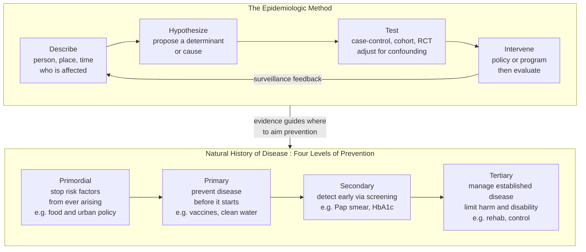

# 🌐 Public Health and Epidemiology

> [!abstract] TL;DR
> **Public health** is the science of protecting and improving the health of whole **populations**, not the individual in front of the doctor. Where clinical medicine asks "what is wrong with *this* patient and how do I fix it," public health asks "why do *so many* patients keep arriving with the same problem, and how do we stop it upstream." Its basic science is **epidemiology** — the study of the *distribution* and *determinants* of health and disease in populations — and its core toolkit is a small set of measures (incidence, prevalence, relative vs absolute risk, odds ratios) and study designs (case-control, cohort, RCT, systematic review) arranged in an **evidence hierarchy**. Its organizing strategy is **prevention** across four levels (primordial, primary, secondary, tertiary). The historically decisive point: the largest gains in human life expectancy came not from clinical cures but from public-health action — clean water, sanitation, vaccination, and tobacco control.

---

## Intuition

**Analogy: the river and the drowning people.** You are standing by a river when you see someone drowning, so you pull them out. Then another. Then another. Soon you are hauling bodies from the water without pause — exhausting, heroic, and endless. Clinical medicine is that rescue work: skilled, urgent, and aimed at the person in front of you. **Public health is the decision to finally walk *upstream* to find out who keeps throwing people in** — a broken bridge, a slippery bank, a factory dumping upstream — and to fix *that*, so the bodies stop coming. Medicine treats the symptom you can see; public health hunts the cause you cannot, because that is where the leverage is.

The same split appears in the famous chain of "why." Ask why a person had a heart attack and you reach a blocked artery — the clinic's domain. Keep asking *why the artery blocked* and you pass through cholesterol and smoking to the food environment, the stressful low-control job, and the neighborhood with nowhere safe to walk — the **"causes of the causes"** ([[Determinants_of_Health]]). Public health treats those upstream causes; medicine treats the downstream event. Both matter, but only one of them stops the *next* thousand cases.

---

## How It Works

### Core Mechanics

**1. The population lens.** The unit of analysis is a *group*, not a person. A cardiologist optimizes one patient's cholesterol; an epidemiologist asks how cholesterol is *distributed* across a million people, what *determines* that distribution, and which lever (a drug, a tax, a ban on trans fats) shifts the whole curve. Shifting a population's average even slightly can prevent more disease than perfectly treating the sickest individuals — a counterintuitive result called the **prevention paradox** (below).

**2. Prevention comes in four levels**, mapped onto the natural history of a disease from "not yet a risk" to "established illness":

- **Primordial** — stop the *risk factors themselves* from ever arising. Food policy, walkable cities, and clean-air regulation so that obesity, smoking, and pollution never take hold in the first place.
- **Primary** — prevent disease *before onset* in people already exposed to risk. Vaccination, clean water, seatbelts, fluoridation. This is where the biggest historical wins live.
- **Secondary** — *early detection* of disease that has begun but is still silent, so it can be caught before it does harm. Screening: mammography, Pap smears, blood-pressure checks, HbA1c ([[Biomarkers_and_Measuring_Health]]).
- **Tertiary** — manage *established* disease to limit disability and complications. Cardiac rehab, diabetic foot care, stroke recovery.

**3. Epidemiology is the basic science underneath.** It runs a repeatable loop: **describe** the pattern (who is affected, where, when — *person, place, time*), **hypothesize** a determinant, **test** the hypothesis with an appropriate study design while controlling for confounding, then **intervene** and evaluate — with **surveillance** feeding the results back to the next round.

**4. A compact set of measures does the quantifying:**

- **Incidence vs prevalence.** Incidence is the rate of *new* cases over time (the faucet); prevalence is the proportion of *existing* cases at a moment (the water in the tub). Roughly, `prevalence ≈ incidence × duration` — a cheap chronic disease people live with for decades has high prevalence even at low incidence.
- **Relative vs absolute risk.** **Relative risk (RR)** is a ratio — treated risk over untreated risk — and it is what headlines love ("cuts risk 50 percent"). But a 50 percent cut on a baseline of 2-in-1000 is trivial, while the same 50 percent cut on 2-in-5 is enormous. **Absolute risk reduction (ARR)** and its reciprocal, the **number needed to treat (NNT = 1 / ARR)**, tell you the real-world payoff. This is the single most abused idea in health reporting.
- **Odds ratio (OR).** Case-control studies cannot compute risk directly, so they report the odds ratio; it *approximates* RR only when the outcome is **rare**.
- **Mortality and morbidity.** Death rates and disease burden, summarized in composite measures like DALYs (see [[Determinants_of_Health]]).

**5. Not all evidence is equal.** Study designs form a hierarchy by their power to isolate causation, from anecdote and descriptive series, through **case-control** and **cohort** studies, to **randomized controlled trials (RCTs)**, capped by **systematic reviews and meta-analyses**. Higher designs suppress more bias — but even an RCT can mislead, and observational studies dominate where randomizing would be unethical (you cannot randomize people to smoke).

### Flow / Architecture



---

## Key Concepts

### Secondary Level

- **Public health vs medicine.** Medicine fixes the sick individual; public health protects whole populations and prevents disease before it starts. Different unit, different toolbox.
- **Upstream vs downstream.** Treating the *cause* (why people keep getting sick) beats treating the *symptom* (each sick person one at a time) — the river-and-drowning parable.
- **The four levels of prevention.** Primordial (stop risks arising), primary (prevent disease), secondary (catch it early), tertiary (limit its damage).
- **Incidence vs prevalence.** Incidence = *new* cases appearing; prevalence = *all* existing cases right now. A slow chronic disease can be common (high prevalence) even if new cases are rare.
- **Epidemiology.** The "detective science" of health: figuring out who gets sick, where, when, and why, by studying groups rather than individuals.
- **The great achievements.** Clean water, sewers, and vaccines added more years to human life than any drug or surgery. Most of the twentieth-century jump in life expectancy was public health, not clinical medicine.

### Undergraduate Level

- **Risk, rate, and ratio.** *Risk* (cumulative incidence) is a probability over a period; a *rate* accounts for person-time at risk; a *ratio* (RR, OR) compares two groups. Confusing them is a classic error.
- **Relative risk reduction vs absolute risk reduction vs NNT.** RRR is a ratio and is *scale-free*; ARR is the actual percentage-point drop and depends on **baseline risk**; NNT = 1/ARR is how many people you must treat to prevent one event. The Python demo below shows why the *same* RRR can be worthless or life-changing.
- **The odds ratio and when it fools you.** Case-control studies start from the outcome (cases and controls) and can only give an **odds ratio**, which overstates the relative risk unless the outcome is rare. Reporting an OR as if it were an RR inflates apparent effects.
- **The evidence hierarchy and its biases.** Descriptive studies generate hypotheses; **case-control** is fast and good for rare diseases but prone to **recall and selection bias**; **cohort** studies follow exposed and unexposed groups forward and can measure incidence directly but are slow and costly; **RCTs** randomize away confounding but can be unethical or unrepresentative; **systematic reviews / meta-analyses** pool everything but inherit the flaws of their inputs and suffer **publication bias** (see [[Nutrition_Myths_and_Evidence]]).
- **Surveillance and outbreak investigation.** Continuous monitoring of disease, plus rapid field investigation when a cluster appears. The founding story is **John Snow and the Broad Street pump** (1854): by mapping cholera deaths in Soho he traced them to one contaminated water pump, removed its handle, and demonstrated waterborne transmission *decades before germ theory* — epidemiology's origin myth and a masterclass in "person, place, time."
- **Screening principles (Wilson–Jungner).** Screening the well is only worthwhile if the disease is serious, common enough, detectable early, and *treatable better when caught early* — and if the test does not do more harm than good. Screening a healthy population is governed by the base-rate math in [[Biomarkers_and_Measuring_Health]].
- **Mortality, morbidity, case fatality.** Death (mortality), illness burden (morbidity), and the proportion of cases who die (case-fatality rate) are distinct — a disease can be highly prevalent yet rarely fatal, or rare yet almost always lethal.

### Graduate Level

- **Causation in epidemiology: the Bradford Hill criteria.** Association is not causation. Austin Bradford Hill (1965) offered nine *viewpoints* — not a checklist — for judging whether an association is causal: **strength, consistency, specificity, temporality** (the one near-necessity: cause must precede effect), **biological gradient (dose-response), plausibility, coherence, experiment, and analogy.** They frame causal judgment as weight-of-evidence reasoning, not a proof. Connect to [[Causal_Reasoning]].
- **Confounding, bias, and reverse causation.** A **confounder** is a third variable that causes both exposure and outcome (coffee drinkers smoke more, so coffee looks harmful). **Bias** is systematic error baked into design (selection bias, recall bias, information bias). **Reverse causation**: the disease caused the exposure, not the other way ("sick people rest more, so rest looks harmful"). These are why observational studies so often fail to replicate, and why the hierarchy exists.
- **The ecological fallacy.** Inferring about *individuals* from *group-level* correlations. Countries with more chocolate consumption win more Nobel Prizes — but this says nothing about whether any individual's chocolate intake helps. A recurring trap in social and nutritional epidemiology.
- **Rose's prevention paradox and two strategies.** Geoffrey Rose showed that a *large* number of people at *small* risk usually generate more total cases than the *small* number at *high* risk. Hence two strategies: the **high-risk strategy** (find and treat the extreme tail — targeted, medically satisfying, but leaves the bulk of cases untouched) versus the **population strategy** (shift the whole distribution slightly — a small mean change in blood pressure or salt intake across everyone). The population strategy prevents more disease but delivers little visible benefit to any one participant, which is why it is politically hard.
- **Herd immunity and R0.** For infectious disease, the basic reproduction number R0 sets the herd-immunity threshold `1 − 1/R0`; vaccinating above it protects even the unvaccinated by breaking chains of transmission — the mechanism behind eradication campaigns (see [[Vaccines_and_Antibiotics]]).
- **Screening's hidden biases.** **Lead-time bias** (earlier detection inflates apparent survival without postponing death), **length-time bias** (screening preferentially catches slow, indolent disease), and **overdiagnosis** (detecting "disease" that would never have caused harm) mean a screening program can *look* lifesaving while helping no one — the central ethical hazard of secondary prevention, detailed in [[Biomarkers_and_Measuring_Health]].
- **Social epidemiology.** The study of how social structure — income, class, race, work, and social ties — patterns disease, formalizing the [[Determinants_of_Health]] into measurable exposures and the social gradient.
- **Health policy and the liberty tension.** Public health routinely constrains individual freedom for collective benefit — quarantine, mandatory vaccination, smoking bans, sugar taxes. This sits on Mill's **harm principle** and a spectrum from gentle *nudges* (default choices, labeling) to hard *mandates* (compulsory seatbelts, isolation orders). Where to draw the line is a genuine ethical conflict, not a technical one (see [[Applications_and_Bioethics]]).

### Roadmap of this section (06 — Public Health and Prevention)

This note is the **anchor** of the Public Health and Prevention section. It sets up the population lens, the prevention levels, and the epidemiologic method that the rest of the section builds on. Planned companion notes extend specific branches:

- **Infectious Disease, Vaccines, and Immunity** — the R0 / herd-immunity machinery, outbreak dynamics, and the vaccination success story (bridges to [[Vaccines_and_Antibiotics]]).
- **Screening and Early Detection** — a deep dive on secondary prevention and its biases (bridges to [[Biomarkers_and_Measuring_Health]]).
- **Health Behavior and Behavior Change** — why "just choose to be healthy" fails, and what actually shifts population behavior.
- **Global Health and Health Systems** — how prevention is financed and delivered across rich and poor countries.

Until those exist, treat this note as the section's single source of truth for population-level thinking.

---

## Python Demo

```python
# Why "cuts your risk 50 percent" can be trivial or life-changing.
# Relative risk reduction (RRR) is a RATIO and hides real-world payoff.
# Absolute risk reduction (ARR) and number needed to treat (NNT = 1/ARR)
# reveal it -- and both depend entirely on the BASELINE RISK.
# This is applied logic/statistics: a ratio is not an effect size.
import numpy as np
import matplotlib.pyplot as plt


def arr_and_nnt(baseline_risk, rrr):
    """Return (treated_risk, absolute_risk_reduction, number_needed_to_treat)."""
    treated_risk = baseline_risk * (1.0 - rrr)
    arr = baseline_risk - treated_risk          # == baseline_risk * rrr
    nnt = 1.0 / arr
    return treated_risk, arr, nnt


RRR = 0.50  # the identical headline: "a drug that halves your risk"

# --- concrete comparison: rare baseline vs common baseline --------------
print("Same 50 percent relative risk reduction, two very different worlds:")
for p0 in (0.01, 0.40):
    _, arr, nnt = arr_and_nnt(p0, RRR)
    print(f"  baseline {p0:5.0%} -> ARR {arr:5.1%} -> NNT {nnt:6.0f}")

# --- sweep across all baseline risks ------------------------------------
baseline = np.linspace(0.002, 0.5, 400)
_, arr, nnt = arr_and_nnt(baseline, RRR)

fig, (ax1, ax2) = plt.subplots(1, 2, figsize=(13, 5))

ax1.plot(baseline * 100, arr * 100, color="#7c3aed", lw=2.5)
ax1.set_title("Same 50 percent RELATIVE reduction\nAbsolute benefit scales with baseline risk")
ax1.set_xlabel("Baseline risk (percent)")
ax1.set_ylabel("Absolute risk reduction (percentage points)")
ax1.grid(alpha=0.3)
for p0 in (1, 40):
    a = 0.5 * p0  # ARR in percentage points for RRR = 0.5
    ax1.scatter([p0], [a], color="#dc2626", zorder=5)
    ax1.annotate(f"{p0}% baseline\nARR {a:.0f} pts", (p0, a),
                 textcoords="offset points", xytext=(8, 6), fontsize=9)

ax2.semilogy(baseline * 100, nnt, color="#0369a1", lw=2.5)
ax2.set_title("Number needed to treat (NNT)\nLow baseline = treat many for one saved")
ax2.set_xlabel("Baseline risk (percent)")
ax2.set_ylabel("NNT (log scale)")
ax2.grid(alpha=0.3, which="both")
for p0 in (1, 40):
    n = 1.0 / (0.5 * p0 / 100.0)
    ax2.scatter([p0], [n], color="#dc2626", zorder=5)
    ax2.annotate(f"{p0}% baseline\nNNT {n:.0f}", (p0, n),
                 textcoords="offset points", xytext=(8, 6), fontsize=9)

plt.tight_layout()
plt.savefig("relative_vs_absolute_risk.png", dpi=120, bbox_inches="tight")

# --- bonus: a 2x2 table, cohort vs case-control framing -----------------
#              outcome+   outcome-
#   exposed       a           b
#   unexposed     c           d
# A cohort study can compute relative risk directly.
# A case-control study can only give the odds ratio, which approximates
# the relative risk ONLY when the outcome is rare.
def rr_and_or(a, b, c, d):
    rr = (a / (a + b)) / (c / (c + d))
    orr = (a * d) / (b * c)
    return rr, orr

rr_rare, or_rare = rr_and_or(20, 9980, 10, 9990)     # rare outcome
rr_common, or_common = rr_and_or(400, 600, 200, 800)  # common outcome
print("\n2x2 tables (RR is the truth; OR is what case-control reports):")
print(f"  rare outcome  : RR {rr_rare:.2f}  OR {or_rare:.2f}  -> OR ~= RR")
print(f"  common outcome: RR {rr_common:.2f}  OR {or_common:.2f}  -> OR overstates RR")
```

**What it shows.** With a fixed **50 percent relative risk reduction**, the *absolute* benefit is entirely governed by baseline risk. At a 1 percent baseline the ARR is half a percentage point and the **NNT is 200** — treat 200 people to prevent one event. At a 40 percent baseline the same drug delivers a 20-point ARR and an **NNT of 5**. Identical headline, forty-fold difference in real value. The bonus 2x2 makes the second trap concrete: the **odds ratio** a case-control study reports tracks the true relative risk only when the outcome is rare (2.00 vs 2.00) and *overstates* it when the outcome is common (2.67 vs 2.00). Both lessons are pure applied statistics — see [[Statistical_Inference_and_Hypothesis_Testing]] and [[Causal_Reasoning]].

---

## Real-World Applications

- **John Snow and cholera (1854).** The founding case: mapping deaths to the Broad Street pump established waterborne transmission and the value of spatial epidemiology, launching the sanitary revolution that drained more mortality from cities than any medicine.
- **The Framingham Heart Study (1948–present).** A landmark **cohort** study that followed thousands of residents for decades and gave us the very concept of a cardiovascular "risk factor" — blood pressure, cholesterol, smoking — now baked into every clinical risk calculator.
- **Doll and Hill on smoking (1950–1954).** Case-control then cohort studies of British doctors linked smoking to lung cancer; the strength, dose-response, and consistency of the association became the textbook application of the **Bradford Hill** viewpoints and the basis of global **tobacco control** — one of public health's greatest wins.
- **COVID-19 surveillance and NPIs.** Real-time tracking of case counts, R0/Rt estimation, and non-pharmaceutical interventions (distancing, masking, isolation) were epidemiology at planetary scale, alongside the fastest vaccine rollout in history — and a live demonstration of the liberty-vs-collective-health tension.
- **National screening programs.** Mammography, colonoscopy, and cervical (Pap) screening are governed by Wilson–Jungner criteria and the base-rate/overdiagnosis math; guideline bodies tune the starting age and interval precisely to keep benefit ahead of harm ([[Biomarkers_and_Measuring_Health]]).

---

## Common Pitfalls

- **Relative-risk hype.** "Cuts your risk 50 percent" is meaningless without the baseline. Always demand the **absolute** risk reduction and NNT; a huge relative reduction on a tiny baseline is a rounding error.
- **Incidence/prevalence confusion.** Treating "how many people have it" (prevalence) as "how fast it is spreading" (incidence). A successful treatment that keeps patients alive longer *raises* prevalence while lowering mortality.
- **Reading an odds ratio as a relative risk.** For common outcomes the OR exaggerates the effect. Case-control studies only yield ORs; do not narrate them as risk multipliers.
- **Observational equals causal.** Confounding, selection bias, and reverse causation make observational associations unreliable. "People who take vitamins live longer" is mostly the **healthy-user effect**, not the vitamin.
- **The ecological fallacy.** Group-level correlations (country chocolate vs Nobel prizes) do not license individual conclusions.
- **Screening biases mistaken for benefit.** Lead-time and length-time bias and overdiagnosis can make a useless screening program look lifesaving. More detection is not automatically more health.
- **Misreading the prevention paradox.** Concluding that population-wide measures "don't work" because no individual feels a benefit — when in aggregate they prevent the most cases. The gain is real but diffuse.

---

## Related Concepts

- [[Determinants_of_Health]] — the upstream social and economic "causes of the causes" that public health targets; social epidemiology operationalizes this note into measurable exposures. *(sibling vault note)*
- [[Biomarkers_and_Measuring_Health]] — the measurement layer of secondary prevention; supplies the sensitivity/specificity, base-rate, and lead-time/length-time machinery behind screening. *(sibling vault note)*
- [[Nutrition_Myths_and_Evidence]] — applies the same evidence hierarchy and bias catalogue to a domain drowning in weak observational studies; the critical-thinking companion. *(sibling vault note)*
- [[Genes_Environment_and_Epigenetics_in_Health]] — the biological mediation of exposures across the life course that epidemiology tracks at the population scale. *(sibling vault note)*
- [[Causal_Reasoning]] — the logic of confounding, temporality, and inference from association to cause; the Bradford Hill criteria are its epidemiologic instantiation.
- [[Statistical_Inference_and_Hypothesis_Testing]] — the inferential backbone: sampling, significance, confidence, and the multiple-comparisons problem that makes so many "findings" spurious.
- [[Scientific_Reasoning_and_Method]] — hypothesis, test, and replication; the evidence hierarchy is this method ranked by bias control.
- [[Bayesian_Reasoning]] — the base-rate logic of screening (PPV as a posterior, prevalence as a prior) that governs secondary prevention.
- [[Cognitive_Biases_and_Heuristics]] — why relative-risk framing and base-rate neglect feel intuitively convincing even to experts.
- [[Vaccines_and_Antibiotics]] — the immunology behind primary prevention and herd immunity referenced throughout. *(Biology vault)*
- [[Applications_and_Bioethics]] — the ethics of coercion, consent, and the individual-liberty-vs-collective-good tension in health policy. *(Biology vault)*

---

## Review Questions

### Secondary

1. Use the river-and-drowning parable to explain the difference between what a doctor does and what public health does. Which one "walks upstream," and what does that mean concretely?
2. Name the four levels of prevention and give one everyday example of each. Which level added the most years to human life expectancy historically?
3. Explain the difference between **incidence** and **prevalence** in your own words. Why can a disease be very common (high prevalence) even when new cases are rare?

### Undergraduate

1. A drug "reduces heart-attack risk by 40 percent." Your uncle has a 2 percent ten-year baseline risk; a high-risk patient has a 30 percent baseline. Compute the absolute risk reduction and NNT for each. What does this teach about reading health headlines?
2. Distinguish a **case-control** from a **cohort** study. Why can a case-control study only report an **odds ratio**, and under what condition does that odds ratio safely approximate the relative risk?
3. Tell the John Snow / Broad Street pump story and identify the "person, place, time" reasoning in it. Why is it remarkable that he cracked cholera transmission *before* germ theory?

### Graduate

1. An observational study finds that people who drink two glasses of red wine a night have less heart disease. Walk through **at least three** ways this could be non-causal (confounding, reverse causation, selection/healthy-user bias), then design the study that would actually settle it — and explain why that study may be unethical or infeasible.
2. Apply the **Bradford Hill** viewpoints to the smoking–lung-cancer case. Which viewpoint is closest to a logical necessity, and why is the whole set explicitly *not* a checklist?
3. Contrast Rose's **high-risk** and **population** prevention strategies for hypertension. Why does the population strategy usually prevent more total disease, why does it deliver little visible benefit to any individual (the **prevention paradox**), and how does that tension play into the ethics of mandates versus nudges?

---

## Sources

- Snow, J. (1855). *On the Mode of Communication of Cholera* (2nd ed.). John Churchill. [https://www.ph.ucla.edu/epi/snow/snowbook.html](https://www.ph.ucla.edu/epi/snow/snowbook.html)
- Hill, A. B. (1965). "The Environment and Disease: Association or Causation?" *Proceedings of the Royal Society of Medicine*, 58(5), 295–300. [https://www.ncbi.nlm.nih.gov/pmc/articles/PMC1898525/](https://www.ncbi.nlm.nih.gov/pmc/articles/PMC1898525/)
- Rose, G. (1985). "Sick Individuals and Sick Populations." *International Journal of Epidemiology*, 14(1), 32–38. [https://doi.org/10.1093/ije/14.1.32](https://doi.org/10.1093/ije/14.1.32)
- Doll, R., & Hill, A. B. (1950). "Smoking and Carcinoma of the Lung." *British Medical Journal*, 2(4682), 739–748. [https://www.bmj.com/content/2/4682/739](https://www.bmj.com/content/2/4682/739)
- Centers for Disease Control and Prevention. *Principles of Epidemiology in Public Health Practice* (3rd ed.). [https://www.cdc.gov/csels/dsepd/ss1978/index.html](https://www.cdc.gov/csels/dsepd/ss1978/index.html)

---

#health #public-health #epidemiology #prevention #population-health
