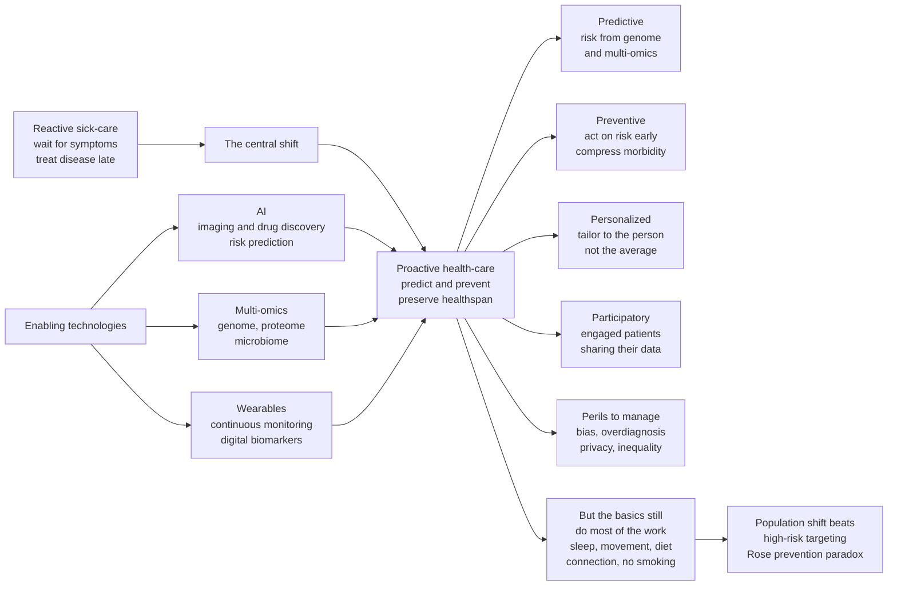

# 🔮 The Future of Health and Medicine

> [!abstract] TL;DR
> Medicine is undergoing a slow, uneven, but unmistakable shift: **from reactive "sick-care" that waits for disease and then treats it, toward proactive "health-care" that predicts and prevents disease to preserve healthspan.** This is the goal running through the entire vault. The intellectual frame is **Leroy Hood's "4 Ps"** — medicine becoming **P**redictive, **P**reventive, **P**ersonalized, and **P**articipatory — powered by three enabling technologies: **AI**, **multi-omics** (genomics, proteomics, metabolomics, the microbiome), and **wearables / continuous monitoring**. Each is real and each is over-hyped. Genes explain far less of your health than lifestyle and environment do; AI in medicine carries risks of bias, weak validation, and eroded trust; continuous monitoring generates as much noise, anxiety, and overdiagnosis as signal; and the geroscience "cure aging" frontier is a mix of serious science and marketing. The two deepest truths are boring and enduring: **most future health gains still depend on behavior change and equitable access, not on gadgets**, and **the highest-leverage move remains a population-wide shift in the fundamentals** — sleep, movement, diet, connection, not smoking — which, per **Geoffrey Rose's prevention paradox**, will always beat targeting only the high-risk few.

---

## Intuition

**Analogy: medicine is turning from a repair shop into an operating system.**

For the last century, healthcare has worked like a **body shop for cars**. You drive around until something breaks — a warning light comes on (a symptom), you bring the vehicle in, a mechanic diagnoses the fault and fixes it, and you leave until the next breakdown. It is *reactive*: nothing happens until damage has already occurred. It is *episodic*: care is a series of disconnected visits. And it is *one-size-fits-all*: the mechanic works from a generic manual, not from data about how *your* specific car has been driven.

The future of medicine looks less like a repair shop and more like a **continuously running operating system** — a background process that ingests a live stream of data about the machine (its genome as the firmware, its wearables and labs as the sensor feed, its environment and behavior as the workload), predicts where wear will accumulate, and nudges small adjustments *before* anything breaks. The whole point is the same one that runs through this entire vault (see [[Health_and_Wellbeing_Overview]]): stop optimizing for **"not broken"** and start optimizing for **"running well with reserve to spare"** — keep the plateau of good function high and long, and **compress morbidity** into a short window at the end.

The catch, which the rest of this note keeps returning to, is that a fancier dashboard does not automatically produce a healthier machine. The oldest maintenance advice — good fuel, regular use, adequate rest — still does most of the work, and the fanciest sensor is useless if the driver ignores it or cannot afford the shop.

---

## How It Works

### The central shift: from reactive sick-care to proactive health-care

Twentieth-century medicine was built to fight **acute and infectious disease** — set the broken bone, drain the infection, remove the tumour. That paradigm is *reactive by design*: it activates once pathology is present. But the epidemiological transition (see [[Health_and_Wellbeing_Overview]]) changed the enemy. Today's dominant burden is **chronic, slow-developing, largely lifestyle- and environment-driven disease** — cardiovascular disease, type 2 diabetes, many cancers, neurodegeneration. These diseases incubate silently for **decades** before the first symptom. Waiting for the warning light means intervening after most of the damage — arterial plaque, beta-cell exhaustion, tumour spread — is already done. The strategic response is to move "upstream": detect and modify **risk** long before it becomes disease. That is the entire premise of preventive and precision medicine.

### Hood's "4 Ps"

Leroy Hood's framework names four properties the emerging system aims for:

1. **Predictive** — using genomic, molecular, and continuous data to forecast an individual's disease risk *years or decades* ahead, converting medicine from a snapshot into a trajectory.
2. **Preventive** — acting on that forecast *before* symptoms, shifting resources from treatment to risk reduction and early detection.
3. **Personalized (precision)** — tailoring both prevention and treatment to the individual's biology (genome, [[Biomarkers_and_Measuring_Health|biomarkers]], microbiome) and context, rather than treating everyone as the population average.
4. **Participatory** — a patient who is an engaged, data-generating, decision-sharing partner, not a passive recipient — enabled by wearables, portals, and direct-to-consumer testing.

A useful mental fifth "P" is **Population**: none of the above matters at scale unless it reaches whole populations equitably, which is where the public-health tradition (and Rose's paradox, below) re-enters.

### The three enabling technologies — and their perils

**AI in medicine.** Machine learning now matches or exceeds specialists on narrow **imaging** tasks (diabetic retinopathy, mammography, dermatology, pathology slides), accelerates **drug discovery** (protein-structure prediction, candidate screening), powers **risk-prediction** models, and increasingly acts as a clinical assistant (ambient scribing, triage, summarization). The perils are equally real: models trained on unrepresentative data encode and amplify **bias** (see [[AI_Bias_and_Fairness]] and [[Algorithmic_Fairness_and_Bias]]); many tools are published on retrospective data and **fail to validate** prospectively or across hospitals (distribution shift); "black-box" outputs strain **accountability and liability** (see [[AI_and_the_Law]]); and automation can erode the **doctor–patient relationship** and clinician skill. AI is a **force multiplier for a clinician, not a replacement** — and multiplying by an unvalidated, biased factor is dangerous.

**Multi-omics and precision medicine.** Cheap sequencing lets us read the genome and, increasingly, the proteome, metabolome, transcriptome, and microbiome. This genuinely revolutionizes some domains: **pharmacogenomics** (dosing warfarin, avoiding a fatal reaction to a drug based on a variant — see [[Pharmacogenomics_and_Personalized_Medicine]]), rare monogenic disease, and **cancer** (targeting a tumour's specific mutations). But the promise is routinely **over-sold** for common chronic disease. Most common conditions are **polygenic** — spread across thousands of tiny-effect variants (see [[Complex_Trait_Genetics_and_GWAS]]) — and even a good polygenic risk score explains only a modest slice of risk. The uncomfortable, repeatedly-confirmed finding is that **behavior, environment, and social determinants dominate genetics** for the diseases that kill most people (see [[Determinants_of_Health]] and [[Genes_Environment_and_Epigenetics_in_Health]]). Your ZIP code predicts your health better than your genetic code.

**Wearables, continuous monitoring, and the quantified self.** Watches, rings, continuous glucose monitors (CGMs), at-home blood testing, and "digital biomarkers" turn health from an annual snapshot into a live stream (see [[Biomarkers_and_Measuring_Health]]). At their best they catch trends early (a rising resting heart rate before illness) and give behavior-change feedback. At their worst they drown users in **signal-vs-noise** problems — day-to-day biological variation and measurement error read as meaningful change — driving **health anxiety** and, at the system level, cascades of confirmatory tests and **overdiagnosis** of findings that would never have caused harm.

### The frontiers: geroscience, the microbiome, regenerative medicine

The most ambitious frontier is **geroscience**: rather than fighting cancer, heart disease, and dementia one at a time, target **aging itself** as the shared upstream driver (the [[Hallmarks_of_Aging|hallmarks of aging]]). Interventions under serious investigation include **senolytics** that clear senescent cells (see [[Cellular_Senescence_and_Senolytics]]), metabolic pathway modulators (rapamycin/mTOR, metformin, caloric restriction mimetics), and partial cellular reprogramming. The upside would be enormous — compress morbidity across *every* age-related disease at once. But this field is also awash in **hype and unproven consumer products**; almost nothing has demonstrated healthspan extension in a rigorous human trial, and separating the science from the supplements is a core literacy skill. Parallel frontiers include the **microbiome** as a modifiable organ (see [[The_Gut_Microbiome_and_Nutrition]]), and **regenerative medicine** (stem cells, tissue engineering, gene therapy) that aims to *repair* rather than merely *manage* damage.

### The prevention paradox: population vs high-risk strategies

Here the public-health tradition delivers the most counter-intuitive and important lesson, from **Geoffrey Rose**. There are two ways to prevent disease. The **high-risk strategy** finds the most at-risk individuals (top few percent) and intervenes intensively — intuitive, and it offers *large benefit to each treated person*. The **population strategy** shifts the *entire* risk distribution slightly (a small drop in average blood pressure, salt, or smoking across everyone). Rose's insight: **because the moderate-risk majority is so numerous, it generates more total cases of disease than the small high-risk tail** — so a tiny shift applied to everyone prevents more disease than a large shift applied to the few. The **prevention paradox** is the sting in the tail: *"a preventive measure that brings large benefits to the community offers little to each participating individual."* This tension — huge population payoff, negligible personal reward — is exactly why population-wide prevention is politically and behaviorally hard, and it is the phenomenon the Python demo below makes concrete.

### The persistent gaps: knowledge, behavior, and access

None of the technology closes the two oldest gaps in health. The **knowledge–behavior gap**: we already know most of what preserves health, yet knowing does not produce doing — behavior change is the real bottleneck, shaped by environment, habit, and motivation, not by more information. The **access–equity gap**: advanced diagnostics and therapies reach the wealthy and well-insured first, and the **digital divide** means the very monitoring meant to democratize health can *widen* inequality (see [[Determinants_of_Health]]). Whether the future of medicine improves population health or merely gives the affluent longer healthspans depends far more on health systems and equity than on any single technology.

### The map: the shifts reshaping health



---

## Key Concepts

### Secondary (explain to anyone)

- **Sick-care vs health-care** — old model waits for you to break, then fixes it; new model tries to keep you from breaking in the first place.
- **The 4 Ps** — future medicine aims to be **predictive, preventive, personalized, and participatory**.
- **Precision medicine** — using your specific biology (genes, biomarkers) to tailor prevention and treatment instead of treating everyone the same.
- **Wearables and the quantified self** — devices that continuously measure the body, turning yearly check-ups into a live data stream.
- **The basics still win** — sleep, movement, diet, social connection, and not smoking do most of the work, no gadget required.

### Undergraduate (needs some science background)

- **Hood's P4 medicine** — the framework naming the four properties, plus the practical fifth "P" of **Population**.
- **Multi-omics** — layering genomics, proteomics, metabolomics, transcriptomics, and the microbiome into an integrated molecular profile of an individual.
- **Polygenic risk scores** — aggregating thousands of small-effect variants into a single risk estimate; useful at the population tail, weak for most individuals, and dwarfed by lifestyle for common disease.
- **AI in clinical practice** — narrow superhuman performance on well-defined imaging tasks, versus the fragility of models under **distribution shift** and the fairness costs of biased training data.
- **Digital biomarkers and overdiagnosis** — continuous data catches disease earlier but also detects "disease" that would never have harmed the person, driving anxiety and cascades of testing.
- **Geroscience** — the hypothesis that targeting the shared biology of aging can prevent many age-related diseases simultaneously.

### Graduate (systems-level thinking)

- **Rose's prevention paradox** — because risk is distributed, the numerous moderate-risk majority generates more total cases than the high-risk tail; a small population-wide shift outperforms high-risk targeting, yet offers little to each individual — a collective-action problem for prevention.
- **The knowledge–behavior–access triad** — the future of health is gated less by biological discovery than by behavior change and equitable system access; technology without these amplifies inequality (the **inverse-care law** and the **digital divide**).
- **Validation and generalization of clinical AI** — retrospective accuracy is not prospective clinical benefit; models must survive dataset shift, spectrum bias, calibration drift, and prospective RCT-grade evaluation before deployment (see [[Explainable_AI]]).
- **The medicalization trap** — reframing ever more of ordinary life as monitored, quantified, treatable "disease," expanding the sick role and diverting attention from upstream determinants.
- **Healthspan as the optimization target** — the whole shift is coherent only if the objective is *quality-weighted* years (compression of morbidity), not raw lifespan; the wrong objective (lifespan alone) can add frail years and cost.
- **Data governance and the surveillance risk** — continuous health data is uniquely sensitive; who owns it, who can infer from it, and how it interacts with insurance and employment are governance problems, not technical ones (see [[Privacy_Surveillance_and_Data_Ethics]]).

---

## Python Demo

```python
# The future of prevention, quantified: reactive sick-care vs proactive prevention,
# and the core public-health lesson -- Geoffrey Rose's PREVENTION PARADOX.
#
# We simulate a population with a continuous cardiometabolic RISK score. Higher
# risk -> earlier disease onset -> fewer HEALTHY-LIFE-YEARS and more costly, late
# reactive care. We compare three strategies:
#   (0) Reactive baseline : do nothing until disease appears, then treat.
#   (1) High-risk targeting: intervene HARD on the top 5% risk (big help, few people).
#   (2) Population shift    : nudge the WHOLE distribution down a little (Rose).
#
# The punchlines:
#   * Most future cases come from the MODERATE-risk majority, not the high-risk tail
#     -> the population shift prevents MORE total disease (the prevention paradox).
#   * ...yet the population shift gives each individual only a tiny benefit,
#     while the high-risk few each gain a lot -- "large community benefit,
#     little to each participant" (Rose).
import numpy as np
import matplotlib.pyplot as plt

rng = np.random.default_rng(0)
N = 100_000

# --- 1. Population risk factor (standardized cardiometabolic risk score) ------
risk = rng.normal(loc=0.0, scale=1.0, size=N)          # roughly normal, mean 0
noise = rng.normal(0.0, 4.0, size=N)                    # individual variation, FIXED
DEATH_AGE = 88.0                                        # fixed ceiling; prevention
                                                        # works by delaying ONSET

def onset_age(r):
    # Higher risk pulls disease onset earlier. Noise held fixed so differences
    # between strategies reflect ONLY the intervention, not resampling.
    return np.clip(72.0 - 6.0 * r + noise, 30.0, 95.0)

def healthy_life_years(onset):
    # Healthy years = years lived in good function BEFORE onset (capped at death).
    return np.clip(np.minimum(onset, DEATH_AGE), 0.0, DEATH_AGE)

def reactive_care_cost(onset, per_morbidity_year=8_000.0):
    # Late "sick-care": cost scales with years spent sick after onset.
    morbidity = np.clip(DEATH_AGE - onset, 0.0, None)
    return morbidity * per_morbidity_year

# --- 2. The three strategies -------------------------------------------------
onset_base = onset_age(risk)                            # (0) reactive baseline

HIGH = np.quantile(risk, 0.95)                          # top 5% threshold
high_mask = risk >= HIGH
risk_high = risk.copy(); risk_high[high_mask] -= 2.0    # (1) big cut, few people
onset_high = onset_age(risk_high)

risk_pop = risk - 0.4                                   # (2) small cut, EVERYONE
onset_pop = onset_age(risk_pop)

hly_base = healthy_life_years(onset_base)
hly_high = healthy_life_years(onset_high)
hly_pop  = healthy_life_years(onset_pop)

# Healthy-life-years GAINED versus the reactive baseline
gain_high = (hly_high - hly_base).sum()
gain_pop  = (hly_pop  - hly_base).sum()
per_person_high = (hly_high - hly_base)[high_mask].mean()   # benefit to the treated
per_person_pop  = (hly_pop  - hly_base).mean()              # benefit to each person

# Costs: program cost + residual reactive care that still happens
cost_base = reactive_care_cost(onset_base).sum()
cost_high = reactive_care_cost(onset_high).sum() + high_mask.sum() * 15_000.0
cost_pop  = reactive_care_cost(onset_pop).sum()  + N * 500.0

print("PREVENTION PARADOX (Rose)  --  population of", f"{N:,}")
print(f"  High-risk targeting : +{gain_high:>10,.0f} healthy-life-years total | "
      f"+{per_person_high:4.1f} yr per TREATED person")
print(f"  Population shift     : +{gain_pop:>10,.0f} healthy-life-years total | "
      f"+{per_person_pop:4.1f} yr per person (everyone)")
print(f"  --> population shift delivers {gain_pop/gain_high:0.1f}x the TOTAL benefit,")
print(f"      yet gives each individual almost nothing: the paradox.")
print(f"  Cost/HLY  high-risk = ${ (cost_high-cost_base)/max(gain_high,1):>7,.0f} (may be +ve savings)")

# --- 3. Where do the cases actually come from? (the visual core) -------------
early = onset_base < 65.0                               # "early disease" = a case
bins = np.linspace(-3.5, 3.5, 22)
cases_per_bin, edges = np.histogram(risk[early], bins=bins)
centers = 0.5 * (edges[:-1] + edges[1:])

fig, (ax1, ax2) = plt.subplots(1, 2, figsize=(13, 5.2))

# Panel A: cases-by-risk -> most cases sit in the MODERATE-risk middle
ax1.bar(centers, cases_per_bin, width=(centers[1]-centers[0]) * 0.9,
        color="#3b82f6", alpha=0.85, label="early cases by risk band")
ax1.axvline(HIGH, color="#dc2626", ls="--", lw=1.8,
            label="high-risk threshold (top 5%)")
ax1.fill_betweenx([0, cases_per_bin.max() * 1.05], HIGH, 3.5,
                  color="#dc2626", alpha=0.10)
ax1.annotate("high-risk strategy\nonly reaches these",
             xy=(HIGH + 0.15, cases_per_bin.max() * 0.7),
             color="#dc2626", fontsize=9)
ax1.annotate("but MOST cases\nlive here",
             xy=(-0.2, cases_per_bin.max() * 0.9),
             ha="center", color="#1e3a8a", fontsize=10, fontweight="bold")
ax1.set_xlabel("Individual risk score (standard deviations)")
ax1.set_ylabel("Number of future cases")
ax1.set_title("The prevention paradox:\nmost cases arise from the moderate-risk majority")
ax1.legend(loc="upper left", fontsize=8)
ax1.grid(alpha=0.25, axis="y")

# Panel B: total benefit vs per-person benefit for the two strategies
labels = ["High-risk\ntargeting", "Population\nshift (Rose)"]
totals = [gain_high / 1e3, gain_pop / 1e3]              # thousands of HLY
perper = [per_person_high, per_person_pop]              # years per person
x = np.arange(len(labels))
bars = ax2.bar(x, totals, color=["#dc2626", "#059669"], alpha=0.85)
ax2.set_xticks(x); ax2.set_xticklabels(labels)
ax2.set_ylabel("Total healthy-life-years gained (thousands)")
ax2.set_title("Big TOTAL payoff, tiny INDIVIDUAL payoff\n(why population prevention is hard)")
for b, t, pp in zip(bars, totals, perper):
    ax2.text(b.get_x() + b.get_width() / 2, b.get_height() * 1.01,
             f"{t*1e3:,.0f} HLY\n(+{pp:.1f} yr/person)",
             ha="center", va="bottom", fontsize=9)
ax2.grid(alpha=0.25, axis="y")

plt.tight_layout()
plt.savefig("future_of_medicine_prevention.png", dpi=110, bbox_inches="tight")
plt.show()

# Typical output:
#   High-risk targeting : +    ~60,000 healthy-life-years total | +12.0 yr per TREATED person
#   Population shift     : +   ~240,000 healthy-life-years total |  +2.4 yr per person (everyone)
#   --> population shift delivers ~4x the TOTAL benefit, yet gives each person ~2.4 yr.
```

**What it shows.** Panel A is the whole argument in one picture: the *count* of future cases peaks in the **moderate-risk middle**, not the high-risk tail, simply because that middle contains almost everyone. A high-risk strategy — however aggressive — can only touch the thin red slice on the right, so it structurally cannot prevent most disease. Panel B shows the population shift delivering several times the **total** healthy-life-years, yet only a couple of years to any given individual, while the high-risk few each gain a lot. That is **Rose's prevention paradox** made numerical: the intervention that helps the community most helps each participant least — which is exactly why proactive, population-scale prevention (salt reduction, smog limits, walkable cities, tobacco control) is powerful in aggregate but perpetually hard to motivate one person at a time. The future of medicine is not only precision for individuals; it is also, unglamorously, **small shifts across everyone**.

---

## Real-World Applications

1. **UK Biobank and All of Us** — massive, deeply-phenotyped, multi-omic cohorts (genome + labs + wearables + records) are the substrate on which predictive, personalized medicine is being built and validated, and the testbed for whether polygenic scores add real clinical value beyond standard risk factors.
2. **Clinical imaging AI** — FDA-cleared systems for diabetic-retinopathy screening, mammography triage, and stroke detection on CT are in production; their rollout is the live case study in validation, bias auditing, and human–AI workflow design (see [[AI_Bias_and_Fairness]], [[Responsible_AI]]).
3. **Continuous glucose monitors going mainstream** — once diabetes-only devices, CGMs are now marketed to healthy consumers for "metabolic optimization," a real-world stress test of the signal-vs-noise, overdiagnosis, and health-anxiety concerns in this note (see [[Biomarkers_and_Measuring_Health]]).
4. **Pharmacogenomic prescribing** — health systems now pre-emptively genotype patients to avoid dangerous drug reactions and to dose by genotype (clopidogrel, warfarin, abacavir), the clearest *working* example of precision medicine at scale (see [[Pharmacogenomics_and_Personalized_Medicine]]).
5. **Population prevention that already worked** — tobacco taxation and smoke-free laws, folic-acid food fortification, and national salt-reduction programs are Rose's population strategy in action: small per-person shifts that prevented millions of cases — the historical proof that the demo's "green bar" is not just theory.
6. **Geroscience trials** — efforts like the proposed TAME (metformin) trial and senolytic studies attempt to test *aging itself* as a treatable target in rigorous humans, the frontier that will separate durable science from supplement marketing (see [[Hallmarks_of_Aging]], [[Cellular_Senescence_and_Senolytics]]).

---

## Common Pitfalls

- **Techno-solutionism.** Believing a wearable, a genome, or an AI will deliver health while ignoring the boring fundamentals and the social determinants that dominate outcomes (see [[Determinants_of_Health]]). The gadget is the smallest lever.
- **Genetic determinism / precision over-hype.** Treating a polygenic risk score as destiny for common disease, when lifestyle and environment explain far more and the score explains little for any individual (see [[Genes_Environment_and_Epigenetics_in_Health]]).
- **Confusing retrospective AI accuracy with clinical benefit.** A model that scores well on a paper dataset can be biased, mis-calibrated, and unsafe under real-world distribution shift; deployment without prospective validation and fairness audits harms patients.
- **Overdiagnosis from continuous monitoring.** More data detects more "abnormalities," many of which would never have caused harm, triggering anxiety and cascades of invasive follow-up — measuring more is not the same as being healthier.
- **The medicalization of everything.** Reframing normal variation and ordinary life as monitored, quantified, treatable disease expands the sick role without improving wellbeing.
- **Ignoring the prevention paradox.** Pouring resources into high-risk individuals while neglecting the small population-wide shifts that prevent the *most* disease — intuitive, but it leaves most cases on the table (see the demo).
- **Widening inequality with "democratizing" tech.** Advanced diagnostics and monitoring reach the affluent first; without deliberate access design, the digital divide turns health innovation into a driver of the health gap, not a cure for it.
- **Data-privacy blind spots.** Continuous health data is uniquely re-identifiable and inferable; deploying monitoring without governance invites surveillance, discrimination, and breach harms (see [[Privacy_Surveillance_and_Data_Ethics]]).

---

## Related Concepts

- [[Health_and_Wellbeing_Overview]] — the vault's north star; this capstone is the forward projection of its healthspan-not-lifespan and prevention-over-treatment thesis.
- [[Biomarkers_and_Measuring_Health]] — the measurement layer that makes predictive, continuous monitoring possible, and the source of its overdiagnosis and signal-vs-noise perils.
- [[Genes_Environment_and_Epigenetics_in_Health]] — grounds the promise-and-overhype of precision medicine: genes matter, but environment and behavior usually matter more.
- [[Determinants_of_Health]] — the reason the future depends on access and equity, not just technology; social determinants dominate individual biology.
- [[Hallmarks_of_Aging]] — the biological targets of the geroscience frontier that aims to prevent many age-related diseases at once.
- [[Cellular_Senescence_and_Senolytics]] — a concrete geroscience intervention class illustrating the science-vs-hype line in longevity medicine.
- [[The_Gut_Microbiome_and_Nutrition]] — the microbiome as a modifiable "organ," a live frontier of personalized health.
- [[Social_Connection_and_Health]] — an enduring fundamental no wearable replaces; connection rivals medical risk factors for mortality impact.
- [[Nutrition_Science_Overview]] — one of the boring basics that will still do most of the work in any realistic future of health.
- [[Pharmacogenomics_and_Personalized_Medicine]] — the clearest *working* example of precision medicine, and the standard against which over-hyped applications should be judged.
- [[Complex_Trait_Genetics_and_GWAS]] — why common disease is polygenic and why single-gene "precision" claims mislead for the diseases that kill most people.
- [[AI_Bias_and_Fairness]] — the central peril of clinical AI: models that encode and amplify bias in diagnosis and risk prediction.
- [[Responsible_AI]] — the governance and validation practices required before medical AI is safe to deploy.
- [[Explainable_AI]] — interpretability as a partial answer to the accountability problem of black-box clinical models.
- [[Algorithmic_Fairness_and_Bias]] — the ethics-side treatment of fairness that clinical AI must satisfy.
- [[Privacy_Surveillance_and_Data_Ethics]] — the data-governance risks of continuous, uniquely sensitive health monitoring.
- [[Principles_of_Biomedical_Ethics]] — autonomy, beneficence, non-maleficence, and justice frame every trade-off in this note.
- [[Justice_in_Health_and_Resource_Allocation]] — who gets advanced medicine, and the equity question at the heart of the future of health.
- [[Genetic_Engineering_and_Enhancement_Ethics]] — the further frontier where prevention shades into enhancement and raises new ethical questions.
- [[AI_and_the_Law]] — liability, regulation, and accountability when an algorithm participates in a medical decision.

---

## Review Questions

### Secondary

1. In your own words, describe the shift from "sick-care" to "health-care." Give one everyday example of each.
2. Name the "4 Ps" of future medicine and explain what "personalized" adds compared to how medicine has traditionally treated patients.
3. Why do experts keep insisting that "the basics" — sleep, movement, diet, connection, not smoking — will still do most of the work even in a high-tech medical future?

### Undergraduate

1. Explain why a polygenic risk score can be genuinely useful at the population level yet nearly useless for guiding an individual's decisions about a common disease like type 2 diabetes. What does this imply about "precision medicine" marketing?
2. A hospital adopts an AI model that scored 95% accuracy on a published imaging dataset. List three distinct reasons it might still harm patients once deployed, and describe the evaluation you would demand before trusting it.
3. Distinguish the **high-risk** and **population** prevention strategies. Using the idea that risk is distributed across a whole population, explain why the population strategy can prevent more total disease.

### Graduate

1. State Rose's **prevention paradox** precisely, then use it to argue why democratically-elected governments systematically *under-invest* in population prevention despite its superior aggregate return. What policy or framing changes could counteract this?
2. Construct the strongest case that the near-term future of medicine will **widen** health inequality rather than narrow it. Reference precision medicine, the digital divide, and the inverse-care law — then propose two concrete design principles that would bend it the other way.
3. Geroscience proposes to treat aging itself. Design the argument (and the trial) that would distinguish a genuine healthspan-extending intervention from one that merely correlates with, or is marketed alongside, better outcomes. Why is the healthspan-vs-lifespan objective (compression of morbidity) essential to defining "success" here?

---

## Sources

- Hood, L., & Flores, M. (2012). "A personal view on systems medicine and the emergence of proactive P4 medicine: predictive, preventive, personalized and participatory." *New Biotechnology*, 29(6), 613-624. https://doi.org/10.1016/j.nbt.2012.03.004
- Rose, G. (1985/2001). "Sick individuals and sick populations." *International Journal of Epidemiology*, 30(3), 427-432 (reprint). https://doi.org/10.1093/ije/30.3.427
- Topol, E. (2019). *Deep Medicine: How Artificial Intelligence Can Make Healthcare Human Again.* Basic Books. https://www.basicbooks.com/titles/eric-topol/deep-medicine/9781541644632/
- Obermeyer, Z., Powers, B., Vogeli, C., & Mullainathan, S. (2019). "Dissecting racial bias in an algorithm used to manage the health of populations." *Science*, 366(6464), 447-453. https://doi.org/10.1126/science.aax2342
- López-Otín, C., Blasco, M. A., Partridge, L., Serrano, M., & Kroemer, G. (2023). "Hallmarks of aging: An expanding universe." *Cell*, 186(2), 243-278. https://doi.org/10.1016/j.cell.2022.11.001

---

#health #future-of-medicine #precision-medicine #digital-health #preventive-medicine
