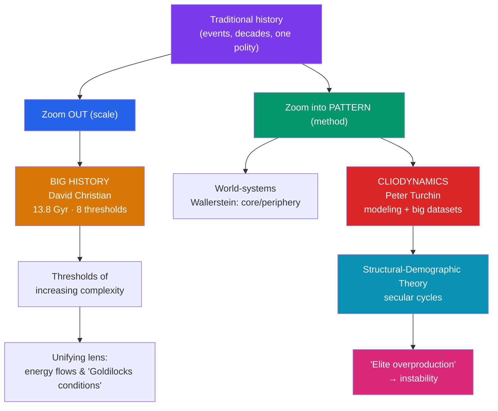

# 🌌 Big History and Cliodynamics

> [!abstract] TL;DR
> Two ambitious movements try to escape the traditional narrow frame of history. **Big History** (David Christian, *Maps of Time*, 2004) zooms *out* to the maximum scale — the Big Bang to the present — organizing 13.8 billion years around eight "**thresholds of increasing complexity**," from the first stars to modern globalization. **Cliodynamics** (Peter Turchin) zooms *in on pattern*, applying mathematical modeling and large datasets to test theories of historical dynamics — **secular cycles**, the **structural-demographic theory**, and "**elite overproduction**" as a driver of instability. Both sit in a longer tradition of quantitative history (cliometrics) and world-systems analysis (Wallerstein). Their promise is generalization and even prediction; their perils are determinism, data gaps, and the reduction of human agency to variables.

## Intuition — analogy first

Traditional history is like studying a city by walking a single street and interviewing its residents. Rich, human, specific — but you can't see the shape of the whole.

**Big History** is the view from orbit. Pull back far enough and the individual streets vanish; what you see is the *whole planet* embedded in a cosmic story — how the atoms in that street were forged in stars, how agriculture let the city exist at all. It trades intimacy for the grandest possible context.

**Cliodynamics** is the view from a weather satellite tracking storm systems. It doesn't care about any single raindrop (any one king or battle); it looks for the recurring *patterns* — the pressure fronts and cycles that make storms form again and again across centuries and continents. It asks: are there laws of political weather? Can we, like meteorologists, model and even forecast the next storm of instability?

Both give up the close-up to gain the pattern. The question this note keeps asking is: what do we lose when we stop looking at the street?

---

## How It Works — Scales and Methods of "Zoomed-Out" History

## Key Concepts

### Big History

**David Christian** launched Big History as a course at Macquarie University (1989) and codified it in **_Maps of Time: An Introduction to Big History_ (2004)**. It fuses cosmology, geology, biology, and human history into a single origin narrative from the **Big Bang (~13.8 billion years ago)** to the present, later popularized through the Bill Gates–backed **Big History Project** and Christian's *Origin Story* (2018).

Its organizing spine is a sequence of **thresholds of increasing complexity** — moments when new, more complex forms emerge under favorable "**Goldilocks conditions**." A common eight-threshold scheme:

| # | Threshold | Roughly when |
|---|-----------|--------------|
| 1 | The Big Bang / origin of the universe | ~13.8 Gya |
| 2 | Stars light up | ~13.6 Gya |
| 3 | New chemical elements forged in stars | ongoing after stars |
| 4 | Earth and the solar system form | ~4.6 Gya |
| 5 | Life on Earth | ~3.8 Gya |
| 6 | Collective learning / *Homo sapiens* | ~250–200 kya |
| 7 | Agriculture | ~11 kya |
| 8 | The modern revolution (fossil fuels, globalization) | ~250 years ago |

A key unifying concept is **collective learning** — humanity's unique ability to accumulate and transmit information across generations, which Christian treats as the engine of accelerating complexity. Energy flows through matter ("complexity" as local order sustained against entropy) provide a physics-flavored throughline.

### Deep History

Adjacent to Big History, **"deep history"** (Daniel Lord Smail, *On Deep History and the Brain*, 2008) argues historians should dissolve the artificial wall of "prehistory" and extend history seamlessly into the Paleolithic, integrating neuroscience and evolution — challenging the document-bound periodization critiqued in [[Periodization_and_Chronology]].

### World-Systems Analysis

**Immanuel Wallerstein** (*The Modern World-System*, vol. 1, 1974) analyzed history at the scale of interconnected economic systems rather than nation-states, dividing the capitalist world-economy into **core**, **semi-periphery**, and **periphery** locked in unequal exchange. It shares cliodynamics' ambition to find large-scale structure, drawing on the Annales *longue durée* (see [[What_Is_History_and_Historiography]]).

### Cliometrics — The Precursor

**Cliometrics** (the "new economic history," 1960s–70s) applied economic theory and statistics to history. **Robert Fogel** and **Douglass North** won the 1993 Nobel Memorial Prize in Economics for it; Fogel's *Time on the Cross* (1974), a quantitative study of American slavery, ignited fierce methodological controversy — a cautionary precedent for quantitative history's power *and* its blind spots.

### Cliodynamics

Coined and championed by **Peter Turchin** (*Historical Dynamics*, 2003; *War and Peace and War*, 2006; *Ages of Discord*, 2016), **cliodynamics** treats history as a system amenable to mathematical modeling and empirical hypothesis-testing, backed by large historical databases (e.g. the **Seshat: Global History Databank**).

- **Structural-Demographic Theory (SDT)** — building on Jack Goldstone's *Revolution and Rebellion in the Early Modern World* (1991), models instability as the interaction of three components: the **general population**, the **elites**, and the **state**. Instability rises when population growth outpaces resources and, critically, when elites proliferate.
- **Secular cycles** — Turchin and Sergey Nefedov (*Secular Cycles*, 2009) identify recurring centuries-long waves of integration and disintegration across agrarian societies (medieval England, France, Rome, Russia).
- **Elite overproduction** — when a society produces far more aspirants to elite status (wealth, office, credentials) than there are positions, intra-elite competition intensifies, factions form, and instability follows. Turchin notably used SDT to *forecast* rising US political instability in the 2020s (a claim published in 2010 and much debated).

### Promise vs. Perils

- **Promise:** generalization across cases; testable hypotheses; escape from parochialism; integrating history with the sciences; even limited forecasting.
- **Perils:** **determinism** (reducing agency and contingency to variables); **data quality** (pre-modern quantitative data are sparse, uneven, and reconstructed); **model dependence** (results hinge on coding choices); **spurious precision**; and the classic humanist objection that meaning, culture, and the singular event resist quantification. Skeptics note that a model retrodicting the past is not the same as predicting the future.

## Primary Sources & Examples

- **Seshat databank:** Cliodynamicists code hundreds of historical polities on standardized variables (social complexity, military technology, ritual) to statistically test hypotheses — e.g. a 2019 *PNAS* study on the relationship between "moralizing gods" and social complexity, itself the subject of vigorous methodological rebuttal (illustrating both promise and peril).
- **Ages of Discord (2016):** Turchin applied the structural-demographic model to US history, tracing wellbeing, elite dynamics, and instability from ~1780 to the present and arguing indicators pointed toward a turbulent 2020s — a concrete, falsifiable, and contested forecast.
- **Maps of Time in the classroom:** Big History's threshold framework became a global secondary-school curriculum, a rare case of a *historiographical* framework directly reshaping how history is taught at scale.

## Common Pitfalls / Misconceptions

- **Mistaking scale for explanation.** Zooming out to 13.8 billion years produces awe and context, but critics argue Big History can flatten human specifics into a smooth "complexity" story that underplays contingency, conflict, and power.
- **Prediction ≠ retrodiction.** A model tuned to fit past cycles has not thereby proven it can forecast; out-of-sample success is the real test, and history offers few clean trials.
- **Garbage-in problem.** Quantitative history is only as good as its data; coding sparse, ambiguous pre-modern evidence into clean variables can manufacture false precision (a lesson from the *Time on the Cross* debates).
- **Determinism vs. agency.** Treating "elite overproduction" or "thresholds" as laws risks erasing the role of choice, culture, and the singular event that traditional history (see [[What_Is_History_and_Historiography]]) is built to capture.

## Related Concepts

- [[_MOC_Historiography|↑ Section MOC]] — the section hub
- [[Periodization_and_Chronology]] — Big History replaces conventional period labels with cosmic-scale "thresholds," the extreme end of periodization
- [[What_Is_History_and_Historiography]] — cliodynamics and Big History are recent schools in the long argument over what history is and how we can know it
- [[Archaeology_and_Dating_Methods]] — absolute dating supplies the deep-time chronology (billions of years) that Big History's timeline depends on
- Cross-vault: [[_MOC_Mathematics_Master]] — the dynamical-systems modeling, statistics, and differential equations that underpin cliodynamics

## Review Questions

1. Explain Big History's concept of "thresholds of increasing complexity" and the role of "collective learning." How does this framework relate to — and depart from — conventional historical periodization?
2. Describe the structural-demographic theory and "elite overproduction." How does Turchin use them to explain (and attempt to forecast) political instability, and why is forecasting from such a model controversial?
3. Weigh the promise against the perils of quantitative history. Using the *Time on the Cross* or Seshat debates, explain why sophisticated modeling does not automatically resolve disputes about the past.

## Sources

- Christian, D. (2004). *Maps of Time: An Introduction to Big History*. University of California Press
- Turchin, P. (2003). *Historical Dynamics: Why States Rise and Fall*. Princeton University Press
- Turchin, P. & Nefedov, S. (2009). *Secular Cycles*. Princeton University Press
- Wallerstein, I. (1974). *The Modern World-System, Vol. I*. Academic Press

#history #historiography #methods #big-history #cliodynamics #quantitative-history
