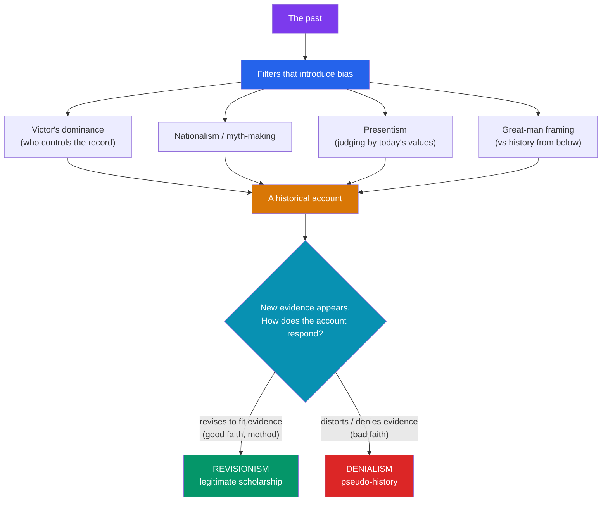

# ⚖️ Historical Bias and Revisionism

> [!abstract] TL;DR
> "History is written by the victors" captures a real truth about **whose** perspective the surviving record privileges — but it is only half the story, since defeated peoples, dissidents, and archaeology constantly return to complicate the winners' version. Bias enters through the sources, through the historian's **presentism** and nationalism, and through the choice between a **"great man"** narrative and **"history from below."** The crucial distinction is between **revisionism** — the legitimate, evidence-driven revising of accepted accounts, which is simply what historians *do* — and **denialism**, the bad-faith distortion or fabrication that mimics scholarship while violating its methods. Vigorous historiographical debate is a sign of a healthy discipline, not a scandal.

## Intuition — analogy first

Think of the past as a **crime with many witnesses**, and every history as a witness statement given from one seat in the courtroom.

Every witness has a vantage point — where they were sitting, what they could see, what they wanted to be true. The victor gives their statement first and loudest, and the court clerk (the archive) writes theirs down while the loser's is lost in the noise. That's **bias by survival**. A witness who insists the defendant is guilty because *of course people like that are guilty* is reasoning from the present backward — that's **presentism**. And a patriotic witness who edits the story to flatter the home team is doing **nationalist myth-making**.

Now the key distinction. A witness who, shown new CCTV footage, *revises* their statement is being honest — that's **revisionism**, and it's exactly what good witnesses should do. But a witness who, shown the same footage, insists the video is faked and the crime never happened is not revising — they're **denying**. Both change the story, but only one respects the evidence. Telling them apart is the whole game.

---

## How It Works — Sources of Bias and the Revision Test

## Key Concepts

### "History Is Written by the Victors" — and Its Limits

The aphorism (often attributed to Churchill, though unverified) rightly flags that power shapes what survives and gets amplified. But the claim is easily overstated:
- **Defeated voices survive** — the Carthaginians lost to Rome, yet critical modern scholarship reconstructs their side; Confederate "Lost Cause" mythology shows the *losers* successfully shaping memory for a century.
- **Archaeology bypasses the winners' pen** — material evidence (see [[Archaeology_and_Dating_Methods]]) can contradict the textual record the victors controlled.
- **Dissident and subaltern histories** deliberately recover the silenced (see [[Primary_and_Secondary_Sources]] on Trouillot's archival silences).

### Great-Man History vs. History from Below

- **"Great man" theory** — Thomas Carlyle (1840): "The history of the world is but the biography of great men." History as driven by kings, generals, geniuses.
- **History from below** — the counter-tradition foregrounding ordinary people. **E.P. Thompson** (*The Making of the English Working Class*, 1963) sought to rescue weavers and artisans "from the enormous condescension of posterity." The **Annales school** (see [[What_Is_History_and_Historiography]]) reframed history around structures and *mentalités* rather than events and elites. **Subaltern studies** recovered peasant agency in colonial South Asia.

### Presentism

**Presentism** is judging the past by the standards, categories, and knowledge of the present — assuming historical actors should have thought as we do. It flattens the strangeness of the past and produces anachronism. Its disciplined opposite is **historicism** / historical empathy: reconstructing what actions and beliefs meant *in their own context*, which is not the same as endorsing them. (The reverse error — assuming the past was totally alien and incomprehensible — is also a failure.)

### Nationalism and Myth-Making

National histories often function as **origin myths** that forge identity and legitimacy. Eric Hobsbawm and Terence Ranger's *The Invention of Tradition* (1983) showed how "ancient" national customs (Scottish clan tartans, much royal ceremonial) were often 18th–19th-century inventions. Benedict Anderson's *Imagined Communities* (1983) argued nations are imagined into being partly through shared historical narrative. State-sponsored history — textbook controversies, monument politics, "patriotic education" — is where bias becomes policy.

### Revisionism vs. Denialism

| | **Legitimate revisionism** | **Denialism / pseudo-history** |
|---|---|---|
| **Motive** | Follow the evidence | Reach a predetermined ideological conclusion |
| **Method** | Standard source criticism; peer review | Cherry-picking, quoting out of context, fabricating, ignoring corroboration |
| **Response to counter-evidence** | Updates the thesis | Explains it away or alleges conspiracy |
| **Example** | Reassessing the origins of WWI beyond sole German guilt; re-dating events with new radiocarbon data; recovering enslaved people's agency | **Holocaust denial**, which the historian Deborah Lipstadt exposed in the *Irving v. Penguin & Lipstadt* (2000) libel trial, where the court ruled David Irving had deliberately falsified the record |

**All history is revisionist** in the benign sense — each generation rewrites the past with new questions and evidence (see [[Periodization_and_Chronology]] on how even period labels get revised). The pejorative "revisionism" conflates this healthy process with denialism; keeping them distinct is essential.

### Debate as Health, Not Scandal

Historiographical controversies — the *Fischer controversy* over German responsibility for WWI, the German *Historikerstreit* (1986–87) over the uniqueness of the Holocaust, debates over the causes of the French Revolution — are how the discipline self-corrects. Disagreement grounded in shared method is the engine of historical knowledge, not evidence of its bankruptcy.

## Primary Sources & Examples

- **The Lost Cause:** After 1865, Confederate apologists (the United Daughters of the Confederacy, textbook campaigns, monument-building) recast secession as about "states' rights" rather than slavery. A textbook case of the *defeated* winning the memory war — decisively refuting the simple "victors write history" claim.
- **Irving v. Lipstadt (2000):** David Irving sued Deborah Lipstadt for calling him a Holocaust denier. Historians including Richard Evans dissected Irving's footnotes and demonstrated systematic, deliberate falsification. The verdict is a rare courtroom demarcation of scholarship from denialism — and a model of what internal source criticism can prove.
- **Invented tradition:** The "ancient" Scottish clan tartan system was substantially codified in the 19th century (partly a Victorian commercial and romantic project), yet is experienced as timeless national heritage — nationalism manufacturing a usable past.

## Common Pitfalls / Misconceptions

- **Treating "revisionism" as a slur.** Revising accepted views with new evidence is the normal, healthy work of history; conflating it with denialism disarms legitimate scholarship.
- **False balance.** "Hearing both sides" does not mean weighting a well-evidenced account equally with a fabricated one. Method, not mere existence of an opposing view, determines standing.
- **Presentism disguised as moral clarity.** Condemning past actors for not sharing modern values can substitute for understanding *why* they acted as they did — historical explanation is not moral endorsement.
- **Assuming bias means worthlessness.** Every source and historian has a vantage point; the goal is not the impossible "view from nowhere" but the disciplined management of bias through criticism and corroboration (see [[Primary_and_Secondary_Sources]]).

## Related Concepts

- [[_MOC_Historiography|↑ Section MOC]] — the section hub
- [[Primary_and_Secondary_Sources]] — internal source criticism is the concrete toolkit for detecting the biases this note surveys
- [[What_Is_History_and_Historiography]] — grounds the claim that history is interpretation, of which bias and revision are direct consequences
- [[Periodization_and_Chronology]] — even period labels ("Dark Ages," "Renaissance") are biased, revisable constructs
- Cross-vault: [[_MOC_Psychology_Master]] — the cognitive biases (confirmation bias, motivated reasoning, hindsight bias) that operate in every historian and reader

## Review Questions

1. State the aphorism "history is written by the victors" and give two concrete historical examples that complicate or refute it.
2. Draw the sharpest distinction you can between legitimate historical revisionism and denialism, using motive, method, and response to counter-evidence. Reference the Irving v. Lipstadt case.
3. What is presentism, and how does the disciplined practice of historical empathy differ from morally endorsing the actions of past actors?

## Sources

- Evans, R.J. (1997). *In Defence of History*. Granta
- Lipstadt, D. (1993). *Denying the Holocaust: The Growing Assault on Truth and Memory*. Free Press
- Hobsbawm, E. & Ranger, T. (eds.) (1983). *The Invention of Tradition*. Cambridge University Press
- Thompson, E.P. (1963). *The Making of the English Working Class*. Victor Gollancz

#history #historiography #methods #bias #revisionism #history-from-below
