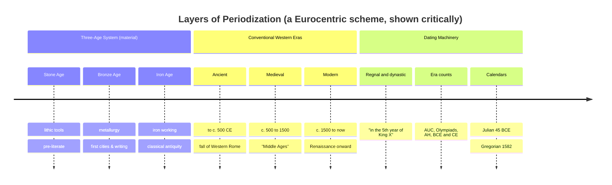

# ⏳ Periodization and Chronology

> [!abstract] TL;DR
> **Chronology** is the sequencing of events in time; **periodization** is the carving of that continuous flow into named blocks — "the Bronze Age," "the Middle Ages," "the Renaissance." These labels are indispensable tools of thought but also **constructed, retrospective, and value-laden**: no medieval person knew they lived in the "Middle" of anything, and terms like "Dark Ages" smuggle in judgments. Periodization schemes are usually **Eurocentric** and travel poorly to other regions. Underlying all of it are the mechanics of **calendars** (Julian, Gregorian), **era systems** (BC/AD, the neutral BCE/CE, regnal and dynastic dating), and the fact that our very year-numbering was invented by a 6th-century monk who miscalculated.

## Intuition — analogy first

Think of periodization as **dividing a river into named stretches**.

A river flows continuously from source to sea — there are no actual lines across the water. But to navigate, map, and talk about it, we impose divisions: "the upper rapids," "the middle valley," "the delta." These names are genuinely useful. Yet notice what they hide: the boundaries are fuzzy (exactly *where* do the rapids end?), they reflect the mapmaker's priorities (a kayaker and a fisherman name different stretches), and some names carry judgments ("the treacherous narrows"). The river doesn't care about your names.

History is that river. "The Middle Ages" is a stretch someone drew a line around — after the fact, from a particular vantage point, for particular reasons. The line is a tool, not a fact of the water. The moment you forget that periods are drawn by mapmakers and mistake them for natural features, you start believing the river actually changes character exactly at 476 CE.

---

## How It Works — Layers of Time-Slicing

## Key Concepts

### The Three-Age System

Devised by Danish antiquarian **Christian Jürgensen Thomsen** (c. 1820, to organize the Copenhagen museum's collection), the **Stone → Bronze → Iron** sequence classifies prehistory by dominant tool material. It was the first great archaeological periodization and remains foundational (see [[Archaeology_and_Dating_Methods]]). Its limits are obvious once stated: the transitions are gradual, occurred at wildly different dates in different regions (the Iron Age reaches sub-Saharan Africa without a preceding Bronze Age in many areas), and "material of tools" is only one axis of change.

### The Ancient / Medieval / Modern Triad

The tripartite scheme is itself a historical artifact. Renaissance humanists (notably **Petrarch**, 14th c.) coined the idea of a benighted "middle" age (*media aetas*) separating their own revival from admired classical antiquity — a piece of Renaissance self-congratulation, not a neutral description. The scheme was systematized by **Christoph Cellarius** (Christoph Keller) in the late 17th century into Ancient / Medieval / Modern.

| Loaded label | Coined by / when | Hidden judgment |
|--------------|------------------|-----------------|
| **"Middle Ages"** | Renaissance humanists (Petrarch onward) | A worthless gap between two golden ages |
| **"Dark Ages"** | Petrarch (of post-Roman Europe); later narrowed to c. 500–1000 | Ignorance, decline, absence of records — now largely rejected by scholars |
| **"Renaissance"** | Popularized by Jules Michelet (1855) & Jacob Burckhardt (1860) | A sudden "rebirth," downplaying medieval continuities |
| **"Byzantine"** | Coined 1557 (Hieronymus Wolf), long after the empire | Framed the Eastern Roman Empire as a decadent other |

### Calendars and Their Reforms

- **Julian calendar** — introduced by Julius Caesar in **45 BCE**; a 365.25-day year with a leap day every 4 years. Slightly too long (by ~11 minutes/year), so it drifted ~1 day per 128 years against the solar year.
- **Gregorian calendar** — reform under **Pope Gregory XIII in 1582**: October 4 was followed directly by October 15 (deleting 10 accumulated days), and century years not divisible by 400 lost their leap day. Catholic states adopted it immediately; Britain and its colonies waited until **1752**; Russia only after the 1917 revolution — which is why the "October Revolution" happened in November by the Gregorian calendar.

### Era Systems and Year-Numbering

- **AD/BC** — *Anno Domini* ("in the year of the Lord") and "Before Christ." The AD count was devised by the monk **Dionysius Exiguus in 525 CE** to calculate Easter; he placed year 1 at Christ's presumed birth — and almost certainly got it wrong by several years (Herod the Great, in the Nativity narrative, died c. 4 BCE). **There is no year zero**: 1 BC is followed directly by AD 1, a source of endless off-by-one errors.
- **BCE/CE** — "Before Common Era" / "Common Era": the same numbers, religiously neutral labels, now standard in scholarship.
- **Other era counts:** the Roman *ab urbe condita* (AUC, from the city's founding), Greek **Olympiads**, the Islamic **Hijri** calendar (AH, lunar, from 622 CE), and countless others — reminders that BCE/CE is one convention among many.
- **Regnal and dynastic dating** — "in the fifth year of the reign of King X," or by dynasty (Ming, Tang). Ubiquitous before standardized eras and central to reading ancient documents; requires a **king-list** to convert into an absolute chronology.

### Absolute vs. Relative Chronology

**Relative** chronology orders events (A before B) without fixed dates; **absolute** chronology attaches calendar years. Linking a relative sequence (e.g. a stratigraphic layering, or a regnal sequence) to an absolute date requires an **anchor** — a datable astronomical event, a dendrochronological match, or a radiocarbon result (see [[Archaeology_and_Dating_Methods]]).

## Primary Sources & Examples

- **The lost eleven days:** When Britain adopted the Gregorian calendar in September 1752, Wednesday 2 September was followed by Thursday 14 September. The popular story of "give us back our eleven days" riots is likely exaggerated, but the tax year still bends around it — the UK fiscal year begins 6 April partly as a fossil of this adjustment.
- **The non-existent year zero:** Historians debated whether the third millennium began on 1 January 2000 or 2001; because there was no year zero, the year 2000 was strictly the *last* year of the second millennium.
- **Regnal dating in practice:** Egyptian chronology is built by chaining pharaohs' regnal years from king-lists (e.g. the Turin Canon) and cross-checking against astronomical records like Sothic (Sirius) risings — a vivid case of converting relative regnal counts into absolute dates.

## Common Pitfalls / Misconceptions

- **Reifying periods.** Treating "the Middle Ages" as a real thing with a start switch at 476 CE, rather than a retrospective label with fuzzy, contested boundaries.
- **Eurocentrism.** Applying ancient/medieval/modern or "Renaissance" to China, the Islamic world, or the Americas distorts more than it illuminates — those regions have their own periodizations.
- **The year-zero / off-by-one trap.** Forgetting there is no year 0, so the span from 1 BCE to 1 CE is *one* year, not two, and centuries/millennia turn over on the "01" year.
- **Assuming calendars were universal.** Dates before 1582 (or 1752 for Britain) may be "Old Style" (Julian); comparing events across calendar systems without converting produces spurious mismatches.

## Related Concepts

- [[_MOC_Historiography|↑ Section MOC]] — the section hub
- [[What_Is_History_and_Historiography]] — periodization is one of the key interpretive choices historians make when constructing an account
- [[Archaeology_and_Dating_Methods]] — supplies the absolute anchors (radiocarbon, dendrochronology) that convert relative chronology into calendar dates
- [[Big_History_and_Cliodynamics]] — pushes periodization to cosmic scale (Christian's "thresholds"), the opposite extreme from regnal dating
- Cross-vault: [[_MOC_Prehistory]] — where the three-age system does its primary work

## Review Questions

1. Explain why calling something the "Dark Ages" or the "Renaissance" is an interpretive act rather than a neutral description. Who coined each term, and what judgment does it encode?
2. Walk through why the Russian "October Revolution" is commemorated in November, connecting your answer to the Julian–Gregorian calendar difference and adoption dates.
3. What is the difference between relative and absolute chronology, and what kind of "anchor" is needed to convert a sequence of regnal years into calendar dates?

## Sources

- Le Goff, J. (2014). *Must We Divide History Into Periods?* Columbia University Press
- Richards, E.G. (1998). *Mapping Time: The Calendar and Its History*. Oxford University Press
- Burckhardt, J. (1860). *The Civilization of the Renaissance in Italy*
- Trigger, B. (2006). *A History of Archaeological Thought* (2nd ed.), on the three-age system

#history #historiography #methods #periodization #chronology #calendars
