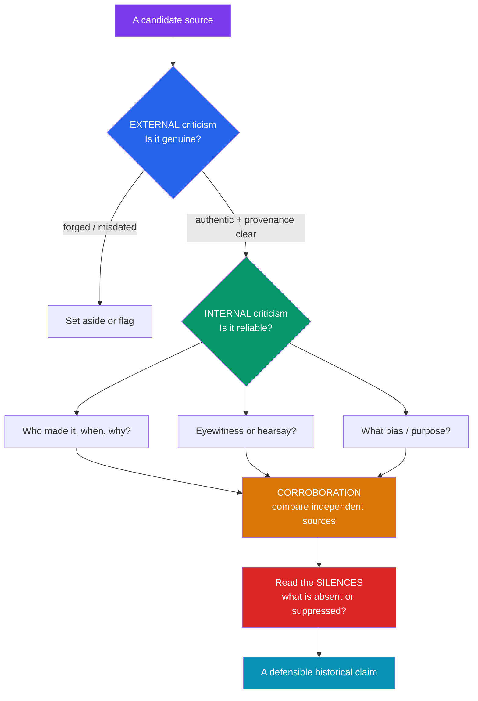

# 🗂️ Primary and Secondary Sources

> [!abstract] TL;DR
> Historical evidence is classified by its distance from the events it describes: **primary sources** are direct traces from the period (charters, letters, artifacts, eyewitness accounts); **secondary sources** interpret them after the fact (a modern biography); **tertiary sources** compile and summarize (encyclopedias). The historian's core craft is **source criticism** — testing a source's authenticity and provenance (**external criticism**) and its reliability and bias (**internal criticism**). Truth is built by **corroboration** across independent sources, but the historian must also read the **silences** of the archive: what was never recorded, or was deliberately destroyed, distorts the record as much as what survives.

## Intuition — analogy first

Think of a historian as a **detective** at a cold-case crime scene decades later.

The detective never witnessed the crime, so everything runs through evidence. A bloodstained knife found at the scene is a **primary source** — a direct physical trace. The forensic report written last week analyzing that knife is a **secondary source** — an expert interpretation. A true-crime encyclopedia summarizing the case is a **tertiary source**.

But a good detective doesn't just collect evidence — they interrogate it. *Is this knife genuine or planted?* (external criticism: authenticity and provenance). *The one eyewitness — was she drunk, biased against the accused, or standing too far away?* (internal criticism: reliability and bias). No single witness is trusted alone; the detective looks for **corroboration** from independent sources. And crucially, the sharpest detectives notice **what's missing** — the security tape that was conveniently erased, the witness nobody interviewed. The archive's silences are clues too.

---

## How It Works — The Source Criticism Pipeline

## Key Concepts

### The Source Typology

| Type | Definition | Examples | Key caution |
|------|------------|----------|-------------|
| **Primary** | Direct trace produced during the period, by a participant/witness | Charters, letters, diaries, treaties, coins, pottery, photographs, census returns, an oral testimony | "Primary" ≠ "true" or "unbiased" — a propaganda poster is a primary source *for propaganda* |
| **Secondary** | Later interpretation/analysis of primary sources | A modern monograph, a scholarly biography, a journal article | Carries the interpreter's argument and era's assumptions |
| **Tertiary** | Compilation/summary of secondary work | Encyclopedias, textbooks, bibliographies, reference dictionaries | Useful for orientation, weak as evidence |

**The category is relational, not fixed.** Gibbon's *Decline and Fall of the Roman Empire* (1776) is a *secondary* source on Rome but a *primary* source for 18th-century Enlightenment thought. A source's type depends on the question you are asking of it.

### External Criticism — *Is it what it claims to be?*

Tests **authenticity and provenance**: date, author, place of origin, chain of custody. Techniques include paleography (handwriting), diplomatics (document form and formulae), philology, and material analysis.

- **Classic triumph:** Lorenzo Valla in 1440 used philological analysis — anachronistic Latin vocabulary that did not exist in the 4th century — to prove the **Donation of Constantine** a medieval forgery, demolishing a document the papacy had used to claim temporal power.

### Internal Criticism — *Can I trust what it says?*

Tests **reliability, competence, and bias**. Ask:
- **Proximity:** eyewitness, or secondhand report? How soon after the event?
- **Competence:** was the author positioned to know?
- **Purpose and audience:** who was it written *for*, and to persuade of what?
- **Bias:** what interests shaped the account? (See [[Historical_Bias_and_Revisionism]].)

### Corroboration and Triangulation

No single source is decisive. **Corroboration** confirms a claim by finding it in *independent* sources — independent meaning not copied from one another. **Triangulation** combines different *kinds* of evidence (a textual charter + archaeological remains + numismatic finds) so their weaknesses don't overlap. When independent sources of different types converge, confidence rises sharply.

### The Silences of the Archive

Michel-Rolph Trouillot, in *Silencing the Past* (1995), argued that silences enter the historical record at four moments: **fact creation** (what gets recorded), **fact assembly** (what enters archives), **fact retrieval** (what historians find), and **retrospective significance** (what gets called important). The Haitian Revolution, he showed, was rendered "unthinkable" and written out. The archive is not a neutral deposit; it encodes the power of those who created and preserved it. **What is absent is evidence too.**

### Material, Textual, and Oral Sources

- **Textual** — writing of every kind; dominant but biased toward the literate elite.
- **Material** — objects, buildings, landscapes, bones (see [[Archaeology_and_Dating_Methods]]); indispensable for pre-literate and non-elite pasts.
- **Oral** — living memory and transmitted tradition; recovers the voices of communities that left no writing, though shaped by the fallibility and reshaping of memory.

## Primary Sources & Examples — A Worked Comparison: Chronicle vs. Charter

Suppose you are dating a 12th-century land grant.

- A **monastic chronicle** narrates: engaging, but written years later, by an author with a house agenda, prone to inflating the monastery's rights and to copying earlier chronicles (so apparent "corroboration" may be plagiarism, not independence).
- A **charter** (the legal grant itself) is contemporaneous, formulaic, and datable by its diplomatic form and witness list — but formulaic language can mask what really happened, and charters were among the most frequently *forged* medieval documents (monasteries fabricated them to defend property claims).

**Method:** apply external criticism to the charter (does its diplomatic form, seal, and script match its claimed date?); apply internal criticism to the chronicle (what is the author's interest?); then **corroborate** — does the charter's witness list match people known from *other, independent* records to have been alive and present? Convergence of an authenticated charter with independent witness evidence yields a defensible date; the chronicle alone would not.

## Common Pitfalls / Misconceptions

- **"Primary source = reliable / true."** Primary sources are *closer*, not *truer*. A forged charter or a lying diarist is still primary. Proximity and reliability are different axes.
- **Mistaking copying for corroboration.** Two medieval chronicles agreeing may simply share a common source — not independent confirmation. Corroboration requires **independence**.
- **Ignoring the silences.** Treating the surviving archive as the whole past over-represents the literate and powerful and erases the enslaved, the poor, and the colonized.
- **Presentism in reading sources.** Judging a source's terms and categories by today's standards, rather than reconstructing what the words meant to their author. (See [[Historical_Bias_and_Revisionism]].)

## Related Concepts

- [[_MOC_Historiography|↑ Section MOC]] — the section hub
- [[What_Is_History_and_Historiography]] — sources are the raw material from which the constructed account of "history" is built
- [[Archaeology_and_Dating_Methods]] — how material sources are recovered and dated when texts are absent or must be checked
- [[Historical_Bias_and_Revisionism]] — internal criticism is the disciplined detection of the bias this note treats as a variable to test
- Cross-vault: [[_MOC_Psychology_Master]] — memory distortion, which bears directly on the reliability of eyewitness and oral testimony

## Review Questions

1. Explain why "primary source" and "reliable source" are independent qualities, using the example of a forged charter or a propaganda poster.
2. Distinguish external from internal criticism, and describe how Lorenzo Valla used one of them to expose the Donation of Constantine.
3. What did Trouillot mean by the "silences" of the archive, and why does this mean that reading only surviving sources can systematically distort our picture of the past?

## Sources

- Bloch, M. (1949). *The Historian's Craft*, esp. ch. on historical criticism
- Trouillot, M-R. (1995). *Silencing the Past: Power and the Production of History*. Beacon Press
- Howell, M. & Prevenier, W. (2001). *From Reliable Sources: An Introduction to Historical Methods*. Cornell University Press
- Tosh, J. (2015). *The Pursuit of History* (6th ed.), ch. on sources and criticism

#history #historiography #methods #sources #source-criticism
