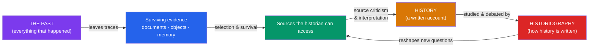

# 📜 What Is History and Historiography

> [!abstract] TL;DR
> **The past** is everything that ever happened; **history** is the disciplined, always-partial account we construct of a tiny selected fraction of it. **Historiography** is the study of how that history is written — its methods, assumptions, and schools. History is never a neutral chronicle but an interpretation shaped by the questions asked, the sources that survive, and the historian's own vantage point. From Herodotus and Thucydides through Ranke's document-based empiricism to the Annales school, Marxist history, the postmodern "linguistic turn," microhistory, and subaltern studies, historians have argued endlessly not just about *what* happened but about how we can know it at all.

## Intuition — analogy first

Think of history as a **map**, and the past as the **territory**.

A map is not the territory. A useful map of London is not a 1:1 replica of London — that would be as big and as useless as London itself. A map is valuable *precisely because* it selects: it keeps roads and rivers, drops individual pebbles and pigeons, exaggerates road widths so you can see them, and chooses a projection that inevitably distorts something. Two mapmakers with different purposes — a cyclist's map, a geologist's map, a tourist's map — will draw the same city utterly differently, and none of them is "wrong."

History works the same way. The past — every breath, every harvest, every forgotten quarrel of the fourteenth century — is the vast, unrecoverable territory. The historian draws a map of it: selecting what matters, imposing scale (a chapter on one battle, a sentence on a century), and choosing a projection (economic, political, cultural). **Historiography** is the study of *mapmaking itself* — why the cartographers made the choices they did, what their projections distort, and how the maps of one generation get redrawn by the next.

---

## How It Works — From Past to Written History

## Key Concepts

### The Past vs. History

- **The past** is gone and total: it cannot be observed, only inferred. Most of it left no trace and is permanently unrecoverable.
- **History** (from Greek *historia*, "inquiry") is the *account* — a text, argument, or narrative produced by a historian in the present, addressed to present concerns.
- Because history is inquiry and selection, **two honest historians can write incompatible accounts of the same events** without either lying. This is not a flaw; it is the nature of interpretation.
- E.H. Carr's famous formulation: history is "a continuous process of interaction between the historian and his facts, an unending dialogue between the present and the past."

### Chronicle vs. History

A **chronicle** merely lists events in order ("In 1066, William conquered England"). **History** explains, contextualizes, and argues — it asks *why*, weighs causes, and builds an interpretation. A telephone directory is not a history of a city.

### The Founders: Herodotus and Thucydides

| Historian | Dates (approx.) | Contribution | Style |
|-----------|-----------------|--------------|-------|
| **Herodotus** | c. 484–425 BCE | *The Histories* (Greco-Persian Wars); called "Father of History" | Digressive, ethnographic, includes myth and hearsay ("some say...") |
| **Thucydides** | c. 460–400 BCE | *History of the Peloponnesian War* | Critical, source-skeptical, focused on political/military causation; "Father of scientific history" |

Thucydides explicitly rejected charming stories in favor of what he could verify — the first articulation of source criticism.

### Major Schools of Historiography

- **Rankean empiricism** — Leopold von Ranke (1795–1886) professionalized history in 19th-century Germany, insisting the historian show the past **"wie es eigentlich gewesen"** ("as it actually was"), grounded in rigorous archival criticism of primary documents. He founded the research seminar and document-based method.
- **The Annales school** (France, from 1929, journal founded by **Marc Bloch** and **Lucien Febvre**) — rejected event-driven political history (*histoire événementielle*) for deep structures. **Fernand Braudel** distinguished three timescales: the near-motionless *longue durée* (geography, climate), medium-term social/economic *conjonctures*, and the fast froth of events. Later Annalistes studied **mentalités** — the collective mental worlds of ordinary people.
- **Marxist history** — history driven by material forces and class struggle (modes of production, base and superstructure). British Marxist historians **E.P. Thompson** (*The Making of the English Working Class*, 1963), Eric Hobsbawm, and Christopher Hill pioneered **"history from below."**
- **The postmodern / linguistic turn** — **Hayden White** (*Metahistory*, 1973) argued that historical narratives are literary artifacts "emplotted" like fiction (as tragedy, comedy, romance, satire), destabilizing the claim that history simply mirrors the past.
- **Microhistory** — intensely narrow studies revealing large worlds through small ones: Carlo Ginzburg's *The Cheese and the Worms* (1976, the miller Menocchio), Natalie Zemon Davis's *The Return of Martin Guerre* (1983).
- **Subaltern studies** — a South Asian collective (Ranajit Guha, and Gayatri Spivak's essay "Can the Subaltern Speak?") recovering the agency of peasants and the colonized left out of elite and nationalist narratives.
- **Oral history** — systematic recording of living memory (pioneered post-WWII, e.g. by Studs Terkel and Alessandro Portelli), giving voice to those who left no documents.

## Primary Sources & Examples

- **Same battle, two maps:** A traditional political history of the 16th century foregrounds kings, treaties, and dates. A Braudelian history of the *same* period foregrounds Mediterranean grain prices, shipping routes, and climate — Philip II barely appears. Neither is false; they map different territory.
- **Menocchio the miller:** Ginzburg used Inquisition trial records (sources produced to *condemn* a heretic) to reconstruct the cosmology of an ordinary 16th-century peasant — reading a hostile source "against the grain" to recover a voice the record meant to silence.
- **Thucydides' speeches:** He admits he reconstructed speeches according to "what was called for" while keeping close to the general sense — an ancient historian openly flagging his own method and its limits.

## Common Pitfalls / Misconceptions

- **"History is just the facts."** Facts don't select or arrange themselves; every history is an argument about which facts matter and why. As Carr warned, worship of "facts" hides the historian's choices.
- **"History is objective / History is pure opinion."** Both extremes are wrong. History is disciplined interpretation: constrained by evidence and method, yet never a neutral mirror. Rejecting naïve objectivity is not the same as saying "anything goes."
- **Confusing history with the past.** The past is fixed; history is continually rewritten as new questions, sources, and methods emerge — hence the endless value of historiography.
- **Assuming the surviving record is representative.** What survives is skewed toward the literate, powerful, and durable; vast swaths of human experience left no trace.

## Related Concepts

- [[_MOC_Historiography|↑ Section MOC]] — the hub for this section's methods toolkit
- [[Primary_and_Secondary_Sources]] — how historians turn surviving traces into evidence, the raw material of any history
- [[Historical_Bias_and_Revisionism]] — why accounts differ and how legitimate reinterpretation works, extending the "history as interpretation" theme
- [[Periodization_and_Chronology]] — the constructed frames (ages, eras) historians impose when writing history
- Cross-vault: [[_MOC_Psychology_Master]] — the cognitive biases that shape how historians (and everyone) interpret evidence

## Review Questions

1. Explain the difference between "the past" and "history," and use it to argue why two honest historians can produce incompatible accounts of the same event without either being dishonest.
2. Contrast Rankean empiricism with the Annales school's *longue durée*. What does each treat as the proper subject of history, and what does each risk overlooking?
3. What did Hayden White mean by "emplotment," and how does the linguistic turn challenge the Rankean promise to show the past "as it actually was"?

## Sources

- Carr, E.H. (1961). *What Is History?* Cambridge University Press
- Bloch, M. (1949, posthumous). *The Historian's Craft* (*Apologie pour l'histoire*)
- Braudel, F. (1949). *The Mediterranean and the Mediterranean World in the Age of Philip II*
- Tosh, J. (2015). *The Pursuit of History* (6th ed.). Routledge

#history #historiography #methods #schools-of-history
