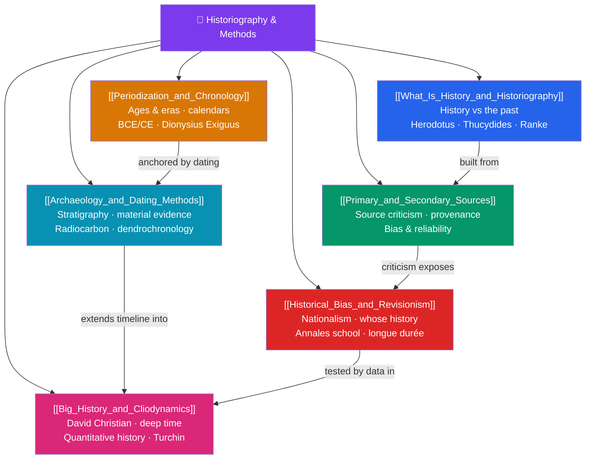

# 🗺️ Historiography & Methods — Map of Content

> [!abstract] What This Section Covers
> Before studying any period, a historian needs a toolkit for turning the messy residue of the past into disciplined knowledge. This section opens with **what history and historiography actually are** (the difference between the past itself and the always-provisional accounts we write of it, from Herodotus to Ranke's "wie es eigentlich gewesen"), then examines **primary and secondary sources** and the source criticism that tests provenance and bias. It covers **periodization and chronology** (why we carve time into ages, and the trouble with BCE/CE and Eurocentric "Middle Ages"), the politics of **historical bias and revisionism** (nationalist myth-making, the Annales school's *longue durée*), the physical evidence recovered through **archaeology and dating methods** (stratigraphy, radiocarbon, dendrochronology), and finally the sweeping quantitative frontiers of **Big History and cliodynamics**. Together they answer a prior question: how do we know what we claim to know?

## Concept Map

## Learning Path

1. [[What_Is_History_and_Historiography]] — What history is as a discipline, the distinction between the past and its written accounts, and the major schools from ancient chroniclers to modern professional history.
2. [[Primary_and_Secondary_Sources]] — Classifying evidence, evaluating provenance and authorial bias, and the craft of source criticism.
3. [[Periodization_and_Chronology]] — How historians divide time into ages and eras, the mechanics of calendars and dating systems, and why periodization is always a contested choice.
4. [[Historical_Bias_and_Revisionism]] — Whose stories get told, how nationalism shapes narrative, and how the Annales school reframed history around structures and everyday life.
5. [[Archaeology_and_Dating_Methods]] — Stratigraphy, radiocarbon and tree-ring dating, and how material culture supplements or corrects the written record.
6. [[Big_History_and_Cliodynamics]] — David Christian's cosmic-scale "Big History" and Peter Turchin's data-driven cliodynamics as attempts to find pattern across vast spans of time.

## All Notes at a Glance

| Note | Difficulty | What You'll Learn |
|------|------------|-------------------|
| [[What_Is_History_and_Historiography]] | Beginner | History vs the past, historiography, Herodotus/Thucydides, Rankean empiricism, schools of thought |
| [[Primary_and_Secondary_Sources]] | Beginner → Intermediate | Source typologies, provenance, internal/external criticism, bias detection, corroboration |
| [[Periodization_and_Chronology]] | Beginner → Intermediate | Ages/eras, BCE/CE vs BC/AD, calendar systems, the constructed nature of period boundaries |
| [[Historical_Bias_and_Revisionism]] | Intermediate | Nationalist historiography, revisionism vs denialism, Annales school, subaltern and social history |
| [[Archaeology_and_Dating_Methods]] | Intermediate | Stratigraphy, radiocarbon dating (Libby), dendrochronology, seriation, material evidence |
| [[Big_History_and_Cliodynamics]] | Intermediate → Advanced | Big History thresholds, quantitative and cliometric history, Turchin's structural-demographic theory |

## Key Questions This Section Answers

- What is the difference between "the past" and "history," and why can two honest historians write incompatible accounts of the same events?
- How do you decide whether a source is trustworthy, and what does "source criticism" actually involve?
- Why is every scheme of periodization — ancient/medieval/modern, BCE/CE — a debatable choice rather than a natural fact?
- How can dating methods like radiocarbon and dendrochronology give absolute ages to objects with no written record?
- Can history be made quantitative and predictive, as Big History and cliodynamics attempt?

## Related Sections

- [[_MOC_History_Master|↑ History Master MOC]]
- [[_MOC_Prehistory|→ Prehistory & Human Origins]]

#MOC #History #Historiography
