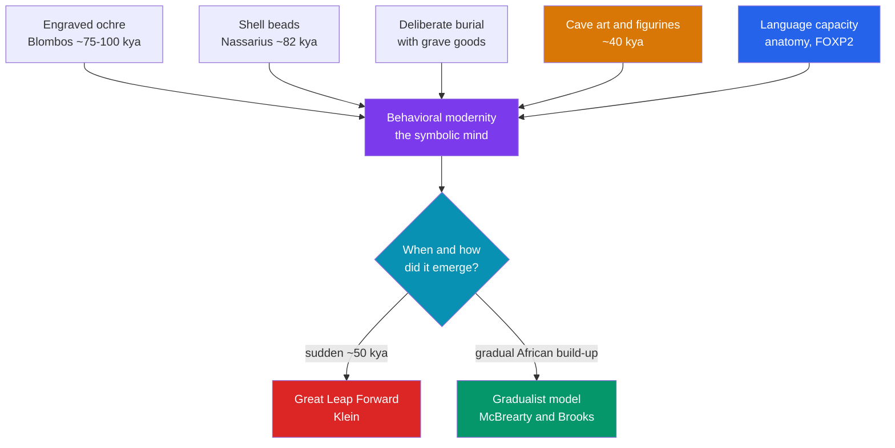

# 🗣️ Early Language and Culture

> [!abstract] TL;DR
> Some time in the last few hundred thousand years, hominins crossed a threshold into **symbolic thought** — the capacity to let one thing *stand for* another, which underlies language, art, ritual, and religion. Archaeologists call the resulting package **behavioral modernity**, evidenced by **pigment use (ochre), personal ornaments (beads), figurative art, and deliberate burial**. The genetics of language are often reduced to the gene **FOXP2**, but this is a caution-worthy oversimplification: FOXP2 affects speech and is shared with Neanderthals, so it is at most one small part of a complex story. Scholars divide over timing: the **"Great Leap Forward"** camp sees a sudden cognitive revolution ~50,000 years ago, while **gradualists** point to a slow African build-up over 200,000+ years. Studying these intangibles is the domain of **cognitive archaeology** — reconstructing ancient minds from the durable traces they left behind.

## Intuition — analogy first

The hardest thing about early humans to dig up is the one thing that most makes them human: **what was happening inside their heads**. Bones and stones survive; thoughts do not. So archaeologists work like **detectives reading a crime scene** — they cannot see the act, only the clues it left, and from those clues they infer the mind that must have been present.

A lump of red **ochre**, ground and carried far from its source, is not food or a tool — so *why* carry it? A pierced sea **shell** worn as a bead says nothing about survival but everything about **signaling identity** to others. A **grave** dug with care and stocked with goods implies beliefs about death and perhaps an afterlife. Each clue, on its own, might be explained away. But when ochre, beads, art, and burial **cluster together**, the detective concludes that a **symbolic mind** — one that traffics in meanings, not just objects — was at work. Language is the clue that rots away entirely, so it must be inferred most cautiously of all, from anatomy, genes, and the symbolic behavior it would have made possible.

---

## How It Works — Reading the Symbolic Mind from Its Traces

## Key Concepts

### Symbolic Thought and Behavioral Modernity

**Behavioral modernity** is the suite of behaviors thought to reflect fully modern cognition — as opposed to merely modern *anatomy*. Commonly listed traits include **abstract and symbolic thinking, planning depth, use of pigment, personal ornamentation, figurative art, complex/composite tools, use of exotic (long-distance) materials, and ritual**. The unifying thread is **symbolism**: the capacity to make and share representations whose meaning is assigned by convention rather than inherent in the object.

### FOXP2 — Handle With Care

The gene **FOXP2** entered popular imagination as "the language gene" after study of the **"KE family,"** many of whose members carry a FOXP2 mutation causing a heritable **speech and language disorder** (affecting fine oral-motor control and grammar). But three cautions matter:
1. FOXP2 is a **regulatory gene** active in many tissues (not just brain), and its disruption impairs speech mechanics broadly, not a dedicated "grammar module."
2. **Neanderthals shared the same two key amino-acid changes** in FOXP2 as modern humans, so it cannot be what uniquely separates us.
3. Later genomic work has **questioned the claim of a recent, strong selective sweep** on FOXP2 in *sapiens*.

FOXP2 is therefore best understood as **one contributing piece** of the biological substrate for speech, not a switch that turned language on.

### The Great Leap Forward vs. Gradualism

| | **"Great Leap Forward"** | **Gradualist / African continuity** |
|---|---|---|
| Core claim | A relatively **sudden** cognitive/cultural revolution ~50 kya (perhaps a neural or genetic change) | Modern behavior **accrued slowly** in Africa over 200,000+ years |
| Key evidence emphasized | The dramatic Upper Paleolithic record of **Europe** (cave art, blades, ornaments) | Early African symbolism: **Blombos ochre and beads (~75–100 kya)**, pigments, microliths |
| Chief proponents | Richard Klein; popularized by Jared Diamond | **Sally McBrearty & Alison Brooks** ("The revolution that wasn't," 2000) |
| Weakness | Eurocentric; ignores older African evidence | Must explain why symbolic traces appear intermittently, not all at once |

The trend in recent scholarship favors the **gradualist** view, as ever-older African finds erode the case for a single late "switch."

### Ochre, Beads, and Blombos Cave

**Blombos Cave**, South Africa (excavated by **Christopher Henshilwood**), is the flagship of early symbolism: **engraved ochre plaques with deliberate cross-hatched designs (~75,000–100,000 years old)**, a ~100,000-year-old **ochre-processing "paint workshop"** using abalone shells, perforated **Nassarius shell beads**, and a ~73,000-year-old **cross-hatch drawing on silcrete** — arguably the oldest known drawing. Comparable early **shell beads** appear at **Grotte des Pigeons (Taforalt), Morocco (~82,000 years old)**. These African finds are central to the gradualist case.

### Deliberate Burial and the Archaeology of the Mind

Intentional **burial** implies concern for the dead and possibly belief about what follows death. **Neanderthals** buried individuals at **Shanidar (Iraq)** and **La Chapelle-aux-Saints (France)**; *sapiens* buried the richly bead-adorned dead at **Sungir (Russia, ~34,000 years ago)**. Interpreting such acts is the work of **cognitive archaeology** (e.g., **Steven Mithen**, *The Prehistory of the Mind*, 1996; **Colin Renfrew**), which asks what mental capacities a given behavior presupposes — while guarding against reading modern meanings into ambiguous evidence.

## Primary Sources & Examples

- **The Blombos engraved ochre:** a palm-sized block scored with a regular geometric pattern ~75,000 years ago — meaningless as a tool, it is widely read as **deliberate abstract mark-making**, evidence of symbolic intent long before European cave art.
- **The KE family studies (1990s–2000s):** clinical and genetic work linking a FOXP2 mutation to an inherited speech/language deficit — the empirical basis, and cautionary limit, for all "language gene" claims.
- **Shanidar Cave Neanderthal burials:** including the debated "flower burial," these finds fueled the argument that symbolic mortuary behavior was not unique to *Homo sapiens*.

## Common Pitfalls / Misconceptions

- **"FOXP2 is the language gene."** It is one of many genes affecting speech; it is shared with Neanderthals and does not by itself explain human language.
- **"Symbolic behavior began suddenly in Ice Age Europe."** Older African evidence (Blombos, Taforalt) shows symbolism was building for tens of thousands of years before the European "explosion."
- **"Anatomically modern equals behaviorally modern."** *Sapiens* looked modern by ~300 kya but the full symbolic behavioral package appears in the record later and unevenly.
- **"We can read ancient beliefs directly from artifacts."** Inference about ancient minds is probabilistic and easily contaminated by **projecting present-day meanings**; cognitive archaeology stresses disciplined caution.

## Related Concepts

- [[_MOC_Prehistory|↑ Section MOC]] — the section hub
- [[Human_Evolution_and_Migration]] — the brain expansion and speciation events that set the stage for symbolic cognition
- [[The_Paleolithic_Era]] — the Upper Paleolithic art and burials that are this note's most vivid evidence
- [[The_Neolithic_Revolution]] — shared symbolic and cooperative capacities that later enabled communal ritual and monuments
- Cross-vault: [[_MOC_NLP_Master]] — the formal study of language and meaning, whose evolutionary origins this note traces

## Review Questions

1. List four archaeological signatures of "behavioral modernity" and explain why each is taken as evidence of symbolic cognition rather than mere survival behavior.
2. Explain three reasons why calling FOXP2 "the language gene" is an oversimplification.
3. Contrast the "Great Leap Forward" and gradualist models of the origin of modern behavior, and identify the African evidence that has shifted opinion toward gradualism.

## Sources

- McBrearty, S. & Brooks, A.S. (2000). "The revolution that wasn't: a new interpretation of the origin of modern human behavior." *Journal of Human Evolution* 39
- Henshilwood, C.S. et al. (2011). "A 100,000-Year-Old Ochre-Processing Workshop at Blombos Cave, South Africa." *Science* 334
- Mithen, S. (1996). *The Prehistory of the Mind: The Cognitive Origins of Art, Religion and Science*. Thames & Hudson
- Enard, W. et al. (2002). "Molecular evolution of FOXP2, a gene involved in speech and language." *Nature* 418

#history #prehistory #language-origins #symbolism #behavioral-modernity #cognitive-archaeology
