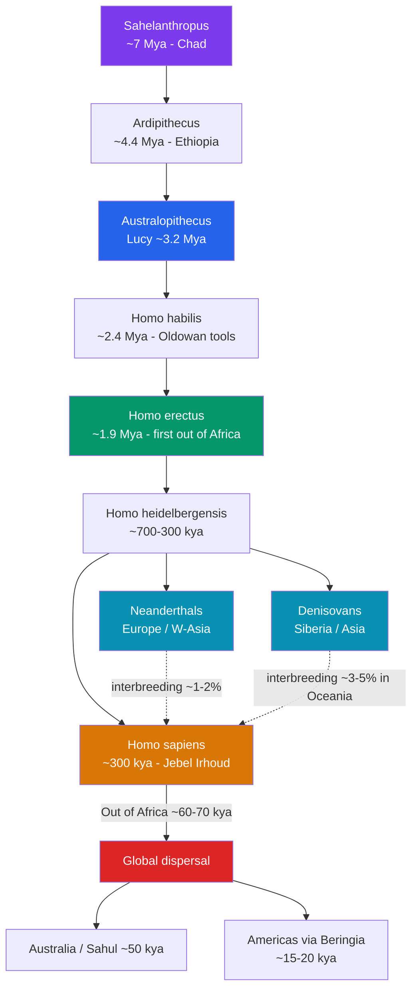

# 🧬 Human Evolution and Migration

> [!abstract] TL;DR
> Humans belong to a bushy family tree of **hominins** that split from other African apes roughly **7 million years ago**, beginning with forms like *Sahelanthropus* and running through the bipedal *Australopithecus* (famously **"Lucy,"** ~3.2 Mya), the toolmaking *Homo habilis*, the far-ranging *Homo erectus*, and the cold-adapted **Neanderthals** and their sister group the **Denisovans**. Our own species, *Homo sapiens*, arose **in Africa around 300,000 years ago** (oldest fossils at **Jebel Irhoud, Morocco**), then dispersed across Eurasia in a major **"Out of Africa"** wave ~60–70,000 years ago, **interbreeding** with Neanderthals and Denisovans along the way. From there humans reached **Australia by ~50,000 years ago** and the **Americas via Beringia ~15–20,000 years ago**, making *sapiens* the only hominin to inhabit every continent. Evolution here is a branching bush, not a ladder — several human species coexisted, and everyone alive today carries traces of that mingled inheritance.

## Intuition — analogy first

Picture human ancestry not as a **single relay race** with a baton passed cleanly from ape to human, but as a **braided river delta**. Channels split, wander, run side by side for a while, some dry up, and occasionally two channels rejoin and mix their waters before flowing on.

The old textbook image — a hunched ape straightening up into a modern man in five neat steps — is the relay-race myth. In reality, at almost every point in the last few million years, **more than one kind of human was alive at the same time**. Around 100,000 years ago you could have found *Homo sapiens* in Africa, Neanderthals in Europe, Denisovans in Asia, tiny *Homo floresiensis* ("the Hobbit") on an Indonesian island, and possibly *Homo erectus* lingering in Java. They were separate channels of the same delta.

And the channels *rejoined*: when *sapiens* moved out of Africa they met Neanderthals and Denisovans and had children with them, so today non-African genomes are **~1–2% Neanderthal**, and people in Oceania are up to **~3–5% Denisovan**. You are, in a small but literal sense, a confluence of ancient rivers.

---

## How It Works — The Hominin Tree and the Great Dispersal

## Key Concepts

### Bipedalism Came First, Big Brains Came Late

The defining early hominin trait was **walking upright**, not intelligence. **Sahelanthropus tchadensis** (~7 Mya, Chad; nicknamed "Toumaï") shows a forward-set skull base hinting at bipedalism while retaining an ape-sized brain. By ~3.2 Mya, **Australopithecus afarensis** — represented by **"Lucy"** (specimen AL 288-1), discovered by **Donald Johanson at Hadar, Ethiopia, in 1974** — was fully bipedal but had a brain of only ~400–500 cc, barely larger than a chimpanzee's. The **Laetoli footprints** (Tanzania, ~3.6 Mya, documented by Mary Leakey) are frozen proof of an upright stride long before brains expanded. Brain enlargement (**encephalization**) accelerated only later, with the genus *Homo*.

### The Genus *Homo* and the First Migrants

| Species | Approx. age | Where | Signature |
|---|---|---|---|
| *Homo habilis* | ~2.4–1.5 Mya | East Africa | "Handy man"; **Oldowan** stone flakes; brain ~600 cc |
| *Homo erectus* | ~1.9 Mya–110 kya | Africa → Eurasia | First to leave Africa (**Dmanisi, Georgia, ~1.8 Mya**); **Acheulean** handaxes; fire; brain ~900–1100 cc |
| *Homo heidelbergensis* | ~700–300 kya | Africa & Europe | Likely last common ancestor of Neanderthals and sapiens |
| *Homo neanderthalensis* | ~400–40 kya | Europe, W. Asia | Cold-adapted, large-brained; **Mousterian** tools; buried dead |
| Denisovans | known ~200–50 kya | Asia | Defined largely by **ancient DNA** from Denisova Cave, Siberia |
| *Homo sapiens* | ~300 kya–present | Africa → worldwide | Us; anatomically & behaviorally modern |

*Homo erectus* was the great pioneer, spreading from Africa across to the Caucasus, India, China (**"Peking Man"**), and Indonesia (**"Java Man"**) — the first hominin to become an Old World cosmopolitan.

### The African Origin of *Homo sapiens*

Genetic and fossil evidence overwhelmingly supports the **Recent African Origin** model: our species evolved in Africa and later spread out. The oldest known *H. sapiens* fossils come from **Jebel Irhoud, Morocco, dated to ~300,000 years ago** (Hublin et al., 2017), pushing the origin back and westward from earlier East African finds at **Omo Kibish (~195 kya)** and **Herto (~160 kya)**, Ethiopia. This displaced the older **multiregional hypothesis** (which held that modern humans evolved in parallel across the Old World).

### Out of Africa and Archaic Interbreeding

There were early excursions — *sapiens* fossils at **Misliya Cave, Israel (~180 kya)** and **Skhul/Qafzeh (~100 kya)** — but the **major, successful dispersal** that populated Eurasia dates to roughly **60–70,000 years ago**. As these migrants met resident archaic humans, they interbred. The **Denisovans** were identified in 2010 almost entirely from a **finger bone's DNA** at **Denisova Cave, Altai, Siberia**, sequenced by **Svante Pääbo's** team — the first human population defined by genetics before anatomy. Pääbo received the **2022 Nobel Prize in Physiology or Medicine** for founding **paleogenomics**. Today non-Africans carry ~1–2% Neanderthal DNA; Melanesians and Aboriginal Australians carry additional Denisovan ancestry.

### Peopling the Whole Planet

- **Australia (Sahul):** reached by boat across water gaps by **~50,000 years ago** (some sites such as Madjedbebe argued to ~65 kya).
- **The Americas:** entered from northeast Asia via **Beringia**, the Ice Age land bridge, around **15–20,000 years ago**. The old **"Clovis-first"** model (~13 kya) has been overturned by **pre-Clovis** sites like **Monte Verde, Chile (~14,500 years ago)** and the contested **White Sands footprints (~21,000+ years ago)**.

## Primary Sources & Examples

- **Lucy (AL 288-1), 1974:** ~40% of a single *A. afarensis* skeleton, showing a bipedal pelvis and knee with a small skull — the clearest single demonstration that upright walking preceded brain expansion. Named after the Beatles' "Lucy in the Sky with Diamonds," playing at the camp that night.
- **The Denisova finger bone, 2010:** a fragment so unremarkable it was nearly overlooked; its genome revealed an entire unknown human population — a landmark for **ancient DNA** as a source (see [[Archaeology_and_Dating_Methods]] for how such samples are dated and sequenced).
- **Neanderthal genome (2010):** the draft sequence, also from Pääbo's lab, proved interbreeding by matching Neanderthal-specific variants embedded in living non-African genomes.

## Common Pitfalls / Misconceptions

- **"We evolved from monkeys/chimps."** We did not descend from living apes; humans and chimps share a **common ancestor** (~6–7 Mya) and diverged along separate branches.
- **The march-of-progress ladder.** Evolution is not a straight line from primitive to advanced. It is a **branching bush** in which many hominin species coexisted; most branches went extinct.
- **"Neanderthals were dumb brutes."** They had brains as large as ours, made sophisticated Mousterian tools, controlled fire, buried their dead, and interbred with us — hardly failures.
- **"Out of Africa was a single mass exodus."** It was a series of dispersals over tens of thousands of years, with earlier failed or minor waves preceding the main one.

## Related Concepts

- [[_MOC_Prehistory|↑ Section MOC]] — the section hub
- [[The_Paleolithic_Era]] — the stone-tool cultures (Oldowan, Acheulean, Mousterian) that map onto this evolutionary sequence
- [[Early_Language_and_Culture]] — when and how the enlarged *sapiens* brain acquired symbolic cognition and language
- [[Archaeology_and_Dating_Methods]] — radiocarbon, potassium-argon, and ancient-DNA techniques that assign the dates used throughout this note
- Cross-vault: [[_MOC_Psychology_Master]] — evolutionary psychology, which studies the adapted mind that this biological history produced

## Review Questions

1. Explain why bipedalism, not large brain size, is considered the earliest defining hominin trait, citing specific fossil evidence.
2. Contrast the Recent African Origin model with the multiregional hypothesis, and name the fossil discovery that pushed the origin of *Homo sapiens* to ~300,000 years ago.
3. What is the genetic evidence that *Homo sapiens* interbred with Neanderthals and Denisovans, and how were the Denisovans first identified?

## Sources

- Stringer, C. (2012). *Lone Survivors: How We Came to Be the Only Humans on Earth*. Times Books
- Reich, D. (2018). *Who We Are and How We Got Here: Ancient DNA and the New Science of the Human Past*. Pantheon
- Hublin, J-J. et al. (2017). "New fossils from Jebel Irhoud, Morocco and the pan-African origin of *Homo sapiens*." *Nature* 546
- Meyer, M. et al. (2012). "A high-coverage genome sequence from an archaic Denisovan individual." *Science* 338

#history #prehistory #human-origins #evolution #migration #paleoanthropology
