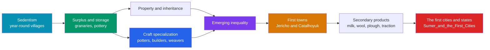

# 🏘️ Rise of Agriculture and Settlement

> [!abstract] TL;DR
> Once people farmed, they could stay put — and **sedentism** (permanent, year-round settlement) transformed human society. Storable surpluses of grain enabled the first true **towns**, such as **Jericho** (with its ~8000 BCE stone tower and wall) and **Çatalhöyük** (a dense honeycomb of mud-brick houses in Anatolia, ~7100 BCE). New technologies followed — **pottery** for storage and cooking, then the **secondary-products revolution** (using animals for milk, wool, and traction, not just meat). With storable wealth and heritable land came **private property** and, for the first time, durable **social inequality**. This is the road from the roaming forager band to the settled village — and the village, in turn, is the seedbed of the city and the state, the story picked up in [[Sumer_and_the_First_Cities]].

## Intuition — analogy first

A foraging band is like a family that lives out of **backpacks**, always ready to move to wherever the food is. Everything they own must be carried, so they own little, and because no one can hoard a mountain of berries, wealth stays roughly **flat**.

Settling down is like that family finally **buying a house with a pantry**. Now they can accumulate: a full granary, heavy pots, tools too bulky to carry, a herd out back. But a pantry is also something to **guard, lock, and pass on to your children** — and once some houses have bigger pantries than others, the flat equality of the backpack life is gone. The house ties you to one spot (you must defend the pantry and tend the fields), it lets far more people live under one roof, and it quietly sorts families into the well-stocked and the not. Multiply that house into a few hundred crowded together and you have a **town**; add a temple, a marketplace, and a ruler who taxes the granaries, and you are on the threshold of a **city**.

---

## How It Works — From Village to City

## Key Concepts

### Sedentism — Staying Put

**Sedentism** is the shift to living in one place year-round, and it is analytically distinct from farming: some **foragers settled first** where wild resources were exceptionally rich (e.g., the **Natufian** culture of the Levant, ~12,500–9500 BCE, built stone-founded hamlets and harvested wild cereals before domestication). Settlement then **intensified** the pressures — mouths to feed, waste to manage, stores to defend — that pushed communities toward full agriculture. Sedentism and farming reinforced each other in a feedback loop (see [[The_Neolithic_Revolution]]).

### The First Towns

| Site | Location | Approx. date | Why it matters |
|---|---|---|---|
| **Jericho** (Tell es-Sultan) | Jordan Valley | PPNA ~9000 BCE | Among the oldest continuously settled places; famous **stone tower (~8 m) and wall** (~8000 BCE); **plastered skulls** suggest an ancestor cult |
| **Çatalhöyük** | Anatolia (Turkey) | ~7100–5700 BCE | Up to ~5,000–8,000 residents; mud-brick houses packed wall-to-wall, **entered through the roof**, no streets; vivid wall paintings and figurines |
| **'Ain Ghazal** | Jordan | ~7250 BCE | Large village yielding striking **lime-plaster statues** of human figures |

**Çatalhöyük**, excavated by **James Mellaart** in the 1960s and re-investigated by **Ian Hodder** from the 1990s, is strikingly **egalitarian in layout** — houses are of broadly similar size — cautioning us that early towns did not automatically produce steep hierarchy. **Jericho's** monumental tower and wall, by contrast, imply organized **communal labor** on a scale unknown to mobile foragers.

### Pottery, Storage, and Property

**Storage** is the hinge of the whole transformation. Pits, bins, and especially **fired pottery** (widespread in the later Neolithic) let households keep grain, seed, oil, and water across the year — banking calories against scarcity. But stored surplus is **wealth that can be owned, counted, taxed, stolen, and inherited**. Heritable **land** and stored goods gave rise to notions of **private property** largely absent among sharing foragers, and archaeologists read growing differences in house size, grave goods, and prestige items as the first durable **social inequality**.

### The Secondary-Products Revolution

Coined by **Andrew Sherratt (1981)**, this describes a later Neolithic/Chalcolithic shift (roughly the **4th millennium BCE**) in which people began exploiting animals for their **renewable "secondary" products** — **milk (dairying), wool, and traction/transport** — rather than only their meat ("primary" product). The **ox-drawn plough**, wheeled carts, and woolly sheep multiplied agricultural output and mobility, intensifying surplus and trade and helping tip larger settlements toward genuine urban scale.

### The Road to the City

The village was not the destination but a **way station**. Rising population, craft specialization, concentrated surplus, managerial elites, and long-distance trade compounded until, in favorable regions like southern **Mesopotamia**, they crossed into a new order of magnitude: the **city**, with monumental temples, record-keeping, and the state. That threshold — **Uruk, Ur, and the Sumerian world** — is taken up in [[Sumer_and_the_First_Cities]].

## Primary Sources & Examples

- **The Tower of Jericho (~8000 BCE):** an ~8-metre stone tower built into the settlement's wall — one of the earliest known monumental structures, evidence of communal organization and shared labor millennia before cities.
- **Çatalhöyük's roof-entry houses and wall art:** homes accessed by ladder through the roof, with painted bulls, hunting scenes, and burials beneath the floors — an intimate portrait of settled Neolithic domestic and ritual life.
- **Plastered skulls of Jericho and 'Ain Ghazal:** human skulls overmodelled in plaster with inset shell eyes, widely interpreted as an **ancestor cult** — settled communities materializing memory and lineage.

## Common Pitfalls / Misconceptions

- **"Farming caused settlement, always in that order."** Some communities (e.g., the **Natufians**) became **sedentary before domesticating crops**; the causal arrow runs both ways.
- **"Early towns were automatically hierarchical."** Çatalhöyük's uniform houses suggest large settlements could remain relatively **egalitarian** for centuries; steep inequality was not instant or inevitable.
- **"Towns like Çatalhöyük were cities."** They were **large villages/proto-towns** lacking the monumental temples, centralized administration, writing, and state apparatus that define the later city.
- **"Pottery came first and made farming possible."** In the Near East, farming and even towns **predate pottery** (the "Pre-Pottery Neolithic"); ceramics were a later, though transformative, addition.

## Related Concepts

- [[_MOC_Prehistory|↑ Section MOC]] — the section hub
- [[The_Neolithic_Revolution]] — the domestication and surplus that made permanent settlement possible in the first place
- [[The_Paleolithic_Era]] — the mobile, egalitarian forager band against which sedentary village life is contrasted
- [[Sumer_and_the_First_Cities]] — the forward link: how proto-towns crossed the threshold into cities and states
- Cross-vault: [[_MOC_Microeconomics_Master]] — property rights, specialization, and the storage of surplus wealth that underpin settled economies

## Review Questions

1. Distinguish sedentism from agriculture, and use the Natufian culture to explain why the two are not the same thing.
2. Compare Jericho and Çatalhöyük as early settlements, noting what each reveals about communal labor and social equality.
3. What was the "secondary-products revolution," who named it, and how did it intensify the path from village to city?

## Sources

- Mithen, S. (2003). *After the Ice: A Global Human History, 20,000–5000 BC*. Weidenfeld & Nicolson
- Hodder, I. (2006). *The Leopard's Tale: Revealing the Mysteries of Çatalhöyük*. Thames & Hudson
- Sherratt, A. (1981). "Plough and pastoralism: aspects of the secondary products revolution." In *Pattern of the Past*. Cambridge University Press
- Kenyon, K. (1957). *Digging Up Jericho*. Ernest Benn

#history #prehistory #neolithic #sedentism #settlement #social-hierarchy
