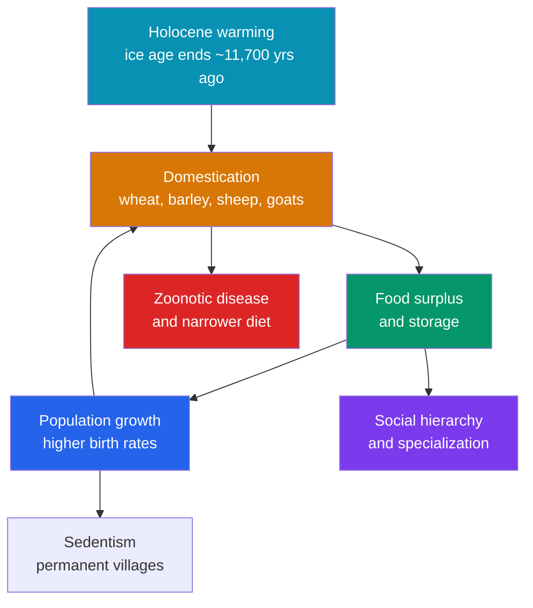

# 🌾 The Neolithic Revolution

> [!abstract] TL;DR
> The **Neolithic Revolution** was humanity's transition from **foraging to farming**, beginning around **10,000 BCE** in the **Fertile Crescent** of Southwest Asia and, independently, in several other world regions. Early farmers **domesticated** plants (emmer and einkorn wheat, barley, lentils, peas) and animals (sheep, goats, then cattle and pigs), producing **food surpluses** that fed larger, settled populations. The archaeologist **V. Gordon Childe** coined the term in the 1930s, framing it as the pivotal break that made civilization possible. But its consequences were double-edged: alongside population growth and social complexity came **infectious disease**, **poorer nutrition**, and **entrenched inequality**. Sites like **Göbekli Tepe** (~9600 BCE) even suggest monumental ritual came *before* full farming — and scholars still debate whether the whole shift was, in Jared Diamond's phrase, **"the worst mistake in the history of the human race."**

## Intuition — analogy first

Imagine a species that has always **shopped at the wild market** — gathering whatever the seasons happen to offer — suddenly deciding to **run its own farm shop**. At first glance it's an obvious upgrade: instead of wandering for food, you grow it on your doorstep and store it for winter.

But running the shop changes everything about your life. You can no longer wander, because the crops need tending — so you settle down. You can now feed **more mouths**, so your family grows, which means you need **even more crops**, which locks you in tighter — a **one-way ratchet** that is very hard to reverse. Living crammed together with your animals and your grain, you catch new diseases and attract rats. Some families end up controlling the storehouse and the best land, so the old sharing band gives way to **haves and have-nots**. The farm shop feeds a village where a foraging band once roamed — but the shopkeepers work longer hours, eat a narrower diet, and can never close up and leave. That trade-off is the Neolithic Revolution in a nutshell.

---

## How It Works — The Domestication Ratchet and Its Consequences

## Key Concepts

### What "Domestication" Means

**Domestication** is a slow, mutual evolutionary process in which humans select organisms for useful traits and those organisms become dependent on human care. In cereals it favored **non-shattering seed heads** (so grain stays on the stalk to be harvested) and **larger seeds**; in animals it favored **tameness, smaller body/brain size, and earlier breeding**. Crucially, farming was **invented independently** in at least a handful of regions — it was not a single idea that spread from one place.

| Region | Approx. start | Signature domesticates |
|---|---|---|
| **Fertile Crescent** (SW Asia) | ~10,000 BCE | Emmer & einkorn wheat, barley, lentils, peas; sheep, goats |
| **East Asia** (China) | ~8000 BCE | Rice (Yangtze), millet (Yellow River); pigs |
| **Mesoamerica** | ~7000–4000 BCE | Maize, beans, squash |
| **Andes / South America** | ~8000 BCE | Potato, quinoa; llama, alpaca |
| **New Guinea** | ~7000 BCE | Taro, banana |
| **Sub-Saharan Africa** (Sahel) | ~5000–3000 BCE | Sorghum, pearl millet, yams |

The eight classic **"founder crops"** of the Fertile Crescent — emmer wheat, einkorn wheat, barley, lentil, pea, chickpea, bitter vetch, and flax — formed the agricultural package that later spread into Europe.

### V. Gordon Childe and the Idea of "Revolution"

The Australian-born archaeologist **V. Gordon Childe** popularized the phrase **"Neolithic Revolution"** in *Man Makes Himself* (1936). By "revolution" he meant not speed — the change took millennia — but its **transformative significance**: for Childe it was the first of two great economic revolutions (the second being the urban revolution of the first cities) that remade human society. The label stuck, even as later scholars stressed how gradual and patchy the process actually was.

### Consequences — Surplus, Growth, Disease, Hierarchy

Farming generated a **storable surplus**, which had cascading effects:
- **Population growth:** settled farmers could wean children earlier and space births more closely than mobile foragers, driving a demographic surge.
- **Sedentism and property:** land and stored grain became things to own, defend, and inherit.
- **Social hierarchy:** control of surplus and land enabled emerging elites, a theme developed in [[Rise_of_Agriculture_and_Settlement]].
- **Disease:** dense living, crowding with animals, and grain stores bred **zoonotic infections** (from livestock) and pests; skeletal evidence shows early farmers were often **shorter, with more dental cavities and nutritional stress** than the foragers who preceded them.

### Göbekli Tepe and the "Ritual First" Puzzle

At **Göbekli Tepe** in southeastern Turkey, excavations led by **Klaus Schmidt** (from 1995) revealed massive carved **T-shaped stone pillars** arranged in circles, dated to **~9600 BCE** — built by people who were still essentially **hunter-gatherers**, before clear evidence of farming there. This provocatively suggests that **communal ritual and monument-building** may have *preceded and even helped drive* the shift to agriculture (perhaps to feed the gatherings), inverting the old assumption that farming came first and religion followed.

### "Was Farming a Mistake?"

In a famous 1987 essay, **Jared Diamond** called the adoption of agriculture **"the worst mistake in the history of the human race,"** arguing it brought worse diets, harder labor, epidemic disease, and social inequality, even as it let far more people exist. The debate is genuine: farming was arguably worse for the **average individual's** health and leisure yet spectacularly successful for the **species' numbers** and for the complex societies it enabled. Both things can be true.

## Primary Sources & Examples

- **Abu Hureyra (Syria):** a deeply stratified tell showing the same community shift from gathering wild plants to cultivating domesticated cereals — a rare in-place record of the transition itself.
- **Çatalhöyük (Anatolia, ~7100 BCE):** a dense early farming town whose plant and animal remains, storage bins, and art document settled Neolithic life (explored further in [[Rise_of_Agriculture_and_Settlement]]).
- **Ötzi the Iceman (~3300 BCE):** a naturally mummified late-Neolithic man found in the Alps, carrying einkorn wheat, a copper axe, and equipment that vividly illustrates a fully agricultural, tool-rich Neolithic lifestyle.

## Common Pitfalls / Misconceptions

- **"Farming was invented once and spread everywhere."** It arose **independently** in multiple regions across the globe from wholly different wild species.
- **"The Neolithic Revolution was fast."** Despite the word "revolution," the transition unfolded over **thousands of years**; "revolution" refers to its importance, not its pace.
- **"Farming immediately improved human life."** For many individuals it meant **worse nutrition, more disease, and harder work**; its success was demographic and social, not personal wellbeing.
- **"Religion and cities came only after farming."** Sites like Göbekli Tepe show **monumental ritual architecture built by foragers**, complicating any simple farming-first sequence.

## Related Concepts

- [[_MOC_Prehistory|↑ Section MOC]] — the section hub
- [[Rise_of_Agriculture_and_Settlement]] — the villages, storage, and social stratification that grew directly out of domestication
- [[The_Paleolithic_Era]] — the foraging world that farming replaced, and against which its trade-offs are measured
- [[Early_Language_and_Culture]] — the cooperative, symbolic capacities that made large communal projects like Göbekli Tepe possible
- Cross-vault: [[_MOC_Microeconomics_Master]] — surplus, storage, division of labor, and property, the economic foundations that agriculture first created

## Review Questions

1. Define domestication and explain the specific traits selected for in cereals versus in livestock.
2. Who was V. Gordon Childe, what did he mean by "revolution," and why do modern scholars qualify that label?
3. Present the strongest case on each side of the "was farming a mistake?" debate, and explain how Göbekli Tepe complicates the traditional farming-first narrative.

## Sources

- Childe, V.G. (1936). *Man Makes Himself*. Watts & Co.
- Diamond, J. (1987). "The Worst Mistake in the History of the Human Race." *Discover Magazine*
- Scott, J.C. (2017). *Against the Grain: A Deep History of the Earliest States*. Yale University Press
- Barker, G. (2006). *The Agricultural Revolution in Prehistory: Why Did Foragers Become Farmers?* Oxford University Press

#history #prehistory #neolithic #agriculture #domestication #fertile-crescent
