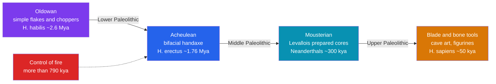

# 🪨 The Paleolithic Era

> [!abstract] TL;DR
> The **Paleolithic** ("Old Stone Age") spans roughly **3.3 million to 12,000 years ago** and covers **over 99% of human existence** — the immense stretch in which our ancestors lived as **mobile hunter-gatherers** in small bands. It is divided into **Lower**, **Middle**, and **Upper** phases, tracked chiefly by stone-tool traditions: the crude **Oldowan** flakes, the elegant teardrop **Acheulean** handaxe, and the flake-based **Mousterian** of the Neanderthals. Somewhere before ~790,000 years ago hominins gained **control of fire**, which reshaped diet, safety, and social life. Then, in the **Upper Paleolithic (~50,000 years ago)**, a **"creative explosion"** produced spectacular **cave art** (Lascaux, Chauvet, Altamira), carved **Venus figurines**, ornaments, and **deliberate burials** — the unmistakable signature of the modern symbolic mind.

## Intuition — analogy first

If the whole human story were a **24-hour day**, the Paleolithic would run from **midnight until roughly 11:56 p.m.** Everything else — farming, cities, writing, empires, the internet — is crammed into the final four minutes. We are, overwhelmingly, a species shaped by the Old Stone Age.

Now imagine a single **toolmaker's workbench** whose clutter accumulates over that near-endless day. At the bottom of the pile lie sharp-edged pebbles knocked into choppers (**Oldowan**). Above them sit beautifully symmetrical teardrop **handaxes**, the "Swiss Army knife" of the Ice Age, made almost unchanged for over a million years. Higher still are thin, pre-planned flakes struck from a prepared core (**Mousterian**) — evidence of a mind that maps out several steps ahead. And at the very top, alongside slender blades of the **Upper Paleolithic**, lie bone needles, carved figurines, and ground pigments: the workbench of a being who not only survives but **imagines**. The strata of that bench are the Paleolithic in miniature.

---

## How It Works — Tool Industries Across the Three Phases

## Key Concepts

### Dividing the Old Stone Age

| Phase | Approx. span | Main toolmakers | Hallmarks |
|---|---|---|---|
| **Lower Paleolithic** | ~3.3 Mya – 300 kya | *H. habilis*, *H. erectus* | Oldowan choppers; Acheulean handaxes; first fire |
| **Middle Paleolithic** | ~300 – 50 kya | Neanderthals, early *H. sapiens* | Mousterian / Levallois flakes; hafting; early symbolism |
| **Upper Paleolithic** | ~50 – 12 kya | *Homo sapiens* | Blades, bone/antler tools, art, burial, ornaments |

The earliest stone tools of all — from **Lomekwi 3, Kenya (~3.3 Mya)** — predate the genus *Homo*, showing that toolmaking began among australopith-grade hominins.

### The Stone Toolkits

- **Oldowan (~2.6 Mya):** named for **Olduvai Gorge, Tanzania** (the Leakeys' famous site). Simple cores and sharp flakes for cutting and pounding — the first recognizable technology.
- **Acheulean (~1.76 Mya):** named for **Saint-Acheul, France**. Its icon is the **bifacial handaxe**, knapped on both faces into a symmetrical teardrop. Astonishingly, this design persisted with little change for over a **million years** — a stability that fascinates and puzzles archaeologists.
- **Mousterian (~300–40 kya):** associated with **Neanderthals** and named for **Le Moustier, France**. It relies on the **Levallois technique**, in which a core is carefully shaped so that a flake of predetermined form can be struck off — evidence of mental templating and planning.

### The Taming of Fire

Control of fire may reach back **~1 million years** (burnt bone and ash at **Wonderwerk Cave, South Africa**), with strong evidence of repeated hearths by **~790,000 years ago** at **Gesher Benot Ya'aqov, Israel**. Fire brought warmth, protection from predators, light that extended the social day, and — per Richard Wrangham's **"cooking hypothesis"** — **cooked food**, whose easier digestion may have fueled the energetically expensive human brain.

### Hunter-Gatherer Life

Paleolithic people lived in small, mobile **bands** (typically a few dozen), subsisting by **foraging, scavenging, and hunting**. Such societies tend to be **egalitarian** and **nomadic**, moving with seasons and game, holding few possessions, and sharing food widely. This foraging way of life sustained humanity for hundreds of thousands of years and still shapes our biology and psychology.

### The Upper Paleolithic "Creative Explosion"

From roughly **50,000 years ago**, the archaeological record blooms with unmistakable symbolism:

- **Cave art:** the horses and bulls of **Lascaux** (France, ~17,000 years old), the lions and rhinos of **Chauvet** (France, ~36,000 years old — among the oldest known), and the bison ceiling of **Altamira** (Spain), whose authenticity was doubted for decades because it seemed "too good."
- **Portable art:** **Venus figurines** such as the **Venus of Willendorf** (~25,000–30,000 years old) and the ivory **Venus of Hohle Fels** (~35,000–40,000 years old), the oldest known figurative sculpture, from the same German caves that yielded the earliest bone **flutes**.
- **Deliberate burial with grave goods:** the **Sungir** burials (Russia, ~34,000 years old), where individuals were interred with thousands of laboriously drilled ivory beads.

Whether this explosion was truly sudden or the visible tip of a longer African build-up is debated in [[Early_Language_and_Culture]].

## Primary Sources & Examples

- **The Acheulean handaxe:** a single artifact type made across Africa, Europe, and Asia for more than a million years — the longest-lived tool tradition in human history, and a case study in how slowly technology once changed.
- **Chauvet Cave (discovered 1994):** its charcoal drawings, radiocarbon-dated to ~36,000 years, overturned the assumption that art "improved" steadily over time — the earliest painters were already masters of perspective and movement.
- **The Hohle Fels finds (Swabian Jura, Germany):** the ivory Venus and bird-bone flutes, ~40,000 years old, together document art *and* music at the very start of the Upper Paleolithic.

## Common Pitfalls / Misconceptions

- **"Stone Age people were primitive and brutish."** Their toolmaking, fire use, hunting strategy, and eventually art demanded deep skill, planning, and knowledge; low technology is not low intelligence.
- **"Cave art was just decoration."** Most decorated caves are deep, dark, and hard to reach — pointing to **ritual, initiation, or shamanic** purposes rather than living-room ornament.
- **"Hunter-gatherers lived short, desperate lives of constant hunger."** Ethnographic and archaeological work suggests foragers often enjoyed varied diets, ample leisure, and good health relative to early farmers.
- **"Tools mark clean species boundaries."** Industries overlap in time and space; Neanderthals and *sapiens* sometimes shared or exchanged techniques, so tool type does not perfectly index a single species.

## Related Concepts

- [[_MOC_Prehistory|↑ Section MOC]] — the section hub
- [[Human_Evolution_and_Migration]] — the hominin species that made each tool industry described here
- [[Early_Language_and_Culture]] — the symbolic cognition behind Upper Paleolithic art, ornament, and burial
- [[The_Neolithic_Revolution]] — what happened when the Ice Age ended and foragers began to farm
- Cross-vault: [[_MOC_Psychology_Master]] — the "evolutionary mismatch" idea, that our forager-adapted minds now inhabit a very different world

## Review Questions

1. Name the three phases of the Paleolithic, their approximate dates, and the characteristic stone-tool industry of each.
2. Summarize the evidence for the control of fire and explain the "cooking hypothesis" for why fire mattered to human evolution.
3. What features of the Upper Paleolithic record constitute the so-called "creative explosion," and give three concrete site examples.

## Sources

- Klein, R.G. (2009). *The Human Career: Human Biological and Cultural Origins* (3rd ed.). University of Chicago Press
- Wrangham, R. (2009). *Catching Fire: How Cooking Made Us Human*. Basic Books
- Clottes, J. (2003). *Chauvet Cave: The Art of Earliest Times*. University of Utah Press
- Bahn, P.G. & Vertut, J. (1997). *Journey Through the Ice Age*. University of California Press

#history #prehistory #paleolithic #stone-tools #hunter-gatherers #cave-art
