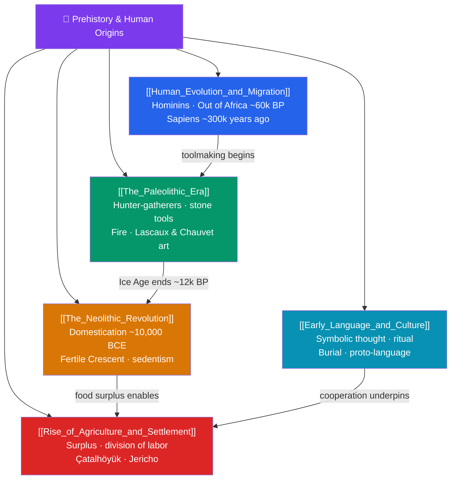

# 🗺️ Prehistory & Human Origins — Map of Content

> [!abstract] What This Section Covers
> Prehistory is the vast stretch before writing, reconstructed almost entirely from bones, stones, and DNA. This section traces **human evolution and migration** (from Australopithecus through *Homo erectus* to *Homo sapiens*, who arose in Africa ~300,000 years ago and dispersed across the globe in the great Out-of-Africa migrations ~60,000 years ago), the long **Paleolithic era** of hunter-gatherers, stone toolkits, the taming of fire, and the astonishing cave art of Lascaux and Chauvet, and the pivotal **Neolithic Revolution** (~10,000 BCE in the Fertile Crescent), when humans domesticated wheat, barley, sheep, and goats. It also examines **early language and culture** — symbolic thought, burial, and ritual that mark behavioral modernity — and the **rise of agriculture and settlement** that produced food surpluses, division of labor, and the first villages such as Çatalhöyük and Jericho. This deep past set every later chapter of history in motion.

## Concept Map

## Learning Path

1. [[Human_Evolution_and_Migration]] — The hominin family tree, bipedalism and brain growth, and how *Homo sapiens* spread out of Africa to populate every continent.
2. [[The_Paleolithic_Era]] — Foraging bands, the Oldowan and Acheulean stone industries, mastery of fire, and Upper Paleolithic symbolic art.
3. [[The_Neolithic_Revolution]] — The independent invention of farming, the shift to sedentary life, and its demographic and health consequences.
4. [[Early_Language_and_Culture]] — Evidence for symbolic cognition, the emergence of language, and ritual practices that signal behavioral modernity.
5. [[Rise_of_Agriculture_and_Settlement]] — How surplus food created specialization, hierarchy, and the first proto-urban settlements.

## All Notes at a Glance

| Note | Difficulty | What You'll Learn |
|------|------------|-------------------|
| [[Human_Evolution_and_Migration]] | Beginner → Intermediate | Australopithecus to Homo sapiens, bipedalism, Out of Africa, peopling of the Americas and Australia |
| [[The_Paleolithic_Era]] | Beginner | Hunter-gatherer life, Oldowan/Acheulean tools, control of fire, cave painting and portable art |
| [[The_Neolithic_Revolution]] | Intermediate | Domestication of plants and animals, sedentism, the Fertile Crescent, health/population trade-offs |
| [[Early_Language_and_Culture]] | Intermediate | Symbolic thought, origins of language, deliberate burial, ritual and early belief |
| [[Rise_of_Agriculture_and_Settlement]] | Intermediate | Surplus and specialization, social stratification, Çatalhöyük and Jericho as first towns |

## Key Questions This Section Answers

- What distinguishes *Homo sapiens* from earlier hominins, and how did our species come to inhabit the entire planet?
- Why did humans spend the overwhelming majority of their existence as hunter-gatherers?
- What triggered the shift to farming around 10,000 BCE, and was it an unambiguous improvement in human life?
- What archaeological signs tell us that early humans possessed language, symbolism, and ritual?
- How did agricultural surpluses lead to the first permanent settlements and social hierarchy?

## Related Sections

- [[_MOC_History_Master|↑ History Master MOC]]
- [[_MOC_Historiography|← Historiography & Methods]]
- [[_MOC_Mesopotamia_Egypt|→ Mesopotamia & Ancient Egypt]]

#MOC #History #Prehistory
