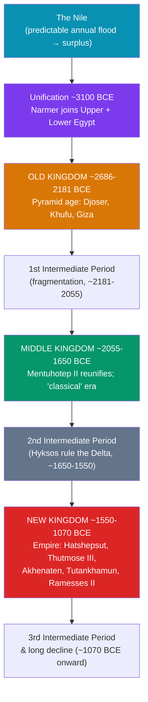

# 🔺 Ancient Egypt Kingdoms

> [!abstract] TL;DR
> Egyptian civilization is the story of a thin green ribbon of the **Nile** and the roughly **3,000 years** of pharaonic rule it sustained. Around **3100 BCE**, **Narmer** unified Upper and Lower Egypt into a single kingdom of the "Two Lands." Historians divide what followed into three great **Kingdoms** separated by two collapses (the **Intermediate Periods**): the **Old Kingdom** (c. 2686–2181 BCE), the pyramid age of **Djoser, Khufu, and Giza**; the **Middle Kingdom** (c. 2055–1650 BCE), a reunified classical era; and the imperial **New Kingdom** (c. 1550–1070 BCE), the age of **Hatshepsut, Thutmose III, Akhenaten's Aten experiment, Tutankhamun, and Ramesses II**. The Nile's uniquely **predictable annual flood** made all of it possible — Herodotus called Egypt "the gift of the Nile."

## Intuition — analogy first

Think of ancient Egypt as a civilization built along a **single road running through a desert**, with a **reliable clock** ticking every year.

The road is the **Nile**: virtually all Egyptians lived within a few miles of it, because everywhere else is lethal sand. That geography does two things. First, it makes the kingdom **long and thin but easy to control** — one river, one set of choke points, one natural highway for boats carrying grain, stone, and soldiers. Second, and unlike the erratic Tigris and Euphrates, the Nile floods **on schedule** every summer, laying down fresh black silt. That reliability breeds a civilization obsessed with **order, continuity, and permanence** — a culture confident enough to plan pyramids that take decades and a state stable enough to last millennia.

The "clock" also explains the rhythm of Egyptian history. When the floods and the central government worked, you got a **Kingdom** — unity, monuments, empire. When the Nile failed or the throne fractured, you got an **Intermediate Period** — fragmentation and hardship — until a strong ruler reunified the Two Lands and the cycle began again.

---

## How It Works — The Arc of Egyptian History

## Key Concepts

### The Gift of the Nile

Egypt is functionally an **oasis civilization**. Egyptians distinguished the fertile **kemet** ("black land," the flooded valley) from the deadly **deshret** ("red land," the desert). Each summer the Nile's **inundation** deposited nutrient-rich silt, enabling reliable harvests with modest effort — a stark contrast to the flood-control struggles of Mesopotamia. The river was also the kingdom's spine and highway: boats sailed **downstream** (north) with the current and **upstream** (south) with the prevailing wind. This dependable abundance underwrote a stable, centralized state and the labor surpluses that built its monuments.

### Unification and the Early Dynastic Period (~3100 BCE)

Tradition and the **Narmer Palette** credit King **Narmer** (possibly the "**Menes**" of later king-lists) with uniting **Upper Egypt** (the southern valley) and **Lower Egypt** (the northern Delta). Thereafter the pharaoh wore the **Double Crown** symbolizing the "Two Lands," and the capital settled at **Memphis**, near the junction of valley and delta.

### The Three Kingdoms and Two Intermediate Periods

| Era | Dates (approx.) | Hallmarks |
|---|---|---|
| **Early Dynastic** | 3100–2686 BCE | Unification; Memphis; first monumental tombs (mastabas) |
| **Old Kingdom** | 2686–2181 BCE | **Pyramid age**; strong central god-kings |
| **1st Intermediate** | 2181–2055 BCE | Collapse, famine, regional rule |
| **Middle Kingdom** | 2055–1650 BCE | Reunification; classical literature; Nubian expansion |
| **2nd Intermediate** | 1650–1550 BCE | **Hyksos** foreign rulers in the Delta |
| **New Kingdom** | 1550–1070 BCE | **Empire**; Valley of the Kings; great temples |
| **3rd Intermediate** | 1070–664 BCE | Fragmentation; Libyan and Nubian dynasties |

### The Old Kingdom — The Pyramid Age (c. 2686–2181 BCE)

The Old Kingdom is the era of **pyramid-building**. **Djoser's Step Pyramid** at Saqqara (c. 2670 BCE), designed by the architect **Imhotep**, was the first monumental stone building. The pinnacle came at **Giza**: the **Great Pyramid of Khufu** (c. 2560 BCE, ~146 m tall, ~2.3 million blocks), the pyramid of **Khafre** with the **Great Sphinx**, and that of **Menkaure**. These were royal tombs built by a well-fed, organized workforce of Egyptian laborers (not, as myth holds, slaves). Overcentralization, drought, and the rising power of provincial governors ended the Old Kingdom in the **First Intermediate Period**.

### The Middle Kingdom — Classical Egypt (c. 2055–1650 BCE)

**Mentuhotep II** of Thebes reunified Egypt, opening a period later Egyptians regarded as their **classical golden age** of literature and art. Kings such as **Senusret III** and the **Amenemhats** expanded into **Nubia** and reformed administration. Weakened rule gave way to the **Second Intermediate Period**, during which the **Hyksos** — Semitic-speaking rulers from the Levant — controlled the Delta and introduced the **horse-drawn chariot** and **composite bow** to Egypt.

### The New Kingdom — Egypt's Empire (c. 1550–1070 BCE)

**Ahmose I** expelled the Hyksos and founded the New Kingdom, Egypt's imperial age, when pharaohs were buried in the **Valley of the Kings** and Egypt ruled from Nubia to Syria:

- **Hatshepsut** (r. c. 1479–1458 BCE): one of the few female pharaohs; ran a prosperous reign, built the mortuary temple at **Deir el-Bahri**, and sent a famous trading expedition to **Punt**.
- **Thutmose III** (r. c. 1479–1425 BCE): the "**Napoleon of Egypt**," who at the **Battle of Megiddo** (c. 1457 BCE) and beyond extended the empire to the **Euphrates**.
- **Akhenaten** (r. c. 1353–1336 BCE): with queen **Nefertiti**, imposed worship of a single sun-disk god, the **Aten**, moved the capital to **Amarna**, and triggered a religious revolution often (loosely) called history's first **monotheism** — reversed after his death.
- **Tutankhamun** (r. c. 1332–1323 BCE): a minor boy-king who restored the god **Amun**, famous only because **Howard Carter** found his near-intact tomb in **1922**.
- **Ramesses II "the Great"** (r. c. 1279–1213 BCE): reigned ~66 years, fought the **Hittites** at the **Battle of Kadesh** (c. 1274 BCE) — after which the world's earliest surviving **peace treaty** was signed — and built colossally at **Abu Simbel** and the **Ramesseum**.

The New Kingdom weakened after the reign of **Ramesses III** (who repelled the **Sea Peoples** c. 1177 BCE) and dissolved into the Third Intermediate Period amid the wider Late Bronze Age crisis (see [[The_Bronze_Age_Collapse]]).

## Primary Sources & Examples

- **The Narmer Palette** (c. 3100 BCE, Egyptian Museum, Cairo): a ceremonial slate showing a king smiting an enemy while wearing the crowns of both lands — the visual charter of a unified Egypt.
- **The Giza pyramid complex:** the Old Kingdom's engineering and administrative capacity made monumental in limestone and granite.
- **The Kadesh inscriptions and the Egyptian–Hittite treaty** (c. 1259 BCE): Ramesses II's version of the battle, plus a bilingual treaty preserved in both Egyptian and Hittite copies.
- **Tutankhamun's tomb (KV62):** discovered in 1922, its intact grave goods transformed knowledge of New Kingdom material culture and belief.

## Common Pitfalls / Misconceptions

- **"Slaves built the pyramids."** Evidence points to a paid, fed, organized workforce of Egyptian laborers housed near Giza, not enslaved masses.
- **"Cleopatra was Old Kingdom / near the pyramids in time."** Cleopatra VII (1st century BCE) lived *closer to us than to Khufu* — the pyramids were already ancient to her.
- **"Akhenaten invented monotheism as we know it."** Aten worship was a top-down royal cult (better called henotheism/monolatry) that collapsed almost immediately after him.
- **"Egypt was one unbroken, unchanging kingdom."** It cycled through **three Kingdoms and three Intermediate Periods** of collapse and reunification over three millennia.
- **"Egypt = Mesopotamia."** Both were river civilizations, but Egypt's predictable Nile bred stability and continuity, while Mesopotamia's volatile rivers and open geography bred flux and conquest.

## Related Concepts

- [[_MOC_Mesopotamia_Egypt|↑ Section MOC]] — the section hub
- [[Egyptian_Society_and_Religion]] — the belief system, hierarchy, and afterlife that these kingdoms expressed in stone
- [[The_Bronze_Age_Collapse]] — the crisis that ended the New Kingdom's empire and Egypt's greatness
- [[Mesopotamian_Empires]] — the contemporary Near Eastern powers Egypt fought and traded with (Hittites, Assyria)
- Cross-vault: [[_MOC_Egyptian_Myth]] — the gods and cosmology that legitimized pharaonic rule

## Review Questions

1. How did the predictability of the Nile's flood shape Egyptian political stability and its cultural preoccupation with permanence, compared with Mesopotamia?
2. Name the three Kingdoms and their approximate dates, and identify one defining achievement or ruler of each. What are the "Intermediate Periods"?
3. Choose two New Kingdom pharaohs (e.g., Thutmose III, Akhenaten, Ramesses II) and explain why each is historically significant.

## Sources

- Shaw, I. (ed.) (2000). *The Oxford History of Ancient Egypt*. Oxford University Press
- Wilkinson, T. (2010). *The Rise and Fall of Ancient Egypt*. Random House
- Kemp, B. (2006). *Ancient Egypt: Anatomy of a Civilization* (2nd ed.). Routledge
- Van De Mieroop, M. (2011). *A History of Ancient Egypt*. Wiley-Blackwell

#history #egypt #pharaoh #nile #new-kingdom #pyramids
