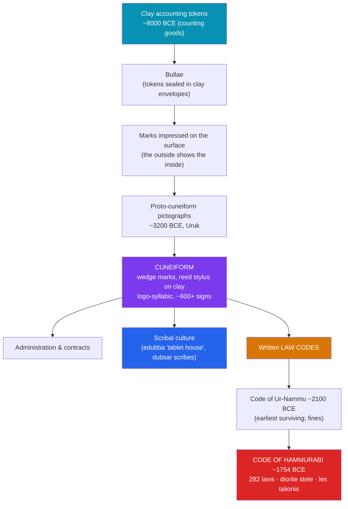

# ✍️ Cuneiform and the Code of Hammurabi

> [!abstract] TL;DR
> Writing was not invented to record poetry — it was invented to **count grain and cattle**. Over centuries in Sumer, three-dimensional clay **accounting tokens** flattened into pressed marks and then into the wedge-shaped **cuneiform** script (Latin *cuneus*, "wedge"), incised into wet clay with a reed stylus and readable for three thousand years. Literacy became the specialized power of a professional **scribal class**. Cuneiform's most famous product is the **Code of Hammurabi** (c. 1754 BCE), 282 laws carved on a black **diorite stele**, best known for its principle of **lex talionis** — "an eye for an eye" — and for the way its penalties **depended on the social class** of both offender and victim. Crucially, it was **not the first law code**: the **Code of Ur-Nammu** (c. 2100 BCE) predates it by roughly 350 years and preferred monetary compensation to retaliation.

## Intuition — analogy first

Imagine you run a warehouse in 8000 BCE and need to remember that a merchant owes you *five sheep and two jars of oil*. You have no writing. So you make **little clay tokens** — a sheep-shaped one, an oil-jar-shaped one — and seal them inside a hollow clay ball (a **bulla**) so no one can cheat. The problem: to check the contents, you'd have to break the ball. So someone starts **pressing each token into the ball's soft surface before sealing it** — now the outside advertises the inside. Then the leap: if the marks on the outside carry the information, *you don't need the tokens at all.* Flatten the ball into a tablet, draw the marks directly, and you have **writing**.

That origin explains cuneiform's character: it was born as **bookkeeping**, and only later stretched to record law, letters, myth, and mathematics. And once law itself could be written and displayed in stone, a ruler could do something new — freeze his idea of **justice** into a public, unchanging monument that outlived him. The Code of Hammurabi is that move: a king telling gods, subjects, and posterity, *this is what a just kingdom looks like.*

---

## How It Works — From Tokens to Script to Law

## Key Concepts

### From Clay Tokens to Cuneiform Script

The archaeologist **Denise Schmandt-Besserat** traced writing's deep prehistory to small **clay tokens** used across the Near East from about 8000 BCE to tally commodities. These evolved into **bullae** (sealed clay envelopes) and impressed surface marks, and by around **3200 BCE** at Uruk into **proto-cuneiform** pictographs on tablets. As scribes replaced curved drawn lines with quick, repeatable impressions of a **reed stylus**, signs became the abstract **wedge** clusters we call **cuneiform**. It was a **logo-syllabic** system of several hundred signs that could stand for whole words or syllables. Cuneiform proved so adaptable that it was used to write not just **Sumerian** but **Akkadian, Elamite, Hittite, and Old Persian** across three millennia — the ancient world's dominant script until the alphabet displaced it.

### Scribal Culture

Literacy was a scarce, guarded skill. Scribes (**dubsar**) trained for years in the **edubba** ("tablet house"), copying sign lists, proverbs, and classics, and mastering the mathematics and legal formulas that ran the temple and palace economy (see [[Sumer_and_the_First_Cities]]). A scribe was an indispensable functionary — record-keeper, accountant, secretary, and lawyer rolled into one — and scribal families formed a professional elite. Clay's durability means we possess **hundreds of thousands** of their tablets; unlike papyrus, baked or dried clay survives fire and flood, which is why Mesopotamia's documentary record is so extraordinarily rich.

### The Code of Hammurabi (c. 1754 BCE)

**Hammurabi**, the Amorite king of Babylon (see [[Mesopotamian_Empires]]), promulgated a collection of **282 laws** inscribed on a **2.25-metre black diorite stele**. At its top, Hammurabi stands before **Shamash**, the sun god of justice, receiving the emblems of authority — a claim that the law is divinely sanctioned. The prologue announces the king's mission "to cause justice to prevail... so that the strong might not oppress the weak." The stele was later carried off as war booty to **Susa** by the Elamite king **Shutruk-Nakhunte** (~1150 BCE), where a French expedition **rediscovered it in 1901–02**; it now stands in the **Louvre**.

### Lex Talionis and Class-Dependent Penalties

The code's signature principle is **lex talionis** — proportional retaliation, "an eye for an eye." Law **196** reads, in effect, "*If a man destroys the eye of another man, they shall destroy his eye.*" But this applied **between social equals**, and penalties varied sharply by the class of the parties:

| Social class | Akkadian term | Treatment under the code |
|---|---|---|
| Free man / noble | **awīlum** | Full talion between equals (eye for eye, bone for bone) |
| Commoner / dependent | **muškēnum** | Often **monetary compensation** rather than physical retaliation |
| Enslaved person | **wardum** | Valued as property; injuries compensated by payment to the owner |

So if an *awīlum* blinded another *awīlum*, he lost his own eye (Law 196); but if he blinded a *muškēnum*, he paid a fine of silver (Law 198); and injuring a slave meant paying the slave's owner half the slave's value (Law 199). Justice was real but **stratified** — the same act carried different consequences depending on *who* did it *to whom*.

### Not the First Code: Ur-Nammu and Others

A persistent myth calls Hammurabi's the "first law code." It is not. The **Code of Ur-Nammu** (c. 2100–2050 BCE), from the Third Dynasty of Ur, predates it by about **350 years** and is the **earliest surviving** law collection — and notably it favored **monetary fines** over bodily retaliation ("If a man knocks out the eye of another man, he shall weigh out half a mina of silver"). Between the two stand the **Laws of Lipit-Ishtar** (c. 1930 BCE) and the **Laws of Eshnunna** (c. 1770 BCE). Scholars also debate whether these were binding statutes enforced by courts or, more likely, **royal declarations of justice** — idealized models advertising a king's righteousness rather than a code judges consulted case by case. (On weighing what such a monument can and cannot tell us, see [[Primary_and_Secondary_Sources]].)

## Primary Sources & Examples

- **The stele of Hammurabi** (Louvre): both a legal text *and* a piece of royal propaganda — the relief of Hammurabi before Shamash frames the whole code as divine justice.
- **The Code of Ur-Nammu tablets:** fragmentary Sumerian copies that overturned the popular belief that Hammurabi's was the earliest code.
- **Administrative and legal tablets:** millions of everyday cuneiform contracts, loan records, and court cases that reveal how law actually functioned, against the idealized stele.
- **The Behistun Inscription** of Darius I: the trilingual cliff-carving whose decipherment by **Henry Rawlinson** (1830s–40s) cracked cuneiform, much as the Rosetta Stone cracked hieroglyphs.

## Common Pitfalls / Misconceptions

- **"Hammurabi wrote the first laws."** No — the **Code of Ur-Nammu** is roughly three and a half centuries older, and it used fines, not talion.
- **"Cuneiform is an alphabet."** It is **logo-syllabic**: signs represent words and syllables, not single sounds. The alphabet was a later, separate invention.
- **"Cuneiform is a language."** It is a **writing system** used to record *many* languages (Sumerian, Akkadian, Hittite, and more).
- **"The code treated everyone equally."** Penalties were explicitly **class-dependent**; equal treatment was reserved for social equals.
- **"'An eye for an eye' was uniquely harsh/Babylonian."** *Lex talionis* was actually a *limiting* principle — punishment proportional to harm, capping escalating blood-feud vengeance.

## Related Concepts

- [[_MOC_Mesopotamia_Egypt|↑ Section MOC]] — the section hub
- [[Sumer_and_the_First_Cities]] — writing was invented inside the Sumerian temple economy to keep its accounts
- [[Mesopotamian_Empires]] — Hammurabi's Old Babylonian state is the political context of his code
- Cross-vault: [[Primary_and_Secondary_Sources]] — how historians read a monument like the stele critically: is it statute, or royal self-image?
- Cross-vault: [[_MOC_Egyptian_Myth]] — compare cuneiform with Egypt's parallel invention of hieroglyphic writing

## Review Questions

1. Reconstruct the path from clay accounting tokens to cuneiform script. Why does this origin explain why the earliest writing records inventories rather than stories?
2. Explain *lex talionis* and demonstrate, with the eye-injury laws, how the Code of Hammurabi's penalties depended on social class.
3. Why is it inaccurate to call the Code of Hammurabi the first law code, and what earlier code holds that title? How did its approach to punishment differ?

## Sources

- Van De Mieroop, M. (2005). *King Hammurabi of Babylon: A Biography*. Blackwell
- Schmandt-Besserat, D. (1996). *How Writing Came About*. University of Texas Press
- Roth, M.T. (1997). *Law Collections from Mesopotamia and Asia Minor* (2nd ed.). Scholars Press
- Walker, C.B.F. (1987). *Cuneiform* (Reading the Past series). British Museum Press

#history #mesopotamia #writing #cuneiform #law #hammurabi
