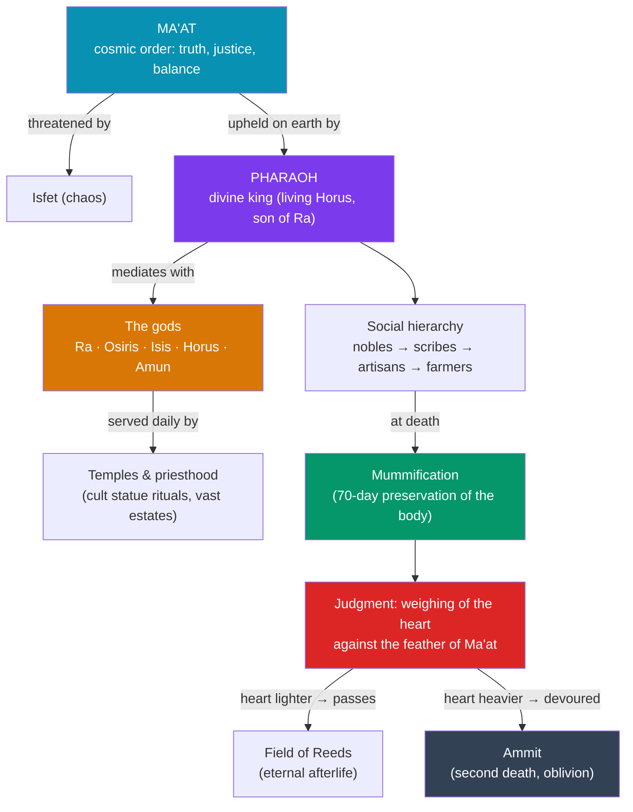

# ☥ Egyptian Society and Religion

> [!abstract] TL;DR
> Ancient Egyptian society was a pyramid in more than stone: at its apex stood the **pharaoh**, a **divine king** who was the living link between gods and humanity and whose central duty was to uphold **ma'at** — the cosmic order of truth, justice, and balance — against chaos. Egyptian religion was richly **polytheistic** (Ra, Osiris, Isis, Horus, and hundreds more), served by wealthy **temples and a powerful priesthood**. Above all, Egyptians were preoccupied with **death and the afterlife**: they perfected **mummification** to preserve the body for eternity, buried their dead with spells and treasure, and imagined a final **judgment** in which the heart was weighed against the feather of ma'at. Their **hieroglyphic** script, sacred and monumental, fell silent for 1,400 years until the **Rosetta Stone** let **Champollion** decode it in 1822.

## Intuition — analogy first

Picture Egyptian civilization as a society running one enormous, all-consuming **project: keeping the universe from falling apart** — and, by extension, keeping *you* alive after death.

The universe, Egyptians believed, is not self-sustaining. Order (**ma'at**) must be constantly renewed against an ever-pressing chaos (**isfet**). The **pharaoh** is the project manager: because he is divine, his correct rule, ritual, and monument-building literally keep the sun rising and the Nile flooding. The **priesthood** are the full-time staff who perform the daily rituals that feed and clothe the gods' statues. And ordinary people fund the project through labor and taxes, hoping to earn their own slice of eternity.

That is why so much Egyptian wealth and genius poured into **tombs and mummies** rather than, say, palaces. Death was not the end but a dangerous *transition* to another life — and just as the cosmos needs upkeep to survive, so does the dead body and soul. Embalm the body, stock the tomb, learn the spells, pass the final exam (the weighing of the heart), and you continue forever. Egyptian religion is, in this sense, one vast **insurance policy against oblivion**, for the king, the gods, and the world alike.

---

## How It Works — Cosmos, Kingship, and the Journey to the Afterlife

## Key Concepts

### The Pharaoh as Divine King

The **pharaoh** was not merely a ruler but a **god on earth** — identified in life with **Horus**, the sky-and-kingship god, called the **son of Ra** the sun god, and expected to become **Osiris**, lord of the dead, after death. His divinity was the constitutional foundation of the state: his rituals and just governance were believed to sustain **ma'at** and thus the functioning of the cosmos itself. This ideology made rebellion not just treason but a cosmic offense, and it justified the immense resources devoted to royal tombs and temples (see [[Ancient_Egypt_Kingdoms]]).

### Ma'at — Cosmic Order

**Ma'at** was simultaneously a goddess (depicted with an ostrich feather) and the central principle of Egyptian thought: **truth, justice, harmony, and the right order of the universe**. Its opposite was **isfet** (chaos, disorder, injustice). Kings, officials, and ordinary people were all expected to "do ma'at." The concept anchored Egyptian law, ethics, and the afterlife judgment alike — to live justly was to live *in ma'at*.

### Polytheism — The Gods

Egyptian religion honored **hundreds of deities**, local and national, whose roles shifted and merged over three millennia:

| Deity | Domain |
|---|---|
| **Ra** (Re) | Sun; creator; supreme god, later fused as **Amun-Ra** |
| **Osiris** | Death, resurrection, and the afterlife; judge of the dead |
| **Isis** | Magic, motherhood, healing; wife of Osiris |
| **Horus** | Sky and kingship; the living pharaoh |
| **Set** | Storms, chaos, the desert; murderer of Osiris |
| **Anubis** | Mummification and the passage of the dead |
| **Thoth** | Writing, wisdom, and the moon; scribe of the gods |
| **Hathor** | Love, music, motherhood |

The **Osiris myth** — his murder by Set, restoration by Isis, and rule over the dead — was the theological heart of afterlife belief (see [[_MOC_Egyptian_Myth]]).

### Temples and the Priesthood

Egyptian temples were the **houses of the gods**, not congregational spaces. Priests performed **daily rituals** — washing, clothing, and feeding the god's cult **statue** — hidden in the inner sanctuary. The great temples, above all **Karnak** at Thebes (temple of Amun), accumulated enormous **landholdings, grain, and labor**, making the priesthood a political power that at times rivaled the throne — a tension that helps explain Akhenaten's attempt to sideline the Amun priesthood.

### Mummification and the Afterlife

Egyptians believed a person comprised several spiritual elements — the **ka** (life-force), the **ba** (personality), and the **akh** (the transfigured, blessed dead) — and that the **body had to be preserved** for the soul to endure. **Mummification** (perfected in the New Kingdom) took about **70 days**: internal organs were removed and stored in **canopic jars** (the brain, deemed useless, was discarded; the **heart**, seat of intellect and morality, was left in place), the body was desiccated with **natron** salt, then wrapped in resin-soaked linen with protective amulets. Spells from the **Book of the Dead** guided the deceased past dangers to the **judgment**: **Anubis** weighed the heart against the **feather of ma'at** while **Thoth** recorded the verdict. A heart lighter than the feather won eternal life in the **Field of Reeds**; a heavy heart was devoured by **Ammit**, the "second death."

### Hieroglyphs and the Rosetta Stone

**Hieroglyphs** ("sacred carvings") were Egypt's prestige script for monuments and religion; scribes also used cursive **hieratic** for daily documents and, later, **demotic** for everyday texts. After Egypt's Christianization, knowledge of hieroglyphs was **lost for ~1,400 years**. The key to recovery was the **Rosetta Stone** (a decree of Ptolemy V, **196 BCE**), rediscovered by French soldiers at Rosetta (Rashid) in **1799**, which carried the same text in **hieroglyphic, demotic, and Greek**. Building on **Thomas Young**'s work, the French scholar **Jean-François Champollion** announced the decipherment in **1822**, proving hieroglyphs were partly phonetic and founding modern **Egyptology**. The stone now resides in the **British Museum**.

### Social Hierarchy

Below the god-king lay a steep pyramid: **viziers, nobles, and high priests**; then literate **scribes and officials**; **soldiers**; **artisans and merchants**; the vast base of **farmers/peasants** who worked the land and provided corvée labor; and **enslaved people** at the bottom. Notably, Egyptian **women** enjoyed relatively strong legal rights for the ancient world — owning property, entering contracts, and initiating divorce.

## Primary Sources & Examples

- **The Book of the Dead** (esp. the **Papyrus of Ani**, c. 1250 BCE): illustrated spells including the classic vignette of the **weighing of the heart** — the fullest window onto afterlife belief.
- **The Rosetta Stone** (196 BCE, British Museum): the trilingual decree whose Greek text unlocked hieroglyphs.
- **The Great Hymn to the Aten:** Akhenaten's monotheistic-leaning hymn, a rare theological text and a milestone in the history of religion.
- **Tomb art and grave goods** (e.g., Tutankhamun's burial): objects "for use" in the afterlife, embodying beliefs about the ka's ongoing needs.

## Common Pitfalls / Misconceptions

- **"Egyptians worshipped death."** They loved *life* so intensely they wanted it to continue forever; the funerary focus was about **preserving life**, not glorifying death.
- **"The brain was carefully preserved."** The opposite — the **heart** was kept as the seat of thought and character; the brain was removed and discarded.
- **"Hieroglyphs are picture-writing / pure symbols."** They are a mixed system with strong **phonetic** components — Champollion's key insight against the older "symbolic" assumption.
- **"Only pharaohs were mummified."** Elites and, over time, many others were mummified; even sacred animals were. It was widespread, not royal-only.
- **"Egyptian religion never changed."** It evolved constantly — gods merged (Amun-Ra), rose and fell (the Aten episode), and shifted emphasis across three millennia.

## Related Concepts

- [[_MOC_Mesopotamia_Egypt|↑ Section MOC]] — the section hub
- [[Ancient_Egypt_Kingdoms]] — the political history that this religion and society sustained and legitimized
- [[Cuneiform_and_the_Code_of_Hammurabi]] — compare hieroglyphs and their decipherment with cuneiform and the Behistun/Rawlinson breakthrough
- Cross-vault: [[_MOC_Egyptian_Myth]] — the detailed mythology of Ra, Osiris, Isis, and Horus behind this belief system
- Cross-vault: [[Archaeology_and_Dating_Methods]] — how tombs, mummies, and papyri are excavated, dated, and interpreted

## Review Questions

1. What was *ma'at*, and how did the pharaoh's divine kingship connect the political order to the cosmic order?
2. Walk through the Egyptian understanding of death: the purpose of mummification, the roles of the ka/ba/heart, and the "weighing of the heart" judgment.
3. How was the Rosetta Stone used to decipher hieroglyphs, and what was Champollion's crucial insight about the nature of the script?

## Sources

- Wilkinson, R.H. (2003). *The Complete Gods and Goddesses of Ancient Egypt*. Thames & Hudson
- Assmann, J. (2001). *The Search for God in Ancient Egypt*. Cornell University Press
- Ikram, S. (2003). *Death and Burial in Ancient Egypt*. Longman
- Robinson, A. (2012). *Cracking the Egyptian Code: The Revolutionary Life of Jean-François Champollion*. Oxford University Press

#history #egypt #religion #maat #mummification #hieroglyphs
