# 👑 Mesopotamian Empires

> [!abstract] TL;DR
> Once Sumer's warring city-states could be conquered, someone eventually conquered them all. Around **2334 BCE**, **Sargon of Akkad** stitched the cities of Mesopotamia into what is usually called **history's first empire**, ruling through appointed governors and a standing army. After its fall, power cycled through a sequence of imperial states: the **Old Babylonian** kingdom of **Hammurabi** (c. 1792–1750 BCE); the terrifyingly efficient **Neo-Assyrian Empire** (911–609 BCE), a militarized machine of iron, siege engines, and mass deportation whose kings — from Tiglath-Pileser III to **Ashurbanipal**, builder of Nineveh's great **library** — ruled the largest empire the world had yet seen; and finally the short, brilliant **Neo-Babylonian** empire of **Nebuchadnezzar II** (r. 605–562 BCE), of the Hanging Gardens, the Ishtar Gate, and the destruction of Jerusalem. In 539 BCE Babylon fell to Cyrus of Persia, ending native Mesopotamian rule.

## Intuition — analogy first

Think of Mesopotamia's political history as a **tournament that keeps producing a champion, then a new challenger who beats them**.

The Sumerian city-states are like a league of small, roughly matched teams (see [[Sumer_and_the_First_Cities]]) — no one wins for long. Then a player figures out that you don't have to *destroy* your rivals, you can **absorb** them: keep their cities standing, install your own governors, extract tribute, and pool their soldiers into one army. That's Sargon's innovation, and it defines an **empire** — one authority ruling many previously independent peoples.

But an empire is expensive to hold. Each champion falls to some mix of the same forces: overextension, a bad harvest or drought, restless conquered peoples, and a hungrier rival on the frontier. The **Assyrians** win by turning war itself into an industrial process — the most fearsome army of the age. The **Babylonians** and Medes then gang up to topple even them. And the whole Mesopotamian bracket finally loses to an outside team, **Persia**, in 539 BCE. Same board, new champions, one after another.

---

## How It Works — The Imperial Sequence

```mermaid
graph LR
    S["Sumerian city-states\n(independent, rival)"] -->|"conquered & unified"| Ak["AKKADIAN EMPIRE\nSargon ~2334 BCE\nfirst empire; Naram-Sin"]
    Ak -->|"collapse ~2154 BCE\n(Gutians, drought)"| Ur3["Ur III revival\n(Sumerian, ~2112-2004 BCE)"]
    Ur3 -->|"Amorite dynasties rise"| Bab["OLD BABYLONIAN\nHammurabi ~1792-1750 BCE\nlaw code; Babylon dominant"]
    Bab -->|"centuries of division;\nHittite sack 1595 BCE"| Assy["NEO-ASSYRIAN EMPIRE\n911-609 BCE\nmilitary machine; Nineveh"]
    Assy -->|"Nineveh falls 612 BCE\n(Medes + Babylonians)"| NB["NEO-BABYLONIAN\nNebuchadnezzar II 605-562 BCE\nHanging Gardens; Ishtar Gate"]
    NB -->|"Babylon falls 539 BCE"| P["PERSIA (Cyrus the Great)\nend of native rule"]

    style S fill:#2563eb,color:#fff
    style Ak fill:#059669,color:#fff
    style Bab fill:#d97706,color:#fff
    style Assy fill:#dc2626,color:#fff
    style NB fill:#7c3aed,color:#fff
    style P fill:#0891b2,color:#fff
```

## Key Concepts

### The Akkadian Empire — History's First Empire (c. 2334–2154 BCE)

**Sargon of Akkad** (Akkadian *Šarru-kīn*, "the king is legitimate") rose, by legend, from cupbearer to conqueror, subdued the Sumerian city-states, and campaigned "from the Lower Sea to the Upper Sea." His new capital **Akkad (Agade)** has never been located. He ruled through **appointed governors** and a **standing army**, and made **Akkadian** (a Semitic language) a language of administration alongside Sumerian. His grandson **Naram-Sin** styled himself "**King of the Four Quarters**" and had himself **deified** — the first Mesopotamian ruler worshipped as a living god, celebrated on the **Victory Stele of Naram-Sin**. The empire fell around 2154 BCE amid invasions by the **Gutians** and, evidence suggests, a severe **drought** (the 4.2-kiloyear climate event), lamented in *The Curse of Agade*. A Sumerian revival followed under the **Third Dynasty of Ur (Ur III)**, whose kings Ur-Nammu and Shulgi ran a famously bureaucratic state.

### The Old Babylonian Period — Hammurabi (r. c. 1792–1750 BCE)

The **Amorite** dynasty of Babylon produced **Hammurabi**, who through patient diplomacy and war made the once-minor city of **Babylon** the master of Mesopotamia. He is remembered above all for his **law code** (see [[Cuneiform_and_the_Code_of_Hammurabi]]). His empire fragmented after his death, and in **1595 BCE** the **Hittite** king **Mursili I** raided and sacked Babylon, after which the **Kassites** ruled it for centuries.

### The Neo-Assyrian Empire — The Military Machine (911–609 BCE)

Assyria, centered on the northern city of **Ashur**, built the ancient world's most formidable **military machine**: iron weapons, professional soldiers, cavalry, engineers with **siege towers and battering rams**, and a policy of **mass deportation** to break conquered populations. It projected terror deliberately, boasting in royal inscriptions of flayed rebels. Its great kings and cities:

| King (reign) | Achievement |
|---|---|
| **Tiglath-Pileser III** (745–727 BCE) | Reformed the army and administration; expansion into the Levant |
| **Sargon II** (722–705 BCE) | Built the capital **Dur-Sharrukin**; deported the northern kingdom of Israel |
| **Sennacherib** (705–681 BCE) | Made **Nineveh** the capital; destroyed Babylon (689 BCE); besieged Jerusalem |
| **Esarhaddon** (681–669 BCE) | Conquered **Egypt** (671 BCE) — empire at its greatest extent |
| **Ashurbanipal** (668–c. 627 BCE) | Assembled the **Library of Nineveh** — ~30,000 tablets, including the standard *Epic of Gilgamesh* |

**Ashurbanipal's library** is one of archaeology's greatest windfalls: a systematically collected royal archive of literature, omens, and science whose rediscovery in the 1850s let scholars read Mesopotamia in its own words. Assyria overextended, and in **612 BCE** a coalition of **Medes and Babylonians** sacked **Nineveh**; the last Assyrian remnant fell by 609 BCE.

### The Neo-Babylonian (Chaldean) Empire (626–539 BCE)

**Nabopolassar** broke Assyrian rule and founded the empire his son **Nebuchadnezzar II** (r. 605–562 BCE) brought to its height. Nebuchadnezzar rebuilt Babylon into a wonder: the blue-glazed **Ishtar Gate**, the great **ziggurat** Etemenanki (the likely "Tower of Babel"), and the legendary **Hanging Gardens** counted among the Seven Wonders (though never securely located — the historian Stephanie Dalley argues they were actually at Assyrian Nineveh). In **587/586 BCE** he destroyed **Jerusalem** and its Temple, deporting the Judean elite in the **Babylonian Captivity**. The empire was short-lived: in **539 BCE**, under the last king **Nabonidus**, Babylon fell to **Cyrus the Great** of Persia, ending three millennia of native Mesopotamian rule.

## Primary Sources & Examples

- **The Victory Stele of Naram-Sin** (c. 2250 BCE, Louvre): the Akkadian king ascends a mountain over his enemies, wearing the horned crown of divinity — imperial propaganda in stone.
- **Assyrian palace reliefs** (British Museum): Ashurbanipal's lion hunts and Sennacherib's siege of **Lachish** are vivid, if self-glorifying, records of Assyrian warfare and ideology.
- **The Library of Ashurbanipal:** the tablet archive from Nineveh, source of the standard *Epic of Gilgamesh*, creation myth *Enūma Eliš*, and countless administrative and scholarly texts.
- **The Babylonian Chronicles** and the **Cyrus Cylinder** (539 BCE): the latter is Cyrus's own account of taking Babylon "without battle," an early piece of conquest legitimation.

## Common Pitfalls / Misconceptions

- **"Babylon and Assyria were one thing."** They were distinct, often hostile powers of northern (Assyria) vs. southern (Babylonia) Mesopotamia; Sennacherib *destroyed* Babylon, and Babylon later helped destroy Assyria.
- **"The Hanging Gardens definitely stood in Babylon."** No archaeological trace has been found there; their existence and location remain genuinely disputed.
- **"Empires simply fell to invaders."** Collapse was usually **multi-causal** — overextension, climate stress, and internal revolt as much as external attack.
- **"The Tower of Babel was pure myth."** The story almost certainly reflects the real Babylonian ziggurat **Etemenanki**, seen by awed outsiders.
- **"Sargon the Akkadian and Sargon II were the same king."** They lived ~1,600 years apart; the later Assyrian deliberately took the storied name.

## Related Concepts

- [[_MOC_Mesopotamia_Egypt|↑ Section MOC]] — the section hub
- [[Sumer_and_the_First_Cities]] — the city-states that Sargon's empire absorbed; the prequel to imperial Mesopotamia
- [[Cuneiform_and_the_Code_of_Hammurabi]] — how the Old Babylonian state under Hammurabi projected law and legitimacy
- [[The_Bronze_Age_Collapse]] — the wider Late Bronze Age system (Hittites, Egypt) whose fall reshaped the imperial map
- Cross-vault: [[_MOC_Classical_Antiquity]] — Persia and, later, Greece and Rome inherit and reshape this Near Eastern imperial model

## Review Questions

1. Why is the Akkadian state of Sargon usually called "the first empire"? What administrative innovations distinguish an empire from a collection of conquered cities?
2. Describe three features that made the Neo-Assyrian military so effective, and explain how Assyria's very success contributed to its collapse in 612 BCE.
3. Trace the rapid rise and fall of the Neo-Babylonian Empire from Nabopolassar to the fall of Babylon in 539 BCE. Why was it so short-lived despite Nebuchadnezzar II's power?

## Sources

- Van De Mieroop, M. (2015). *A History of the Ancient Near East, c. 3000–323 BC* (3rd ed.). Wiley-Blackwell
- Radner, K. (2015). *Ancient Assyria: A Very Short Introduction*. Oxford University Press
- Roux, G. (1992). *Ancient Iraq* (3rd ed.). Penguin
- Dalley, S. (2013). *The Mystery of the Hanging Garden of Babylon*. Oxford University Press

#history #mesopotamia #akkad #assyria #babylon #empire
