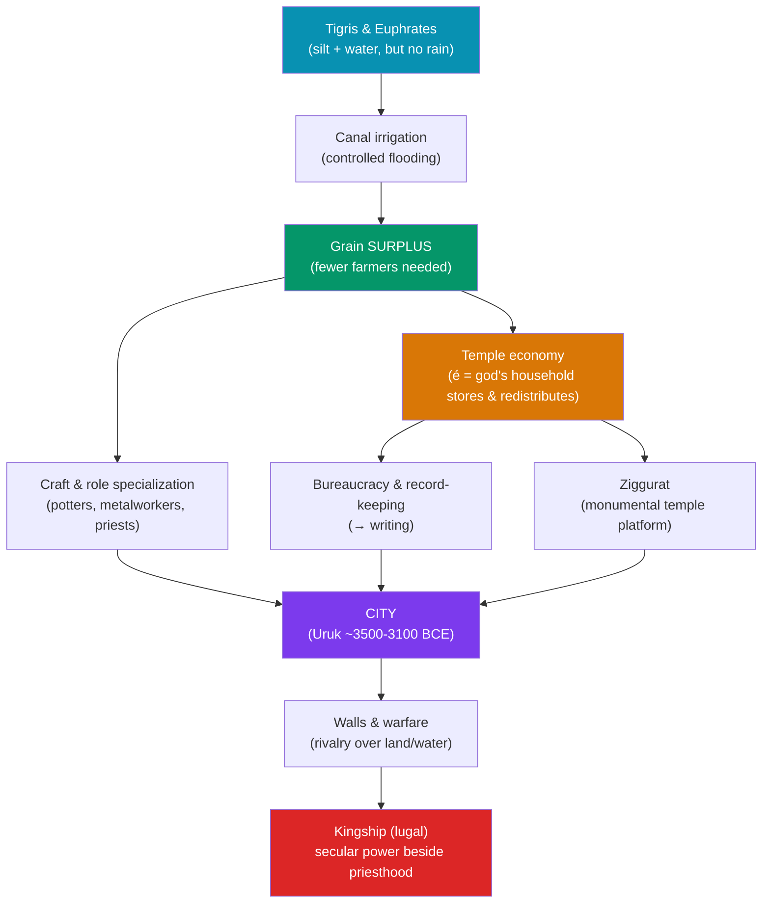

# 🏛️ Sumer and the First Cities

> [!abstract] TL;DR
> Between roughly **3500 and 3100 BCE**, in the southern floodplain of the Tigris and Euphrates, the settlement of **Uruk** swelled into what most historians call the **world's first city** — tens of thousands of people living off irrigated grain surpluses they could not have produced alone. Sumer was never a unified state but a mosaic of rival **city-states** — Uruk, Ur, Lagash, Eridu, Nippur, Kish — each centered on a god's temple and its towering **ziggurat**. The temple began as landlord, granary, and bank of a **redistributive economy**, and out of the need to manage that surplus came the twin engines of civilization: a **bureaucracy** that invented writing to keep accounts, and a warrior-**kingship** (the *lugal*, "big man") that grew beside the priesthood. Sumer gives us the first cities, the first kings, the first bureaucrats — and, in Gilgamesh of Uruk, the first named literary hero.

## Intuition — analogy first

Think of early Mesopotamia as a **desert with a plumbing problem** and a brilliant solution.

The southern plain is hot, nearly rainless, and flat — but two great rivers run through it carrying silt and water. Left alone, that water floods unpredictably and then vanishes. The Sumerians turned the problem into a windfall by digging **canals**: spread the river across the fields on your schedule, not its own, and the silt-rich soil produces grain surpluses so large that most people no longer need to farm.

Now ask the question that makes cities: *what do you do with the extra grain, and who decides?* You need someone to **store** it (a big building), **count** it (record-keepers), **defend** it (soldiers and walls), and **allocate** it (an authority). The big building is the **temple**; the counters become **scribes** and invent writing; the defenders' leader becomes the **king**. A city, in this sense, is what a grain surplus grows into once you build the institutions to manage it. The ziggurat rising over Uruk is that surplus made visible — a mountain of mud-brick that says *this is where the wealth, the god, and the power live.*

---

## How It Works — From Surplus to City-State

## Key Concepts

### The Uruk Phenomenon (~3500–3100 BCE)

The **Uruk period** is named for the site that defines it. At its peak Uruk may have held **40,000–80,000 people** inside a wall later legend credited to Gilgamesh, spread over roughly **250 hectares** — an order of magnitude larger than any earlier settlement. Its two great sacred precincts, the **Eanna** (dedicated to **Inanna**, goddess of love and war) and the **Anu district** with its **White Temple**, anchored the skyline. Uruk pioneered mass-produced **bevel-rim bowls** (probably ration containers), the potter's wheel, and the first **proto-cuneiform** clay tablets (~3200 BCE). So influential was its material culture across the Near East that archaeologists speak of the "**Uruk expansion**."

### City-States, Not an Empire

Sumer was a patchwork of independent, competing **city-states** (*a "state" the size of a city and its hinterland*), each believing itself the earthly estate of a patron deity.

| City | Patron deity | Noted for |
|------|-------------|-----------|
| **Eridu** | Enki (Ea) | Regarded by Sumerians as the oldest city; first on the King List |
| **Uruk** | Inanna / Anu | Largest early city; home of legendary king Gilgamesh |
| **Ur** | Nanna (Sin, moon) | Royal Cemetery; Great Ziggurat of Ur-Nammu |
| **Lagash** | Ningirsu | Eannatum's conquests; Gudea's statues; earliest reform texts |
| **Nippur** | Enlil | Pan-Sumerian religious capital (no dynasty, but sacred) |
| **Kish** | Zababa | "Kingship" first descended here per the Sumerian King List |

Their rivalry — especially the centuries-long border war between **Lagash and Umma** over the Guedena farmland — is among the first documented wars, commemorated on the **Stele of the Vultures** (c. 2450 BCE) of **Eannatum of Lagash**.

### Ziggurats and the Temple Economy

The **ziggurat** was a stepped platform of sun-dried mud-brick raising a shrine toward the heavens — a "bond between heaven and earth." The best-preserved, the **Great Ziggurat of Ur**, was built by **Ur-Nammu** (c. 2100 BCE) for the moon god Nanna. But the temple (Sumerian *é*, "house") was not only religious: it was the economic heart of the city. In the **temple/palace economy**, much land, herds, and labor were held in the god's name; the temple collected produce, stored it, and **redistributed** rations to dependents and workers — a centrally administered rather than market economy. Tracking who owed and received what is precisely what drove the invention of writing (see [[Cuneiform_and_the_Code_of_Hammurabi]]).

### The Rise of Kingship (Lugal) and Bureaucracy

Authority in early Sumer was split between the temple's chief administrator, the **ensi** (governor / priestly steward), and the **lugal** (literally "big man"), a war-leader whose power became permanent and hereditary as inter-city conflict intensified. The **Sumerian King List** later fused myth and record, granting antediluvian kings reigns of tens of thousands of years and noting how "kingship descended from heaven" and passed from city to city. Beneath the ruler stood the first true **bureaucracy**: literate **scribes** (*dubsar*), tax and ration accounts, sealed contracts, and standardized measures — the administrative machinery a city cannot run without. Sumer also bequeathed the **sexagesimal** (base-60) system behind our 60-minute hour and 360-degree circle.

### Gilgamesh — History Behind Legend

**Gilgamesh** appears on the King List as an early ruler of Uruk (c. 2700 BCE) and became the hero of the *Epic of Gilgamesh*, the oldest great work of literature, treating friendship, mortality, and a flood narrative that predates and parallels the biblical one (see [[_MOC_Mesopotamian_Myth]]). Whether or not the historical man matched the legend, the epic shows a civilization already reflecting on kingship, hubris, and the walls of its own first city.

## Primary Sources & Examples

- **The Warka (Uruk) Vase** (c. 3200–3000 BCE): a carved alabaster vessel depicting offerings brought to Inanna's temple — a visual snapshot of the temple economy and its redistributive hierarchy.
- **The Sumerian King List:** a later scribal compilation blending mythic and historical reigns; invaluable for how Sumerians conceptualized kingship "descending from heaven," even as its numbers are fantastical.
- **The Stele of the Vultures** (c. 2450 BCE): commemorates Eannatum of Lagash's victory over Umma — among the earliest historical war monuments and the first depiction of an organized phalanx.
- **The Reforms of Urukagina** of Lagash (c. 2350 BCE): often called the first recorded legal/social reform, curbing abuses by officials and protecting the vulnerable.

## Common Pitfalls / Misconceptions

- **"The Sumerians were an empire."** No — Sumer was a *cultural region* of independent, quarrelsome city-states. Political unification came later, from the outside, with Sargon of Akkad (see [[Mesopotamian_Empires]]).
- **"Cities came first, then farming."** The causation runs the other way: irrigated agriculture and its **surplus** were the precondition for urban life, not a byproduct of it.
- **"Ziggurats are tombs like the pyramids."** They are temple platforms, not burial monuments; no one was interred inside a ziggurat.
- **"Kings ruled because they were priests."** Early on, secular kingship (*lugal*) and temple authority (*ensi*) were distinct and sometimes rival institutions; their fusion was gradual.
- **"Sumerian is an early Semitic language."** Sumerian is a **language isolate**, unrelated to the Semitic Akkadian that later dominated Mesopotamia.

## Related Concepts

- [[_MOC_Mesopotamia_Egypt|↑ Section MOC]] — the section hub
- [[Cuneiform_and_the_Code_of_Hammurabi]] — writing was invented *inside* the temple economy described here, to keep its accounts
- [[Mesopotamian_Empires]] — the sequel: how these independent city-states were welded into the first empires
- Cross-vault: [[_MOC_Mesopotamian_Myth]] — Inanna, Enki, Enlil, and the *Epic of Gilgamesh* that Uruk produced
- Cross-vault: [[_MOC_Prehistory]] — the Neolithic farming revolution whose surpluses made cities possible

## Review Questions

1. Explain the causal chain from the geography of the southern Mesopotamian floodplain to the emergence of the first cities. Why was irrigation the pivotal link?
2. What was the "temple economy," and how did the need to administer it drive the development of both writing and bureaucracy?
3. Distinguish the roles of the *ensi* and the *lugal*. Why did permanent kingship grow more powerful over time in a landscape of competing city-states?

## Sources

- Van De Mieroop, M. (2015). *A History of the Ancient Near East, c. 3000–323 BC* (3rd ed.). Wiley-Blackwell
- Kramer, S.N. (1963). *The Sumerians: Their History, Culture, and Character*. University of Chicago Press
- Crawford, H. (2004). *Sumer and the Sumerians* (2nd ed.). Cambridge University Press
- Liverani, M. (2006). *Uruk: The First City*. Equinox

#history #mesopotamia #sumer #uruk #city-states #urbanism
