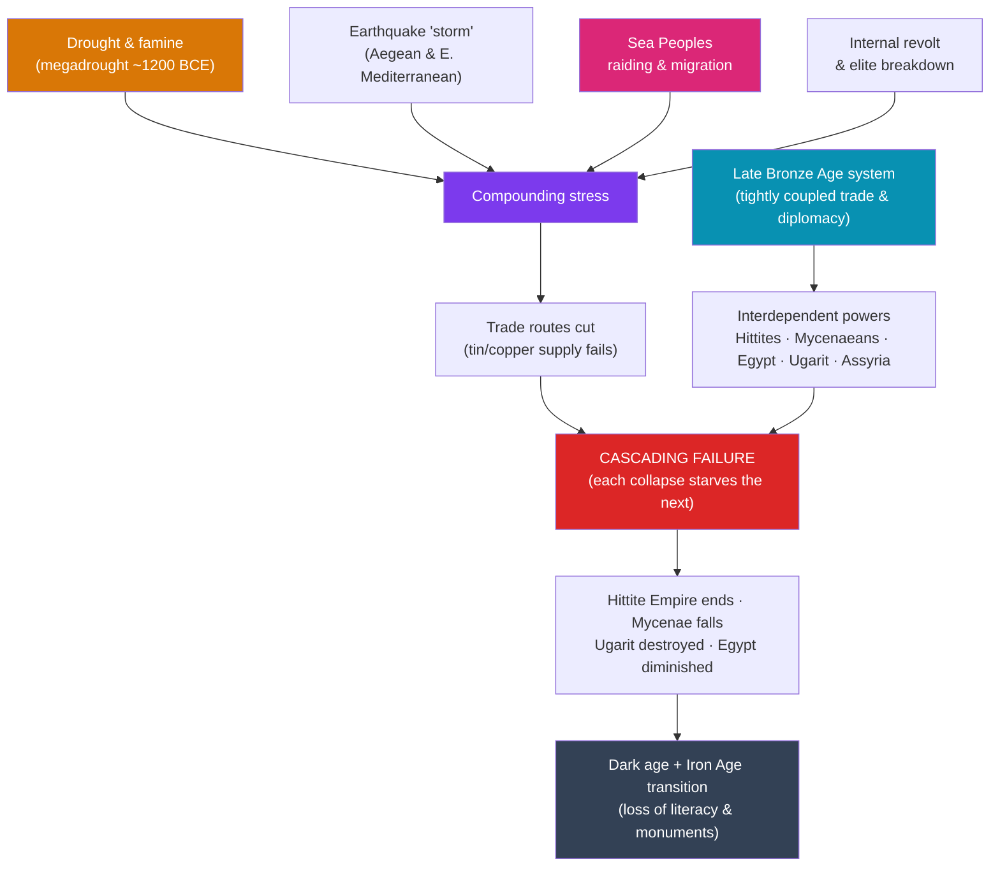

# 🌊 The Bronze Age Collapse

> [!abstract] TL;DR
> Around **1200–1150 BCE**, the interconnected civilizations of the eastern Mediterranean and Near East fell apart within a single lifetime. The **Hittite Empire** vanished, the **Mycenaean** palaces of Greece burned, the great trading city of **Ugarit** was destroyed, and even **Egypt's New Kingdom** survived only battered and diminished. Contemporary sources blame the mysterious **Sea Peoples**, but no single cause fits: the modern consensus, argued most influentially by **Eric Cline** in *1177 BC: The Year Civilization Collapsed* (2014), is a **"perfect storm" of systems collapse** — drought and famine, earthquakes, warfare and migration, and above all the **breakdown of a fragile, hyper-connected trade network** that no one polity could survive losing. The aftermath was a centuries-long **dark age** and the transition from the Bronze Age to the **Iron Age**.

## Intuition — analogy first

Think of the Late Bronze Age as a **just-in-time global supply chain** — and the collapse as what happens when it seizes up all at once.

Bronze, the age's defining metal, requires **copper** *and* **tin**, and tin had to travel thousands of miles (much of it from Afghanistan). No kingdom was self-sufficient; every palace depended on long-distance trade in metals, grain, timber, and luxury goods, greased by diplomatic gift-exchange between "brother" kings. It was efficient and prosperous — and **brittle**. Like a modern economy where a single factory or shipping lane failing can empty shelves worldwide, the Bronze Age world had **densely coupled** its fortunes together.

Now hit that system with several shocks at once: a decades-long **drought** wrecks harvests, **earthquakes** flatten cities, **raiders and migrants** cut the trade routes, and hungry populations **revolt**. In a resilient, loosely connected world, any one shock is survivable. In a tightly coupled one, the shocks **cascade** — a failure in one node starves the next, which collapses and starves the one after that. The Sea Peoples may be less the *cause* than a **symptom**: desperate people on the move because their own world had already begun to fail. That is what historians mean by **systems collapse**.

---

## How It Works — Cascading Systems Collapse

## Key Concepts

### The Interconnected Late Bronze Age World

By around 1300 BCE the eastern Mediterranean hosted a genuinely **international system** of great powers: **Egypt's New Kingdom** (see [[Ancient_Egypt_Kingdoms]]), the **Hittite Empire** in Anatolia (capital **Hattusa**), **Mycenaean Greece**, **Assyria** and **Babylonia** (see [[Mesopotamian_Empires]]), **Cyprus** (Alashiya), and hub trading cities like **Ugarit** on the Levantine coast. The **Amarna Letters** — diplomatic correspondence in Akkadian cuneiform — reveal kings addressing one another as "brother," exchanging gifts, gold, and princesses. This prosperity rested on **long-distance trade**, especially in the **tin and copper** needed to make bronze, binding every state's fate to the others'.

### The Casualties (c. 1200–1150 BCE)

| Civilization | Fate | Approx. date |
|---|---|---|
| **Hittite Empire** | Capital **Hattusa** burned/abandoned; empire dissolved | c. 1200–1180 BCE |
| **Mycenaean Greece** | Palaces (Mycenae, Pylos, Tiryns) destroyed; Linear B literacy lost | c. 1200–1180 BCE |
| **Ugarit** | City destroyed and never reoccupied; final tablets describe enemy ships | c. 1185 BCE |
| **Egypt (New Kingdom)** | Survived but lost its empire and entered long decline | after c. 1177 BCE |
| **Kassite Babylon / Assyria** | Weakened and contracted, but survived | 12th century BCE |

The near-**simultaneity** across a huge region is what makes the collapse so striking and demands a systemic, not local, explanation.

### The Sea Peoples

The **Sea Peoples** are a loose confederation of seaborne raiders and migrants named in Egyptian records — groups such as the **Peleset** (linked to the biblical **Philistines**), **Sherden**, **Shekelesh**, and others. Pharaoh **Merneptah** fought them c. 1207 BCE, and **Ramesses III** recorded a great land-and-sea battle against them in his **Year 8** (c. **1177 BCE**) on the temple walls of **Medinet Habu**, claiming they had already swept away Hatti, Cyprus, and the Levant. Modern scholars increasingly view them not as a single invading army but as **displaced peoples on the move** — as much a *consequence* of the collapse as a cause.

### Competing and Combined Causes

No single explanation suffices; historians now favor a **multi-causal, systems-collapse** model:

- **Climate change / drought:** paleoclimate data (pollen cores from the Sea of Galilee and Cyprus, isotope records) indicate a severe, prolonged **drought/megadrought** and famine across the region around 1200 BCE.
- **Earthquakes:** archaeoseismologists (notably **Amos Nur**) argue an "**earthquake storm**" — a cluster of major quakes along active faults — toppled cities across the Aegean and Levant within decades.
- **Warfare and migration:** the Sea Peoples and other movements severed trade and sacked cities.
- **Internal rebellion:** stressed populations may have risen against palace elites who could no longer guarantee food or protection.
- **Systems collapse:** **Eric Cline** synthesizes these in *1177 BC*, arguing the decisive factor was the **fragility of the interconnected network itself** — remove enough nodes and the whole tightly coupled system unravels, a "**perfect storm**" no single shock could have caused alone.

### Aftermath — Dark Age and the Iron Age

The collapse ushered in a **dark age**: populations shrank, monumental building ceased, and **writing was lost** in some regions (Greece forgot **Linear B**, entering a centuries-long illiterate interval before adopting the alphabet). Yet the disruption also midwifed the **Iron Age** — with tin trade broken, ironworking spread as an alternative to bronze. Some peoples rose from the wreckage: the **Phoenicians** of coastal cities like **Tyre** and **Sidon** flourished in the trade vacuum and spread the **alphabet**, and smaller states (including early Israel) emerged in the Levant. The centralized palace civilizations of the Bronze Age, however, were gone for good.

## Primary Sources & Examples

- **The Medinet Habu reliefs and inscriptions** (Ramesses III, c. 1177 BCE): Egypt's detailed record of the land and sea battles against the Sea Peoples — the single most important textual source.
- **The last letters of Ugarit** (c. 1185 BCE): baked in the fire that destroyed the city, one tablet reportedly warns that "enemy ships" have been sighted and the city is undefended.
- **Paleoclimate proxies:** pollen cores from the Sea of Galilee (Kaniewski et al.) and speleothem/isotope data indicating drought c. 1250–1100 BCE.
- **The Merneptah Stele** (c. 1207 BCE): records earlier clashes with Libyans and Sea Peoples (and the first extrabiblical mention of "Israel").

## Common Pitfalls / Misconceptions

- **"The Sea Peoples caused the collapse."** They are better understood as a **symptom and accelerant** of a wider crisis, and their identity and origins remain genuinely obscure.
- **"It was one single cause."** The scholarly consensus is explicitly **multi-causal** — drought, earthquakes, war, and network fragility compounding one another.
- **"Everything was destroyed everywhere."** Egypt, Assyria, and Elam **survived** in reduced form; the collapse was severe but uneven.
- **"Iron was a superior wonder-metal that caused the change."** Early iron was not clearly better than bronze; its spread owed much to the **disruption of the tin trade**, not sudden metallurgical superiority.
- **"A dark age means nothing happened."** The "dark age" reflects a loss of *records and monuments*, not of all activity — and it incubated the alphabet, new peoples, and the Iron Age world.

## Related Concepts

- [[_MOC_Mesopotamia_Egypt|↑ Section MOC]] — the section hub
- [[Ancient_Egypt_Kingdoms]] — the New Kingdom whose empire the collapse ended, and Ramesses III's defense against the Sea Peoples
- [[Mesopotamian_Empires]] — Assyria and Babylon as survivors, and the Near Eastern powers linked in the Bronze Age system
- [[Sumer_and_the_First_Cities]] — the deep origin of the interconnected urban world that unraveled here
- Cross-vault: [[_MOC_Classical_Antiquity]] — the Iron Age and archaic Greece that emerged from the ensuing dark age

## Review Questions

1. Why does the *near-simultaneity* of the Late Bronze Age collapses across many regions point toward a systemic rather than a local explanation?
2. List and briefly assess at least four proposed causes of the collapse. What does Eric Cline mean by a "systems collapse" or "perfect storm"?
3. Who were the Sea Peoples, and why do many historians now regard them as a consequence of the crisis as much as a cause of it?

## Sources

- Cline, E.H. (2014). *1177 BC: The Year Civilization Collapsed*. Princeton University Press
- Drews, R. (1993). *The End of the Bronze Age: Changes in Warfare and the Catastrophe ca. 1200 B.C.* Princeton University Press
- Kaniewski, D. et al. (2013). "Environmental Roots of the Late Bronze Age Crisis." *PLoS ONE*
- Nur, A. & Cline, E.H. (2000). "Poseidon's Horses: Plate Tectonics and Earthquake Storms in the Late Bronze Age." *Journal of Archaeological Science*

#history #bronze-age #collapse #sea-peoples #systems-collapse #iron-age
