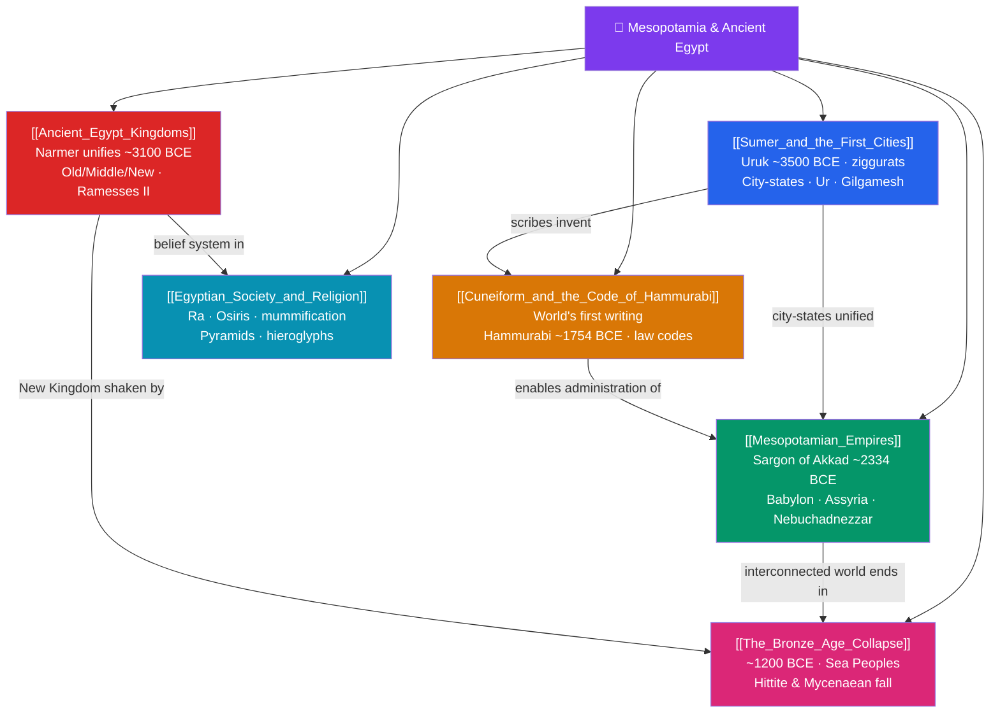

# 🗺️ Mesopotamia & Ancient Egypt — Map of Content

> [!abstract] What This Section Covers
> Civilization proper begins in two river valleys. In Mesopotamia — the land between the Tigris and Euphrates — **Sumer built the first cities** such as Uruk around 3500 BCE, with monumental ziggurats and independent city-states, before being welded into the **first empires** by Sargon of Akkad (c. 2334 BCE), Hammurabi's Babylon, and the militarized Assyrians. These societies invented **cuneiform writing** and codified law in the **Code of Hammurabi** (c. 1754 BCE), with its "eye for an eye" principle. In the Nile valley, the **kingdoms of ancient Egypt** — Old, Middle, and New — were unified c. 3100 BCE under Narmer and ruled by god-kings from Khufu to Ramesses II. **Egyptian society and religion** revolved around Ra and Osiris, mummification, pyramids, and hieroglyphs later decoded via the Rosetta Stone. The section closes with the **Bronze Age Collapse** (c. 1200 BCE), when the Sea Peoples and cascading systems failures toppled an interconnected Near Eastern world.

## Concept Map

## Learning Path

1. [[Sumer_and_the_First_Cities]] — The world's first urban civilization: Uruk, temple-centered city-states, ziggurats, and the epic of Gilgamesh.
2. [[Cuneiform_and_the_Code_of_Hammurabi]] — The birth of writing, record-keeping and bureaucracy, and one of history's earliest written law codes.
3. [[Mesopotamian_Empires]] — From Sargon's Akkadian conquest through Babylonian and Assyrian imperial power.
4. [[Ancient_Egypt_Kingdoms]] — The unification of Egypt and the arc of the Old, Middle, and New Kingdoms along the Nile.
5. [[Egyptian_Society_and_Religion]] — Gods, the afterlife, pyramid-building, mummification, and the hieroglyphic script.
6. [[The_Bronze_Age_Collapse]] — The near-simultaneous fall of Late Bronze Age civilizations and the debate over its causes.

## All Notes at a Glance

| Note | Difficulty | What You'll Learn |
|------|------------|-------------------|
| [[Sumer_and_the_First_Cities]] | Beginner → Intermediate | Uruk, Ur, Lagash, ziggurats, temple economy, city-state politics, Gilgamesh |
| [[Mesopotamian_Empires]] | Intermediate | Akkadian, Old Babylonian, Assyrian, and Neo-Babylonian empires; kingship and conquest |
| [[Cuneiform_and_the_Code_of_Hammurabi]] | Intermediate | Origins of writing, scribal culture, Hammurabi's law code, lex talionis, class-based justice |
| [[Ancient_Egypt_Kingdoms]] | Beginner → Intermediate | Unification under Narmer, the three kingdoms, pharaohs, Nile-based agriculture and power |
| [[Egyptian_Society_and_Religion]] | Intermediate | Polytheism, Ra/Osiris/Isis, mummification, pyramids, hieroglyphs, the Rosetta Stone |
| [[The_Bronze_Age_Collapse]] | Intermediate → Advanced | Sea Peoples, systems-collapse theory, drought, and the transition to the Iron Age |

## Key Questions This Section Answers

- Why did the world's first cities and states emerge in Mesopotamia and Egypt rather than elsewhere?
- How did the invention of cuneiform writing transform administration, law, and memory?
- What does the Code of Hammurabi reveal about justice, class, and power in Babylon?
- Why were Egyptian civilization and religion so preoccupied with death, the afterlife, and monumental building?
- What caused the sudden collapse of the interconnected Bronze Age world around 1200 BCE?

## Related Sections

- [[_MOC_History_Master|↑ History Master MOC]]
- [[_MOC_Prehistory|← Prehistory & Human Origins]]
- [[_MOC_Classical_Antiquity|→ Classical Antiquity]]

#MOC #History #AncientNearEast
