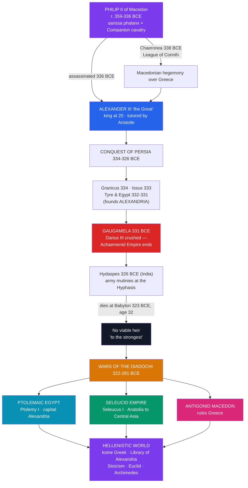

# ⚔️ Alexander and the Hellenistic World

> [!abstract] TL;DR
> In little more than a decade, one Macedonian king conquered the largest empire the world had yet seen and permanently fused Greek and Near Eastern civilisation. **Philip II of Macedon** first built the war machine — the **sarissa** pike-phalanx and heavy **Companion cavalry** — and subdued Greece at **Chaeronea (338 BCE)**. His son **Alexander the Great** used that army to destroy the Persian Empire in a string of unbeaten victories — **Granicus, Issus, and the decisive Gaugamela (331 BCE)** — pushing all the way to the **Indus in India** before his army turned back. His sudden **death at Babylon in 323 BCE**, aged 32, with no viable heir, shattered the empire among his generals, the **Diadochi**, whose wars produced the great **successor kingdoms — Ptolemaic Egypt, the Seleucid Empire, and Antigonid Macedon**. The resulting **Hellenistic age** spread **koine Greek**, made **Alexandria** and its **Library** the intellectual capital of the world, and lasted until Rome swallowed the last kingdom in 30 BCE.

## Intuition — analogy first

Picture a **start-up founder who conquers an entire industry in ten years, then dies suddenly with no succession plan** — and watch his lieutenants carve the company into rival firms.

Philip built the "product": a professional army so superior it could beat anything in the known world. Alexander inherited it at 20 and went on the most audacious expansion in history, buying out the world's biggest incumbent — the vast Persian Empire — not by outspending it but by winning every decisive engagement. He kept pushing east until his own exhausted "employees" refused to go further, at the rivers of India.

Then, at 32, the founder dropped dead in Babylon with a newborn heir and a pregnant wife and, asked who should inherit, reportedly said only "**to the strongest.**" The result was a decades-long boardroom war among his generals — the **Diadochi**, the "Successors" — that split the empire into three great regional franchises: **Egypt**, the **Near East**, and **Macedon-Greece**. But the *culture* the founder spread outlived any single kingdom. Just as a dominant company's file formats and jargon become an industry standard, **Greek language, city planning, coinage, and science became the shared operating system** of a whole world stretching from the Adriatic to Afghanistan — the Hellenistic age.

---

## How It Works — Conquest, Death, and Fragmentation

## Key Concepts

### Philip II and the Macedonian Military Revolution

**Macedon**, a semi-Greek kingdom on the northern fringe of the Greek world, was transformed by **Philip II (r. 359–336 BCE)** into the region's dominant power. His army was a **combined-arms** system unlike the old hoplite phalanx:

- The **sarissa** — a pike up to **~6 metres** long, wielded two-handed, so that the front five ranks projected spearpoints; the **Macedonian phalanx** was a hedgehog that pinned the enemy in place.
- The **Companion cavalry (*hetairoi*)** — heavy shock horsemen who delivered the decisive blow, often as a wedge, while the phalanx held the line (the "hammer and anvil").
- Professional, drilled, year-round troops, plus advanced **siege engines** (torsion catapults).

At **Chaeronea (338 BCE)** Philip crushed a coalition led by Athens and Thebes and organised the Greek states into the **League of Corinth** under his leadership, nominally to invade Persia. He was **assassinated in 336 BCE**, leaving both the army and the plan to his son.

### Alexander's Conquests (334–323 BCE)

**Alexander III (356–323 BCE)**, tutored as a boy by **Aristotle**, crossed into Asia in **334 BCE** and never lost a pitched battle:

| Battle / Event | Year | Significance |
|----------------|------|--------------|
| **Granicus** | 334 BCE | First major victory; opens Asia Minor |
| **Issus** | 333 BCE | Defeats **Darius III** in person; Darius flees |
| **Siege of Tyre** | 332 BCE | Brutal seven-month siege secures the coast |
| **Egypt / founding of Alexandria** | 332–331 BCE | Welcomed as liberator; founds his greatest city |
| **Gaugamela** | 331 BCE | Decisive defeat of Darius III — ends the **Achaemenid Persian Empire** |
| **Hydaspes** | 326 BCE | Defeats King **Porus** in India; his farthest victory |
| **Mutiny at the Hyphasis** | 326 BCE | Exhausted army refuses to march further east |

After Gaugamela he took **Babylon, Susa, and Persepolis** (whose palace was burned), married the Bactrian princess **Roxana**, and adopted elements of Persian dress and court ceremony — a controversial policy of fusion. He died of a fever at **Babylon in June 323 BCE**, aged **32**, leaving an empire stretching from Greece to the Indus.

### The Diadochi and the Successor Kingdoms

With only a mentally incapable half-brother and a posthumous son as heirs, the empire was doomed to fragment. Alexander's leading generals, the **Diadochi ("Successors")**, fought the **Wars of the Successors (322–281 BCE)**, a bloody scramble climaxing at battles such as **Ipsus (301 BCE)**. Three durable kingdoms emerged:

- **Ptolemaic Egypt** — founded by **Ptolemy I Soter**, ruled from **Alexandria**; the longest-lived, ending only with **Cleopatra VII** in 30 BCE.
- **Seleucid Empire** — founded by **Seleucus I Nicator**, the largest, sprawling from Anatolia across Mesopotamia and Persia toward Central Asia, ruled from **Antioch** and **Seleucia**.
- **Antigonid Macedon** — the dynasty of **Antigonus II Gonatas**, controlling Macedon and mainland Greece.

(Later the **Attalids of Pergamon** and the breakaway **Greco-Bactrian** kingdom joined the mosaic.)

### The Hellenistic World and Its Culture

The **Hellenistic age (323–31 BCE)** — bookended by Alexander's death and Rome's victory at Actium — was a cosmopolitan fusion of Greek and Near Eastern civilisation:

- **Koine Greek** ("common" Greek) became the **lingua franca** from Egypt to Bactria — the language of trade, administration, and later the New Testament.
- **Alexandria** became the intellectual capital, its **Library and Museum (*Mouseion*)** the greatest research institution of antiquity. Scholars there included **Euclid** (*Elements*, geometry), **Eratosthenes** (who measured the Earth's circumference and served as chief librarian), and **Aristarchus** (an early heliocentric proposal); **Archimedes** of Syracuse corresponded with them.
- New **philosophies of the individual** flourished — **Stoicism** (founded by **Zeno of Citium**), **Epicureanism**, **Cynicism**, and Skepticism — suited to a world of vast kingdoms rather than small self-governing poleis.
- **Art** turned emotional and realistic — the *Dying Gaul*, the *Winged Victory of Samothrace*, the *Venus de Milo*, and the *Laocoön*.

## Primary Sources & Examples

- **Arrian, *Anabasis of Alexander* (2nd c. CE):** the most reliable narrative of the campaigns, based on lost eyewitness accounts by Ptolemy and Aristobulus — a case study in using near-contemporary sources filtered through a later historian.
- **Plutarch, *Life of Alexander*:** a moralising biography rich in anecdote (the taming of Bucephalus, the Gordian knot) — vivid but to be read critically.
- **The Rosetta Stone (196 BCE):** a Ptolemaic decree in Greek, demotic, and hieroglyphs — a literal artefact of Greek-Egyptian fusion, and the key that unlocked hieroglyphics.
- **The Alexander Mosaic (Pompeii, c. 100 BCE):** a Roman copy of a Hellenistic painting depicting Alexander charging Darius III at Issus — evidence of the enduring image of the conqueror.
- **Euclid's *Elements* (c. 300 BCE):** produced in Ptolemaic Alexandria; the most influential mathematics textbook in history.

## Common Pitfalls / Misconceptions

- **Crediting Alexander alone.** The army, tactics, and the very plan to invade Persia were **Philip II's** achievement; Alexander inherited a finished war machine and a casus belli.
- **Imagining a lasting "Alexandrian Empire."** The unified empire barely outlived Alexander; within a generation it was permanently split among the Diadochi. Its true legacy was cultural, not political.
- **Overstating cultural fusion as harmony.** Hellenisation was often a thin ruling-class veneer over Egyptian, Persian, and Jewish populations; it produced tension and revolt (e.g. the Maccabean revolt against Seleucid rule) as well as exchange.
- **Confusing "Hellenic" with "Hellenistic."** *Hellenic* refers to Classical Greece itself; *Hellenistic* refers to the post-Alexander, Greek-influenced but hybrid world from 323 to 31 BCE.
- **The "one Library of Alexandria burning" myth.** The Library's decline was gradual and multi-causal over centuries, not a single dramatic fire; the popular story oversimplifies.

## Related Concepts

- [[_MOC_Classical_Antiquity|↑ Section MOC]] — the Classical Antiquity hub
- [[Athenian_Democracy_and_Greek_Culture]] — the classical Greek culture (and Aristotle) that Alexander carried east
- [[Ancient_Greece_and_the_Polis]] — the independent polis world whose autonomy Macedon and the Hellenistic kingdoms ended
- [[The_Roman_Republic]] — the power that conquered the Hellenistic kingdoms one by one and inherited their culture
- [[The_Roman_Empire]] — Rome absorbed the last kingdom (Ptolemaic Egypt, 30 BCE) and made koine Greek the language of its eastern half
- Cross-vault: [[_MOC_Mathematics_Master]] — Euclid's *Elements* and Alexandrian geometry, a direct product of this age
- Cross-vault: [[_MOC_Mythology_Master]] — the ruler cult and syncretic Greco-Egyptian deities (e.g. Serapis) of the Hellenistic kingdoms

## Review Questions

1. What specific military innovations did Philip II introduce, and how did the sarissa phalanx and Companion cavalry work together as a "hammer and anvil"?
2. Order and explain the significance of Granicus, Issus, Gaugamela, and the Hydaspes. Why is Gaugamela (331 BCE) the turning point of the whole campaign?
3. Why did Alexander's empire fragment so quickly after 323 BCE, and what were the three main successor kingdoms? Distinguish "Hellenic" from "Hellenistic."

## Sources

- Arrian (2nd c. CE). *The Campaigns of Alexander* (trans. de Sélincourt, Penguin Classics)
- Green, P. (1990). *Alexander to Actium: The Historical Evolution of the Hellenistic Age*. University of California Press
- Cartledge, P. (2004). *Alexander the Great: The Hunt for a New Past*. Macmillan
- Bugh, G.R. (ed.) (2006). *The Cambridge Companion to the Hellenistic World*. Cambridge University Press

#history #classical-antiquity #greece #macedon #alexander #hellenistic
