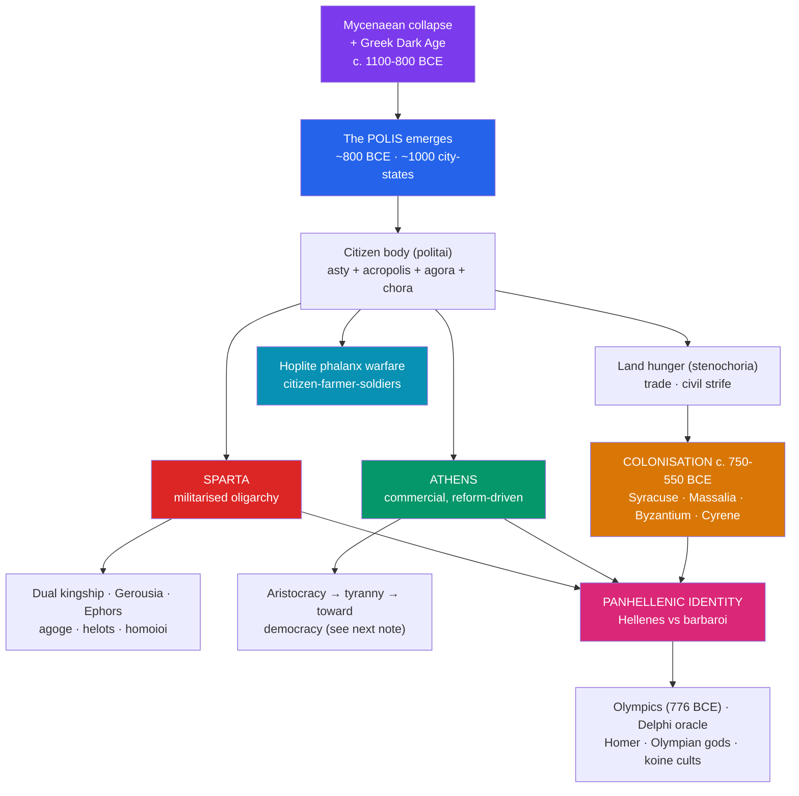

# 🏛️ Ancient Greece and the Polis

> [!abstract] TL;DR
> After the collapse of Mycenaean palace society and a "Dark Age" (c. 1100–800 BCE), the Greeks reorganised not into a kingdom or empire but into roughly a **thousand independent city-states — the polis**. Each polis was a small, fiercely autonomous community of citizens fused to its patch of countryside, and land hunger drove a wave of **colonisation** (c. 750–550 BCE) that seeded Greek towns from Marseille to the Black Sea. Two poleis became archetypes of opposite futures: **Sparta**, a militarised oligarchy that turned its whole society into an army to hold down the enslaved **helots**, and **Athens**, a commercial, restless state edging toward democracy. Their shared style of war — the citizen-soldier **hoplite** fighting shoulder-to-shoulder in the **phalanx** — and a shared **Panhellenic identity** (the Olympics, the oracle at Delphi, Homer, the Olympian gods) bound these rivals into one recognisably *Greek* world.

## Intuition — analogy first

Think of Archaic Greece not as a country but as a **mountainous archipelago of stubbornly independent towns**, each one a walled club with strict membership rules.

The rugged terrain — mountains and sea slicing the land into pockets — meant no single ruler could dominate. So each valley grew its own self-governing town, the **polis**: a downtown (the *asty*, usually with a fortified *acropolis* and an open *agora* marketplace) plus the farmland (*chora*) that fed it. Being "Athenian" or "Corinthian" was like belonging to a walled club — you were a member (*politēs*) or you were not, and the club made its own laws, minted its own coins, worshipped its own patron god, and went to war on its own account.

When a club grew too crowded, it did what a beehive does: it **swarmed**, sending out settlers to found a daughter-town overseas — a *colony*. And though these clubs fought each other constantly, they all recognised each other as members of one **super-league** called *Hellas*: they spoke dialects of one language, read the same Homer, prayed to the same twelve gods, and every four years called a truce to compete at Olympia. Everyone else was a *barbaros* — someone whose speech sounded like "bar-bar." Two clubs ran on opposite rules: Sparta was a **boot camp** that never let out; Athens was a **trading floor** that kept widening the franchise.

---

## How It Works — Anatomy of the Polis and Its Two Faces

## Key Concepts

### The Polis — a New Kind of Community

The **polis** (plural *poleis*) was the defining institution of Greek civilisation, crystallising in the **Archaic period (c. 800–480 BCE)**. It was less a *place* than a *body of citizens*: the Greeks said "the Athenians" did something, rarely "Athens." A typical polis combined an urban centre (the *asty*), often crowned by a defensible **acropolis** and organised around the **agora** (civic and market square), with the surrounding farmland (*chora*) that made it self-sufficient. Many poleis formed through **synoikismos**, the amalgamation of neighbouring villages into one political unit.

Most poleis were tiny — a few thousand citizens. Their politics cycled through recognisable stages: rule by land-owning **aristocracies** (e.g. the *Eupatridai* at Athens), sometimes overthrown by populist strongmen called **tyrants** (a neutral Greek word for an unconstitutional ruler, such as Peisistratus at Athens or Cypselus at Corinth), and, in a few cases, toward **oligarchy** or **democracy**.

### Colonisation of the Mediterranean

Between roughly **750 and 550 BCE**, overpopulation and land shortage (*stenochoria*), trade opportunity, and political feuding pushed poleis to found **colonies** (*apoikiai*) across the Mediterranean and Black Sea. A **mother-city (*metropolis*)** would appoint a founder (*oikistēs*), typically consult the **oracle at Delphi** for sanction, and dispatch settlers who founded a new, formally independent polis that kept cultural and religious ties to home.

| Colony | Founded by | Approx. date | Modern location |
|--------|-----------|--------------|-----------------|
| **Syracuse** | Corinth | 734 BCE | Sicily, Italy |
| **Neapolis** ("new city") | Cumae/Euboeans | c. 600 BCE | Naples, Italy |
| **Massalia** | Phocaea | c. 600 BCE | Marseille, France |
| **Byzantion** | Megara | c. 657 BCE | Istanbul, Turkey |
| **Cyrene** | Thera | c. 631 BCE | Libya |

**Miletus** alone was said to have founded dozens of Black Sea colonies. This diaspora spread the Greek alphabet, coinage, and urban culture — and later gave Rome its first close contact with Hellenism through *Magna Graecia*, the Greek cities of southern Italy and Sicily.

### Hoplite Warfare and the Phalanx

From the **7th century BCE**, Greek warfare was dominated by the **hoplite**: a heavily armed infantryman, usually a middling farmer wealthy enough to buy his own bronze **panoply** — the round **aspis** (or *hoplon*) shield about a metre across, a thrusting spear (**dory**) around 2.5 m, a short sword (**xiphos**), plus helmet, breastplate, and greaves.

Hoplites fought in the **phalanx**: a dense rectangular block, typically **eight ranks deep**, each man's shield protecting the left side of his neighbour. Battles were brutal shoving matches — the **othismos**, or "push" — decided quickly by which line broke first. Because the phalanx depended on ordinary property-owning citizens standing together, historians have long linked the "hoplite" to the rise of more broadly based, egalitarian politics: the men who fought as equals increasingly demanded a political voice.

### Sparta — the Militarised Oligarchy

**Sparta** (Lacedaemon), in the region of **Laconia**, built the most extreme society in Greece. Having conquered neighbouring **Messenia** in the 8th–7th centuries BCE, Sparta reduced its population to **helots** — state-owned serfs who worked the land and vastly outnumbered their masters. Fear of helot revolt made Sparta permanently armed. Its institutions, credited to the semi-legendary lawgiver **Lycurgus**, were:

- **Dual kingship** — two hereditary kings from the **Agiad** and **Eurypontid** houses, chiefly military and religious leaders.
- **Gerousia** — a council of 28 elders (over 60) plus the two kings, which prepared legislation.
- **Ephors** — five overseers elected annually, with sweeping executive and judicial power, even over the kings.
- **Apella** — the assembly of full Spartan citizens.

Male citizens (**Spartiates**, who called themselves *homoioi*, "the equals") entered the **agōgē** at age seven — a brutal state upbringing — and lived in common messes (**syssitia**), forbidden ordinary trade or farming, which was left to free non-citizens (**perioikoi**) and the helots. The dreaded **krypteia** licensed young Spartans to terrorise and kill helots. The result was Greece's finest heavy infantry and a rigidly conservative, inward-looking oligarchy.

### Athens — the Commercial Rival

**Athens**, in **Attica**, took the opposite path. Wealthy from **silver mines at Laurion**, olive oil, and pottery exports, and outward-facing through sea trade, it moved through aristocracy and tyranny toward the political experiment covered in the next note. Where Sparta prized obedience and stability, Athens prized the citizen's active participation — a contrast the Greeks themselves dramatised (most famously in Pericles' funeral oration).

### Panhellenic Identity — One Greek World

For all their feuding, the Greeks knew themselves as one people, **Hellenes**, distinct from **barbaroi** (non-Greek speakers). What bound them:

- **The Olympic Games** — traditionally first held in **776 BCE** at Olympia in honour of Zeus, with a sacred truce (*ekecheiria*) suspending war; part of a *periodos* circuit including the **Pythian** (Delphi), **Isthmian** (Corinth), and **Nemean** games.
- **Oracles** — above all the **oracle of Apollo at Delphi**, where the priestess (**Pythia**) delivered prophecies that shaped colonies, wars, and constitutions; also the oracle of Zeus at Dodona.
- **Shared religion and myth** — the twelve **Olympian gods** and the poems of **Homer** (*Iliad*, *Odyssey*) as a common cultural canon.

## Primary Sources & Examples

- **Homer, *Iliad* and *Odyssey* (c. 750–700 BCE):** the foundational texts of Greek identity, reflecting values (honour, *aretē*) that shaped the aristocratic ethos of the emerging poleis.
- **Herodotus, *Histories* (c. 430 BCE):** our richest narrative source for colonisation, Delphi's role, and the Spartan and Athenian constitutions; in Book 7 the Spartan Demaratus explains to Xerxes why free Greeks fight harder than the king's subjects.
- **Tyrtaeus (7th c. BCE):** Spartan war poetry exhorting hoplites to hold the line — a window onto the phalanx ethos.
- **Archaeology at Olympia and Delphi:** stadium, treasuries, and dedications confirm the Panhellenic sanctuaries as neutral ground where rival poleis competed and displayed wealth.

## Common Pitfalls / Misconceptions

- **"Ancient Greece was a country."** There was no unified Greek state until the Macedonians and later Romans imposed one. Hellas was a cultural, not a political, unity — hundreds of sovereign poleis.
- **Romanticising Sparta.** The Spartan "military utopia" rested on the mass enslavement of the helots and a fragile, shrinking citizen body; its rigidity ultimately doomed it. The pop-culture "300" image flattens a brutal, unstable system.
- **Assuming "tyrant" meant "cruel despot."** In Greek usage a *tyrannos* was simply a ruler who seized power outside the constitution; many were popular reformers. The modern moral sense came later.
- **Treating colonisation as an "empire."** Colonies (*apoikiai*) were founded as independent poleis, not governed provinces — closer to franchises than to conquered territory.
- **Overstating the "hoplite = democracy" link.** The connection between mass infantry and broader political rights is a real historiographical argument, not a mechanical law; scholars still debate its timing and strength.

## Related Concepts

- [[_MOC_Classical_Antiquity|↑ Section MOC]] — the Classical Antiquity hub
- [[Athenian_Democracy_and_Greek_Culture]] — how one polis, Athens, turned the citizen ideal into direct democracy and a cultural golden age
- [[Alexander_and_the_Hellenistic_World]] — how Macedon ended the independence of the poleis and exported Greek culture across the East
- [[The_Roman_Republic]] — Rome's first deep contact with Greek culture came through the colonies of *Magna Graecia*
- Cross-vault: [[_MOC_Mythology_Master]] — the Olympian gods, Homeric epic, and hero cults that supplied the Panhellenic religious glue
- Cross-vault: [[_MOC_Game_Theory_Master]] — the polis system as a many-player anarchy of rival actors, alliances, and colonisation as expansion

## Review Questions

1. Define the *polis* and explain three features (physical, political, and religious) that made it the distinctive unit of Greek civilisation. Why did roughly a thousand of them never unify?
2. Contrast Sparta and Athens across governance, economy, and social structure. What role did the helots play in making Sparta a militarised oligarchy?
3. What was the hoplite phalanx, and what elements of shared **Panhellenic** identity (name at least two institutions) allowed constantly warring poleis to see themselves as one people?

## Sources

- Pomeroy, S. et al. (2017). *A Brief History of Ancient Greece: Politics, Society, and Culture*. Oxford University Press
- Hansen, M.H. (2006). *Polis: An Introduction to the Ancient Greek City-State*. Oxford University Press
- Cartledge, P. (2002). *Sparta and Lakonia: A Regional History 1300–362 BC*. Routledge
- Osborne, R. (2009). *Greece in the Making, 1200–479 BC*. Routledge

#history #classical-antiquity #greece #polis #sparta #athens #hoplite
