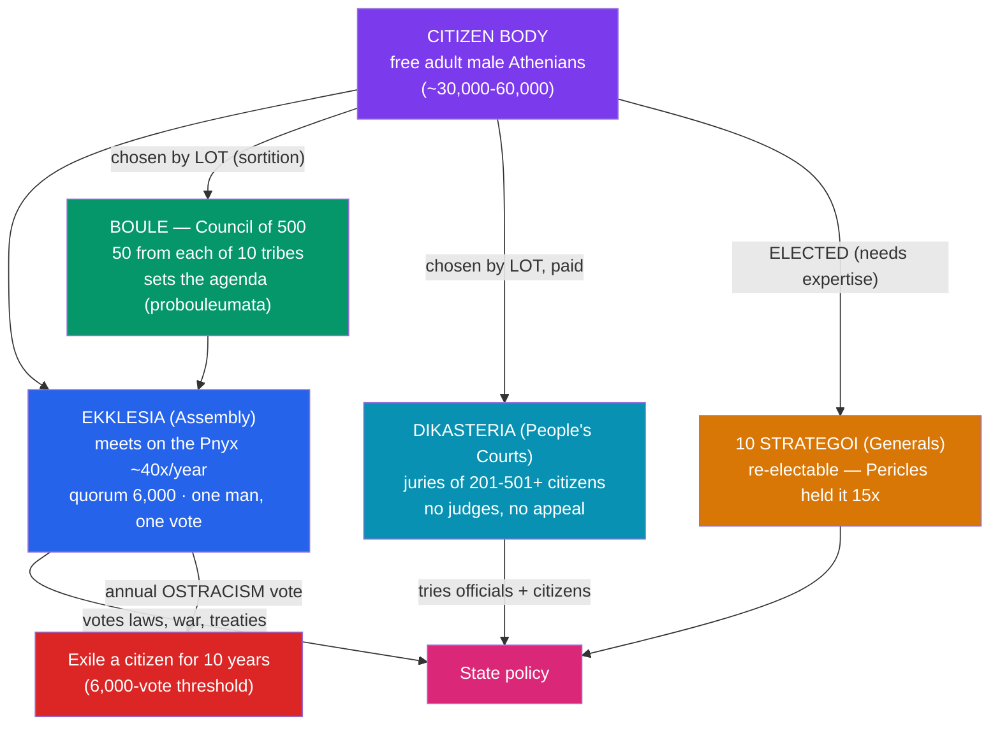

# 🏺 Athenian Democracy and Greek Culture

> [!abstract] TL;DR
> In a single, extraordinary century Athens invented **direct democracy** and produced a burst of philosophy, drama, and art that still anchors Western culture. **Solon** (594 BCE) defused a debt crisis and graded citizens by wealth, then **Cleisthenes** (508 BCE) rebuilt the citizen body into ten artificial tribes and created the machinery of *dēmokratia* — the **Ekklesia** (assembly), a **Council of 500** chosen by lot, and popular juries. Athens then twice saved Greece from Persia (**Marathon 490**, **Salamis 480 BCE**), turned its wartime alliance into an empire, and under **Pericles** reached a **Golden Age** that built the **Parthenon** and hosted **Socrates**. That same imperial power triggered the ruinous **Peloponnesian War (431–404 BCE)** against Sparta, chronicled by **Thucydides**, which ended in Athenian defeat — even as **Plato** and **Aristotle** carried Greek thought to its peak.

## Intuition — analogy first

Imagine a city run not by elected representatives but by a **giant standing town-meeting of every citizen**, where the officials are picked the way we pick jury duty — by lottery.

Modern democracies are *representative*: you vote for someone to decide for you. Classical Athens was **direct**: several thousand ordinary citizens gathered on a hillside (the **Pnyx**) forty times a year and personally voted the laws, declared the wars, and set the taxes. Even more radically, they distrusted elections as a rich man's game — so most public offices were filled by **sortition**, drawing lots, on the theory that any competent citizen could serve and rotation prevented tyranny. Only the jobs where expertise was truly life-or-death, like the ten generals, were actually elected.

The catch: the "everyone" who ruled was only free adult male citizens — perhaps a fifth of the population. Women, slaves, and resident foreigners were excluded. So picture the world's first democracy as a **remarkably participatory club with a locked front door**: inside, radical equality; outside, no vote at all. And the same confident, argumentative culture that produced this experiment also produced the theatre of Sophocles, the questioning of Socrates, and the marble perfection of the Parthenon — a civilisation that then turned its brilliance on itself in a thirty-year war it could not win.

---

## How It Works — The Machinery of Athenian Direct Democracy

## Key Concepts

### From Solon to Cleisthenes — Building a Democracy

Athenian democracy was not founded in one act but assembled over a century:

- **Solon (archon 594 BCE)** confronted a crisis in which poor farmers were being enslaved for debt. His **seisachtheia** ("shaking off of burdens") cancelled such debts and banned debt-slavery, and he replaced birth with **wealth** as the basis of political rights, sorting citizens into four **timocratic classes** (from the top *pentakosiomedimnoi* down to the landless *thetes*). He laid foundations but did not create democracy.
- After the **tyranny of Peisistratus and his sons** (mid–late 6th century), **Cleisthenes** carried out the decisive reforms of **508/507 BCE**. He broke the power of the old regional aristocracies by reorganising all citizens into **ten new tribes (*phylai*)**, each artificially built from **demes** (local wards) drawn from the city, coast, and inland — deliberately mixing the population. He created the **Council of 500 (Boulē)**, 50 men chosen **by lot** from each tribe, and is credited with **ostracism**. For this he is called the **father of Athenian democracy**; the Greeks called the new order **isonomia**, "equality before the law."
- **Ephialtes (462 BCE)** and then **Pericles** completed the radicalisation, stripping the aristocratic **Areopagus** council of its powers and introducing **pay for public office (*misthos*)** so poor citizens could afford to serve.

### How the Democracy Ran

Sovereignty lay with the **Ekklesia (Assembly)**, open to all citizens, meeting on the **Pnyx** hill around 40 times a year with a quorum of 6,000. The **Boulē** of 500 prepared its agenda. Justice ran through **dikastēria**, huge popular juries (often 501 members) with **no professional judges and no appeal**, jurors selected by lot using an allotment machine (the *klērōtērion*) and paid a daily wage. Almost all magistracies were filled by **lot** and rotated annually; only offices needing real skill — above all the **ten *stratēgoi* (generals)** — were **elected** and re-electable, which is how Pericles led for so long. Once a year the Assembly could hold an **ostracism**, exiling any citizen for ten years without trial if 6,000 votes were cast.

### The Persian Wars (499–479 BCE)

The great external test came from the **Persian (Achaemenid) Empire**:

| Battle | Year | Outcome |
|--------|------|---------|
| **Marathon** | 490 BCE | Athenians (under **Miltiades**) crush **Darius I's** landing force |
| **Thermopylae** | 480 BCE | **Leonidas** and ~300 Spartans (with allies) hold the pass, then are outflanked and die; delaying action |
| **Artemisium / Salamis** | 480 BCE | **Themistocles** lures **Xerxes'** huge fleet into the narrow straits of Salamis and destroys it — the decisive victory |
| **Plataea / Mycale** | 479 BCE | Combined Greek land and sea victories end the invasion |

After the war Athens organised the **Delian League (478 BCE)**, an alliance against Persia that it steadily converted into an **Athenian empire**, moving the treasury to Athens in 454 BCE.

### The Golden Age of Pericles

Under **Pericles** (dominant c. 461–429 BCE, the "first citizen"), Athens reached its cultural summit. He directed League funds into a vast building programme on the **Acropolis**, above all the **Parthenon (447–432 BCE)** — a Doric temple to Athena designed by **Ictinus and Callicrates** with sculpture overseen by **Phidias**. His **Funeral Oration**, reported by Thucydides, is the classic statement of the democratic ideal ("our constitution... is called a democracy because power is in the hands not of a minority but of the whole people"). This was the age of tragic drama at the **City Dionysia** — **Aeschylus, Sophocles, Euripides** — and the biting political comedy of **Aristophanes**, and of **Herodotus**, the "father of history."

### The Peloponnesian War (431–404 BCE)

Athenian power frightened Sparta into war. The historian **Thucydides**, an exiled Athenian general, wrote its history and named its deep cause: "the growth of the power of Athens, and the alarm which this inspired in Sparta" — the origin of the modern phrase **"Thucydides trap."** A devastating **plague (430–426 BCE)** killed perhaps a quarter of Athenians, including Pericles. The catastrophic **Sicilian Expedition (415–413 BCE)** wiped out an Athenian army and fleet. Finally a Spartan navy, funded by Persian gold and led by **Lysander**, crushed Athens at **Aegospotami (405 BCE)**; Athens surrendered in **404 BCE** and briefly suffered the oligarchy of the **Thirty Tyrants**.

### Philosophy — Socrates, Plato, Aristotle

The intellectual legacy outlasted the empire:

- **Socrates (c. 470–399 BCE)** wrote nothing but pioneered the **Socratic method** of relentless questioning; convicted of "impiety" and "corrupting the youth" by an Athenian jury, he was executed by hemlock in **399 BCE**.
- **Plato (c. 428–348 BCE)**, his student, founded the **Academy**, wrote the dialogues (*Republic*, *Symposium*), and advanced the **Theory of Forms** and a critique of democracy itself.
- **Aristotle (384–322 BCE)**, Plato's student, founded the **Lyceum**, tutored the young **Alexander**, and laid the foundations of logic, biology, ethics, and political science through **empirical** study — the bridge into the next note.

## Primary Sources & Examples

- **Thucydides, *History of the Peloponnesian War* (late 5th c. BCE):** the founding work of "scientific," cause-seeking history; the source for Pericles' Funeral Oration and the ruthless **Melian Dialogue** on power ("the strong do what they can and the weak suffer what they must").
- **Herodotus, *Histories*:** the narrative of the Persian Wars, including Marathon, Thermopylae, and Salamis.
- **Plato, *Apology*:** Socrates' defence speech at his trial — a primary window onto the tension between free philosophical inquiry and the democracy that condemned it.
- **The Parthenon and Acropolis (built 447–432 BCE):** the physical monument of the Golden Age, its frieze and metopes a direct artefact of Periclean Athens.
- **Aristophanes, *The Clouds* / *Lysistrata*:** comedies that lampoon Socrates and the war, evidence of Athens' remarkable tolerance for public political satire.

## Common Pitfalls / Misconceptions

- **Confusing direct with representative democracy.** Athenians did not elect representatives to govern for them; citizens voted in person and filled office by lot. Modern liberal democracy is a very different, largely representative system.
- **Idealising Athenian inclusiveness.** The demos excluded women, the large enslaved population, and resident foreigners (*metics*). Citizenship was also narrowed by Pericles' own 451 BCE law requiring two Athenian parents.
- **Thinking the Persian Wars were won by Sparta alone.** Thermopylae is famous, but it was a *defeat* that bought time; the war was decided by the Athenian-led naval victory at Salamis and the combined land victory at Plataea.
- **Treating the Delian League as a voluntary alliance throughout.** It began as one but became a coercive **empire**; states that tried to leave (e.g. Naxos, Mytilene) were forced back, feeding the resentment that fuelled the Peloponnesian War.
- **Assuming Athens "fell" for good in 404 BCE.** It lost its empire and never fully recovered its power, but the city, its democracy (soon restored), and its schools persisted for centuries; the cultural legacy peaked *after* the military defeat.

## Related Concepts

- [[_MOC_Classical_Antiquity|↑ Section MOC]] — the Classical Antiquity hub
- [[Ancient_Greece_and_the_Polis]] — the polis framework and the Sparta-Athens rivalry that this note develops
- [[Alexander_and_the_Hellenistic_World]] — Aristotle's pupil who ended Greek city-state independence and spread Greek culture east
- [[The_Roman_Republic]] — a very different (representative, mixed) constitution that consciously contrasted itself with, and admired, Greek models
- Cross-vault: [[_MOC_Game_Theory_Master]] — the "Thucydides trap," the security dilemma, and the Melian Dialogue as classic problems of power and credible commitment
- Cross-vault: [[_MOC_Mythology_Master]] — the gods and myths dramatised in Athenian tragedy and honoured in the Parthenon

## Review Questions

1. Trace the path from Solon (594 BCE) to Cleisthenes (508 BCE): what did each reformer actually change, and why is Cleisthenes rather than Solon called the father of Athenian democracy?
2. Explain how sortition, the Ekklesia, the Boulē, and elected generals fit together in Athenian direct democracy. Which offices were elected rather than allotted, and why?
3. According to Thucydides, what was the deepest cause of the Peloponnesian War, and how does the trajectory from the Persian Wars through the Delian League illustrate it?

## Sources

- Thucydides (c. 400 BCE). *History of the Peloponnesian War* (trans. Warner, Penguin Classics)
- Ober, J. (2015). *The Rise and Fall of Classical Greece*. Princeton University Press
- Hansen, M.H. (1991). *The Athenian Democracy in the Age of Demosthenes*. Blackwell
- Cartledge, P. (2016). *Democracy: A Life*. Oxford University Press

#history #classical-antiquity #greece #athens #democracy #philosophy
