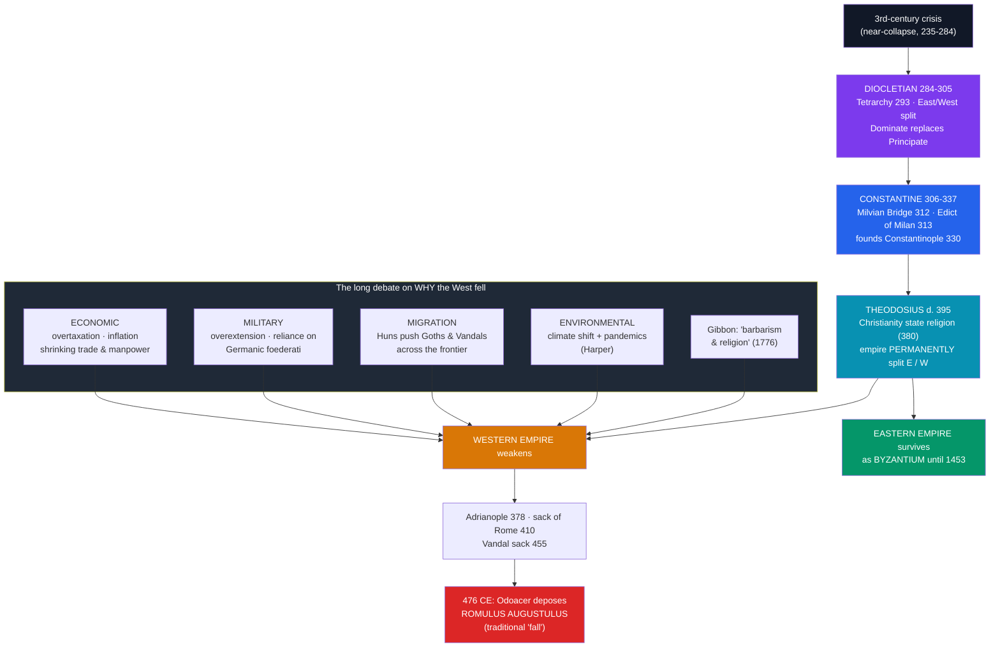

# 🏚️ Fall of the Western Roman Empire

> [!abstract] TL;DR
> Why the Western Roman Empire "fell" is one of history's oldest and most contested questions. The narrative spine is clear: **Diocletian** ended the third-century crisis by splitting the empire into East and West and creating the four-ruler **Tetrarchy (293 CE)**; **Constantine** reunited it, legalised **Christianity** (313 CE), and founded **Constantinople (330 CE)**; the empire then permanently divided in **395 CE**. Under pressure from the **Huns**, Germanic peoples poured across the frontier — the Goths destroyed a Roman army at **Adrianople (378)** and **sacked Rome in 410** — until the last Western emperor, the boy **Romulus Augustulus, was deposed in 476 CE**. But the *causes* are fiercely debated: from **Gibbon's** "barbarism and religion" to modern theories stressing **economic** breakdown, **military** overreliance on Germanic troops, **migration** pressure, and **climate and pandemic disease**. Crucially, only the *West* fell; the **Eastern (Byzantine) Empire** survived at Constantinople for another **thousand years**, until 1453.

## Intuition — analogy first

Think of the fall of Rome less like a **building demolished by a single wrecking ball** and more like an **old company that slowly loses the ability to pay and control its own security guards, until one of them simply takes over the office and no one bothers to stop him.**

For centuries historians looked for the one wrecking ball — moral decay, Christianity, the barbarians — and Edward Gibbon's famous verdict blamed "barbarism and religion." But modern historians mostly reject the single-cause story. The Western empire didn't so much explode as **erode**: tax revenues shrank, the army came to depend on Germanic recruits who were increasingly loyal to their own leaders, provinces stopped sending money and men, and climate shifts and plague thinned the population. By the 5th century the "emperor" in the West was often a child figurehead controlled by a Germanic general. When one such general, **Odoacer**, deposed the last boy-emperor in **476**, he didn't sack a mighty capital — he retired a powerless teenager and told the East he'd run Italy himself. Many people living through it barely noticed a "fall."

And here's the twist the phrase "fall of Rome" hides: **the Roman Empire did not end in 476.** Its richer, more urbanised eastern half — centred on Constantinople and calling itself Roman to the end — sailed on for another **millennium** as the Byzantine Empire. Only the *western* office closed.

---

## How It Works — Competing Causes and the Political Timeline

## Key Concepts

### Diocletian, the Tetrarchy, and Division (284–305 CE)

**Diocletian (r. 284–305 CE)** rescued the empire from the third-century crisis by re-engineering it. Judging the empire too large for one man, in **293 CE** he created the **Tetrarchy** ("rule of four"): two senior emperors (**Augusti**), one in the East and one in the West, each with a junior colleague and heir (**Caesar**). He doubled the number of provinces (grouped into **dioceses**), expanded the bureaucracy and army, tried to freeze prices with the **Edict on Maximum Prices (301 CE)**, and launched the last and largest **Great Persecution** of Christians (from 303 CE). His open autocracy — emperor as *dominus* ("lord and master") — is called the **Dominate**, replacing Augustus's fiction of the Principate. In **305 CE** he did the almost unheard-of and **abdicated**.

### Constantine and Christianisation (306–337 CE)

The Tetrarchy collapsed into civil war, from which **Constantine the Great** emerged victorious at the **Battle of the Milvian Bridge (312 CE)** — which tradition links to a vision of the Christian cross ("*in hoc signo vinces*," "in this sign, conquer"). With the **Edict of Milan (313 CE)** he and his co-emperor Licinius **legalised Christianity**; he convened the **Council of Nicaea (325 CE)** to settle Christian doctrine (the Nicene Creed); and in **330 CE** he refounded the old Greek city of Byzantium as **Constantinople**, "New Rome," a Christian capital in the wealthier East. He reunited the empire and became its first Christian ruler. Later, **Theodosius I** made **Nicene Christianity the state religion** (Edict of Thessalonica, 380 CE) and was the last man to rule a unified empire; on his death in **395 CE** it split permanently into Western and Eastern halves.

### The Migrations and the End in the West

From the late 4th century, the westward pressure of the **Huns** drove Germanic peoples across the Roman frontier. Rome's response — admitting them as **foederati** (allied settlers) it could no longer defeat or fully control — proved fatal:

| Event | Year | Significance |
|-------|------|--------------|
| **Battle of Adrianople** | 378 CE | Goths annihilate the Eastern army and kill Emperor Valens — a shock to Roman military prestige |
| **Sack of Rome** by the Visigoth **Alaric** | 410 CE | First fall of the city in 800 years; prompts Augustine's *City of God* |
| **Vandal sack of Rome** | 455 CE | Vandals, now ruling Roman Africa, plunder the city |
| **Battle of the Catalaunian Plains** | 451 CE | A Roman–Visigothic coalition checks **Attila the Hun** |
| **Deposition of Romulus Augustulus** | **476 CE** | The Germanic general **Odoacer** deposes the last Western emperor and returns the imperial regalia to Constantinople |

By 476 the Western "emperors" were largely puppets of their Germanic generals; **476 CE** is the conventional end date, though it marked less a dramatic collapse than the quiet lapse of a title that had already emptied of power.

### The Long Debate on Causes

There is no scholarly consensus on *why* the West fell; the historiography is itself a case study in how history gets revised:

- **Edward Gibbon**, in *The History of the Decline and Fall of the Roman Empire* (1776–1789), blamed the loss of civic virtue and the rise of **Christianity** (draining resources and martial spirit) — the "triumph of barbarism and religion." Influential, but now seen as reflecting his own Enlightenment prejudices.
- **Economic** theories stress overtaxation, currency debasement and inflation, shrinking long-distance trade, and a chronic shortage of manpower and revenue that starved the state and army.
- **Military** theories emphasise overextension of frontiers and growing dependence on **Germanic foederati** whose loyalty was to their own commanders.
- **Migration / "barbarian" pressure.** **Peter Heather** (*The Fall of the Roman Empire*, 2005) argues external shock — the Huns and the peoples they displaced — was decisive; **Bryan Ward-Perkins** (*The Fall of Rome and the End of Civilization*, 2005) insists this was a real, violent **catastrophe** with sharp material decline, pushing back against a too-gentle picture.
- **"Transformation," not fall.** The **Late Antiquity** school, associated with **Peter Brown** and **Guy Halsall**, reframes 300–700 CE as a gradual *transformation* and accommodation of Roman and Germanic worlds rather than a single collapse — the very word "fall" is contested.
- **Environmental and disease.** **Kyle Harper** (*The Fate of Rome*, 2017) argues **climate change** (a "Late Antique Little Ice Age") and repeated **pandemics** (the Antonine Plague, Plague of Cyprian, and later Plague of Justinian) were major, underappreciated drivers.
- **Henri Pirenne** earlier argued the real break came later, with the Arab conquests disrupting Mediterranean trade in the 7th–8th centuries.

### Survival of the East as Byzantium

The most important corrective to "the fall of Rome" is that **only the West fell**. The **Eastern Roman Empire** — richer, more urbanised, and centred on **Constantinople** — survived the migrations and continued to call itself *Rhomaioi* ("Romans"). Modern historians label it the **Byzantine Empire**. Under **Justinian I (r. 527–565)** it even briefly reconquered Italy and North Africa and codified Roman law (the *Corpus Juris Civilis*). It endured, in shrinking form, until the **Ottoman conquest of Constantinople in 1453** — a thousand years after the West's end, and the true bridge into the medieval world.

## Primary Sources & Examples

- **Ammianus Marcellinus, *Res Gestae*:** the last great classical Latin historian, whose narrative includes the disaster at Adrianople (378) — a near-contemporary account of the empire's military crisis.
- **Augustine of Hippo, *The City of God* (413–426 CE):** written in direct response to the sack of Rome in 410, defending Christianity against pagans who blamed it for the catastrophe — a primary document of how contemporaries interpreted the "fall."
- **Edict on Maximum Prices (301 CE):** Diocletian's inscribed attempt to freeze prices — physical evidence of the era's runaway inflation.
- **Notitia Dignitatum (c. 400 CE):** a late imperial register of civil and military offices — a snapshot of the administrative machine in the West's final decades.
- **Coinage and archaeology:** debased late-Roman coins and the sharp decline in pottery quality, building, and trade goods that Ward-Perkins uses as material proof of a genuine collapse in living standards.

## Common Pitfalls / Misconceptions

- **"Rome fell in 476."** This applies only to the **Western** empire, and even there 476 was a legal formality; the Eastern Roman (Byzantine) Empire continued until **1453**. The Roman state did not end in 476.
- **Looking for a single cause.** No serious historian today accepts one master explanation. Economic, military, migratory, environmental, and religious factors interacted over centuries; Gibbon's "barbarism and religion" is a period piece, not a verdict.
- **Picturing "barbarian hordes" annihilating Rome.** Many Germanic peoples sought to *settle within* and serve the empire as *foederati*; the process was as much internal transformation and accommodation as external destruction.
- **Assuming an instant "Dark Age."** The transition into the early medieval world was uneven; some regions saw steep decline, others considerable continuity of Roman institutions, law, and the Church.
- **Forgetting the Church inherited the machinery.** The Roman Church preserved Latin, law, literacy, and administrative structures, providing continuity from antiquity into the medieval West.

## Related Concepts

- [[_MOC_Classical_Antiquity|↑ Section MOC]] — the Classical Antiquity hub
- [[The_Roman_Empire]] — the prequel: the Principate and Pax Romana whose long decline this note explains, and the third-century crisis that Diocletian answered
- [[The_Roman_Republic]] — the origin of the Roman law and institutions that outlived the Western empire in the Church and in Byzantium
- Cross-section: [[_MOC_Medieval_World]] — the successor world: Germanic kingdoms, the Church, and Byzantium that emerge directly from this collapse
- Cross-vault: [[_MOC_Cybersecurity_Master]] — reliance on "trusted" outsiders (foederati) who turn on the system as a classic failure of an over-extended defence perimeter
- Cross-vault: [[_MOC_Macroeconomics_Master]] — currency debasement, inflation, and fiscal crisis as macroeconomic drivers of state collapse

## Review Questions

1. Explain how Diocletian's Tetrarchy and Constantine's founding of Constantinople reshaped the empire, and why the death of Theodosius in 395 CE proved to be a permanent division rather than a temporary one.
2. Lay out at least four distinct modern explanations for the fall of the West (economic, military, migration, environmental) and contrast them with Gibbon's thesis. Why do historians reject a single-cause account?
3. In what sense is "the fall of Rome in 476" misleading? Address both the nature of the 476 event and the survival of the Eastern Roman (Byzantine) Empire.

## Sources

- Gibbon, E. (1776–1789). *The History of the Decline and Fall of the Roman Empire*
- Heather, P. (2005). *The Fall of the Roman Empire: A New History of Rome and the Barbarians*. Macmillan
- Ward-Perkins, B. (2005). *The Fall of Rome and the End of Civilization*. Oxford University Press
- Harper, K. (2017). *The Fate of Rome: Climate, Disease, and the End of an Empire*. Princeton University Press

#history #classical-antiquity #rome #decline-and-fall #byzantium
