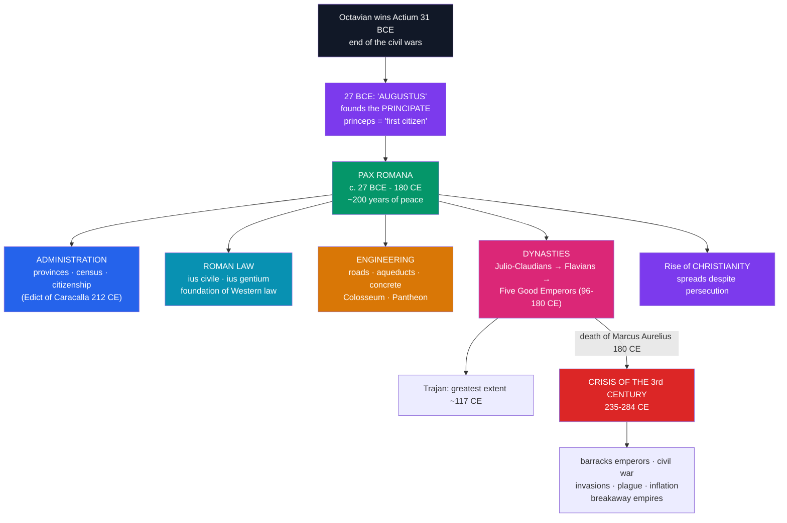

# 🦅 The Roman Empire

> [!abstract] TL;DR
> Out of the Republic's collapse **Augustus** built a monarchy that pretended not to be one. Winning the last civil war at **Actium (31 BCE)**, he accepted the title **Augustus in 27 BCE** and founded the **Principate** — ruling as *princeps* ("first citizen") while keeping the outward forms of the Republic. His settlement launched the **Pax Romana**, roughly two centuries (27 BCE–180 CE) of peace and prosperity across the Mediterranean, knit together by professional **administration**, a sophisticated body of **Roman law**, and world-class **engineering** — roads, aqueducts, and concrete. Power passed through the **Julio-Claudian** and **Flavian** dynasties to the **Five Good Emperors** (Nerva to Marcus Aurelius), under whom the empire reached its greatest extent. Beneath the peace, **Christianity** spread from a Jewish sect into a Mediterranean-wide faith. Then the system nearly broke apart in the **Crisis of the Third Century (235–284 CE)** — a half-century of civil war, invasion, plague, and economic collapse that reshaped what came next.

## Intuition — analogy first

Picture a **founder who takes a chaotic, war-torn company private, keeps all the old job titles on the org chart to reassure everyone, but quietly wires every real lever of power to himself.**

That was Augustus's genius. Romans hated the word "king," and the last man who acted like one — Julius Caesar — got stabbed. So Augustus never abolished the Senate, consuls, or assemblies; he let them keep meeting and voting. He simply held, personally and permanently, the powers that mattered: command of the armies, control of the wealthiest provinces, and the tribunes' protections — all at once, forever. He called himself merely *princeps*, "first citizen." The Republic's furniture stayed in the room; the Republic itself was gone.

The payoff was the **Pax Romana** — a peace so broad that a merchant could travel from Britain to Syria on paved Roman roads, using one currency, under one legal system, drinking water piped in by aqueduct. But the design had a hidden bug it never fixed: **there was no legal rule for choosing the next princeps.** As long as an emperor adopted a capable heir, it worked spectacularly. When that broke down, the army discovered it could simply *sell* the throne to whoever paid — and in the third century it nearly tore the empire to pieces.

---

## How It Works — From Principate to Crisis

## Key Concepts

### Augustus and the Principate (27 BCE)

**Octavian**, Julius Caesar's adopted heir, ended a century of civil war by defeating **Mark Antony and Cleopatra** at **Actium (31 BCE)** and annexing Egypt. Rather than declare himself king or dictator — the mistakes that killed Caesar — he engineered a subtle revolution. In **27 BCE** the Senate granted him the honorific **Augustus** ("revered one"), and he styled himself **princeps** ("first citizen"), claiming merely to have "restored the Republic."

In reality he held the substance of power permanently and simultaneously: **proconsular *imperium*** over the armies and the frontier provinces where the legions sat, and **tribunician power** (*tribunicia potestas*) with its veto and sacrosanctity — all without holding a hated title. This hybrid, the **Principate**, was monarchy dressed in republican clothes. He reigned until **14 CE**, professionalising the army, reorganising provincial government, and founding the imperial system.

### The Pax Romana and Its Machinery

The **Pax Romana** ("Roman Peace"), roughly **27 BCE to 180 CE**, was about two centuries of relative internal peace and prosperity across the Mediterranean world. It rested on three pillars:

- **Administration.** The empire was divided into **provinces** (some governed by the Senate, the militarily important ones by the emperor's legates), with regular **censuses**, taxation, and a growing professional bureaucracy. **Roman citizenship** was steadily extended, culminating in the **Edict of Caracalla (212 CE)**, which granted it to almost all free inhabitants of the empire. A standing professional army guarded the fortified frontiers (*limes*).
- **Roman law.** Building on the Twelve Tables, Roman jurists developed a sophisticated legal science distinguishing the *ius civile* (law for citizens) from the *ius gentium* (law of nations) and elaborating concepts — contract, property, legal personality, the presumption of innocence — that remain **the foundation of the Western legal tradition** (and were later codified in Justinian's *Corpus Juris Civilis*).
- **Engineering.** Rome's practical genius produced a road network of some **80,000 km of paved highways** (the *Via Appia*, begun 312 BCE, was the first), a vast system of **aqueducts** (the *Pont du Gard*), and **Roman concrete** (*opus caementicium*, using volcanic *pozzolana*) that made possible the arches, the **Colosseum** (opened 80 CE), and the still-standing dome of the **Pantheon** (rebuilt under Hadrian, c. 126 CE).

### The Emperors

| Dynasty / group | Dates | Notable rulers |
|-----------------|-------|----------------|
| **Julio-Claudians** | 27 BCE–68 CE | Augustus, Tiberius, Caligula, Claudius (conquest of Britain, 43 CE), Nero |
| Year of the Four Emperors | 69 CE | Civil war after Nero's fall |
| **Flavians** | 69–96 CE | Vespasian, Titus (destruction of Jerusalem, 70 CE; Colosseum), Domitian |
| **Five Good Emperors** | 96–180 CE | Nerva, **Trajan**, **Hadrian**, Antoninus Pius, **Marcus Aurelius** |

Under the **Five Good Emperors**, chosen by **adoption** of the ablest successor rather than by blood, the empire was at its height. **Trajan** pushed it to its **greatest extent (~117 CE)**, conquering Dacia and Mesopotamia; **Hadrian** consolidated the frontiers (**Hadrian's Wall** in Britain); and the Stoic philosopher-emperor **Marcus Aurelius** wrote his *Meditations* while campaigning. His death in **180 CE** — and his choice of his unfit son **Commodus** — is traditionally taken to mark the end of the Pax Romana.

### The Spread of Christianity

During the Principate a new faith spread through the empire's cities. Beginning as a movement within Judaism after the crucifixion of **Jesus** (c. 30–33 CE) under the prefect **Pontius Pilate**, it was carried across the Mediterranean by missionaries such as **Paul of Tarsus**, exploiting Roman roads, koine Greek, and urban Jewish communities. Christians faced sporadic **persecution** — blamed by **Nero** for the Great Fire of Rome (64 CE) and later targeted empire-wide — yet the religion grew steadily among all classes, setting up the transformation that Constantine would complete in the next century.

### The Crisis of the Third Century (235–284 CE)

After the Severan dynasty, the empire nearly disintegrated in about **fifty years of chaos**:

- **Political collapse** — roughly **two dozen "barracks emperors"** raised and murdered by their own troops; the throne effectively for sale to whoever the legions backed.
- **External invasion** — **Germanic peoples (Goths)** breached the Danube and Rhine, while the resurgent **Sassanid Persians** even captured the emperor **Valerian (260 CE)**, a humiliation without precedent.
- **Economic and demographic ruin** — currency **debasement** and runaway inflation, plus the **Plague of Cyprian**, hollowed out trade and manpower.
- **Fragmentation** — breakaway states, the **Gallic Empire** in the west and the **Palmyrene Empire** under **Zenobia** in the east, briefly split the Roman world in three.

The empire was pulled back from the brink by soldier-emperors, above all **Aurelian** (who reunited it, 270–275 CE) and then **Diocletian** (from 284 CE), whose radical reorganisation opens the story of the fall.

## Primary Sources & Examples

- **Augustus, *Res Gestae Divi Augusti* ("The Deeds of the Divine Augustus"):** Augustus's own inscribed account of his reign — a masterclass in how the Principate presented itself as a restoration of the Republic.
- **Tacitus, *Annals* and *Histories*:** the sharp, sceptical narrative of the Julio-Claudian and Flavian emperors by a senator who distrusted autocracy.
- **Suetonius, *The Twelve Caesars*:** gossipy biographies from Julius Caesar to Domitian — colourful, uneven, but revealing of imperial self-image.
- **Marcus Aurelius, *Meditations*:** the private Stoic notebook of a reigning emperor — a unique primary source for the mind of power.
- **The Pantheon and the *Pont du Gard*:** surviving engineering that physically demonstrates Roman concrete, the arch, and hydraulics.

## Common Pitfalls / Misconceptions

- **Thinking Augustus "abolished" the Republic openly.** He kept its institutions running and claimed to have restored it; the monarchy was deliberately disguised. Contemporaries could still speak of the *res publica*.
- **Imagining the Pax Romana as universal peace.** It meant relative internal stability, not the end of war — Rome still fought major frontier and conquest wars (Britain, Dacia, Judaea) throughout the period.
- **Assuming Roman emperors were worshipped as gods everywhere in life.** The imperial cult was real but complex; most emperors were formally deified only *after* death, and living-emperor worship varied by region.
- **Dating the "fall" of Rome to the third-century crisis.** The empire nearly collapsed in 235–284 CE but recovered and survived for two more centuries in the West (and far longer in the East); the crisis reshaped, rather than ended, it.
- **Believing Christianity was legal or dominant during the Pax Romana.** It was a persecuted minority faith throughout this period; its legalisation and rise to state religion come later, with Constantine and Theodosius.

## Related Concepts

- [[_MOC_Classical_Antiquity|↑ Section MOC]] — the Classical Antiquity hub
- [[The_Roman_Republic]] — the prequel: the Republic's collapse is exactly what Augustus's Principate was built to resolve
- [[Fall_of_the_Western_Roman_Empire]] — the sequel: how Diocletian's response to the third-century crisis set up the eventual fall of the West
- [[Alexander_and_the_Hellenistic_World]] — the Hellenistic east that Rome ruled, where koine Greek remained the common tongue
- Cross-vault: [[_MOC_Networking_Master]] — the Roman road and aqueduct system as an early physical "network": hubs, routes, and throughput ("all roads lead to Rome")
- Cross-vault: [[_MOC_Mythology_Master]] — the Roman state religion and imperial cult, and the religious context into which Christianity spread

## Review Questions

1. How did Augustus hold supreme power while claiming to have "restored the Republic"? Name the two key legal powers underpinning the Principate and explain why he avoided the title of king.
2. What were the three pillars of the Pax Romana (administration, law, engineering)? Give one concrete example of each and explain how it bound the empire together.
3. Describe the Crisis of the Third Century. What were its main causes (political, military, economic), and why did the empire survive it rather than fall in 284 CE?

## Sources

- Beard, M. (2015). *SPQR: A History of Ancient Rome*. Profile Books
- Goldsworthy, A. (2014). *Augustus: First Emperor of Rome*. Yale University Press
- Kelly, C. (2006). *The Roman Empire: A Very Short Introduction*. Oxford University Press
- Potter, D.S. (2004). *The Roman Empire at Bay, AD 180–395*. Routledge

#history #classical-antiquity #rome #empire #augustus #pax-romana
