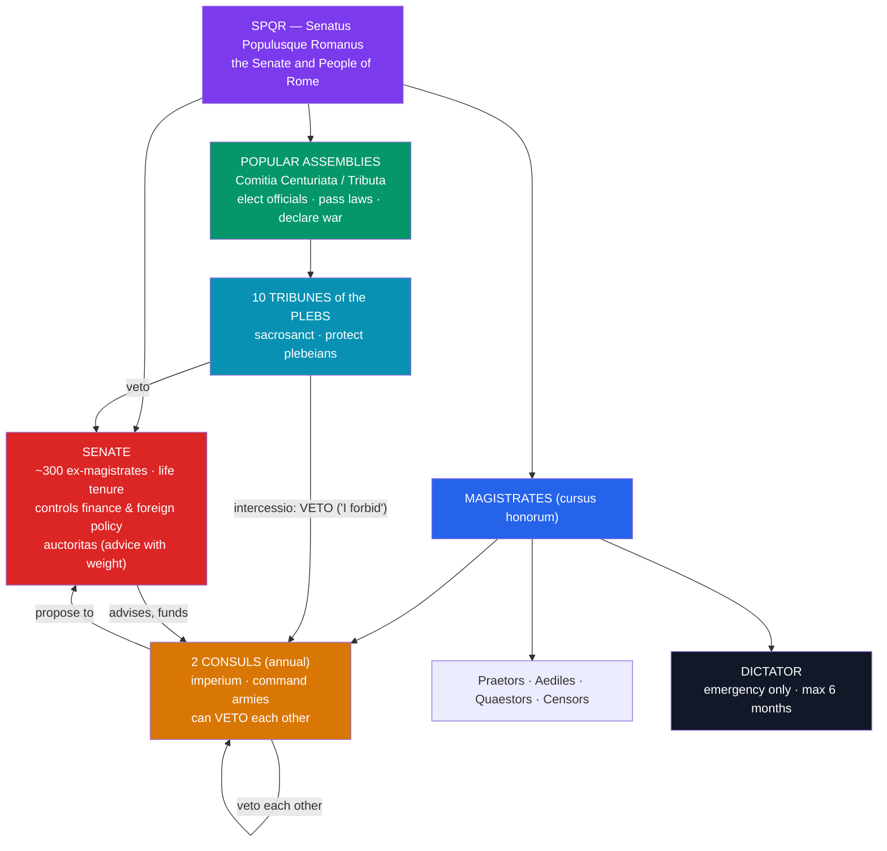

# 🐺 The Roman Republic

> [!abstract] TL;DR
> After expelling its last king in **509 BCE**, Rome governed itself for nearly five centuries as a **res publica** ("public affair") built to prevent any one man from ruling — a balance of the **Senate**, two annually elected **consuls**, popular **assemblies**, and the plebs' own **tribunes** with their power of veto. An internal **Struggle of the Orders** gradually won the common **plebeians** legal equality with the aristocratic **patricians** (culminating in 287 BCE). Rome then conquered Italy and, in the three **Punic Wars** against **Carthage** (264–146 BCE) — surviving **Hannibal's** invasion and his crushing win at **Cannae (216 BCE)** before **Scipio** beat him at **Zama (202 BCE)** — became master of the Mediterranean. But the strains of empire broke the Republic: from the **Gracchi** through the civil wars of **Marius and Sulla** to the **First Triumvirate**, the system spiralled toward warlords, until **Julius Caesar crossed the Rubicon in 49 BCE**, made himself dictator, and was **assassinated on the Ides of March, 44 BCE** — clearing the way for the Empire.

## Intuition — analogy first

Think of the Roman Republic as a **corporate governance structure obsessively designed so no single executive can seize the whole company** — a design that worked brilliantly until the company got so big it needed CEOs who wouldn't step down.

Having thrown out its kings, Rome was paranoid about one-man rule. So it built in redundancy and term limits: **two** CEOs (consuls) instead of one, each able to **veto** the other, both serving only a **single year**. A powerful board of ex-executives (the **Senate**) held the institutional memory and the purse. And to protect the ordinary "employees," the plebeians got their own union reps — the **tribunes** — who could shout *veto!* ("I forbid") and freeze any action. For centuries this kept ambition in check.

The system's fatal flaw showed once Rome conquered the Mediterranean. Winning wars now meant commanding huge professional armies for years far from home — armies that came to look to their **general** for land and pay, not to the Senate. The "single-year, share-power" rules couldn't contain men who controlled legions. So the last century of the Republic reads like a series of hostile takeovers by executives who refused to hand back the keys — Marius, Sulla, Pompey, Crassus, and finally Caesar, who marched his army across a small river called the **Rubicon** and ended the experiment.

---

## How It Works — The Balanced Constitution of the Res Publica

## Key Concepts

### Founding and the Res Publica (509 BCE)

Rome's traditional founding was **753 BCE** under **Romulus**, followed by a line of kings. In **509 BCE** the Romans expelled the last, the tyrannical **Tarquinius Superbus** ("Tarquin the Proud"), and founded the **Republic** — the *res publica*, literally "the public thing." Determined never again to submit to a king (*rex* became a hated word), they distributed power among institutions. The Greek historian **Polybius** later admired Rome's **"mixed constitution"**: a **monarchic** element (the consuls), an **aristocratic** element (the Senate), and a **democratic** element (the assemblies), each checking the others.

- **Consuls** — two supreme magistrates elected annually, holding *imperium* (military and civil command). Collegiality (two of them) and annuality (one year) plus mutual veto restrained them.
- **Senate** — roughly 300 members, mostly former magistrates serving for life; formally advisory but controlling the treasury, foreign policy, and provincial administration through sheer *auctoritas*.
- **Assemblies** — the *Comitia Centuriata* (weighted toward the wealthy, elected consuls and declared war) and others passed laws and elected officials.
- **Tribunes of the plebs** — ten officials, personally **sacrosanct**, who could **veto (*intercessio*)** almost any state action to protect the common people.
- In dire emergencies a single **dictator** could be appointed, but only for **six months**.

### The Struggle of the Orders (c. 494–287 BCE)

Early Rome was dominated by the hereditary **patricians**; the far more numerous **plebeians** fought a long, largely non-violent campaign for political and legal equality. Their key weapon was the **secession (*secessio plebis*)** — mass withdrawal from the city, a kind of general strike.

| Milestone | Date | Gain for the plebeians |
|-----------|------|------------------------|
| First secession → **Tribunes of the plebs** | 494 BCE | Officials to defend plebeian interests |
| **Twelve Tables** | 451–450 BCE | Rome's first written, public law code |
| *Lex Canuleia* | 445 BCE | Legalised patrician–plebeian intermarriage |
| Licinian–Sextian laws | 367 BCE | One consul each year must be a plebeian |
| **Lex Hortensia** | 287 BCE | Plebiscites (plebeian assembly decisions) bind the whole state — **ends the Struggle** |

The result was not a democracy but a broadened **oligarchy**: a mixed patrician-plebeian aristocracy of office-holding families (the *nobiles*).

### The Punic Wars and Mediterranean Mastery (264–146 BCE)

After subduing the Italian peninsula (Latins, Samnites, and the Greek-backed **Pyrrhus of Epirus**), Rome collided with the North African maritime empire of **Carthage** in three wars:

- **First Punic War (264–241 BCE)** — a struggle over **Sicily** that forced landlocked Rome to build a navy from scratch; victory brought Rome its first overseas **province**.
- **Second Punic War (218–201 BCE)** — the great war of **Hannibal**, who marched an army with war elephants over the Alps into Italy and won stunning victories at the Trebia, Lake Trasimene, and above all **Cannae (216 BCE)**, a double-envelopment that annihilated a Roman army of tens of thousands — still studied as a tactical masterpiece. Rome survived by refusing battle (the "**Fabian strategy**" of Fabius Maximus "the Delayer") until **Scipio Africanus** carried the war to Spain and Africa and defeated Hannibal at **Zama (202 BCE)**.
- **Third Punic War (149–146 BCE)** — driven by Cato the Elder's refrain "**Carthago delenda est**" ("Carthage must be destroyed"), Rome besieged and **razed Carthage in 146 BCE**. The same year it sacked Corinth, bringing Greece under control.

### The Crisis of the Late Republic (133–44 BCE)

Conquest enriched the elite and wrecked the old citizen-farmer base: slave-worked estates (*latifundia*) displaced smallholders, and armies became loyal to the generals who paid them. The Republic's institutions could not absorb the strain:

- **The Gracchi** — the tribunes **Tiberius (133 BCE)** and **Gaius Gracchus (123–122 BCE)** pushed land reform for the poor and were killed in political violence, opening a lasting split between **Optimates** (defenders of Senate privilege) and **Populares** (appealing to the assemblies).
- **Marius vs Sulla** — **Gaius Marius** professionalised the army by recruiting the landless (creating soldiers loyal to their commander), while **Sulla** became the first Roman to **march his legions on Rome** (88 BCE), won a civil war, and ruled as **dictator (82–79 BCE)** with bloody **proscriptions** before retiring.
- **The First Triumvirate (60 BCE)** — an informal power-sharing pact between **Julius Caesar**, **Pompey the Great**, and the immensely rich **Crassus** (who died at Carrhae in 53 BCE).
- **Caesar's rise** — after conquering **Gaul (58–50 BCE)**, Caesar defied a Senate order to disband his army and **crossed the Rubicon in 49 BCE** ("*alea iacta est*," the die is cast), igniting civil war. He beat Pompey at **Pharsalus (48 BCE)**, was made **dictator for life (44 BCE)**, and on the **Ides of March (15 March 44 BCE)** was stabbed to death by senators led by **Brutus and Cassius**, who feared he meant to become king. Their act did not save the Republic — it triggered the final civil wars that produced the Empire.

## Primary Sources & Examples

- **Polybius, *Histories* (2nd c. BCE):** a Greek hostage in Rome who analysed the "mixed constitution" and explained to a Greek audience how Rome conquered the Mediterranean — a near-contemporary political analysis.
- **Livy, *Ab Urbe Condita* ("From the Founding of the City"):** the great narrative of the Republic from Romulus onward — patriotic and often legendary for the early period, invaluable thereafter.
- **The Twelve Tables (451–450 BCE):** fragments of Rome's first codified law, foundational to the later tradition of Roman law.
- **Caesar, *Commentarii de Bello Gallico* (*The Gallic War*):** Caesar's own account of conquering Gaul — a primary source that is also self-serving political propaganda.
- **Cicero's letters and speeches:** an unmatched real-time window onto the collapse of the Republic from an insider who lived (and died) through it.

## Common Pitfalls / Misconceptions

- **Calling the Republic a democracy.** It was an aristocratic **oligarchy** with democratic features; wealthy citizens' votes counted far more (the *Comitia Centuriata* was weighted), and the Senate dominated real policy.
- **Confusing the Republic with the Empire.** The Republic (509–27 BCE) had no emperor; power was shared and offices were temporary. One-man rule (the Principate) begins with Augustus, covered in the next note.
- **Thinking Hannibal lost because he was outfought.** He was rarely beaten in the field; Rome won through manpower, alliances, the Fabian strategy of attrition, and by taking the war to Africa — strategy over tactics.
- **Assuming Caesar's assassins restored the Republic.** Killing Caesar (44 BCE) removed a man, not the underlying breakdown; it led directly to renewed civil war and Augustus, ending the Republic for good.
- **Overusing "crossing the Rubicon" loosely.** It marks a specific, irreversible act of treason — leading an army out of a general's province into Italy — not merely any bold decision.

## Related Concepts

- [[_MOC_Classical_Antiquity|↑ Section MOC]] — the Classical Antiquity hub
- [[The_Roman_Empire]] — the direct sequel: how the Republic's collapse produced Augustus and one-man rule
- [[Alexander_and_the_Hellenistic_World]] — the Hellenistic kingdoms Rome conquered as it expanded eastward
- [[Athenian_Democracy_and_Greek_Culture]] — a contrasting constitution (direct democracy) that Roman writers knew and deliberately defined themselves against
- Cross-vault: [[_MOC_Game_Theory_Master]] — the consul/tribune **veto**, collegiality, and term limits as a designed system of checks and credible constraints on power
- Cross-vault: [[_MOC_Psychology_Master]] — ambition, factionalism, and the group dynamics that drove the Optimates–Populares breakdown

## Review Questions

1. Describe the "mixed constitution" of the Republic. How did collegiality, annuality, the tribunes' veto, and the Senate's *auctoritas* each work to prevent one-man rule?
2. What was the Struggle of the Orders, and name two concrete gains (with dates) the plebeians won. Did it produce a democracy? Explain.
3. Summarise the arc from the Gracchi (133 BCE) to Caesar's assassination (44 BCE). Why did conquering the Mediterranean end up destroying the Republic that achieved it?

## Sources

- Beard, M. (2015). *SPQR: A History of Ancient Rome*. Profile Books
- Polybius (2nd c. BCE). *The Histories* (trans. Waterfield, Oxford World's Classics)
- Flower, H.I. (2010). *Roman Republics*. Princeton University Press
- Goldsworthy, A. (2006). *The Fall of Carthage: The Punic Wars 265–146 BC*. Cassell

#history #classical-antiquity #rome #republic #punic-wars #caesar
