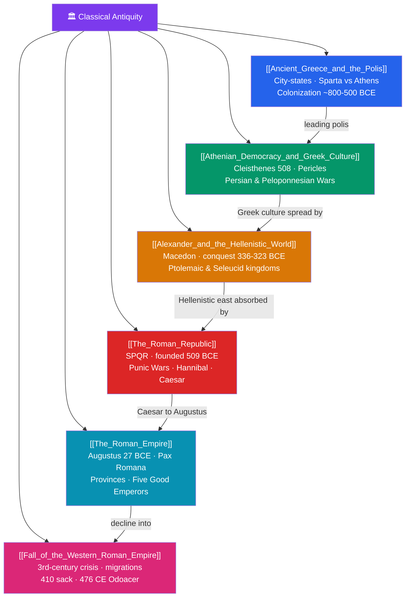

# 🗺️ Classical Antiquity — Map of Content

> [!abstract] What This Section Covers
> Classical antiquity is the Greco-Roman world whose politics, philosophy, and law still shape the West. It begins with **ancient Greece and the polis**, the fiercely independent city-states — militarized Sparta versus commercial, restless Athens — that colonized the Mediterranean. **Athenian democracy and Greek culture** flowered under Cleisthenes and Pericles alongside Socrates, Plato, and Aristotle, tested by the Persian Wars (Marathon 490, Salamis 480 BCE) and the ruinous Peloponnesian War (431–404 BCE). **Alexander and the Hellenistic world** saw a Macedonian king conquer Persia (336–323 BCE) and spread Greek culture from Egypt to India. Rome's story runs from **the Roman Republic** (509 BCE, SPQR, the Punic Wars against Hannibal) through its collapse into the **Roman Empire** under Augustus (27 BCE) and the two-century Pax Romana, ending with the long, contested **fall of the Western Roman Empire** in 476 CE. Together these notes trace the rise and dissolution of the ancient Mediterranean order.

## Concept Map

## Learning Path

1. [[Ancient_Greece_and_the_Polis]] — The rise of the city-state, the contrast between Sparta and Athens, and Greek colonization of the Mediterranean.
2. [[Athenian_Democracy_and_Greek_Culture]] — Direct democracy, the golden age of philosophy and drama, and the Persian and Peloponnesian Wars.
3. [[Alexander_and_the_Hellenistic_World]] — Macedonian hegemony, Alexander's conquests, and the fusion of Greek and Eastern cultures.
4. [[The_Roman_Republic]] — Republican institutions, expansion through the Punic Wars, and the civil wars that ended the Republic.
5. [[The_Roman_Empire]] — Augustus's principate, imperial administration, and the peace and reach of the Pax Romana.
6. [[Fall_of_the_Western_Roman_Empire]] — Third-century crisis, barbarian migrations, and the debate over why the West fell.

## All Notes at a Glance

| Note | Difficulty | What You'll Learn |
|------|------------|-------------------|
| [[Ancient_Greece_and_the_Polis]] | Beginner → Intermediate | The polis, hoplite warfare, Spartan vs Athenian society, Archaic colonization |
| [[Athenian_Democracy_and_Greek_Culture]] | Intermediate | Cleisthenes' reforms, Pericles, Socrates/Plato/Aristotle, Marathon and Salamis, the Peloponnesian War |
| [[Alexander_and_the_Hellenistic_World]] | Intermediate | Philip II, Alexander's campaigns, the successor kingdoms, Hellenistic science and culture |
| [[The_Roman_Republic]] | Intermediate | SPQR, the Senate, Punic Wars and Hannibal, the Gracchi, Caesar and the Republic's fall |
| [[The_Roman_Empire]] | Intermediate | Augustus and the principate, Pax Romana, provincial rule, Roman law and engineering |
| [[Fall_of_the_Western_Roman_Empire]] | Intermediate → Advanced | Crisis of the third century, Diocletian and Constantine, the sacks of 410 and 476, causal debates |

## Key Questions This Section Answers

- What was the polis, and how did the rivalry between Sparta and Athens shape Greek history?
- How did Athenian democracy actually work, and why did the classical Greek world burn itself out in war?
- How did Alexander's conquests create a single Hellenistic cultural world from Egypt to India?
- Why did the Roman Republic collapse into one-man rule under Augustus?
- Did the Western Roman Empire "fall" in 476 CE, and what really caused its disintegration?

## Related Sections

- [[_MOC_History_Master|↑ History Master MOC]]
- [[_MOC_Mesopotamia_Egypt|← Mesopotamia & Ancient Egypt]]
- [[_MOC_Ancient_India_China|→ Ancient India & China]]

#MOC #History #ClassicalAntiquity
