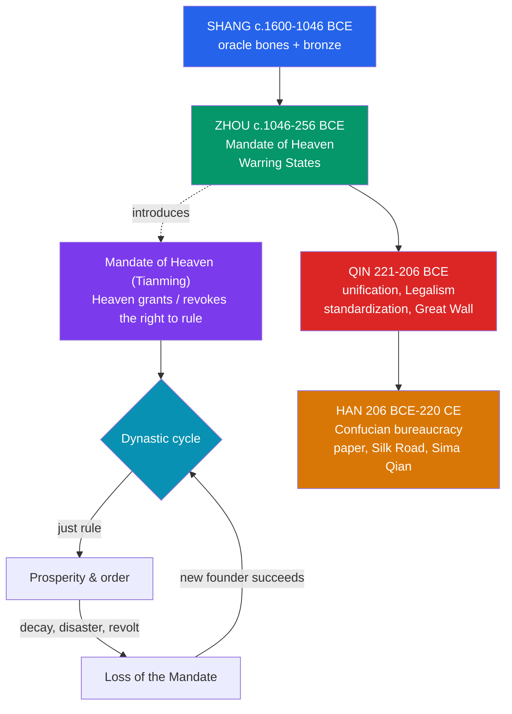

# 🐉 Ancient Chinese Dynasties

> [!abstract] TL;DR
> Ancient China's political story runs through four foundational dynasties. The **Shang** (c. 1600–1046 BCE) gave us the earliest Chinese writing — **oracle-bone script** — and masterful ritual **bronzes**. The **Zhou** (c. 1046–256 BCE) introduced the enduring doctrine of the **Mandate of Heaven** (*Tianming*), the idea that Heaven grants — and can withdraw — the right to rule; its long decline produced the chaotic but intellectually fertile **Warring States** period. The **Qin** (221–206 BCE) achieved the first true unification under **Qin Shi Huangdi**, imposing **Legalist** rule and standardizing script, weights, and measures, building early walls and the famous **terracotta army** — but collapsing within a generation. The long **Han** (206 BCE–220 CE) stabilized the imperial system on a **Confucian bureaucracy** with the ideal of a merit-based civil service, invented **paper**, opened the **Silk Road**, and produced the great historian **Sima Qian**. Together they set the template — dynastic cycle, centralized bureaucracy, Confucian governance — that shaped China for two millennia.

## Intuition — analogy first

Think of ruling China as holding a **cosmic lease on a house**, granted by a landlord called **Heaven**. The lease has a clause: you keep it only as long as you are a just and competent tenant. Floods, famines, corruption, and revolts are read as the landlord's **eviction notices** — signs the Mandate is being withdrawn. When a rebel succeeds and founds a new dynasty, that very success is taken as proof Heaven **re-issued the lease** to him. This is the **Mandate of Heaven**, and it turns Chinese history into a recurring **dynastic cycle**: a vigorous founder, a golden peak, gradual decay, disorder, then a new claimant.

Now watch four tenants move through the house. The **Shang** carve messages to the ancestors on bones and cast magnificent bronzes. The **Zhou** invent the lease itself to justify overthrowing the Shang. The **Qin** brutally renovate the whole house into one standardized structure — then are evicted almost immediately for cruelty. And the **Han** move in for four centuries, decorating the house in **Confucian** style and building the administrative machinery that later tenants will inherit. The building outlasts them all; the cycle explains the turnover.

---

## How It Works — The Dynastic Cycle and the Four Dynasties

## Key Concepts

### The Shang: Writing and Bronze

The **Shang dynasty** (c. 1600–1046 BCE), centred in the Yellow River valley with a late capital at **Anyang**, is the earliest Chinese dynasty confirmed by both texts and archaeology (the **Xia** before it remains semi-legendary). Two achievements stand out:
- **Oracle-bone script** (*jiaguwen*) — the oldest known Chinese writing, inscribed on ox scapulae and turtle plastrons used for **divination**: a question was posed to the ancestors, the bone heated to crack, and the result read and recorded. These are the direct ancestor of modern Chinese characters.
- **Ritual bronzes** — technically superb cast bronze vessels (for food and wine offerings to ancestors), made by a sophisticated **piece-mold** process, central to Shang ancestor worship and royal authority.

### The Zhou and the Mandate of Heaven

The **Zhou** overthrew the Shang (traditionally at the **Battle of Muye**, c. 1046 BCE) and justified it with the **Mandate of Heaven (*Tianming*)** — the claim that Heaven confers legitimacy on a virtuous ruler and **withdraws it from a corrupt one**, licensing rebellion against tyrants. This became the master theory of Chinese political legitimacy for millennia. The Zhou is split into:

| Sub-period | Approx. dates | Character |
|---|---|---|
| Western Zhou | c. 1046–771 BCE | Strong central kings; decentralized *fengjian* (fief) order |
| Eastern Zhou: Spring and Autumn | 770–476 BCE | Weakening kings; contending states; rise of philosophy |
| Eastern Zhou: **Warring States** | 475–221 BCE | Seven great states at war; iron; the Hundred Schools of Thought |

The long collapse of Zhou order is exactly the crisis the era's philosophers tried to solve (see [[Chinese_Philosophy_and_the_Silk_Road]]).

### The Qin: Unification and Legalism

In **221 BCE**, the state of Qin conquered its rivals, and its king took the title **Qin Shi Huangdi** ("First Emperor of Qin") — the first ruler of a unified China. Guided by **Legalism** and his chancellor **Li Si**, he built a centralized, harshly regulated state and **standardized** the essentials of empire:
- a single **script** (small seal style), **weights, measures, coinage** (round banliang coins), and even **axle widths** for roads;
- linked and extended northern frontier walls (an ancestor of the later **Great Wall**);
- built a vast mausoleum guarded by the **Terracotta Army** — thousands of life-size clay soldiers near modern Xi'an.

Legalism's severity — heavy punishments, forced labour, the notorious **"burning of books"** — bred resentment; the Qin **collapsed within a few years** of the First Emperor's death in 210 BCE. It was short-lived but foundational: it proved unification was possible and bequeathed the machinery of centralized empire.

### The Han: Confucian Bureaucracy and Innovation

The **Han dynasty** (206 BCE–220 CE), founded by the commoner-turned-emperor **Liu Bang (Gaozu)**, kept the Qin's centralized structure but softened its ideology. Under **Emperor Wu (Han Wudi**, r. 141–87 BCE), **Confucianism** became the **state doctrine** and an **Imperial Academy** trained officials, establishing the enduring **ideal of a merit-based civil service** staffed by scholars steeped in the classics (formal examinations were elaborated in later dynasties). Han achievements include:
- the invention and improvement of **paper** (traditionally credited to **Cai Lun**, c. 105 CE);
- the opening of the **Silk Road**, following the westward missions of the envoy **Zhang Qian** (from c. 138 BCE);
- **Sima Qian** (c. 145–86 BCE), the "Grand Historian," whose **_Shiji_** (*Records of the Grand Historian*) founded Chinese historiography with its sweeping, source-critical narrative from myth to his own day.

A brief usurpation by **Wang Mang** (the Xin dynasty, 9–23 CE) splits the era into Western (Former) and Eastern (Later) Han.

## Primary Sources & Examples

- **Oracle bones (Anyang)** — the actual inscribed divination bones are primary evidence for Shang religion, kingship, and the earliest Chinese writing.
- **Sima Qian's _Shiji_** — the foundational Chinese history, a primary narrative source (and model of historiography) for the Zhou, Qin, and early Han.
- **The Terracotta Army and the First Emperor's mausoleum** — a monumental physical source revealing Qin military organization, mass production, and imperial ambition.
- **Han administrative documents on wood/bamboo strips** (e.g., from frontier garrisons like Juyan) — everyday records showing how the Han bureaucracy actually functioned.

## Common Pitfalls / Misconceptions

- **"The Great Wall we see today is the Qin wall."** Qin Shi Huangdi connected and extended earlier rammed-earth walls; most of the famous stone-and-brick wall visitors see is **Ming dynasty** (14th–17th c.), far later.
- **"The Mandate of Heaven meant kings could do anything."** It was **conditional** — misrule, disasters, and rebellion were read as Heaven withdrawing the Mandate, making it a justification for **overthrowing** bad rulers, not absolute license.
- **"Han China had full merit-based civil-service exams."** The Han established the Confucian, merit ideal and an academy, but the mature, empire-wide **examination system** was developed in the Sui and Tang and perfected later.
- **"The Qin's brutality means it accomplished nothing."** Though short-lived and reviled, the Qin created the standardized, centralized template — script, measures, administration — that every later dynasty inherited.

## Related Concepts

- [[_MOC_Ancient_India_China|↑ Section MOC]] — the Ancient India & China hub
- [[Chinese_Philosophy_and_the_Silk_Road]] — the Hundred Schools (Confucianism, Daoism, Legalism) that these dynasties adopted, and the trade routes the Han opened
- [[Indus_Valley_Civilization]] — a comparative Bronze Age civilization; Shang bronze-and-writing culture parallels early South Asian urbanism
- [[Vedic_India_and_the_Mauryan_Empire]] — a contemporaneous experiment in empire (Maurya) to compare with Qin/Han centralization
- Cross-vault: [[_MOC_Classical_Antiquity|← Classical Antiquity]] — the Roman Empire, the Han's rough contemporary and the far end of the Silk Road

## Review Questions

1. What is the Mandate of Heaven, and how does it explain both the legitimacy of a new dynasty and the fall of an old one?
2. Contrast the Qin and Han approaches to governance, noting what the Han kept from the Qin and what it changed.
3. Name three Shang or Han innovations and explain the lasting significance of each.

## Sources

- Lewis, M.E. (2007). *The Early Chinese Empires: Qin and Han*. Harvard University Press
- Ebrey, P.B. (2010). *The Cambridge Illustrated History of China*. Cambridge University Press
- Loewe, M. & Shaughnessy, E.L. (eds.) (1999). *The Cambridge History of Ancient China*. Cambridge University Press
- Sima Qian (trans. B. Watson) (1993). *Records of the Grand Historian*. Columbia University Press

#history #ancient-china #dynasties #qin #han #mandate-of-heaven
