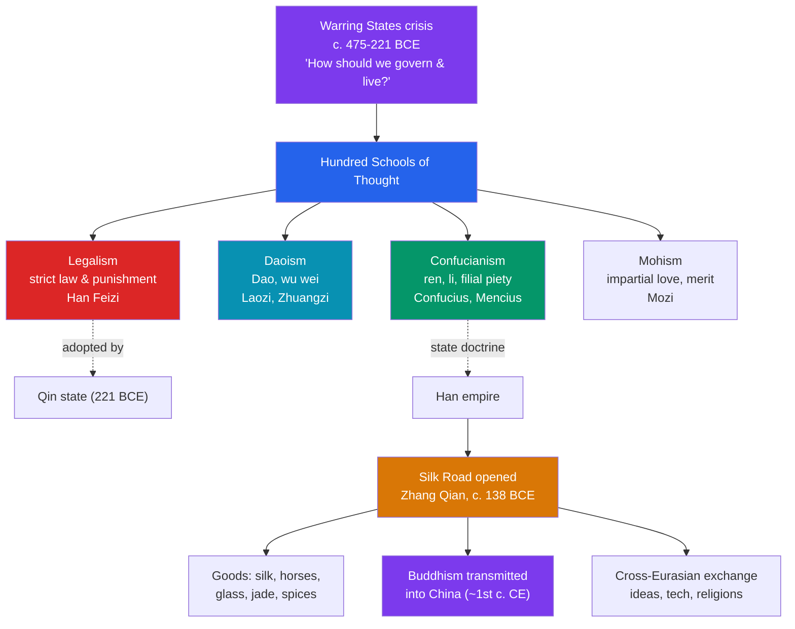

# ☯️ Chinese Philosophy and the Silk Road

> [!abstract] TL;DR
> The collapse of Zhou order in the Warring States era provoked China's great age of thought, the **Hundred Schools of Thought** (c. 6th–3rd century BCE), as rival thinkers asked the same urgent question: **how should society be governed and life be lived?** Four answers endured. **Confucianism** (Confucius, later Mencius) sought harmony through **_ren_** (humaneness), **_li_** (ritual propriety), and **filial piety**, cultivating virtuous rulers and gentlemen. **Daoism** (Laozi, Zhuangzi) urged alignment with the **_Dao_** (the Way) and **_wu wei_** (effortless non-action). **Legalism** (Han Feizi) trusted only strict **law and punishment**, and became the ideology of the Qin. **Mohism** (Mozi) preached **impartial love** and merit. Meanwhile the **Silk Road** — the web of Eurasian routes opened under the Han — carried not only silk and horses but **Buddhism into China** and ideas, technologies, and religions across the continent, making these philosophies part of a wider **cross-Eurasian exchange**.

## Intuition — analogy first

Imagine a country falling apart — warlords fighting, old certainties gone — and four advisors step forward, each with a different theory of how to fix a broken society. The **Confucian** says: *heal it from within.* Restore proper relationships and rituals, teach rulers to be moral, honour parents and ancestors, and order will radiate outward from good character. The **Daoist** says: *stop forcing it.* The more you meddle, scheme, and legislate, the worse it gets — align with nature's flow, act by not-acting, and things will right themselves. The **Legalist** says: *people are selfish; only fear works.* Write harsh, clear laws, reward and punish mechanically, and never trust virtue to hold a state together. The **Mohist** says: *care for everyone equally* — favouritism and pointless war are the disease; universal love and thrift the cure.

These are not abstractions; they are **operating systems for a state**, and history ran the experiment: Legalism built (and burned out) the Qin, Confucianism became the long-term software of the Han and every dynasty after. And along the same centuries, the **Silk Road** turned China from a closed world into one node of a continent-spanning network — the same roads that carried silk west carried a foreign religion, **Buddhism**, east into the Chinese heart.

---

## How It Works — The Hundred Schools and the Roads West

## Key Concepts

### The Hundred Schools of Thought

During the **Spring and Autumn** and **Warring States** periods (c. 6th–3rd century BCE), the breakdown of Zhou authority (see [[Ancient_Chinese_Dynasties]]) unleashed a burst of competing philosophies — the **Hundred Schools of Thought** (*baijia*). Itinerant scholars advised rival courts on the era's core problem: how to restore order to a warring world. Four schools shaped Chinese civilization most deeply.

### Confucianism

Founded by **Confucius (Kongzi, 551–479 BCE)** and preserved in the **_Analects_ (_Lunyu_)**, Confucianism locates order in **moral cultivation and right relationships**. Its key ideas:
- **_ren_** — humaneness, benevolence, the supreme virtue;
- **_li_** — ritual propriety, etiquette, the proper forms that structure society;
- **filial piety (_xiao_)** — reverence for parents and ancestors, the root of social order;
- the **_junzi_** — the "gentleman" or exemplary person cultivated through learning and virtue;
- ordered **relationships** (ruler–subject, parent–child, etc.) as the fabric of a harmonious state.

**Mencius (Mengzi, c. 372–289 BCE)** developed it, arguing **human nature is innately good** and that rulers govern by the people's welfare and Heaven's mandate (his rival **Xunzi** held that nature is bad and must be shaped by ritual). Confucianism became the Han state doctrine and the backbone of Chinese governance and education for two millennia.

### Daoism

**Daoism** (Taoism) turns from social ritual to **nature and spontaneity**. Its foundational text, the **_Dao De Jing_**, is attributed to the (possibly legendary) **Laozi**, and its brilliant, paradoxical second voice is **Zhuangzi (c. 369–286 BCE)**. Central ideas:
- the **_Dao_** — the ineffable "Way," the natural order underlying all things;
- **_wu wei_** — "non-action" or effortless action, achieving ends by not forcing, like water wearing down stone;
- **_ziran_** — naturalness, spontaneity;
- distrust of rigid rules, ambition, and over-government.

Where Confucianism cultivates society, Daoism counsels harmony with nature — the two became complementary poles of Chinese thought (a scholar Confucian in office, Daoist in retirement).

### Legalism

**Legalism (_Fajia_)**, systematized by **Han Feizi (c. 280–233 BCE)** and practised by statesmen like **Shang Yang** and **Li Si**, is the hard-nosed counterpoint: it assumes people are **self-interested** and that only a strong state armed with **clear laws (_fa_), strict rewards and punishments**, and centralized power can keep order. It supplied the ideology of the **Qin unification** (221 BCE) — effective at building the machinery of empire, but its harshness helped doom the Qin.

### Mohism

**Mohism**, founded by **Mozi (c. 470–391 BCE)**, championed **_jian'ai_ — impartial or universal love** (caring for all equally, against Confucian graded affection), **meritocracy**, **frugality**, opposition to **offensive war**, and a proto-consequentialist test of ideas by their benefit to society. Influential in its day, it faded after the Han but is notable for its logic and ethical universalism.

| School | Founder(s) | Core idea | Political legacy |
|---|---|---|---|
| **Confucianism** | Confucius, Mencius | *ren*, *li*, filial piety, moral rulers | State doctrine from the Han onward |
| **Daoism** | Laozi, Zhuangzi | *Dao*, *wu wei*, naturalness | Enduring counterpoint; personal/spiritual life |
| **Legalism** | Han Feizi, Shang Yang | Strict law, reward & punishment | Ideology of the Qin unification |
| **Mohism** | Mozi | Impartial love, merit, anti-war | Influential then faded post-Han |

### The Silk Road

The **Silk Road** was not one road but a **network of overland (and maritime) routes** linking China to Central Asia, India, Persia, and the Mediterranean. It was opened for regular exchange under the **Han**, following the westward diplomatic missions of the envoy **Zhang Qian** (from c. 138 BCE). It carried:
- **goods** — Chinese **silk** westward; **horses** (prized Ferghana steeds), glass, jade, spices, precious metals, and later paper flowing in many directions;
- **Buddhism into China** — transmitted from India via Central Asia around the **1st century CE**, aided by the **Kushan Empire**; tradition dates the first monastery, the **White Horse Temple** at Luoyang, to c. 68 CE. Buddhism would become one of China's major traditions (see [[Vedic_India_and_the_Mauryan_Empire]] for its Indian origins and Ashoka's early promotion);
- **cross-Eurasian exchange** — technologies, artistic styles, religions (Buddhism, later Manichaeism, Nestorian Christianity, Islam), and unfortunately diseases, moving between the great civilizations along oasis hubs like **Dunhuang** (famed for its **Mogao cave** shrines).

The Silk Road made ancient China a participant in a **connected Afro-Eurasian world**, not an isolated one (see [[Ancient_Trade_Networks]]).

## Primary Sources & Examples

- **The _Analects_ of Confucius** — the primary record of Confucian teaching, a collection of sayings and dialogues compiled by disciples.
- **The _Dao De Jing_ and the _Zhuangzi_** — the founding Daoist texts; the *Zhuangzi*'s parables (e.g., the "butterfly dream") are primary illustrations of Daoist thought.
- **The _Han Feizi_** — Han Feizi's essays, the fullest statement of Legalist statecraft and a source for how the Qin justified its methods.
- **Dunhuang manuscripts and the Mogao caves** — Silk Road documents and Buddhist art (including a copy of the *Diamond Sutra*, one of the earliest printed books) that physically attest to cross-Eurasian religious exchange.

## Common Pitfalls / Misconceptions

- **"The Silk Road was a single paved highway."** It was a shifting **web** of caravan and sea routes across deserts, mountains, and oases; few traders traversed its whole length — goods and ideas passed hand to hand.
- **"Confucianism is a religion like Christianity."** It is better understood as an **ethical-political philosophy** centred on this-worldly conduct and social order, though it acquired ritual and quasi-religious dimensions over time.
- **"Confucianism, Daoism, and Legalism are mutually exclusive."** In practice they blended — Han governance is often summarized as **"Confucian outside, Legalist inside,"** and educated Chinese drew on Confucian and Daoist ideas in different spheres of life.
- **"China invented Buddhism."** Buddhism originated in **India** and was **transmitted into China along the Silk Road** around the 1st century CE, then adapted into distinctively Chinese forms (e.g., Chan/Zen).

## Related Concepts

- [[_MOC_Ancient_India_China|↑ Section MOC]] — the Ancient India & China hub
- [[Ancient_Chinese_Dynasties]] — the political history these philosophies served; Legalism built the Qin and Confucianism became the Han state doctrine
- [[Vedic_India_and_the_Mauryan_Empire]] — the Indian homeland of Buddhism, which the Silk Road later carried into China (Ashoka's missions began its spread)
- [[The_Gupta_Golden_Age]] — classical India at the western Indian end of these exchange networks
- [[Ancient_Trade_Networks]] — the broader framework of premodern long-distance trade of which the Silk Road is the flagship example
- Cross-vault: [[_MOC_Classical_Antiquity|← Classical Antiquity]] — Rome, the Silk Road's western terminus and a hungry market for Chinese silk

## Review Questions

1. Summarize how Confucianism, Daoism, and Legalism each answered the question of how society should be governed, and give the key term(s) associated with each.
2. Why did Legalism suit the Qin while Confucianism became the long-term ideology of imperial China? What does "Confucian outside, Legalist inside" mean?
3. Beyond silk, what did the Silk Road transmit, and how did Buddhism reach China along it?

## Sources

- Ivanhoe, P.J. & Van Norden, B.W. (eds.) (2005). *Readings in Classical Chinese Philosophy*. Hackett
- Graham, A.C. (1989). *Disputers of the Tao: Philosophical Argument in Ancient China*. Open Court
- Hansen, V. (2012). *The Silk Road: A New History*. Oxford University Press
- Liu, X. (2010). *The Silk Road in World History*. Oxford University Press

#history #ancient-china #philosophy #confucianism #daoism #silk-road
