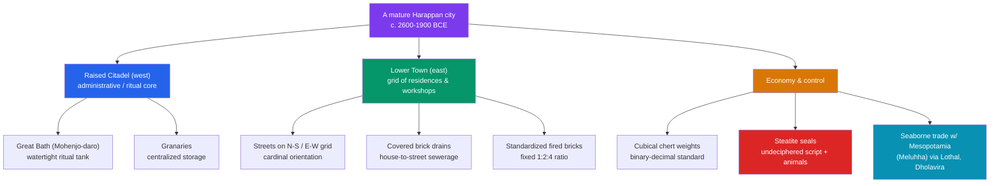

# 🧱 Indus Valley Civilization

> [!abstract] TL;DR
> The **Indus Valley (Harappan) Civilization** was South Asia's first urban culture and, alongside Mesopotamia and Egypt, one of the world's three great Bronze Age civilizations. In its mature phase (**c. 2600–1900 BCE**) it spread across roughly a million square kilometres of modern Pakistan and northwest India, anchored by planned cities like **Harappa** and **Mohenjo-daro**. Its hallmark was not monumental kingship but **infrastructure**: grid-planned streets, standardized fired bricks, covered municipal drainage, public baths, and granaries — an engineering-first urbanism with no clear palaces or royal tombs. It traded by sea and land with **Mesopotamia**, standardized its weights to a precise binary-decimal system, and left thousands of inscribed seals in a **script that remains undeciphered**. Around 1900 BCE the cities were gradually abandoned — most likely because of shifting rivers and a weakening monsoon rather than any single catastrophe. Its relationship to the later Vedic culture, and the **Indo-Aryan migration debate**, remain genuinely contested.

## Intuition — analogy first

Imagine an archaeologist unearths a **modern planned city** — Chandigarh or Milton Keynes — but with **every written document erased**. They would find dead-straight streets on a grid, uniform housing, a citywide sewer system, standardized construction materials, and identical measuring weights in every shop. From this alone they would conclude: *a literate, centrally organized, technically sophisticated society lived here.* Yet without the writing, they could not name a single king, read a single law, or know what gods were worshipped.

That is exactly the position we occupy with the Indus Valley. The **plumbing shouts** — its engineering tells us the Harappans were organized, prosperous, and obsessed with order and hygiene. But the **script is silent** — because we cannot read it, we do not know their language, their rulers' names, or their political structure. We are reading a civilization almost entirely from its **hardware**, not its **words**. That asymmetry — spectacular material remains, mute texts — is the defining puzzle of the Harappans.

---

## How It Works — Anatomy of a Harappan City

## Key Concepts

### Discovery, Chronology, and Extent

The civilization was rediscovered in the **1920s**, when Daya Ram Sahni excavated **Harappa** (1921) and R.D. Banerji excavated **Mohenjo-daro** (1922) under John Marshall of the Archaeological Survey of India — abruptly extending India's known history back two millennia. Archaeologists divide it into phases:

| Phase | Approx. dates | Character |
|---|---|---|
| Early Harappan | c. 3300–2600 BCE | Farming villages, early towns (Kot Diji, Mehrgarh roots) |
| **Mature Harappan** | **c. 2600–1900 BCE** | Peak urbanism; standardized cities, seals, weights, trade |
| Late Harappan | c. 1900–1300 BCE | De-urbanization; regional cultures; smaller settlements |

Over **1,000 sites** are known, from **Sutkagen-dor** near the Iranian border to **Rakhigarhi** (Haryana, one of the largest) and **Dholavira** and **Lothal** in Gujarat.

### Urban Planning and Engineering

The Harappans' signature achievement was **civic engineering**:
- **Grid layout** — major streets ran north–south and east–west, dividing the city into rectangular blocks, oriented to the cardinal directions.
- **The citadel and lower town** — most cities had a raised western mound (citadel) with public buildings and a larger residential lower town to the east.
- **Covered drainage** — brick-lined drains ran under the streets; individual houses connected to them via chutes and had private wells and bathing platforms. This citywide sanitation is unmatched in the ancient world.
- **The Great Bath** at Mohenjo-daro — a watertight sunken tank (~12 × 7 m) of finely fitted brick sealed with bitumen, almost certainly for ritual bathing.
- **Granaries** and large brick platforms suggest centralized storage and surplus management.

### Standardization: Bricks and Weights

Harappan uniformity is striking. **Fired (baked) bricks** were mass-produced in a consistent **1:2:4 ratio** (thickness : width : length) across cities hundreds of kilometres apart. **Cubical chert weights** followed a precise system doubling and scaling (1, 2, 4, 8, 16 … then decimal multiples), pointing to regulated trade and some overarching authority — yet, remarkably, **no monumental royal iconography, palaces, or tombs** have been securely identified, making Harappan governance a genuine mystery.

### The Undeciphered Script

Thousands of small **steatite (soapstone) seals** carry short inscriptions — typically **five or so signs** — alongside animal motifs, most famously the one-horned "unicorn" and the seated horned figure sometimes called *Pashupati* ("proto-Shiva," a contested reading). The **Indus script** has roughly **400+ distinct signs**, was usually written **right-to-left**, and appears in inscriptions too short to yield a confident decipherment. Because the **underlying language is unknown** and there is **no bilingual "Rosetta Stone,"** it remains undeciphered; scholars even debate whether it encodes full language at all.

### Trade with Mesopotamia

The Harappans were connected long-distance traders. Mesopotamian cuneiform texts refer to **Meluhha**, widely identified with the Indus region, as a source of carnelian, ivory, and hardwoods. **Indus seals and etched carnelian beads** have been found at Mesopotamian sites such as **Ur**. The port town of **Lothal** (Gujarat) has what is often interpreted as a **dockyard**, and **Dholavira** shows extraordinary water-harvesting reservoirs — evidence of maritime and riverine commerce across the Arabian Sea and Persian Gulf.

### Decline (c. 1900 BCE)

The mature cities were **gradually abandoned**, not violently destroyed. The leading explanations are environmental:
- **River shifts** — the drying or course-change of the Ghaggar-Hakra (identified by some with the Vedic **Sarasvati**) and instabilities of the Indus undermined the agricultural base.
- **Weakening monsoon** — climate studies indicate reduced rainfall around 2000 BCE, stressing farming.
- **De-urbanization** — populations dispersed eastward into smaller Late Harappan villages; writing, seals, and standardized weights fell out of use.

The older idea of a violent **"Aryan invasion"** destroying the cities (Mortimer Wheeler's dramatic "Indra stands accused") is now **rejected** as a cause of the collapse.

### The Aryan-Migration Debate (handled neutrally)

A separate, still-live question is how the Harappans relate to the later **Vedic** culture and its **Indo-Aryan** (Indo-European) language. Two broad positions are debated:
- **Indo-Aryan migration** — most linguists and, increasingly, ancient-DNA studies (evidence of Central Asian **steppe-related ancestry** entering South Asia in the 2nd millennium BCE) support gradual migrations of Indo-Aryan speakers *after* the Harappan peak, mixing with existing populations.
- **Indigenous/continuity views** — some scholars argue for greater cultural continuity between the Harappans and Vedic society, disputing the timing or scale of external migration.

The topic carries modern political charge; the responsible stance is to distinguish **language spread and population mixing** (gradual, complex) from any notion of a single conquering "invasion" (unsupported), and to note that the evidence is still being refined.

## Primary Sources & Examples

- **Mohenjo-daro's Great Bath and drainage** — the physical remains themselves are the primary evidence: watertight brickwork and a citywide sewer system that let archaeologists infer social organization without any readable text.
- **The "Priest-King" statuette** (Mohenjo-daro) — a small steatite bust with a trefoil-patterned robe; the name is a modern label, not a documented office, illustrating how we project titles onto a silent culture.
- **Meluhha references in Mesopotamian cuneiform** — external written testimony (from a *literate neighbour*) that names Indus traders even though the Harappans' own script stays mute.
- **Dholavira's water reservoirs and signboard** — massive rock-cut cisterns and a large inscription of Indus signs above a gateway, showing both hydraulic engineering and monumental (but unreadable) writing.

## Common Pitfalls / Misconceptions

- **"The Aryan invasion destroyed the Indus cities."** The cities declined mainly from environmental change centuries before, and the "invasion" model as a cause is discredited; migration and de-urbanization are separate, gradual processes.
- **"We just haven't cracked the script yet — it's only a matter of time."** With an unknown language, no bilingual text, and extremely short inscriptions, decipherment may be impossible in principle; overconfident "translations" appear regularly and fail peer scrutiny.
- **"It was a centralized empire with god-kings."** Unlike Egypt or Mesopotamia, the Harappans left no clear palaces, royal tombs, or ruler-glorifying art; the political system remains genuinely unknown and may have been more decentralized.
- **"Harappan and Hindu/Vedic culture are simply the same thing."** Tempting readings (e.g., "Pashupati seal = Shiva") are speculative; continuity is debated, not established, and should be flagged as interpretation.

## Related Concepts

- [[_MOC_Ancient_India_China|↑ Section MOC]] — the Ancient India & China hub
- [[Vedic_India_and_the_Mauryan_Empire]] — the culture that follows the Harappan decline; the Aryan-migration debate directly connects the two
- [[The_Gupta_Golden_Age]] — classical India's later urban and intellectual flowering, a useful contrast to Harappan pre-literate urbanism
- [[Ancient_Chinese_Dynasties]] — East Asia's parallel Bronze Age trajectory (Shang), a comparative case in early state formation
- Cross-vault: [[_MOC_Classical_Antiquity|← Classical Antiquity]] — Mesopotamia and Egypt, the Harappans' contemporaries and trade partners

## Review Questions

1. List three specific features of Harappan urban planning and explain what each reveals about the society, given that we cannot read their writing.
2. Why does the Indus script remain undeciphered, and what would decipherment require that we currently lack?
3. Distinguish the (discredited) "Aryan invasion as cause of collapse" claim from the separate, still-debated question of Indo-Aryan migration. Why is neutrality important here?

## Sources

- Possehl, G.L. (2002). *The Indus Civilization: A Contemporary Perspective*. AltaMira Press
- Kenoyer, J.M. (1998). *Ancient Cities of the Indus Valley Civilization*. Oxford University Press
- Wright, R.P. (2010). *The Ancient Indus: Urbanism, Economy, and Society*. Cambridge University Press
- Robinson, A. (2015). *The Indus: Lost Civilizations*. Reaktion Books

#history #ancient-india #indus-valley #harappa #archaeology #bronze-age
