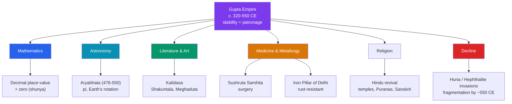

# 🪷 The Gupta Golden Age

> [!abstract] TL;DR
> The **Gupta Empire** (c. **320–550 CE**) presided over what is conventionally called **classical India's golden age** — a period of political stability across the Ganges heartland that unleashed a burst of achievement in mathematics, astronomy, literature, art, and medicine. Its most consequential legacy is the **decimal place-value system and the concept of zero (*shunya*) as a number**, a foundation of all modern arithmetic. The astronomer-mathematician **Aryabhata** (476–550 CE) computed an accurate value of π and argued the Earth rotates on its axis; **Kalidasa** wrote Sanskrit's most admired plays and poems; the **Iron Pillar of Delhi** still resists rust after 1,600 years, testifying to metallurgical skill; and the medical **Sushruta Samhita** codified surgery. The Guptas presided over a **Hindu revival** — temple-building, Puranic religion, and Sanskrit as the language of the court — while the empire eventually fragmented under **Huna (Hephthalite) invasions** and internal strain.

## Intuition — analogy first

Every civilization has a moment later generations point back to and say *"that was when we were at our best"* — Athens under Pericles, Florence in the Renaissance. For India, that moment is the **Gupta period**. The label "golden age" is partly a value judgement made in hindsight, but it captures a real clustering of firsts.

Here is the single idea that outlived the empire itself. Try multiplying **MDCCLXXVI by XXXIX** in Roman numerals — it is agony, because the system has **no positional value and no zero**. Now do it with **1776 × 39**, where the *place* of a digit carries meaning and a small circle, **0**, holds an empty column. That leap — a symbol for *nothing* that makes *everything* computable — was worked out and formalized in Gupta-era India. When people say the Guptas gave the world a golden age, the most durable piece of gold is not a statue or a poem; it is the humble **zero** that every calculator, spreadsheet, and computer still runs on.

---

## How It Works — What Made the Age "Golden"

## Key Concepts

### The Empire and Its Rulers

The dynasty was founded by **Chandragupta I** (r. c. 320 CE), whose marriage to a **Licchavi** princess boosted the family's legitimacy. His son **Samudragupta** (r. c. 335–375 CE), celebrated in the **Allahabad (Prayag) Prashasti** inscription composed by the court poet **Harishena**, was a conquering ruler sometimes dubbed the "Indian Napoleon." **Chandragupta II "Vikramaditya"** (r. c. 375–415 CE) defeated the Western Kshatrapas and is remembered for a court supposedly graced by **navaratnas** ("nine gems") of scholars. The Chinese Buddhist pilgrim **Faxian** visited during his reign and described a prosperous, well-ordered realm.

### Mathematics: Place-Value and Zero

The Guptas' era crystallized the **decimal (base-10) place-value system**, in which a digit's value depends on its position, together with **zero (*shunya*)** as both a placeholder and a genuine number. The evolving **Brahmi numerals** are the ancestors of the "Hindu-Arabic" digits used worldwide. Transmitted later through the Islamic world to Europe, this system replaced clumsy non-positional notations and made modern computation possible — arguably ancient India's greatest single gift to global knowledge.

### Aryabhata: Astronomy and Mathematics

**Aryabhata** (476–550 CE), in his **_Aryabhatiya_** (499 CE), delivered a remarkable body of exact science:

| Contribution | Detail |
|---|---|
| Value of π | Approximated as **3.1416**, noting it was "approximate" (an implicit sense of irrationality) |
| Earth's rotation | Argued the **Earth spins on its axis**, explaining the apparent motion of stars |
| Trigonometry | Produced **sine (jya) tables**, foundational to later trigonometry |
| Astronomy | Gave methods for eclipses and a strikingly accurate length of the sidereal year |

His work fed a strong Indian tradition of mathematical astronomy (continued by **Brahmagupta** in the 7th century, who gave formal rules for zero and negative numbers).

### Kalidasa and Sanskrit Literature

**Kalidasa**, traditionally placed in the Gupta era (often linked to Chandragupta II's court), is regarded as the supreme classical Sanskrit poet and dramatist. His masterpieces include the play **_Abhijnanashakuntalam_** (*The Recognition of Shakuntala*), the lyric poem **_Meghaduta_** (*The Cloud Messenger*), and the epic **_Raghuvamsha_**. Sanskrit drama, poetry, and aesthetics reached a refined peak, and Sanskrit served as the prestige language of court and learning.

### Medicine and Metallurgy

- **Medicine** — the **_Sushruta Samhita_**, a great compendium of surgery attributed to **Sushruta** (its material older, but redacted and influential in this era), describes operations, instruments, and even early **rhinoplasty**; alongside the **_Charaka Samhita_** it anchored the **Ayurvedic** medical tradition.
- **Metallurgy** — the **Iron Pillar of Delhi** (at Mehrauli, c. 400 CE, bearing an inscription of a king "Chandra"), stands ~7 m tall and has **resisted corrosion for over 1,600 years** thanks to a protective phosphorus-rich passive layer — a showpiece of ancient iron-working.

### Hindu Revival and Culture

The Guptas patronized a flourishing of **Hinduism**: worship of **Vishnu** and **Shiva**, composition and codification of the **Puranas**, and early free-standing stone **temple architecture** (e.g., the Dashavatara temple at **Deogarh**). Buddhism and Jainism continued and were patronized too — the great monastic university of **Nalanda** was founded in this period (under Kumaragupta I) — but Puranic Hinduism and Sanskrit culture became increasingly dominant.

### Decline

From the mid-5th century the empire faced the **Hunas (Hephthalites / "White Huns")** pressing in from Central Asia. **Skandagupta** (r. c. 455–467 CE) beat them back at heavy cost, but repeated invasions under Huna leaders like **Toramana** and **Mihirakula**, combined with fiscal strain and the rise of regional powers, fragmented Gupta authority; by around **550 CE** the empire had effectively dissolved into successor kingdoms.

## Primary Sources & Examples

- **The _Aryabhatiya_ (499 CE)** — Aryabhata's own terse Sanskrit verses on mathematics and astronomy; the primary evidence for Gupta-era exact science.
- **The Allahabad Pillar Inscription (Prayag Prashasti)** — Harishena's panegyric to Samudragupta, our chief record of his conquests and the dynasty's self-image.
- **The Iron Pillar of Delhi** — a physical primary source: its rust resistance and its inscription to a king "Chandra" testify to both metallurgy and Gupta royal ideology.
- **Faxian's travel account** — a Chinese Buddhist pilgrim's outside description (c. 399–414 CE) of a peaceful, prosperous India under the Guptas.

## Common Pitfalls / Misconceptions

- **"India (or the Arabs) 'invented' the Arabic numerals."** The digits are **Hindu-Arabic**: the place-value system and zero originated in India and were transmitted to Europe via the medieval Islamic world — a shared lineage, not a single inventor.
- **"'Golden age' means everything was uniformly wonderful for everyone."** The label reflects elite cultural and scientific achievement; social hierarchy (caste) persisted, and the term is partly a later, sometimes nationalist, valuation.
- **"The Guptas ruled all of India like the Mauryas."** Their core lay in the north Indian plain; the south and far peripheries remained under other dynasties, and control was often through subordinate rulers.
- **"Kalidasa's exact dates are known."** His biography is uncertain; the Gupta-court dating is the strong scholarly consensus but is inferred, not documented.

## Related Concepts

- [[_MOC_Ancient_India_China|↑ Section MOC]] — the Ancient India & China hub
- [[Vedic_India_and_the_Mauryan_Empire]] — the earlier empire and religious foundation the Gupta age built upon and, in the Hindu revival, reasserted
- [[Indus_Valley_Civilization]] — South Asia's first urbanism, a distant precursor to this classical flowering
- [[Chinese_Philosophy_and_the_Silk_Road]] — the trade routes and Buddhist exchange that connected Gupta India with China (Faxian traveled these routes)
- Cross-vault: [[_MOC_Classical_Antiquity|← Classical Antiquity]] — the contemporary Roman and post-Roman Mediterranean world, a comparative "classical" era

## Review Questions

1. Why is the decimal place-value system with zero considered the Gupta age's most durable contribution, and how did it reach the wider world?
2. Summarize three specific claims Aryabhata made in the *Aryabhatiya* and why each was significant.
3. In what senses is "golden age" an accurate description of the Gupta period, and in what senses is it a simplification worth qualifying?

## Sources

- Thapar, R. (2002). *Early India: From the Origins to AD 1300*. University of California Press
- Keay, J. (2000). *India: A History*. HarperCollins
- Plofker, K. (2009). *Mathematics in India*. Princeton University Press
- Willis, M. (2009). *The Archaeology of Hindu Ritual: Temples and the Establishment of the Gods*. Cambridge University Press

#history #ancient-india #gupta-empire #mathematics #aryabhata #classical-india
