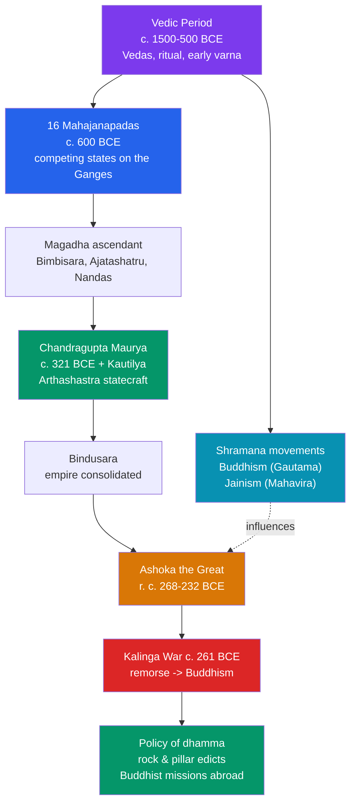

# 🕉️ Vedic India and the Mauryan Empire

> [!abstract] TL;DR
> After the Harappan cities faded, North India entered the **Vedic period** (c. 1500–500 BCE), an oral, ritual-centred age whose Sanskrit hymns — the **Vedas** — became the foundation of Hindu tradition and introduced the fourfold **varna** ordering of society. By c. 600 BCE the Ganges plain held **sixteen Mahajanapadas** ("great realms"), and a spiritual ferment produced the two great renouncer religions, **Buddhism** (Siddhartha Gautama) and **Jainism** (Mahavira), which challenged Vedic ritual and caste. From the kingdom of **Magadha** rose India's first great empire, the **Maurya**, founded c. 321 BCE by **Chandragupta** with the strategist **Kautilya**, whose *Arthashastra* is a ruthless manual of statecraft. Its greatest ruler, **Ashoka** (r. c. 268–232 BCE), waged the catastrophic **Kalinga war**, then in remorse embraced Buddhism and proclaimed a policy of moral governance — *dhamma* — across the subcontinent in inscribed **rock and pillar edicts**, the earliest decipherable writing in Indian history.

## Intuition — analogy first

Picture two very different kinds of ancestor for modern India. The first is a **family's oral scripture** — memorized word-for-word by priests over centuries, defining who is who and how the cosmos is kept in order through correct ritual. That is the **Vedic** inheritance: a religion and social order transmitted by voice, not stone, that still underlies Hindu practice today.

The second ancestor is a **state** — the first time the subcontinent was stitched into one administered empire, with a treasury, spies, roads, and a bureaucracy. That is the **Maurya**. And its most famous ruler offers one of history's rare **on-the-record changes of heart**: after a war so bloody it sickened him, Ashoka literally **carved his conscience onto rocks and pillars** for his subjects to read, swapping conquest-by-arms for conquest-by-*dhamma*. The Vedic age gives India its religious grammar; the Mauryas give it its first taste of empire — and in Ashoka's edicts, the first Indian we can hear speaking in his own voice.

---

## How It Works — From Vedic Tribes to a Pan-Indian Empire

## Key Concepts

### The Vedic Period and the Vedas

The **Vedic age** (c. 1500–500 BCE) is named for the **Vedas**, the oldest layer of Sanskrit sacred literature, composed and transmitted **orally** with extraordinary precision. The four Vedas are the **Rigveda** (the oldest, c. 1500–1200 BCE, hymns to deities like Indra and Agni), the **Samaveda** (melodies), the **Yajurveda** (ritual formulae), and the **Atharvaveda** (spells and everyday concerns). Religion centred on the **yajna** (fire sacrifice) performed by **Brahmin** priests. Historians distinguish the **Early (Rigvedic)** phase, largely pastoral and tribal, from the **Later Vedic** phase, when settled agriculture, iron, and larger kingdoms emerged on the Ganges plain (archaeologically, the Painted Grey Ware culture).

The **varna** system — an early fourfold social ordering into **Brahmins** (priests), **Kshatriyas** (warriors/rulers), **Vaishyas** (producers/traders), and **Shudras** (servants) — appears in the late Rigvedic **Purusha Sukta** hymn. This is the ideological seed of the later, far more rigid **caste (jati)** system, though early varna was less fixed than the caste order that developed over subsequent centuries.

### The Sixteen Mahajanapadas

By around **600 BCE** Buddhist and Jain texts describe **sixteen Mahajanapadas** ("great foothold of a people"), major states ranging from monarchies to **gana-sanghas** (oligarchic republics). The most powerful included **Magadha, Kosala, Vatsa, and Avanti**. Through the **Haryanka dynasty** kings **Bimbisara** and **Ajatashatru**, and later the **Nanda dynasty**, **Magadha** (in modern Bihar, capital eventually at **Pataliputra**) absorbed its rivals and became the springboard for empire.

### Buddhism and Jainism

This same era produced the **Shramana** ("striver") movements — ascetic, renouncer traditions that questioned Vedic ritual, priestly authority, and animal sacrifice:

| | **Buddhism** | **Jainism** |
|---|---|---|
| Founder | **Siddhartha Gautama, the Buddha** (trad. c. 563–483 BCE) | **Mahavira**, 24th *tirthankara* (trad. c. 599–527 BCE) |
| Core teaching | Four Noble Truths; Eightfold Path; end suffering (*dukkha*) via the Middle Way | Extreme *ahimsa* (non-violence); asceticism; liberation of the soul (*jiva*) |
| Attitude to Vedas/caste | Rejects Vedic ritual authority and rigid caste | Rejects Vedic sacrifice; strong world-renunciation |

Both offered a path to liberation open beyond the Brahminical order and won royal patronage, Buddhism especially under the Mauryas.

### The Mauryan Empire and Kautilya's *Arthashastra*

**Chandragupta Maurya** overthrew the Nandas and founded the **Maurya Empire c. 321 BCE**, aided by his brilliant, ruthless advisor **Kautilya** (also called **Chanakya**). Kautilya's **_Arthashastra_** is a systematic treatise on **statecraft, economics, taxation, law, diplomacy, and espionage** — often compared to Machiavelli's *The Prince* but far more encyclopedic. Chandragupta expanded to the northwest, defeating **Seleucus I Nicator** (a successor of Alexander) around 305 BCE and receiving the Greek ambassador **Megasthenes**, whose account (the *Indica*, surviving in fragments) describes the great capital **Pataliputra**. His son **Bindusara** extended the empire further south.

### Ashoka the Great and *Dhamma*

**Ashoka** (r. c. 268–232 BCE), Bindusara's son, brought the empire to its height across nearly the entire subcontinent. Early in his reign he conquered **Kalinga** (modern Odisha) in c. **261 BCE**; by his own testimony the war killed and deported hundreds of thousands. In his **13th Major Rock Edict**, Ashoka expresses **remorse** and renounces war as policy — a startlingly personal statement from an ancient emperor. He embraced **Buddhism** and promulgated **_dhamma_**: a public ethic of **non-violence, tolerance among sects, respect for elders, honesty, and welfare** (wells, rest-houses, medical care for people and animals).

He broadcast this through **rock and pillar edicts** inscribed across the empire — mostly in **Prakrit** written in the **Brahmi script**, with versions in **Greek and Aramaic** at Kandahar for the northwest. Their **1837 decipherment of Brahmi by James Prinsep** reopened Ashoka to history. Ashoka appointed **Dhamma Mahamatras** (officers of morality) and sent **Buddhist missions abroad**, including his son **Mahinda to Sri Lanka**, launching Buddhism's spread across Asia. His **Lion Capital of Sarnath** is today India's national emblem. After his death the empire declined and, by c. **185 BCE**, gave way to successor states.

## Primary Sources & Examples

- **Ashoka's Rock and Pillar Edicts** — the primary voice of the period: e.g., **Major Rock Edict XIII** on Kalinga ("the Beloved of the Gods felt remorse") and pillar edicts on *dhamma*. They are also the earliest securely dated, readable Indian inscriptions.
- **Kautilya's _Arthashastra_** — a near-contemporary manual revealing how the Mauryan state was imagined to work: a network of spies, a controlled economy, and detailed administrative law.
- **Megasthenes' _Indica_** — a Greek outsider's description of Pataliputra and Mauryan court life, valuable precisely because it is external testimony (preserved only in later quotations).
- **The Rigveda** — the foundational oral text of the Vedic age; its **Purusha Sukta** (10.90) is the earliest statement of the fourfold varna scheme.

## Common Pitfalls / Misconceptions

- **"The Vedas were written books from the start."** They were composed and transmitted **orally** with elaborate mnemonic techniques for many centuries before being written down; their authority rested on precise recitation.
- **"Ashoka forced Buddhism on everyone."** His edicts stress **tolerance among all sects** and a broad ethical *dhamma* rather than compulsory conversion; he patronized Buddhism but promoted coexistence.
- **"Early varna was the same as the modern caste system."** Varna in the Vedic texts is an idealized fourfold scheme; the rigid, hereditary, endogamous **jati** system developed and hardened over later centuries.
- **"The Maurya ruled a uniform, tightly centralized nation-state."** It was a vast, unevenly administered empire of core provinces and looser peripheries, held by roads, garrisons, and revenue officials — not a modern bureaucratic monolith.

## Related Concepts

- [[_MOC_Ancient_India_China|↑ Section MOC]] — the Ancient India & China hub
- [[Indus_Valley_Civilization]] — the preceding South Asian civilization; the Aryan-migration debate links Harappan decline to the Vedic age
- [[The_Gupta_Golden_Age]] — the later "classical" empire that revived Sanskrit culture and Hindu tradition seeded in the Vedic period
- [[Chinese_Philosophy_and_the_Silk_Road]] — the Silk Road later carried Ashoka-era Buddhism into China; a direct thematic link
- Cross-vault: [[_MOC_Classical_Antiquity|← Classical Antiquity]] — Chandragupta's clash with Seleucus ties the Mauryas to the Hellenistic successor states of Alexander

## Review Questions

1. What are the four Vedas, how were they transmitted, and where does the earliest statement of the varna scheme appear?
2. Explain how Buddhism and Jainism arose as Shramana responses to Vedic religion, and name their traditional founders.
3. Describe the Kalinga war's effect on Ashoka and summarize what his policy of *dhamma* actually involved, citing the evidence of the edicts.

## Sources

- Thapar, R. (2002). *Early India: From the Origins to AD 1300*. University of California Press
- Singh, U. (2008). *A History of Ancient and Early Medieval India*. Pearson
- Olivelle, P. (2013). *King, Governance, and Law in Ancient India: Kautilya's Arthasastra*. Oxford University Press
- Thapar, R. (1997). *Asoka and the Decline of the Mauryas*. Oxford University Press

#history #ancient-india #vedic #mauryan-empire #ashoka #buddhism
