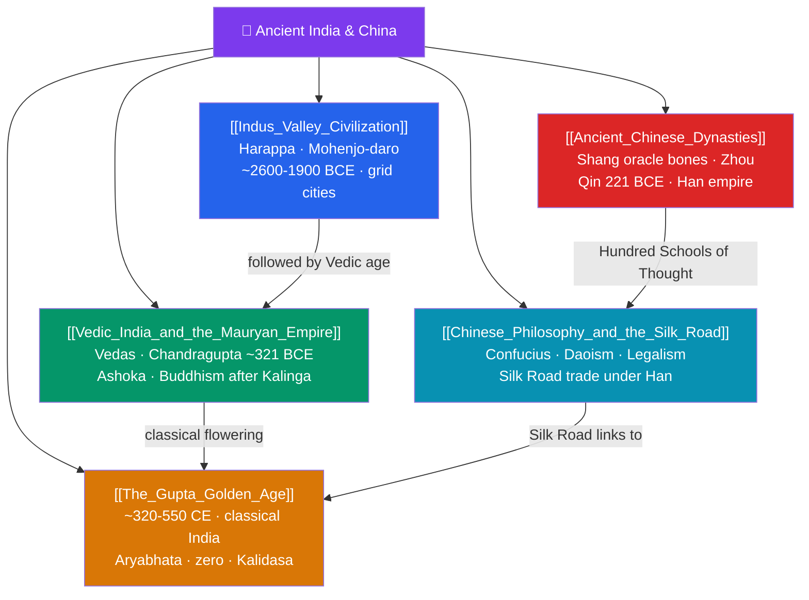

# 🗺️ Ancient India & China — Map of Content

> [!abstract] What This Section Covers
> Asia's two great classical civilizations grew along their own river valleys and produced traditions that still shape half of humanity. In South Asia, the **Indus Valley Civilization** (c. 2600–1900 BCE) built remarkably planned cities like Harappa and Mohenjo-daro with grid streets and drainage, leaving a still-undeciphered script; the later **Vedic age and the Mauryan Empire** gave India the Vedas and its first great empire, whose ruler Ashoka (r. c. 268–232 BCE) embraced Buddhism after the bloody Kalinga war and spread it across Asia. The **Gupta golden age** (c. 320–550 CE) crowned classical India with advances in mathematics — including the decimal place-value system and the concept of zero — astronomy, and Sanskrit literature. In East Asia, the **ancient Chinese dynasties** run from Shang oracle bones through the Zhou "Mandate of Heaven," the unifying Qin of Shi Huangdi (221 BCE), and the long Han. Finally, **Chinese philosophy and the Silk Road** — Confucianism, Daoism, and Legalism — gave China its governing ideas while overland trade linked it to India and Rome.

## Concept Map

## Learning Path

1. [[Indus_Valley_Civilization]] — South Asia's first cities, their sophisticated urban planning, and the mystery of the Harappan script.
2. [[Vedic_India_and_the_Mauryan_Empire]] — The Vedic religious foundation and India's first pan-Indian empire under Chandragupta and Ashoka.
3. [[The_Gupta_Golden_Age]] — Classical India's peak in mathematics, astronomy, art, and Sanskrit literature.
4. [[Ancient_Chinese_Dynasties]] — Shang, Zhou, Qin, and Han, and the political concept of the Mandate of Heaven.
5. [[Chinese_Philosophy_and_the_Silk_Road]] — Confucianism, Daoism, and Legalism, and the trade routes that connected China to the wider world.

## All Notes at a Glance

| Note | Difficulty | What You'll Learn |
|------|------------|-------------------|
| [[Indus_Valley_Civilization]] | Beginner → Intermediate | Harappa, Mohenjo-daro, urban grid planning, drainage, seals, the undeciphered script |
| [[Vedic_India_and_the_Mauryan_Empire]] | Intermediate | Vedas and Vedic society, Chandragupta Maurya, Ashoka's edicts, the spread of Buddhism |
| [[The_Gupta_Golden_Age]] | Intermediate | Decimal system and zero, Aryabhata, Kalidasa, classical art and the "golden age" concept |
| [[Ancient_Chinese_Dynasties]] | Intermediate | Shang oracle bones, Zhou and the Mandate of Heaven, Qin unification, Han institutions |
| [[Chinese_Philosophy_and_the_Silk_Road]] | Intermediate | Confucianism, Daoism, Legalism, imperial ideology, and Silk Road commerce and exchange |

## Key Questions This Section Answers

- How did the Indus Valley build such advanced cities, and why does its script remain unreadable?
- What led Ashoka to renounce conquest and promote Buddhism across his empire?
- Why is the Gupta period called India's "golden age," and what did its mathematicians contribute to the world?
- What is the "Mandate of Heaven," and how did it legitimize and constrain Chinese dynasties?
- How did Confucianism, Daoism, and Legalism offer competing answers to how China should be governed?

## Related Sections

- [[_MOC_History_Master|↑ History Master MOC]]
- [[_MOC_Classical_Antiquity|← Classical Antiquity]]
- [[_MOC_Africa_Pre_Columbian|→ Africa & Pre-Columbian Americas]]

#MOC #History #AncientAsia
