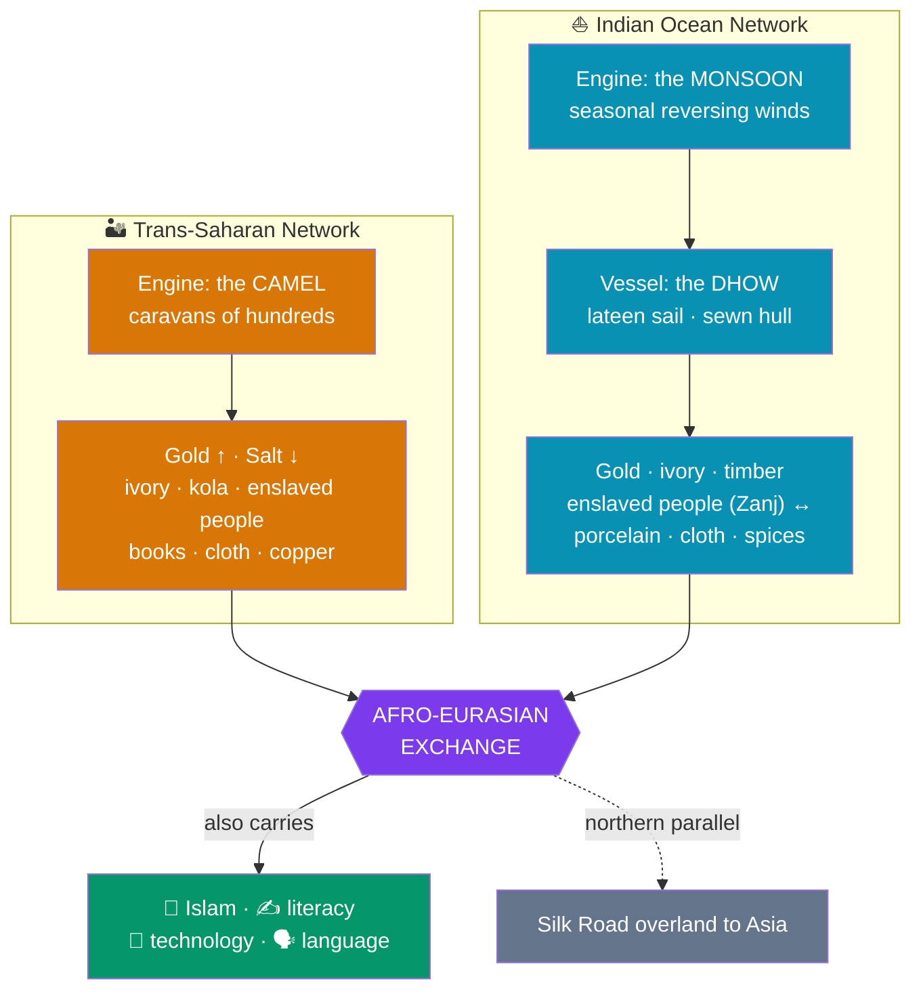

# 🐫 Ancient Trade Networks

> [!abstract] TL;DR
> Africa was never isolated. Two great pre-modern networks knit it into the wider Afro-Eurasian world. Across the desert ran the **trans-Saharan caravan routes**, made possible by the **camel**, moving **gold, salt, ivory, and enslaved people** between the Sahel and the Mediterranean. Along the eastern seaboard ran the **Indian Ocean monsoon trade**, whose **predictable seasonal winds** carried **dhows** between the **Swahili coast** and Arabia, Persia, India, and even Ming China. These routes gave rise to wealthy, cosmopolitan **Swahili city-states** — Kilwa, Mombasa, Zanzibar — and, like the **Silk Road** to their north, they carried far more than cargo: **religions (especially Islam), technologies, languages, and ideas** flowed along them, weaving Africa firmly into the connected medieval world.

## Intuition — analogy first

A trade route is only as good as the **vehicle that can survive the terrain**. The two great barriers around Africa are the **Sahara** — a sea of sand — and the **Indian Ocean** — a sea of water. Each demanded its own miracle machine.

For the desert, the machine is the **camel**: it stores fat, tolerates dehydration, and walks for days on thorny scrub, turning an impassable void into a crossable one. String enough camels into a caravan and the Sahara becomes a **highway of "sand-ships."**

For the ocean, the machine is the **monsoon itself**. Twice a year the winds reverse like clockwork — blowing you *toward* India for half the year, then *home* the other half. A sailor who learns this rhythm gets a **free, predictable engine**. Put a **dhow** with a triangular lateen sail into that wind and East Africa is suddenly a week from Arabia. Master the camel and the monsoon, and Africa stops being a wall and becomes a **crossroads**.

---

## How It Works — Two Engines, One Connected World

## Key Concepts

### The Trans-Saharan Caravan Routes

From roughly the early centuries CE, the spread of the **domesticated dromedary camel** made regular crossings of the Sahara viable for the first time. Caravans — sometimes numbering hundreds or thousands of camels — linked **Sahel termini** (Timbuktu, Gao, Kano) to **North African hubs** (**Sijilmasa** in Morocco, Ghadames, and Cairo), hopping between **oasis waystations**. The staple exchange was **West African gold moving north** and **Saharan salt moving south** (cut in slabs at desert mines like **Taghaza** and **Bilma**), alongside **ivory, kola nuts, leather, cloth, copper, horses, manuscripts — and enslaved people**, trafficked across the desert in large numbers over the centuries. This commerce funded the empires of [[West_African_Empires|Ghana, Mali, and Songhai]] and carried **Islam** peacefully into the Sahel.

### The Indian Ocean Monsoon Trade

The Indian Ocean was the world's most active maritime network long before the Atlantic, and its secret was the **monsoon**:

- The **southwest monsoon** (roughly April–September) drives ships **northeast**, from East Africa toward Arabia and India.
- The **northeast monsoon** (roughly November–February) reverses, carrying them **home**.

Because the winds were **predictable and seasonal**, merchants could plan round trips a year in advance. Ships were **dhows** — wooden vessels with **triangular lateen sails** and, traditionally, **hulls sewn together with coir cord** rather than nailed. Down these sea-lanes moved **gold, ivory, timber, and enslaved people out of Africa**, and **Chinese porcelain, Indian cotton, and spices in**, linking the coast to Arabia, Persia, India, Southeast Asia, and China.

### The Swahili Coast City-States

Where the ocean trade met the African shore, a distinctive **Swahili civilization** arose (c. 800–1500 CE): a string of independent, competing **city-states** including **Mogadishu, Lamu, Malindi, Mombasa, Zanzibar, Kilwa, and Sofala**. Its character was a genuine **fusion**:

- **Language** — **Swahili (Kiswahili)** is a **Bantu language** enriched with **Arabic** (and later Persian and Portuguese) loanwords — an African language shaped by trade.
- **Religion** — the coastal elite was **Muslim**, building mosques and connecting the coast to the wider Islamic world.
- **Architecture** — wealthy "**Stone Towns**" of coral-rag and lime; **Kilwa Kisiwani** boasted the **Great Mosque** and the palatial **Husuni Kubwa**, and controlled the **Sofala gold** flowing from the inland state of **Great Zimbabwe**.

| Feature | Trans-Saharan network | Indian Ocean network |
|---|---|---|
| **Enabling technology** | The camel + oasis chains | The monsoon + the dhow |
| **Prime movers** | Berber and Sahelian caravanners | Swahili, Arab, Persian, Indian merchants |
| **Signature exports from Africa** | Gold, ivory, enslaved people | Gold, ivory, timber, enslaved people |
| **Cultural cargo** | Islam, Arabic literacy into the Sahel | Islam, Swahili language, cosmopolitan cities |
| **Key hubs** | Timbuktu, Gao, Sijilmasa | Kilwa, Mombasa, Zanzibar, Sofala |

### The Zanj and the Human Cost

**"Zanj"** was the Arabic term for the East African coast and its peoples. The **enslavement and export of East Africans** was a long-running feature of the Indian Ocean world; the massive **Zanj Rebellion** of enslaved laborers in the marshes of southern **Iraq (869–883 CE)** — one of the largest slave revolts in history — testifies to its scale and brutality. Both African trade systems, for all their wealth and cosmopolitanism, were built in part on **human trafficking**, a dimension that must not be romanticized away.

### A Connected World — and the Silk Road Parallel

These African networks were not separate from Eurasia but **continuous with it**. Ming China's admiral **Zheng He** reached **Malindi** on the Swahili coast in the early 1400s, and an East African **giraffe** was famously carried to the Chinese court. The Moroccan traveler **Ibn Battuta** sailed to **Kilwa in 1331** and judged it one of the finest cities he had seen. Together with the overland **[[Chinese_Philosophy_and_the_Silk_Road|Silk Road]]** across Central Asia, the trans-Saharan and Indian Ocean routes formed the **three great arteries** of the pre-modern connected world — moving not just goods but **faiths, technologies, crops, and ideas** in every direction.

## Primary Sources & Examples

- **The *Periplus of the Erythraean Sea* (c. 1st century CE):** an anonymous Greek merchant's sailing guide to the Red Sea and East African coast — the earliest detailed account of the monsoon trade, naming African ports and their goods.
- **Ibn Battuta's *Rihla* (1331 visit to the Swahili coast):** an eyewitness description of Mogadishu, Mombasa, and **Kilwa**, praising the piety, wealth, and elegance of the coastal cities.
- **The ruins of Kilwa Kisiwani** (a UNESCO World Heritage Site): the Great Mosque and Husuni Kubwa palace — physical proof of the wealth generated by the Sofala gold trade.
- **Chinese porcelain in African archaeology:** Ming and earlier ceramic sherds embedded in Swahili walls and middens, and the record of Zheng He's voyages — hard evidence of Africa–China contact.

## Common Pitfalls / Misconceptions

- **"Sub-Saharan Africa was cut off from the world."** The Sahara and the ocean were **highways, not walls**; Africa was deeply integrated into Afro-Eurasian exchange.
- **"The Swahili were just Arab colonists."** Swahili civilization was fundamentally **African** — a Bantu language and coastal population — that adopted Islam and absorbed foreign influences on its own terms.
- **Romanticizing the trade.** Both networks trafficked **enslaved human beings** on a large scale; the Zanj Rebellion is a stark reminder of that reality.
- **"Only Europeans linked Africa to global trade."** These networks flourished for **centuries before** the Portuguese arrived in the Indian Ocean around 1500 — European ships **entered** an existing system.
- **Treating the Silk Road as the only great trade route.** The trans-Saharan and Indian Ocean networks were comparable arteries of exchange, moving comparable volumes of goods and ideas.

## Related Concepts

- [[West_African_Empires]] — the empires whose wealth *was* the trans-Saharan gold trade described here
- [[Nubia_Kush_and_Aksum]] — Aksum's Red Sea commerce was an early node of this same Indian Ocean world
- [[_MOC_Africa_Pre_Columbian|↑ Section MOC]] — the section hub
- Cross-vault: [[Chinese_Philosophy_and_the_Silk_Road]] — the overland Eurasian counterpart; together the three networks formed the pre-modern connected world

## Review Questions

1. Explain how the camel and the monsoon each turned a natural barrier into a trade route, and name the characteristic vehicle or vessel of each network.
2. What made Swahili civilization a cultural fusion? Address language, religion, and architecture, and explain why calling it "just Arab" is wrong.
3. Beyond goods, what else traveled these routes? Use Islam, the Swahili language, and the Zanj to illustrate both the connective and the exploitative sides of ancient trade.

## Sources

- Fauvelle, F.-X. (2018). *The Golden Rhinoceros: Histories of the African Middle Ages*. Princeton University Press
- Horton, M. & Middleton, J. (2000). *The Swahili: The Social Landscape of a Mercantile Society*. Blackwell
- Beaujard, P. (2019). *The Worlds of the Indian Ocean: A Global History*. Cambridge University Press
- Austen, R.A. (2010). *Trans-Saharan Africa in World History*. Oxford University Press

#history #africa #trade #sahara #indian-ocean #swahili
