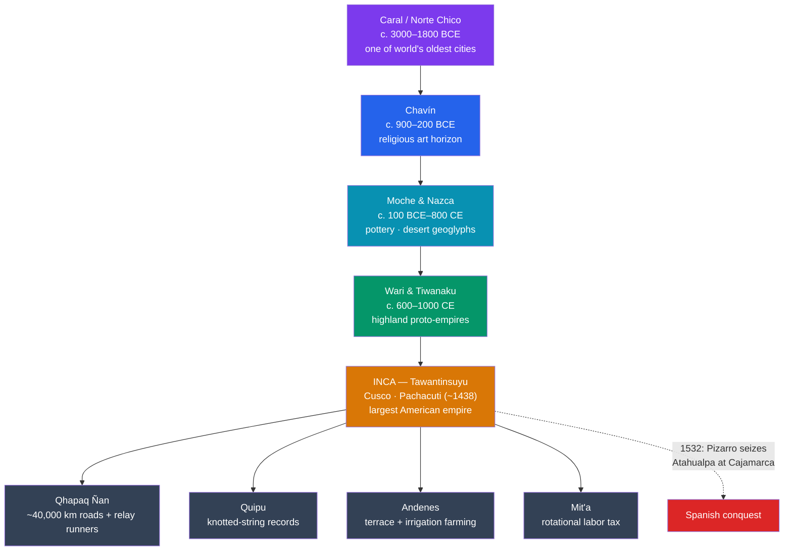

# ⛰️ Andean Civilizations and the Inca

> [!abstract] TL;DR
> The Andes hosted one of humanity's few **independent cradles of civilization**, stretching back to **Caral / Norte Chico** (c. 3000 BCE), one of the oldest cities in the world. Over the next four millennia came the religious art-horizon of **Chavín**, the master potters of the **Moche**, the giant desert **Nazca lines**, and the highland empires of **Wari and Tiwanaku**. The tradition culminated in the **Inca Empire** — **Tawantinsuyu**, "the four united regions" — the largest state in the pre-Columbian Americas, ruled from **Cusco** and expanded by **Pachacuti**. The Inca ran this vast realm with astonishing tools: a **~40,000 km road network**, **quipu** knotted-string records, mountainside **terrace agriculture**, and the **mit'a** labor tax — and they did it **without writing, without money, and without the wheel**. Their royal estate **Machu Picchu** endures as its icon.

## Intuition — analogy first

Most people imagine a great empire needs the same starter kit: writing to keep records, coins to move value, and wheels to move goods. The Inca ran an empire the size of the Roman one with **none of those three things** — and it worked. How?

Substitute each missing piece with something the Andes offered. Instead of **writing**, tie **knots in colored strings** (*quipu*) whose position and type encode numbers and categories — a physical spreadsheet. Instead of **money and markets**, tax people in **labor** (the *mit'a*): the state feeds you and you build its roads, terraces, and temples. Instead of **wheeled carts** (useless on cliff-face trails anyway), send **relay runners** and **llama trains** down a paved road network hugging the mountains. The lesson is that "civilization" has no single required technology — the Andes reached the same destination by a completely different road, literally.

---

## How It Works — A Deep Sequence and the Inca Machine

## Key Concepts

### The Deep Andean Sequence

Andean civilization has one of the longest unbroken pedigrees on Earth:

| Culture | Approx. dates | Region | Signature |
|---|---|---|---|
| **Caral / Norte Chico** | c. 3000–1800 BCE | Supe Valley coast | Monumental pyramids and plazas — among the **oldest cities anywhere**, built *without* pottery or writing |
| **Chavín** | c. 900–200 BCE | Northern highlands | A religious "horizon"; the temple of **Chavín de Huántar** and its fanged **Lanzón** monolith spread a shared art style |
| **Moche** | c. 100–700 CE | North coast | Superb naturalistic **ceramics** and metalwork; the rich royal tombs of the **Lord of Sipán** |
| **Nazca** | c. 100 BCE–800 CE | South coast | The colossal **Nazca lines** — geoglyphs of animals and shapes visible from the air |
| **Wari & Tiwanaku** | c. 600–1000 CE | Highlands / Lake Titicaca | Two expansive **Middle Horizon** states pioneering roads, terracing, and administration the Inca later scaled up |

The Inca inherited a deep reservoir of Andean engineering, textile, and administrative traditions — they were the **culmination**, not the origin, of Andean civilization.

### Tawantinsuyu — the Inca Empire

The **Inca Empire** called itself **Tawantinsuyu**, "**the four united regions (suyus)**," radiating from the capital **Cusco**, conceived as the navel of the world. Though the Inca dynasty was older, imperial expansion began explosively around **1438** under **Pachacuti** (Pachacutec, "he who remakes the world") and his successors **Topa Inca** and **Huayna Capac**, until Tawantinsuyu stretched some **4,000 km** down the Andes — from modern Colombia to Chile — the **largest empire in the pre-Columbian Americas**, ruling perhaps 10–12 million people.

### Governing Without Writing — Quipu and the Mit'a

The Inca administered this immense state through remarkable non-literate systems:

- **Quipu (khipu)** — assemblages of **knotted, colored cords** that recorded numbers in a **base-10 positional** scheme (and, likely, narrative/categorical information not yet fully understood). Specialist accountants (*quipucamayocs*) kept census, tribute, and storehouse records.
- **The mit'a** — a **rotational labor tax**: communities owed the state periods of work (building roads, terraces, temples; military service; mining) rather than cash or tribute goods. In return the state maintained vast **storehouses (*qollqas*)** to redistribute food and cloth, a command economy without markets or money.
- **Mitma (mitmaqkuna)** — the forced **resettlement of populations** to secure newly conquered or restless regions.

### Roads, Terraces, and Stone

- **The Qhapaq Ñan** — an integrated **road network of roughly 40,000 km**, with suspension bridges, waystations (*tambos*), and relay runners (*chasquis*) who could carry messages hundreds of kilometers a day; today a UNESCO World Heritage Site.
- **Terrace agriculture (*andenes*)** — vast stepped terraces with sophisticated irrigation turned steep, cold mountainsides into productive farmland for **maize, potatoes, and quinoa**, buffered against frost and erosion.
- **Masonry** — the Inca fitted enormous stone blocks without mortar so precisely (as at **Sacsayhuamán** and **Cusco**) that a knife-blade cannot slip between them — earthquake-resistant engineering.

### Machu Picchu and the Spanish Conquest

**Machu Picchu**, perched on a ridge above the Urubamba, is best understood not as a "lost city" but as a **royal estate of Pachacuti** (c. 1450), abandoned around the time of the Spanish conquest and never found by the Spanish. In **1532**, **Francisco Pizarro** with about 168 men exploited a devastating **civil war** between the brothers **Atahualpa and Huáscar** (and an epidemic — likely smallpox — that had already killed Huayna Capac). Pizarro **captured Atahualpa at Cajamarca**, collected a legendary room full of gold and silver as ransom, then executed him — and the empire fell with startling speed, though Inca resistance persisted at Vilcabamba until 1572.

## Primary Sources & Examples

- **Surviving quipu:** hundreds of knotted-cord records preserved in museums and burials — the Inca "documents" that scholars are still learning to read, and the best evidence for how a stateless-of-writing bureaucracy functioned.
- **Guaman Poma de Ayala, *El primer nueva corónica y buen gobierno* (c. 1615):** a ~1,200-page illustrated chronicle by an **indigenous Andean author**, addressed to the King of Spain, depicting Inca administration, the quipu, and the abuses of colonial rule — an invaluable insider source.
- **Pedro Cieza de León, *Crónica del Perú* (1550s):** an early, comparatively careful Spanish description of Inca roads, storehouses, and provincial organization.
- **Machu Picchu and the Qhapaq Ñan:** the physical archaeology of estate, road, terrace, and storehouse that corroborates and corrects the written chronicles.

## Common Pitfalls / Misconceptions

- **"The Inca built everything from scratch."** They synthesized **3,000 years** of Andean predecessors — Wari and Tiwanaku had already pioneered roads, terracing, and administration.
- **"A stateless-of-writing society must be primitive."** The Inca ran a continent-spanning command economy with **quipu accounting** and the **mit'a** — sophistication without an alphabet.
- **"Machu Picchu was a lost city / the Inca capital."** It was a **royal estate**; the capital was **Cusco**. It was "lost" only to outsiders after abandonment.
- **"168 Spaniards simply out-fought millions of Inca."** Conquest hinged on a raging **civil war**, **indigenous allies**, and above all **Old World epidemic disease** that preceded the Spanish.
- **Assuming the Nazca lines are mysterious "alien" runways.** They are ritual/ceremonial geoglyphs made by removing surface stones — impressive but firmly human and Andean.

## Related Concepts

- [[Mesoamerican_Civilizations]] — the *other* great New World civilization, which developed writing and calendars where the Andes developed quipu and roads
- [[Ancient_Trade_Networks]] — contrast: the Andes built a state-run road-and-storehouse economy rather than the market caravan networks of Afro-Eurasia
- [[_MOC_Africa_Pre_Columbian|↑ Section MOC]] — the section hub
- Cross-vault: [[_MOC_Mesoamerican_Myth]] — for the neighboring New World mythologies; the Inca had their own creator god **Viracocha** and sun cult of **Inti** paralleling those traditions

## Review Questions

1. Name three Andean cultures that preceded the Inca and one lasting contribution of each. Why does it matter that the Inca were a "culmination"?
2. Explain how the Inca administered a vast empire *without* writing, money, or the wheel — reference the quipu, the mit'a, and the road network.
3. What combination of factors allowed fewer than 200 Spaniards to topple Tawantinsuyu in the 1530s? Why is "military superiority" an incomplete answer?

## Sources

- D'Altroy, T.N. (2014). *The Incas* (2nd ed.). Wiley-Blackwell
- Moseley, M.E. (2001). *The Incas and Their Ancestors: The Archaeology of Peru* (2nd ed.). Thames & Hudson
- Urton, G. (2017). *Inka History in Knots: Reading Khipus as Primary Sources*. University of Texas Press
- Hemming, J. (1970). *The Conquest of the Incas*. Macmillan

#history #americas #andes #inca #peru #tawantinsuyu
