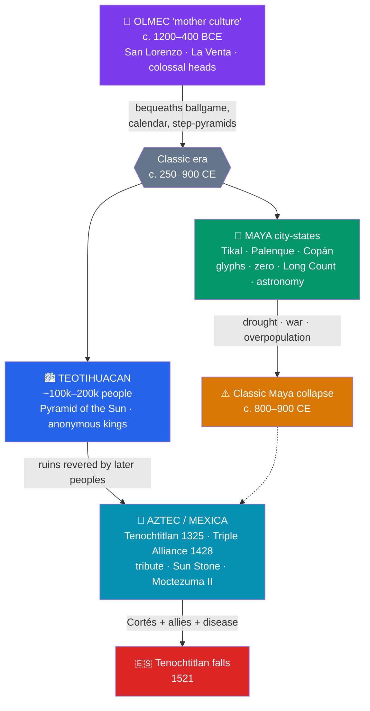

# 🌽 Mesoamerican Civilizations

> [!abstract] TL;DR
> Across the highlands and jungles of central Mexico and Central America, a shared cultural world flourished for three thousand years. The **Olmec** (c. 1200–400 BCE) are often called the **"mother culture,"** pioneering the colossal stone heads, ballgame, and calendar traditions later civilizations inherited. The **Maya** built dozens of competing **city-states** — Tikal, Palenque, Copán — and independently developed a fully **hieroglyphic writing system**, the concept of **zero**, a **Long Count calendar**, and astronomy precise enough to predict Venus, before many centers were abandoned in the **Classic collapse** (c. 800–900 CE). The vast planned metropolis of **Teotihuacan** dominated the highlands for centuries. Last came the **Aztec (Mexica)**, whose island capital **Tenochtitlan**, **Triple Alliance**, tribute empire, sacred calendar, and **ritual human sacrifice** built the greatest state in the Americas' north — until it fell to Spanish conquest in 1521.

## Intuition — analogy first

Think of Mesoamerica the way we think of the **ancient Mediterranean**: not a single empire, but a **family of civilizations sharing a common toolkit** — a 260-day sacred calendar, a ritual ballgame, maize agriculture, step-pyramids, and a pantheon of related gods — while remaining politically fragmented and often at war. Just as Greece, Rome, Egypt, and Phoenicia borrowed a common alphabet-and-city idea while staying distinct, the Olmec, Maya, and Aztec passed down a shared cultural inheritance across a thousand years.

The **Olmec** are the "grandparents" who invented much of the family style. The **Maya** are the scholars and astronomers — the ones who wrote everything down. **Teotihuacan** is the giant cosmopolitan capital whose fashions everyone copied. And the **Aztec** are the latecomers who consciously collected and revived the whole tradition, casting themselves as heirs of a glorious past they only half understood — much as Renaissance Europeans looked back to Rome.

---

## How It Works — A Shared World Across Three Millennia

## Key Concepts

### The Olmec — the "Mother Culture"

Centered in the humid Gulf Coast lowlands (modern Veracruz and Tabasco) from roughly **1200 to 400 BCE**, the **Olmec** are the earliest complex society of Mesoamerica. From their centers at **San Lorenzo** and **La Venta** they produced the famous **colossal heads** — basalt boulders up to 3 m tall and 20+ tons, carved as individualized rulers' portraits and hauled dozens of kilometers from distant quarries. The Olmec also worked precious **jade**, revered a were-jaguar deity, likely played the ritual **ballgame**, and may have originated early forms of writing and the calendar. The label **"mother culture"** is debated: some scholars prefer **"sister culture,"** stressing that Mesoamerican civilization arose through interaction among peers rather than descent from one source.

### The Maya — Writing, Zero, and the Calendar

The **Maya** occupied the Yucatán, Guatemala, Belize, and Chiapas, reaching their **Classic peak (c. 250–900 CE)** as dozens of rival **city-states** — **Tikal, Calakmul, Palenque, Copán, Yaxchilán** — ruled by divine kings (*k'uhul ajaw*) who warred, allied, and intermarried. Their intellectual achievements were extraordinary:

- **Hieroglyphic writing** — a full **logosyllabic script** (signs for whole words *and* syllables) capable of recording any spoken sentence. Its decipherment, advanced by **Yuri Knorozov** in the 1950s and completed by many hands since, revealed real dynastic history.
- **The concept of zero** — the Maya used a **positional, base-20 (vigesimal)** number system with a symbol for **zero**, developed independently of the Old World.
- **Calendars** — the **260-day sacred *Tzolk'in*** and **365-day *Haab'*** meshed into a 52-year "Calendar Round," while the **Long Count** tracked days linearly from a mythic zero date (11/13 August 3114 BCE) — the system behind the misunderstood "2012" date.
- **Astronomy** — the surviving **Dresden Codex** contains accurate **Venus and eclipse tables**.

### The Classic Maya Collapse

Between roughly **800 and 900 CE**, most of the great **southern lowland** Maya cities were **abandoned**: monument-building stopped, populations dispersed, and dynasties failed. No single cause explains it; leading factors include **prolonged drought**, **overpopulation and environmental degradation**, and **endemic warfare** among city-states. Crucially, the Maya **did not "vanish"** — millions of Maya people live on today, and northern cities like **Chichén Itzá** thrived afterward.

### Teotihuacan — the Great Planned City

In the highland Valley of Mexico, **Teotihuacan** grew into one of the largest cities on Earth (c. **100 BCE – 550 CE**), with an estimated **100,000–200,000 inhabitants**. Laid out on a rigid grid around the **Avenue of the Dead**, it was dominated by the immense **Pyramid of the Sun** and **Pyramid of the Moon**. It was strikingly **cosmopolitan**, housing ethnic neighborhoods (including Maya and Zapotec quarters), and its art and influence radiated across Mesoamerica. Yet we still **cannot read its script or name its kings** — its rulers are curiously anonymous — and it was burned and largely abandoned around 550 CE. The far later **Aztecs**, awed by its ruins, gave it the Nahuatl name meaning *"the place where the gods were created."*

### The Aztec (Mexica) — Tenochtitlan and the Triple Alliance

The **Mexica**, a Nahuatl-speaking people, founded their capital **Tenochtitlan** on an island in **Lake Texcoco** in **1325 CE** (tradition: where an eagle perched on a cactus — now on the Mexican flag). In **1428** they formed the **Triple Alliance** with **Texcoco** and **Tlacopan**, the political core of what we call the Aztec Empire. Key features:

- **A tribute empire** — rather than directly governing conquered peoples, the Aztecs extracted **tribute** (maize, cloth, cacao, feathers, captives) and left local rulers in place.
- **Engineering** — Tenochtitlan reached perhaps 200,000 people, fed by **chinampas** (raised "floating" garden plots), causeways, and aqueducts; it astonished the Spanish who first saw it in 1519.
- **The calendar** — the same 260-day and 365-day counts as the wider tradition, iconically depicted on the carved basalt **Sun Stone (Piedra del Sol)**.
- **Ritual human sacrifice** — bound to a **cosmology in which the sun-god Huitzilopochtli required human hearts and blood to keep the sun moving** and forestall the world's destruction; captives from war (and "flower wars" fought partly to take prisoners) supplied victims. The scale is genuinely debated, and Spanish accounts had propaganda motives, but the practice was real and central.
- **Moctezuma II** (r. 1502–1520) ruled at the empire's height when **Hernán Cortés** arrived in 1519; allied with resentful subject peoples (notably the **Tlaxcalans**) and aided by epidemic disease, the Spanish captured **Tenochtitlan in 1521**.

## Primary Sources & Examples

- **Maya stelae and the Dresden Codex:** carved dynastic monuments and one of only four surviving pre-conquest Maya bark-paper books, containing the famous **Venus table** — direct evidence of Maya history and astronomy in their own script.
- **The Florentine Codex (c. 1577):** a bilingual **Nahuatl-Spanish** encyclopedia of Aztec life compiled by the friar **Bernardino de Sahagún** with Nahua informants — an indispensable, if mediated, indigenous-voiced source.
- **The Sun Stone (Piedra del Sol):** the great carved Mexica basalt monument encoding cosmological cycles, unearthed in Mexico City in 1790.
- **Bernal Díaz del Castillo, *The Conquest of New Spain*:** an eyewitness conquistador memoir describing the wonder of first seeing **Tenochtitlan** — vivid but partisan.

## Common Pitfalls / Misconceptions

- **"The Maya mysteriously disappeared."** The Classic *cities* collapsed; the *people* did not — millions of Maya live in Mexico and Central America today.
- **Lumping "Aztec" and "Maya" together.** They are different peoples, languages, regions, and eras — separated by centuries and hundreds of kilometers.
- **"The 2012 Long Count meant the end of the world."** It marked the end of a great cycle (a *bʼakʼtun*), like an odometer rolling over — not a prophecy of apocalypse.
- **Reading Aztec sacrifice through Spanish propaganda alone.** It was real and religiously central, but figures were likely exaggerated to justify conquest; treat numbers critically.
- **Assuming these achievements were derived from the Old World.** Maya writing, the base-20 zero, and the calendars were **independent inventions** of the Americas.

## Related Concepts

- [[Andean_Civilizations_and_the_Inca]] — the *other* great center of New World civilization, in South America, developing in parallel and largely without contact
- [[Ancient_Trade_Networks]] — for comparison, the Old World long-distance networks that Mesoamerica developed entirely apart from
- [[_MOC_Africa_Pre_Columbian|↑ Section MOC]] — the section hub
- Cross-vault: [[_MOC_Mesoamerican_Myth]] — the gods and cosmology (Quetzalcoatl, Huitzilopochtli, the Popol Vuh) behind the calendars and sacrifice described here

## Review Questions

1. Why are the Olmec called the "mother culture," and why do some scholars prefer "sister culture"? Give two concrete Olmec contributions.
2. Describe three distinct Maya intellectual achievements (writing, mathematics, calendrics, or astronomy) and explain why "independent invention" matters.
3. What was the Aztec Triple Alliance, and how did the empire's tribute system and religious cosmology shape the practice of human sacrifice?

## Sources

- Coe, M.D. & Koontz, R. (2013). *Mexico: From the Olmecs to the Aztecs* (7th ed.). Thames & Hudson
- Coe, M.D. & Houston, S. (2015). *The Maya* (9th ed.). Thames & Hudson
- Townsend, R.F. (2009). *The Aztecs* (3rd ed.). Thames & Hudson
- Restall, M. (2003). *Seven Myths of the Spanish Conquest*. Oxford University Press

#history #americas #mesoamerica #maya #aztec #olmec
